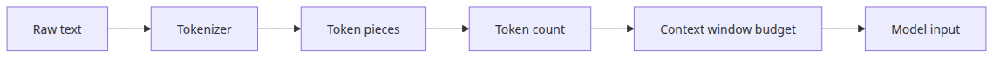

# Understanding tokens — cost, limits, and context windows

> LLM App Foundations 101 (2/6)

Example code: [github.com/yeongseon-books/llm-app-foundations-101](https://github.com/yeongseon-books/llm-app-foundations-101/tree/main/en/02-understanding-tokens)

The diagram below summarizes how raw text becomes tokens and then turns into model budget.


When people first connect an LLM API, they usually focus on answer quality. That makes sense at the demo stage. In real applications, though, the first hard constraints show up somewhere else: cost, latency, and length limits. A prompt gets a little longer, and the response slows down. A few more messages are added, and token usage jumps. A large chunk of reference text is attached, and the model starts cutting answers short. The shared unit behind all of those behaviors is the token.

A token is the unit the model uses to read and generate text. Humans think in sentences, paragraphs, and words. Models do not. They process smaller pieces, and those pieces do not map cleanly to words. That is why developers new to LLM systems often misjudge size. A prompt that looks short in plain text can still be expensive. A block of code can consume more tokens than expected. A Korean sentence can fragment differently from an English sentence.

This post puts token accounting in the center of the mental model. We will cover seven things:

- what a token actually is
- why words and tokens are not the same thing
- why cost and latency move with token count
- how to read `usage.prompt_tokens`, `completion_tokens`, and `total_tokens`
- how to estimate prompt size with `tiktoken`
- what a context window is, and what 128k means for `llama-3.1-8b-instant`
- how to control output length with `max_tokens` and detect truncation with `finish_reason`

The central idea is simple: **LLM applications run on token budgets, not on raw strings**.

---

## What a token actually is

A token is a chunk of text from the model's point of view. That chunk is not guaranteed to be a word. Sometimes a short common word becomes one token. Sometimes a longer word is split into several pieces. Korean text can split across stems, particles, and endings. Numbers, whitespace, newlines, punctuation, and code symbols all count too.

These three inputs may feel similar to a human reader:

- `hello world`
- `unbelievable`
- `print(user_profile[0]["email"])`

To a tokenizer, they can look very different. Common text fragments may be stored as larger reusable pieces. Rare combinations are broken into smaller ones. Code often inflates token count because brackets, quotes, dots, underscores, and indentation all matter.

That leads to the basic idea behind BPE, short for Byte Pair Encoding. At a high level, BPE builds larger reusable units out of frequently appearing character sequences. The result is a vocabulary where common patterns are stored as bigger chunks and uncommon patterns are split more aggressively. So a word like `understanding` is not treated as a sacred unit. It is split according to the tokenizer's learned vocabulary.

For application work, you do not need to master tokenizer theory. You do need one practical conclusion: **word count is a poor proxy for token count**. If you try to estimate LLM cost and limits by counting words, you will keep getting surprised.

---

## Why tokens matter so much

Tokens are not just an internal implementation detail. They drive the three things that shape application behavior most often: cost, speed, and limits.

Start with cost. Most LLM APIs charge based on input tokens and output tokens. The exact pricing table varies by provider and model, but the structure stays familiar. A longer prompt costs more on the input side. A longer answer costs more on the output side. Adding a system prompt, a large conversation history, or multiple retrieved passages increases total token usage, even if the user only asked a short question.

Next comes latency. Generation happens token by token. More input tokens means more text for the model to read before it can answer. More output tokens means more text for the model to generate before the response is complete. Provider infrastructure and model speed matter too, but token count is still the most stable first explanation for why one request feels heavier than another.

Then there are limits. Every model has a maximum number of tokens it can handle in a single request. That is the context window. It is safer to think of that window as a shared budget for input and output, not as an input-only number. If the prompt is already large, the model has less room left for the answer.

In operational terms, three rules help:

- cost questions are usually token questions
- latency questions are often token questions first
- length-limit failures are usually token budget failures

Once you start looking at logs through that lens, many “mysterious” LLM behaviors become easier to explain.

---

## Revisiting `usage.prompt_tokens`, `completion_tokens`, and `total_tokens`

Post 01 introduced the `usage` field. Now we need to read it like an operator, not like a curious beginner. Every code example in this post is written so you can copy and run it directly. The example below makes a real call with the Groq Python SDK and prints the usage numbers.

```python
import os

from groq import Groq

client = Groq(api_key=os.environ["GROQ_API_KEY"])

completion = client.chat.completions.create(
    model="llama-3.1-8b-instant",
    messages=[
        {
            "role": "user",
            "content": "Explain Python decorators in no more than two paragraphs.",
        }
    ],
)

usage = completion.usage

print(completion.choices[0].message.content)
print()
print(f"finish_reason={completion.choices[0].finish_reason}")
print(f"prompt_tokens={usage.prompt_tokens}")
print(f"completion_tokens={usage.completion_tokens}")
print(f"total_tokens={usage.total_tokens}")
```

Each field tells you something different.

### `prompt_tokens`

This is the number of tokens in the request input. It includes the full `messages` array, not just the current user prompt. Once you add a system message, prior turns, or retrieved documents, this number can grow quickly.

### `completion_tokens`

This is the number of tokens the model generated in the answer. If the model responds at length, this number rises. Streaming and non-streaming responses eventually converge on the same idea here: how much output was produced.

### `total_tokens`

This is the sum of input and output. In logs, this is often the fastest number to watch because it tells you how heavy the request was overall.

These numbers become more useful when you compare them. A large `prompt_tokens` value with a small `completion_tokens` value often points to prompt bloat. A small input with a very large output may point to weak answer-length control. Large values on both sides usually mean an expensive request with a lot of context and a long response.

In production-style logging, it is worth storing `model`, `prompt_tokens`, `completion_tokens`, `total_tokens`, and `finish_reason` together. That gives you enough signal to explain cost increases and truncation problems later.

---

## Estimating token count with `tiktoken`

Reading usage after the call is necessary, but it is not enough. You also want a preflight estimate before sending the request. That helps you decide whether to trim input, summarize older messages, or split one large job into multiple calls.

Install `tiktoken` like this:

```bash
pip install tiktoken
```

The smallest useful example is to encode one string and inspect the result.

```python
import tiktoken

encoding = tiktoken.get_encoding("cl100k_base")

text = "Measuring token length before a request makes prompt handling safer."
tokens = encoding.encode(text)

print(tokens)
print(f"token_count={len(tokens)}")
```

There is one important caveat here. `cl100k_base` is a well-known encoding from the OpenAI ecosystem. It does not automatically mean that Groq's `llama-3.1-8b-instant` uses the exact same tokenizer internally. Because of that, treat this number as a **practical estimate**, not as the provider's billing source of truth. For billing and final accounting, the provider's `usage` field is authoritative.

That does not make the estimate useless. In most applications, the first question is not “what is the exact invoice number for this one request?” The first question is “is this prompt short, large, or dangerously large?” An approximate count is often enough to trigger the right control flow.

In real systems, you usually want to estimate the whole message bundle, not a single string. The exact formatting overhead differs by provider, but the pattern below is good enough for first-pass budgeting.

```python
import tiktoken

encoding = tiktoken.get_encoding("cl100k_base")

messages = [
    {"role": "system", "content": "You are a concise Python tutor."},
    {"role": "user", "content": "Explain the difference between a list and a tuple."},
    {"role": "assistant", "content": "Lists are mutable, while tuples are immutable."},
    {"role": "user", "content": "Add one short code example too."},
]

serialized = "\n".join(f"{m['role']}: {m['content']}" for m in messages)
estimated_prompt_tokens = len(encoding.encode(serialized))

print(serialized)
print()
print(f"estimated_prompt_tokens={estimated_prompt_tokens}")
```

This is not a provider-exact calculation. It is a useful operational estimate. For a chatbot, you can run this just before the API call and start trimming or summarizing once the estimate crosses a threshold.

---

## What a context window really means

The context window is the maximum token range the model can work with in one request. It is often described like an input-size limit, but that wording causes confusion. In practice, it is better understood as a shared budget across what you send and what you expect back.

For this series, the working model is `llama-3.1-8b-instant`, which supports a 128k context window. That sounds huge, and for small prompts it is generous. The problem is that LLM applications consume that budget faster than people expect.

All of the following compete for the same budget:

- the system prompt
- the current user request
- prior conversation turns
- retrieved passages from search or RAG
- the answer the model is about to generate

That is why “128k context” should not be read as “the user can type 128k worth of input.” If conversation history already consumes 40k and retrieved documents consume 60k, the remaining room is smaller than it looks. Ask for a long answer on top of that, and truncation becomes more likely.

The working equation is simple:

`input tokens + output tokens <= context window`

In real systems, do not plan around the absolute theoretical edge. Leave headroom. Serialization overhead, prompt template changes, and user variability make token length move around from request to request. Designs that live right against the limit are fragile.

---

## Controlling completion length with `max_tokens`

Managing input size is only half the job. You also need to control output size. The most direct parameter for that is `max_tokens`, which caps the number of tokens the model is allowed to generate.

This block sends the same kind of question as before, but adds a low `max_tokens` value.

```python
import os

from groq import Groq

client = Groq(api_key=os.environ["GROQ_API_KEY"])

completion = client.chat.completions.create(
    model="llama-3.1-8b-instant",
    messages=[
        {
            "role": "user",
            "content": "Explain the difference between a Python generator and a list with examples.",
        }
    ],
    max_tokens=80,
)

print(completion.choices[0].message.content)
print()
print(f"completion_tokens={completion.usage.completion_tokens}")
print(f"finish_reason={completion.choices[0].finish_reason}")
```

`max_tokens` affects more than length alone.

- a smaller value often produces shorter, faster, cheaper answers
- a larger value allows more detail but raises cost and latency risk
- a large value does not guarantee a long answer if the prompt already consumed too much context

It is also important to remember what `max_tokens` is not. It is not a promise that the model will use exactly that many tokens. The model can stop earlier if it believes the answer is complete. That is why the real output length still needs to be observed through `completion_tokens` and `finish_reason`.

---

## Detecting long-prompt problems with `finish_reason`

Once prompts get longer, two failure modes show up often. The request itself may approach the context limit, or the answer may hit a generation cap and stop midstream. In both cases, you want explicit detection instead of guessing from the final text.

The script below creates a long repeated input, estimates its token size with `tiktoken`, sends the request with a small `max_tokens`, and checks `finish_reason`.

```python
import os

import tiktoken
from groq import Groq

client = Groq(api_key=os.environ["GROQ_API_KEY"])
encoding = tiktoken.get_encoding("cl100k_base")

long_text = " ".join(
    [
        "Explain why a Python web application should keep both request logs and exception logs."
    ]
    * 200
)

instruction = "Read the following text and summarize the key points as 10 bullets."
user_content = instruction + "\n\n" + long_text
estimated_prompt_tokens = len(encoding.encode(user_content))
print(f"estimated_prompt_tokens={estimated_prompt_tokens}")

completion = client.chat.completions.create(
    model="llama-3.1-8b-instant",
    messages=[
        {
            "role": "user",
            "content": user_content,
        }
    ],
    max_tokens=60,
)

choice = completion.choices[0]

print(choice.message.content)
print()
print(f"prompt_tokens={completion.usage.prompt_tokens}")
print(f"completion_tokens={completion.usage.completion_tokens}")
print(f"total_tokens={completion.usage.total_tokens}")
print(f"finish_reason={choice.finish_reason}")

if choice.finish_reason == "length":
    print("Warning: the response stopped because it hit a length limit.")
```

Three things matter here.

First, the script estimates prompt size before the call. That estimate is useful for preflight control.

Second, after the call, it reads the provider-reported `usage`. That is the final accounting source.

Third, it checks `finish_reason == "length"`. When that happens, the answer may have stopped because of a generation cap rather than because the model finished naturally.

Do not treat that signal as harmless. A length-truncated answer can end in the middle of a sentence, leave a list incomplete, or cut code off before the closing block. At minimum, log it. In some systems, you may also want to retry with a shorter prompt, a higher output cap, or a more compressed answer format.

Common responses include:

- shorten the prompt
- reduce the number of retrieved passages
- increase `max_tokens`
- request a denser answer format
- break one large request into multiple steps

This becomes especially important in chatbots and RAG systems, where conversation history and retrieved context tend to grow together over time.

---

## Practical habits for token-aware application design

At this point, the important part is not tokenizer trivia. It is habit formation.

First, when a request becomes expensive, look at `usage` before debating prompt wording. Numbers answer the first question faster than intuition does.

Second, estimate token size before the call. `tiktoken.get_encoding("cl100k_base")` is not the provider's billing oracle for Groq, but it is still a good early-warning tool.

Third, treat the context window as a shared input-output budget. Large documents and long answers compete with each other.

Fourth, do not leave `max_tokens` arbitrarily high. Output length is also a cost control.

Fifth, log `finish_reason`. A quiet `length` truncation tends to come back later as a product bug.

Early in LLM development, prompt phrasing feels like the main craft. In production-minded work, token budgeting matters just as much. Short requests are easier to predict. Long requests can carry more context, but they need explicit management. Either way, tokens are the accounting unit that keeps the system understandable.

---

## Closing thoughts

This post covered the reason tokens sit at the center of LLM application work. Tokens are not just another way to say words. They are the unit the model uses for reading, generation, billing, speed, and limits. Once you build the habit of reading `usage`, estimating size with `tiktoken`, and watching `max_tokens` together with `finish_reason`, the rest of the stack becomes easier to reason about.

In the next post, we will stay with the same chat API and focus on message roles. Once `system`, `user`, and `assistant` are clearly separated, it becomes much easier to produce stable behavior from the same model.

<!-- blog-only:start -->
Next: [Prompt engineering basics — system, user, and assistant roles](./03-prompt-engineering-basics.md)
<!-- blog-only:end -->

<!-- toc:begin -->
## In this series

- [LLM API first call — sending your first request](./01-llm-api-first-call.md)
- **Understanding tokens — cost, limits, and context windows (current)**
- Prompt engineering basics — system, user, and assistant roles (upcoming)
- Few-shot and chain-of-thought — steering better answers (upcoming)
- Managing conversation state — building a multi-turn chatbot (upcoming)
- Handling streaming responses — real-time output (upcoming)

<!-- toc:end -->

---

## References

- [Groq API reference](https://console.groq.com/docs/api-reference)
- [Groq models](https://console.groq.com/docs/models)
- [Groq Python SDK](https://github.com/groq/groq-python)
- [tiktoken GitHub repository](https://github.com/openai/tiktoken)
- [OpenAI tokenizer](https://platform.openai.com/tokenizer)

Tags: LLM, OpenAI, Prompt Engineering, Python
