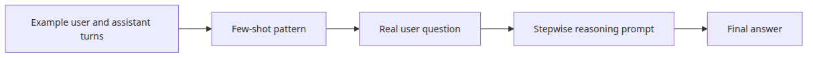

# Few-shot and chain-of-thought — steering better answers

> LLM App Foundations 101 (4/6)

Example code: [github.com/yeongseon-books/llm-app-foundations-101](https://github.com/yeongseon-books/llm-app-foundations-101/tree/main/en/04-few-shot-and-cot)

The diagram below shows how examples and stepwise reasoning steer one request.


Post 03 established the basic shape of prompt design: split policy into `system`, put the current request in `user`, and replay earlier answers as `assistant` when you need conversation state. Once that foundation is in place, the next practical question shows up immediately. Why does the same model sometimes follow the format you want very closely, while other times it gives something that feels almost right but not dependable enough to automate?

In application work, two of the first steering tools you reach for are few-shot prompting and chain-of-thought prompting. Few-shot means showing the model one or more examples of the behavior you want. Chain-of-thought means nudging the model to solve the task in intermediate steps instead of jumping straight to the final answer. Neither technique retrains the model. Both are ways to make an already capable model behave more predictably on the request in front of it.

This post uses Groq's `llama-3.1-8b-instant` to cover both patterns in runnable Python. We will look at seven things:

- what few-shot prompting is in message-array form
- how zero-shot and few-shot differ on the same task
- why example quality matters more than example count
- why chain-of-thought often helps on multi-step tasks
- how zero-shot CoT differs from few-shot CoT
- how to combine few-shot and CoT in one prompt
- where these techniques stop helping

The operating idea is simple: better prompts are often less about clever wording and more about showing the model a clear pattern to follow.

---

## Few-shot prompting teaches by example inside the messages array

Few-shot prompting is the practice of placing one or more worked examples before the real question. In chat APIs, those examples are not stored in a separate training field. They live in the same `messages` array as everything else, usually as paired `user` and `assistant` turns.

The basic pattern looks like this:

1. put the global rules in `system`
2. add an example `user` request
3. add the example `assistant` answer you want the model to imitate
4. repeat with one or two more examples if needed
5. add the real `user` request at the end

From the model's point of view, this behaves like short in-context pattern learning. The weights do not change, but the request now contains a miniature demonstration of what counts as a good answer for this task. That is especially useful for formatting, label normalization, style control, and other short transformation jobs.

This minimal script shows the core idea.

```python
import os

from groq import Groq

client = Groq(api_key=os.environ["GROQ_API_KEY"])

messages = [
    {
        "role": "system",
        "content": (
            "You classify customer support tickets. "
            "Always answer in exactly this format:\n"
            "category: <billing|technical|account>\n"
            "priority: <low|medium|high>\n"
            "reason: <one sentence>"
        ),
    },
    {"role": "user", "content": "The payment went through, but I never received the receipt email."},
    {
        "role": "assistant",
        "content": (
            "category: billing\n"
            "priority: medium\n"
            "reason: The issue is part of the payment follow-up flow rather than a product bug."
        ),
    },
    {"role": "user", "content": "I changed my password, but I still cannot log in."},
    {
        "role": "assistant",
        "content": (
            "category: account\n"
            "priority: high\n"
            "reason: Loss of account access can block the user from using the service at all."
        ),
    },
    {"role": "user", "content": "The server throws an error whenever I upload a CSV file."},
]

completion = client.chat.completions.create(
    model="llama-3.1-8b-instant",
    messages=messages,
    temperature=0.2,
)

print(completion.choices[0].message.content)
```

~~~
Output
category: technical
priority: high
reason: The issue is directly related to the functionality of the service, causing a critical error.
~~~

Three things matter here. First, few-shot is just message-array design. Second, the example has to show the desired answer shape, not merely a related question. Third, every example consumes tokens, so compact representative examples are usually better than long ones.

---

## Zero-shot versus few-shot on the same request

Zero-shot means you ask for the task directly with no examples. You rely on the model's general training and instruction-following ability. That often works surprisingly well, especially for simple classification or summarization tasks. The weakness is consistency. The model may understand the task but still vary the label wording, the answer structure, or the level of explanation.

The script below sends the same support ticket twice: once as zero-shot and once with few-shot examples.

```python
import os

from groq import Groq

client = Groq(api_key=os.environ["GROQ_API_KEY"])

ticket = "We are on the team plan, but this month's invoice is almost double what we expected."

system_prompt = (
    "You classify SaaS support tickets. "
    "Always answer in exactly this format:\n"
    "category: <billing|technical|account>\n"
    "priority: <low|medium|high>\n"
    "reason: <one sentence>"
)

zero_shot = client.chat.completions.create(
    model="llama-3.1-8b-instant",
    messages=[
        {"role": "system", "content": system_prompt},
        {"role": "user", "content": ticket},
    ],
    temperature=0.2,
)

few_shot = client.chat.completions.create(
    model="llama-3.1-8b-instant",
    messages=[
        {"role": "system", "content": system_prompt},
        {"role": "user", "content": "My refund still does not appear on my card statement."},
        {
            "role": "assistant",
            "content": (
                "category: billing\n"
                "priority: medium\n"
                "reason: The problem is part of payment reconciliation after the original charge."
            ),
        },
        {"role": "user", "content": "I receive the two-factor code, but login still fails."},
        {
            "role": "assistant",
            "content": (
                "category: account\n"
                "priority: high\n"
                "reason: An access failure can immediately block the user from their work."
            ),
        },
        {"role": "user", "content": ticket},
    ],
    temperature=0.2,
)

print("[zero-shot]")
print(zero_shot.choices[0].message.content)
print()
print("[few-shot]")
print(few_shot.choices[0].message.content)
```

~~~
Output
[zero-shot]
category: billing
priority: high
reason: The discrepancy in the invoice suggests an unexpected change in pricing or billing calculation.

[few-shot]
category: billing
priority: high
reason: Unexpected billing discrepancies can cause financial disruptions for the customer.
~~~

In many runs, zero-shot will still produce a reasonable answer. Few-shot usually improves a different dimension: repeatability. It tends to stabilize the label vocabulary, the line order, the explanation length, and the way ambiguous cases are interpreted.

That difference matters because applications care less about one impressive answer than about hundreds of answers arriving in a shape the rest of the system can rely on.

---

## Example quality can help or hurt

Few-shot prompting is only as good as the examples you provide. That sounds obvious, but it is one of the most common failure modes in early LLM applications. Developers add examples expecting an automatic boost, and the outputs become less consistent instead of more consistent.

Bad examples usually fail in one of four ways:

- the labels are inconsistent
- the answer format changes from one example to the next
- the examples are verbose and hide the actual pattern
- the examples are too easy and do not resemble the real task

This script compares poor examples with stronger ones.

```python
import os

from groq import Groq

client = Groq(api_key=os.environ["GROQ_API_KEY"])

target_question = "The password reset email never arrives, so I cannot sign in."

bad_examples = [
    {"role": "user", "content": "The invoice amount looks wrong."},
    {
        "role": "assistant",
        "content": "This might be billing or account related. Ask the customer more questions first.",
    },
    {"role": "user", "content": "I cannot log in."},
    {
        "role": "assistant",
        "content": "The priority could be urgent, but it depends on the full situation.",
    },
]

good_examples = [
    {"role": "user", "content": "I think my card was charged twice."},
    {
        "role": "assistant",
        "content": (
            "category: billing\n"
            "priority: high\n"
            "reason: A possible duplicate charge creates direct financial risk for the customer."
        ),
    },
    {"role": "user", "content": "The profile photo uploader returns a 500 error every time."},
    {
        "role": "assistant",
        "content": (
            "category: technical\n"
            "priority: medium\n"
            "reason: The feature is broken, but the user is not fully locked out of the account."
        ),
    },
]

system_prompt = (
    "You classify SaaS support tickets. "
    "Always answer in exactly this format:\n"
    "category: <billing|technical|account>\n"
    "priority: <low|medium|high>\n"
    "reason: <one sentence>"
)

bad_run = client.chat.completions.create(
    model="llama-3.1-8b-instant",
    messages=[
        {"role": "system", "content": system_prompt},
        {"role": "user", "content": "Use the examples below to classify the final ticket."},
        *bad_examples,
        {"role": "user", "content": target_question},
    ],
    temperature=0.2,
)

good_run = client.chat.completions.create(
    model="llama-3.1-8b-instant",
    messages=[
        {"role": "system", "content": system_prompt},
        *good_examples,
        {"role": "user", "content": target_question},
    ],
    temperature=0.2,
)

print("[bad examples]")
print(bad_run.choices[0].message.content)
print()
print("[good examples]")
print(good_run.choices[0].message.content)
```

~~~
Output
[bad examples]
category: technical
priority: high
reason: The customer is unable to access their account due to a failed password reset process.

[good examples]
category: technical
priority: high
reason: The inability to reset the password prevents the user from accessing their account.
~~~

The stronger examples do more than show correct answers. They demonstrate a stable schema, a clear priority policy, and the expected sentence length. That is why example quality matters more than raw example count. Two clean examples often outperform six messy ones.

In practice, good few-shot examples are usually:

- close to the real inputs you expect
- consistent with each other
- rich in edge-case signal rather than surface variety
- short enough that the pattern stays obvious

---

## Chain-of-thought helps the model decompose the task

If few-shot is about answer patterns, chain-of-thought is about solution process. The familiar version is a phrase such as “Let's think step by step.” The reason this often works is not mystical. Multi-step tasks become easier when the model is nudged to compute or check intermediate states instead of leaping directly to the conclusion.

That is useful for arithmetic, rule application, ordered constraints, and cases where the final answer depends on several earlier checks. The model is not gaining new facts. It is being guided to use its existing knowledge more methodically.

This is the simplest zero-shot CoT pattern.

```python
import os

from groq import Groq

client = Groq(api_key=os.environ["GROQ_API_KEY"])

question = (
    "An online course costs 120000 won. Apply a 10% coupon first, "
    "then add 10% VAT to the discounted price. What is the final payment amount?"
)

completion = client.chat.completions.create(
    model="llama-3.1-8b-instant",
    messages=[
        {
            "role": "system",
            "content": "You explain calculations carefully and stay numerically precise.",
        },
        {
            "role": "user",
            "content": (
                question
                + " Let's think step by step. Put the last line in the form final_answer: <number> won."
            ),
        },
    ],
    temperature=0.0,
)

print(completion.choices[0].message.content)
```

~~~
Output
To find the final payment amount, we'll follow the steps you mentioned.

Step 1: Apply a 10% coupon to the original price of 120,000 won.

First, we need to find 10% of 120,000 won. 
10% of 120,000 won = (10/100) * 120,000 = 0.1 * 120,000 = 12,000 won

Now, subtract the coupon amount from the original price.
Discounted price = Original price - Coupon amount
= 120,000 won - 12,000 won
= 108,000 won

Step 2: Add 10% VAT to the discounted price.

First, we need to find 10% of the discounted price.
10% of 108,000 won = (10/100) * 108,000 = 0.1 * 108,000 = 10,800 won

Now, add the VAT amount to the discounted price.
Final price = Discounted price + VAT amount
= 108,000 won + 10,800 won
= 118,800 won

final_answer: 118800 won.
~~~

This tends to reduce mistakes in ordering and intermediate arithmetic. It is especially handy when the task has words like “first,” “then,” “except,” or “only if,” because those are exactly the cases where skipping an intermediate check causes the answer to drift.

---

## Zero-shot CoT and few-shot CoT are different tools

Zero-shot CoT tells the model to reason step by step but does not show an example of that reasoning. It is cheap in tokens and easy to try first. On many general reasoning tasks, that alone is enough.

Few-shot CoT goes further. The examples do not only show the final answer format. They also show the reasoning rhythm the model should imitate.

This small script demonstrates the pattern.

```python
import os

from groq import Groq

client = Groq(api_key=os.environ["GROQ_API_KEY"])

messages = [
    {
        "role": "system",
        "content": (
            "You calculate order totals. "
            "Always answer with numbered steps followed by final_answer."
        ),
    },
    {
        "role": "user",
        "content": "The base price is 50000 won. After a 20% discount, add a 3000 won shipping fee. What is the total?",
    },
    {
        "role": "assistant",
        "content": (
            "1) 20% of 50000 won is 10000 won.\n"
            "2) After the discount, the subtotal is 40000 won.\n"
            "3) Add the 3000 won shipping fee to get 43000 won.\n"
            "final_answer: 43000 won"
        ),
    },
    {
        "role": "user",
        "content": "The base price is 80000 won. After a 25% discount, add a 5000 won shipping fee. What is the total?",
    },
]

completion = client.chat.completions.create(
    model="llama-3.1-8b-instant",
    messages=messages,
    temperature=0.0,
)

print(completion.choices[0].message.content)
```

~~~
Output
1) 25% of 80000 won is 20000 won.
2) After the discount, the subtotal is 60000 won.
3) Add the 5000 won shipping fee to get 65000 won.
final_answer: 65000 won
~~~

The difference is easy to summarize:

- zero-shot CoT: ask for step-by-step reasoning
- few-shot CoT: provide a step-by-step reasoning example first

For most beginner projects, a good operating order is to start with zero-shot CoT and only pay for few-shot CoT when the reasoning structure keeps drifting.

---

## Combining few-shot and CoT fixes both the answer shape and the reasoning path

In real applications, these two techniques are often strongest together. You may want the model to follow a stable output schema while also checking rules in a specific order. That combination shows up in policy decisions, operations triage, eligibility checks, and other business tasks where the route to the answer matters almost as much as the answer itself.

The example below uses a refund policy. The few-shot part fixes the schema. The CoT part makes the model walk through the policy before deciding.

```python
import os

from groq import Groq

client = Groq(api_key=os.environ["GROQ_API_KEY"])

policy = (
    "Refund policy:\n"
    "- Full refund if the purchase was within 7 days and watch progress is under 20%\n"
    "- No refund if the purchase was within 7 days but watch progress is 20% or more\n"
    "- No refund if more than 7 days have passed, regardless of watch progress"
)

messages = [
    {
        "role": "system",
        "content": (
            "You review refund requests for an online course service. "
            "Always answer with 1) policy_check 2) decision 3) reason."
        ),
    },
    {"role": "user", "content": policy},
    {
        "role": "user",
        "content": "It has been 3 days since purchase, and the watch progress is 10%. Decide whether the refund should be approved.",
    },
    {
        "role": "assistant",
        "content": (
            "policy_check:\n"
            "1) The request is within 7 days of purchase.\n"
            "2) Watch progress is under 20%.\n"
            "decision: approved\n"
            "reason: The request satisfies both the time window and the watch-progress requirement for a full refund."
        ),
    },
    {
        "role": "user",
        "content": "It has been 5 days since purchase, and the watch progress is 35%. Decide whether the refund should be approved.",
    },
    {
        "role": "assistant",
        "content": (
            "policy_check:\n"
            "1) The request is within 7 days of purchase.\n"
            "2) Watch progress is 20% or more.\n"
            "decision: denied\n"
            "reason: The request is inside the time window, but the watch-progress threshold has already been crossed."
        ),
    },
    {
        "role": "user",
        "content": "It has been 10 days since purchase, and the watch progress is 0%. Decide whether the refund should be approved.",
    },
]

completion = client.chat.completions.create(
    model="llama-3.1-8b-instant",
    messages=messages,
    temperature=0.0,
)

print(completion.choices[0].message.content)
```

~~~
Output
policy_check:
1) The request is more than 7 days after purchase.
2) Watch progress is under 20%.
decision: denied
reason: The request exceeds the allowed time window for a refund, regardless of the watch progress.
~~~

This pattern is useful because it improves more than answer quality. It improves debuggability. If the output is wrong, you can inspect which policy check went wrong rather than treating the whole response as a black box.

---

## Where these techniques stop helping

Few-shot and CoT are powerful, but they are not universal fixes.

### When the model lacks the required knowledge

Neither technique creates missing facts. If the task depends on current events, private company policy, or information outside the model's training, you need retrieval or tools, not just a more elaborate prompt.

### When the context is already crowded

Few-shot examples cost tokens. If you already have long conversation history or large retrieved passages, adding more examples may reduce headroom for the real task.

### When the output must stay extremely strict

Chain-of-thought often makes the model more verbose. That is not ideal when the target output is rigid JSON, SQL, CSV, or another tightly constrained format. In those cases, stronger format instructions often matter more than visible reasoning.

### When the examples are not representative

If your examples are easy but the real task is full of ambiguous edge cases, few-shot will not rescue the gap. It gives a local hint, not full task training.

### When zero-shot is already enough

Some tasks do not need extra steering. A short summary, a simple rewrite, or a clear classification request may already work well in zero-shot form. If so, few-shot and CoT can become unnecessary latency and token cost.

---

## Closing thoughts

Few-shot prompting teaches by example. Chain-of-thought prompting teaches by decomposition. The first is strong at stabilizing answer shape and style. The second is strong at reducing errors in multi-step reasoning. Used together, they can lock both the response schema and the path the model takes to get there.

The practical lesson is still conservative. More examples do not automatically mean better results. “Let's think step by step” does not create knowledge the model never had. Most of the time, the best outcomes come from short clean examples, explicit output rules, low temperature for structured tasks, and careful token budgeting.

The next post moves from static prompt design to dynamic conversation state. Few-shot examples are fixed context. Multi-turn chat memory is changing context, and that is where chatbot architecture starts to feel like application engineering instead of prompt tinkering.

<!-- toc:begin -->
## In this series

- [LLM API first call — sending your first request](./01-llm-api-first-call.md)
- [Understanding tokens — cost, limits, and context windows](./02-understanding-tokens.md)
- [Prompt engineering basics — system, user, and assistant roles](./03-prompt-engineering-basics.md)
- **Few-shot and chain-of-thought — steering better answers (current)**
- Managing conversation state — building a multi-turn chatbot (upcoming)
- Handling streaming responses — real-time output (upcoming)

<!-- toc:end -->

---

## References

- Groq Docs, "Text chat": <https://console.groq.com/docs/text-chat>
- Groq Python Library: <https://github.com/groq/groq-python>
- OpenAI, "Prompt engineering": <https://platform.openai.com/docs/guides/prompt-engineering>
- Anthropic Docs, "Prompt engineering overview": <https://docs.anthropic.com/en/docs/build-with-claude/prompt-engineering/overview>
- Jason Wei et al., "Chain-of-Thought Prompting Elicits Reasoning in Large Language Models": <https://arxiv.org/abs/2201.11903>

Tags: LLM, OpenAI, Prompt Engineering, Python
