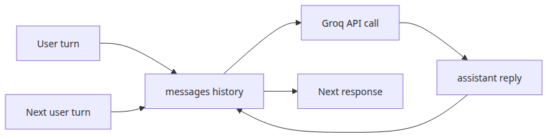

# Managing conversation state — building a multi-turn chatbot

> LLM App Foundations 101 (5/6)

Example code: [github.com/yeongseon-books/llm-app-foundations-101](https://github.com/yeongseon-books/llm-app-foundations-101/tree/main/en/05-conversation-state)

The diagram below summarizes how message history accumulates across turns.


One of the first surprises in chatbot development is how quickly the illusion breaks. The first answer looks fine. The second user message refers to the previous turn, and the model suddenly behaves as if the conversation started from zero. That is not a provider bug. It is the default API contract.

An LLM does not carry your application's conversation state for free. A chat product feels stateful because the application keeps rebuilding context and resending it on every request. The memory is not hidden in the model. It is a data structure you own.

This post uses Groq's `llama-3.1-8b-instant` to build that mental model and turn it into runnable Python. We will cover seven things:

- why LLM calls are fundamentally stateless
- how multi-turn chat emerges from accumulated `messages`
- the simplest memory pattern: keep the full history
- sliding windows that retain only the last N turns
- summary-based compression for long conversations
- a practical CLI chatbot with an input loop and history management
- how to detect and handle context window overflow

The main idea is simple: **conversation memory lives in your application layer, not inside the model session**.

---

## Why LLM calls are stateless

At the API boundary, each chat completion request is independent. The model sees only the payload you send. If you do not include earlier turns, those turns do not exist from the model's point of view.

Suppose your first request is:

```python
messages = [
    {"role": "user", "content": "My name is Mina. Please remember that."}
]
```

The model can answer using the name `Mina` because that information is present in the prompt. But if the next request is only:

```python
messages = [
    {"role": "user", "content": "What is my name?"}
]
```

then the model has no way to recover the missing fact. It is not refusing to remember. It was never sent the earlier turn.

This statelessness is easy to misread as a limitation, but it is also what makes chat systems debuggable. A request can be replayed exactly, the sent context is inspectable, and privacy or retention policy stays under application control. The provider offers generation. Your application decides what counts as memory.

---

## Multi-turn chat comes from replaying history in messages

Every new request includes prior turns alongside the latest user input. The model reads the whole array and continues from there.

In chat APIs, that history is usually represented with three roles:

- `system` for global rules
- `user` for user turns
- `assistant` for earlier model replies

Here is the smallest useful example.

```python
import os

from groq import Groq

client = Groq(api_key=os.environ["GROQ_API_KEY"])

messages = [
    {
        "role": "system",
        "content": "You are a concise Python tutor.",
    },
    {"role": "user", "content": "Explain the difference between a list and a tuple."},
    {
        "role": "assistant",
        "content": "A list is mutable, while a tuple is immutable.",
    },
    {"role": "user", "content": "Which one is better as a dictionary key then?"},
]

completion = client.chat.completions.create(
    model="llama-3.1-8b-instant",
    messages=messages,
    temperature=0.3,
)

print(completion.choices[0].message.content)
```

```
Output
In Python, dictionary keys should be immutable. Therefore, a tuple is a better choice than a list as a dictionary key because tuples are immutable, while lists are not.
```

The important part is not just the last question. It is the replayed context before it. Terms like “which one” and “then” become meaningful only because the earlier turns are present in the same request. In application code, the loop is simple: append the new user message, send the current history, append the assistant reply, and repeat.

---

## Keeping the full history is the simplest memory pattern

The first implementation most teams write is also the easiest to understand: keep the entire conversation and resend it every time. For short sessions, that is still a perfectly reasonable design.

```python
import os

from groq import Groq

client = Groq(api_key=os.environ["GROQ_API_KEY"])

history = [
    {
        "role": "system",
        "content": "You are a concise technical support assistant.",
    }
]

def ask(user_text: str) -> str:
    history.append({"role": "user", "content": user_text})

    completion = client.chat.completions.create(
        model="llama-3.1-8b-instant",
        messages=history,
        temperature=0.2,
    )

    answer = completion.choices[0].message.content or ""
    history.append({"role": "assistant", "content": answer})
    return answer

print(ask("My product is a monthly SaaS service. Please remember that."))
print(ask("Now write a one-line refund policy statement."))
```

```
Output
I'll keep in mind that your product is a monthly SaaS (Software as a Service) service. What issue or question do you need help with?
"We offer a 30-day money-back guarantee for all monthly subscriptions, with refunds processed on the next billing cycle."
```

The appeal is obvious: implementation is trivial, context retention is strong, and debugging stays easy because nothing is hidden or compressed. The weakness is just as obvious. Prompt size, latency, and cost grow with every turn until the request hits the model's context window.

---

## Sliding windows retain only the last N turns

In many conversations, the most important details live near the end. Sliding-window memory takes advantage of that. You keep the fixed `system` message, then preserve only the most recent N user and assistant turns.

```python
import os
from collections import deque

from groq import Groq

client = Groq(api_key=os.environ["GROQ_API_KEY"])

system_message = {
    "role": "system",
    "content": "You are a chatbot that helps users learn Python.",
}
recent_turns = deque(maxlen=6)  # last 3 user/assistant pairs

def ask(user_text: str) -> str:
    recent_turns.append({"role": "user", "content": user_text})

    messages = [system_message, *recent_turns]
    completion = client.chat.completions.create(
        model="llama-3.1-8b-instant",
        messages=messages,
        temperature=0.3,
    )

    answer = completion.choices[0].message.content or ""
    recent_turns.append({"role": "assistant", "content": answer})
    return answer
```

This pattern makes token usage much easier to bound because raw history cannot grow forever. The trade-off is equally clear: once a fact falls out of the window, the model no longer sees it. If something must survive the whole session, it belongs in `system` or in a persistent summary rather than in rolling history. Sliding windows are strong for short support or Q&A sessions, and weaker for long task-oriented chats where old decisions still matter later.

---

## Summary-based compression handles longer conversations

Sometimes discarding old turns is too aggressive, but keeping everything is too expensive. Summary-based compression sits in the middle: keep a fixed `system` prompt, preserve a summary of older context, and retain only the latest raw turns.

```python
import os

from groq import Groq

client = Groq(api_key=os.environ["GROQ_API_KEY"])

system_message = {
    "role": "system",
    "content": "You are a project-planning chatbot.",
}
summary_text = ""
recent_turns = []

def summarize_history(history_chunk: list[dict[str, str]], current_summary: str) -> str:
    prompt = [
        {
            "role": "system",
            "content": (
                "Compress the conversation. Preserve user goals, confirmed facts, "
                "preferences, and unresolved questions."
            ),
        },
        {
            "role": "user",
            "content": (
                f"Current summary:\n{current_summary or '(none)'}\n\n"
                f"New history chunk:\n{history_chunk}"
            ),
        },
    ]

    completion = client.chat.completions.create(
        model="llama-3.1-8b-instant",
        messages=prompt,
        temperature=0.1,
    )
    return completion.choices[0].message.content or ""

def build_messages(user_text: str) -> list[dict[str, str]]:
    messages = [system_message]
    if summary_text:
        messages.append(
            {
                "role": "system",
                "content": f"Conversation summary:\n{summary_text}",
            }
        )
    messages.extend(recent_turns)
    messages.append({"role": "user", "content": user_text})
    return messages
```

The practical risk here is information loss. A summary is lossy. If it drops a crucial constraint, the rest of the session continues from a distorted memory. That is why summary prompts should preserve durable facts: goals, constraints, user preferences, decisions already made, and open issues.

---

## Detecting context overflow before the request fails

Long conversations usually fail because the prompt gets too large. Once accumulated history grows past the usable context budget, the provider may reject the request or force trade-offs between prompt size and completion length.

The best approach is to estimate prompt size before sending. Exact token counting is ideal, but even a rough estimate is enough to trigger trimming and summarization.

```python
def rough_token_count(messages: list[dict[str, str]]) -> int:
    total_chars = sum(len(message["content"]) for message in messages)
    overhead = len(messages) * 12
    return (total_chars // 4) + overhead

def enforce_budget(messages: list[dict[str, str]], max_input_tokens: int = 6000) -> list[dict[str, str]]:
    if rough_token_count(messages) <= max_input_tokens:
        return messages

    trimmed = messages[:1] + messages[-8:]
    if rough_token_count(trimmed) <= max_input_tokens:
        return trimmed

    raise ValueError("Conversation is too long. A more aggressive summary is required.")
```

Even this crude estimate is enough to trigger useful actions: summarize older turns, shrink the sliding window, reduce completion length, or ask the user to reset the session. It is also worth logging `completion.usage` after every successful call. That is how you spot which sessions are expanding prompt cost and where the memory policy starts to break down.

---

## Building a practical CLI chatbot

Now let us combine the ideas into one script. The example below supports:

- a CLI input loop
- rolling raw history
- summary-based compression when the estimated budget is exceeded
- simple session commands for reset and inspection

```python
import os
from typing import List, Dict

from groq import Groq

MODEL = "llama-3.1-8b-instant"
MAX_INPUT_TOKENS = 6000
RAW_TURN_LIMIT = 6  # last 3 user/assistant pairs

client = Groq(api_key=os.environ["GROQ_API_KEY"])

system_message = {
    "role": "system",
    "content": (
        "You are a practical assistant for Python and LLM application development. "
        "Be concise, accurate, and explicit when something is uncertain."
    ),
}

summary_text = ""
recent_turns: List[Dict[str, str]] = []

def rough_token_count(messages: List[Dict[str, str]]) -> int:
    total_chars = sum(len(message["content"]) for message in messages)
    overhead = len(messages) * 12
    return (total_chars // 4) + overhead

def summarize_old_turns(old_turns: List[Dict[str, str]], current_summary: str) -> str:
    completion = client.chat.completions.create(
        model=MODEL,
        temperature=0.1,
        messages=[
            {
                "role": "system",
                "content": (
                    "Compress the conversation history. Preserve user goals, confirmed facts, "
                    "preferences, and unresolved questions."
                ),
            },
            {
                "role": "user",
                "content": (
                    f"Current summary:\n{current_summary or '(none)'}\n\n"
                    f"History to merge:\n{old_turns}"
                ),
            },
        ],
    )
    return completion.choices[0].message.content or current_summary

def build_messages(user_text: str) -> List[Dict[str, str]]:
    messages: List[Dict[str, str]] = [system_message]

    if summary_text:
        messages.append(
            {
                "role": "system",
                "content": f"Conversation summary:\n{summary_text}",
            }
        )

    messages.extend(recent_turns)
    messages.append({"role": "user", "content": user_text})
    return messages

def compress_if_needed(next_user_text: str) -> None:
    global summary_text, recent_turns

    candidate = build_messages(next_user_text)
    if rough_token_count(candidate) <= MAX_INPUT_TOKENS:
        return

    if len(recent_turns) > RAW_TURN_LIMIT:
        old_turns = recent_turns[:-RAW_TURN_LIMIT]
        recent_turns = recent_turns[-RAW_TURN_LIMIT:]
        summary_text = summarize_old_turns(old_turns, summary_text)

    candidate = build_messages(next_user_text)
    if rough_token_count(candidate) > MAX_INPUT_TOKENS:
        raise ValueError("Input is still too large. Start a new session with /reset.")

def ask(user_text: str) -> str:
    compress_if_needed(user_text)

    messages = build_messages(user_text)
    completion = client.chat.completions.create(
        model=MODEL,
        messages=messages,
        temperature=0.3,
    )

    answer = completion.choices[0].message.content or ""
    recent_turns.append({"role": "user", "content": user_text})
    recent_turns.append({"role": "assistant", "content": answer})

    usage = completion.usage
    print(f"[tokens] prompt={usage.prompt_tokens} total={usage.total_tokens}")
    return answer

def main() -> None:
    global summary_text, recent_turns

    print("Multi-turn chatbot started. Commands: /reset, /summary, /quit")

    while True:
        user_text = input("you> ").strip()

        if not user_text:
            continue
        if user_text == "/quit":
            break
        if user_text == "/reset":
            summary_text = ""
            recent_turns = []
            print("assistant> Session cleared.")
            continue
        if user_text == "/summary":
            print(f"assistant> Current summary:\n{summary_text or '(none)'}")
            continue

        try:
            answer = ask(user_text)
            print(f"assistant> {answer}\n")
        except ValueError as exc:
            print(f"assistant> {exc}\n")

if __name__ == "__main__":
    main()
```

The point of this example is the location of the state. `summary_text`, `recent_turns`, and `MAX_INPUT_TOKENS` all belong to your application. In production, you would usually move session state into Redis or a database, persist summaries separately from raw turns, and add logging plus retry logic around summarization.

---

## Choosing the right memory pattern

The practical rule is simple. If sessions are short, full-history replay is often enough. If token budgets must stay predictable, sliding windows are a strong default. If conversations are long, summary-based compression becomes necessary.

Most real systems combine all three. Keep stable global rules in `system`, preserve the last few raw turns for local coherence, and fold older history into a summary.

When you design memory for a chatbot, three questions matter more than anything else:

- which facts must survive the whole session
- which details are safe to forget
- how will you recover if the summary becomes wrong

If you can answer those clearly, conversation memory stops being magic and becomes an ordinary engineering component.

<!-- toc:begin -->
## In this series

- [LLM API first call — sending your first request](./01-llm-api-first-call.md)
- [Understanding tokens — cost, limits, and context windows](./02-understanding-tokens.md)
- [Prompt engineering basics — system, user, and assistant roles](./03-prompt-engineering-basics.md)
- [Few-shot and chain-of-thought — steering better answers](./04-few-shot-and-cot.md)
- **Managing conversation state — building a multi-turn chatbot (current)**
- Handling streaming responses — real-time output (upcoming)

<!-- toc:end -->

---

## References

- [Groq quickstart](https://console.groq.com/docs/quickstart)
- [Groq API reference](https://console.groq.com/docs/api-reference)
- [Groq models](https://console.groq.com/docs/models)
- [OpenAI prompt engineering guide](https://platform.openai.com/docs/guides/prompt-engineering)

Tags: LLM, OpenAI, Prompt Engineering, Python
