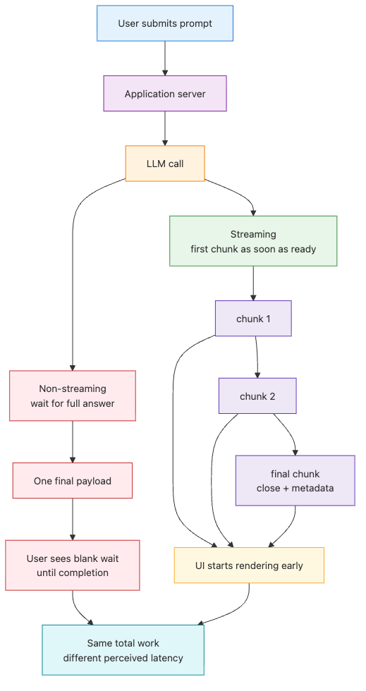

# Handling streaming responses — real-time output

> LLM App Foundations 101 (6/6)

Example code: [github.com/yeongseon-books/llm-app-foundations-101](https://github.com/yeongseon-books/llm-app-foundations-101/tree/main/en/06-streaming-responses)

The diagram below shows the basic event flow of a streamed response.


One of the easiest ways to make an LLM application feel slow is to treat it like an ordinary blocking API call. The server sends a prompt, waits in silence, and only returns once the entire answer is finished. The feature works, but the experience feels worse than it needs to. A user stares at a blank box for several seconds and has no idea whether the model is thinking, the network is stalled, or the app is broken.

That is the real value of streaming. It does not magically reduce the model's total generation time. What it changes is visibility. The first partial output can reach the user quickly, the UI can start rendering immediately, and long answers stop feeling like dead time. In practice, that difference matters a lot. A five-second wait with no feedback feels suspicious. A five-second wait where text starts appearing after a few hundred milliseconds feels responsive.

Streaming also changes how you think about the response itself. Without streaming, a completion is one object with one final text field. With streaming, the answer becomes a sequence of chunks. Each chunk may contain new text, metadata, or just a signal that generation is ending. Once you start building chat UIs, drafting tools, or browser-based copilots, that event-oriented model becomes much more natural than waiting for one large string.

This post closes the series by building that mental model with the Groq Python SDK. We will cover seven things:

- why blocking calls create UX friction
- how Groq streaming works with `stream=True` and `for chunk in stream:`
- how to extract text from `chunk.choices[0].delta.content`
- how streaming differs from synchronous and asynchronous execution models
- how to read token usage from the final chunk's `x_groq` metadata or from separate aggregation
- how to write streamed output to a file or pipe it into another stage
- where to go next after the foundations series ends

The main idea is simple: **streaming does not make the model smarter or faster, but it makes waiting legible**.

---

## Why streaming matters

From a backend point of view, blocking calls are attractive. The implementation is easy to explain. Send the request, wait for completion, read the final text, return the result. That is perfectly fine for small scripts and offline jobs.

The problem shows up at the user boundary. When the application waits for the full answer before sending anything back, the user gets no evidence that progress is happening. The model may already be generating tokens, but the interface remains frozen until the last token arrives.

Compare the two flows.

In a non-streaming path:

1. the user submits a prompt
2. the server calls the model
3. the model generates tokens internally
4. the server waits for all of them
5. the application returns one final payload

In a streaming path:

1. the user submits a prompt
2. the server calls the model
3. the first chunk is returned as soon as it is available
4. later chunks keep arriving and are appended in the UI
5. the final chunk closes the stream and may carry usage metadata

The total wall-clock time may be similar, but the perceived latency is very different. Users can see that the request started, begin reading early, and decide whether to keep waiting. That opens the door to better interaction design:

- partial rendering instead of blank waiting
- cancellation during long generations
- incremental logging or persistence
- chaining downstream consumers before the full response is complete

Streaming is especially valuable when answers are long or variable in length: chatbot replies, structured explanations, summaries, drafts, code generation, and assistant-style interfaces. It matters less for internal batch jobs where no human is waiting on the response in real time.

That distinction is worth keeping in mind throughout this article. Streaming is not a rule. It is a design choice driven by who is waiting and what they need to see while they wait.

---

## The smallest Groq streaming example

With the Groq SDK, streaming starts with one parameter: `stream=True`. Instead of receiving one completed response object, you receive an iterable stream of chunks.

```python
import os

from groq import Groq

client = Groq(api_key=os.environ["GROQ_API_KEY"])

stream = client.chat.completions.create(
    model="llama-3.1-8b-instant",
    messages=[
        {
            "role": "system",
            "content": "You are a concise Python tutor.",
        },
        {
            "role": "user",
            "content": "Explain Python generators in five sentences.",
        },
    ],
    temperature=0.3,
    stream=True,
)

for chunk in stream:
    print(chunk)
```

~~~
Output
ChatCompletionChunk(id='chatcmpl-10091ef1-3c4f-401d-9000-9088ef0c54f9', choices=[Choice(delta=ChoiceDelta(content='', annotations=None, function_call=None, reasoning=None, role='assistant', tool_calls=None, executed_tools=None), finish_reason=None, index=0, logprobs=None)], created=1777646502, model='llama-3.1-8b-instant', object='chat.completion.chunk', system_fingerprint='fp_7ccc667439', usage=None, x_groq=XGroq(id='req_01kqhzt07yf07r9hf1tdp5sf8a', debug=None, seed=1107188184, usage=None, usage_breakdown=None, error=None))
ChatCompletionChunk(id='chatcmpl-10091ef1-3c4f-401d-9000-9088ef0c54f9', choices=[Choice(delta=ChoiceDelta(content='**', annotations=None, function_call=None, reasoning=None, role=None, tool_calls=None, executed_tools=None), finish_reason=None, index=0, logprobs=None)], created=1777646502, model='llama-3.1-8b-instant', object='chat.completion.chunk', system_fingerprint='fp_7ccc667439', usage=None, x_groq=None)
ChatCompletionChunk(id='chatcmpl-10091ef1-3c4f-401d-9000-9088ef0c54f9', choices=[Choice(delta=ChoiceDelta(content='Python', annotations=None, function_call=None, reasoning=None, role=None, tool_calls=None, executed_tools=None), finish_reason=None, index=0, logprobs=None)], created=1777646502, model='llama-3.1-8b-instant', object='chat.completion.chunk', system_fingerprint='fp_7ccc667439', usage=None, x_groq=None)
ChatCompletionChunk(id='chatcmpl-10091ef1-3c4f-401d-9000-9088ef0c54f9', choices=[Choice(delta=ChoiceDelta(content=' Gener', annotations=None, function_call=None, reasoning=None, role=None, tool_calls=None, executed_tools=None), finish_reason=None, index=0, logprobs=None)], created=1777646502, model='llama-3.1-8b-instant', object='chat.completion.chunk', system_fingerprint='fp_7ccc667439', usage=None, x_groq=None)
ChatCompletionChunk(id='chatcmpl-10091ef1-3c4f-401d-9000-9088ef0c54f9', choices=[Choice(delta=ChoiceDelta(content='ators', annotations=None, function_call=None, reasoning=None, role=None, tool_calls=None, executed_tools=None), finish_reason=None, index=0, logprobs=None)], created=1777646502, model='llama-3.1-8b-instant', object='chat.completion.chunk', system_fingerprint='fp_7ccc667439', usage=None, x_groq=None)
ChatCompletionChunk(id='chatcmpl-10091ef1-3c4f-401d-9000-9088ef0c54f9', choices=[Choice(delta=ChoiceDelta(content='**\n', annotations=None, function_call=None, reasoning=None, role=None, tool_calls=None, executed_tools=None), finish_reason=None, index=0, logprobs=None)], created=1777646502, model='llama-3.1-8b-instant', object='chat.completion.chunk', system_fingerprint='fp_7ccc667439', usage=None, x_groq=None)
ChatCompletionChunk(id='chatcmpl-10091ef1-3c4f-401d-9000-9088ef0c54f9', choices=[Choice(delta=ChoiceDelta(content='================', annotations=None, function_call=None, reasoning=None, role=None, tool_calls=None, executed_tools=None), finish_reason=None, index=0, logprobs=None)], created=1777646502, model='llama-3.1-8b-instant', object='chat.completion.chunk', system_fingerprint='fp_7ccc667439', usage=None, x_groq=None)
ChatCompletionChunk(id='chatcmpl-10091ef1-3c4f-401d-9000-9088ef0c54f9', choices=[Choice(delta=ChoiceDelta(content='=====', annotations=None, function_call=None, reasoning=None, role=None, tool_calls=None, executed_tools=None), finish_reason=None, index=0, logprobs=None)], created=1777646502, model='llama-3.1-8b-instant', object='chat.completion.chunk', system_fingerprint='fp_7ccc667439', usage=None, x_groq=None)
ChatCompletionChunk(id='chatcmpl-10091ef1-3c4f-401d-9000-9088ef0c54f9', choices=[Choice(delta=ChoiceDelta(content='\n\n', annotations=None, function_call=None, reasoning=None, role=None, tool_calls=None, executed_tools=None), finish_reason=None, index=0, logprobs=None)], created=1777646502, model='llama-3.1-8b-instant', object='chat.completion.chunk', system_fingerprint='fp_7ccc667439', usage=None, x_groq=None)
ChatCompletionChunk(id='chatcmpl-10091ef1-3c4f-401d-9000-9088ef0c54f9', choices=[Choice(delta=ChoiceDelta(content='A', annotations=None, function_call=None, reasoning=None, role=None, tool_calls=None, executed_tools=None), finish
... (truncated)
~~~
That small change is enough to shift your mental model. A streamed response is not one text value. It is a sequence of events. Some events carry new text. Some carry only structural metadata. One of them ends the interaction.

In practice, most applications care about three separate tasks while consuming a stream:

- extracting visible text for the user
- accumulating a full final string for storage or later processing
- reading final metadata such as usage and finish state

You usually want all three, not just the first one.

---

## Extracting text from each chunk

In chat streaming, the text you usually want to render lives in `chunk.choices[0].delta.content`. Not every chunk contains visible text, so your loop should treat missing content as normal.

Here is the most useful baseline pattern.

```python
import os

from groq import Groq

client = Groq(api_key=os.environ["GROQ_API_KEY"])

stream = client.chat.completions.create(
    model="llama-3.1-8b-instant",
    messages=[
        {
            "role": "user",
            "content": "Explain the difference between FastAPI and Flask for beginners.",
        }
    ],
    temperature=0.2,
    stream=True,
)

parts: list[str] = []

for chunk in stream:
    delta = chunk.choices[0].delta.content
    if delta:
        print(delta, end="", flush=True)
        parts.append(delta)

final_text = "".join(parts)
print("\n---")
print(final_text)
```

~~~
Output
**Introduction to FastAPI and Flask**

FastAPI and Flask are two popular Python web frameworks used for building web applications. While both frameworks share some similarities, they have distinct differences in their design, architecture, and use cases.

**Flask**

Flask is a micro web framework that is lightweight and flexible. It was one of the first Python web frameworks and has been widely used since its inception. Flask is ideal for small to medium-sized projects and is often used for prototyping and proof-of-concepts.

**Key Features of Flask**

*   Lightweight and flexible
*   Micro framework with a small codebase
*   Supports both synchronous and asynchronous code
*   Has a large community and extensive documentation
*   Supports a wide range of extensions and libraries

**FastAPI**

FastAPI is a modern, fast (high-performance), web framework for building APIs with Python 3.7+ based on standard Python type hints. It's designed to be fast, scalable, and secure, making it an excellent choice for building large-scale web applications.

**Key Features of FastAPI**

*   Fast and scalable
*   Supports asynchronous code out of the box
*   Automatic API documentation with Swagger UI
*   Supports Python type hints for automatic API documentation and validation
*   Has a growing community and extensive documentation

**Comparison of Flask and FastAPI**

|  Feature  | Flask | FastAPI |
|  ------  |  ----  |  ------  |
|  **Size** |  Small  |  Large    |
|  **Complexity** |  Simple  |  Complex  |
|  **Performance** |  Good  |  Excellent |
|  **Async Support** |  Optional |  Built-in  |
|  **API Documentation** |  Manual  |  Automatic  |
|  **Community** |  Large  |  Growing  |

**Choosing Between Flask and FastAPI**

*   **Small to medium-sized projects**: Flask is a good choice due to its lightweight and flexible nature.
*   **Large-scale web applications**: FastAPI is a better choice due to its high-performance, scalability, and automatic API documentation.
*   **Prototyping and proof-of-concepts**: Flask is a good choice due to its simplicity and ease of use.
*   **Building APIs with Python type hints**: FastAPI is a better choice due to its automatic API documentation and validation.

**Example Use Case**

Here's an example of a simple API using both Flask and FastAPI:

**Flask Example**
    ```python
    from flask import Flask, jsonify
    
    app = Flask(__name__)
    
    @app.route('/users', methods=['GET'])
    def get_users():
        users = [{'id': 1, 'name': 'John'}, {'id': 2, 'name': 'Jane'}]
        return jsonify(users)
    ... (truncated)
~~~from fastapi import FastAPI
... (truncated)
```

This pattern does two jobs at once. It renders incremental text immediately, and it keeps a stable final copy of the answer in memory. That second part matters more than beginners often expect. Once you want to save the completion to a database, run moderation, cache the result, or feed it into another step, you need the full reconstructed string.

There is also an important defensive habit here: always expect some chunks to contain no text. Depending on the SDK and provider behavior, a chunk may carry role information, a stop marker, or usage metadata without any new output content. Treating `None` or empty deltas as normal keeps the consumer loop simple and robust.

---

## Streaming versus sync and async patterns

Streaming and async are related in practice, but they are not the same concept.

Streaming describes **how the response arrives**. Instead of one final payload, the result arrives in pieces.

Async describes **how your application waits**. An async runtime can keep doing other work while one network operation is in flight.

That means you can have:

- synchronous non-streaming calls
- synchronous streaming calls
- asynchronous non-streaming calls
- asynchronous streaming calls

For a small CLI tool, synchronous streaming is often the simplest choice. For a web server with multiple users, asynchronous streaming is usually the better fit because one connection waiting for the next chunk should not block the whole worker.

Here is an async version using `AsyncGroq` and `async for`.

```python
import asyncio
import os

from groq import AsyncGroq

client = AsyncGroq(api_key=os.environ["GROQ_API_KEY"])

async def main() -> None:
    stream = await client.chat.completions.create(
        model="llama-3.1-8b-instant",
        messages=[
            {
                "role": "user",
                "content": "Explain why asyncio helps in web servers.",
            }
        ],
        temperature=0.2,
        stream=True,
    )

    parts: list[str] = []

    async for chunk in stream:
        delta = chunk.choices[0].delta.content
        if delta:
            print(delta, end="", flush=True)
            parts.append(delta)

    final_text = "".join(parts)
    print("\n---")
    print(final_text)

asyncio.run(main())
```

~~~
Output
**Asyncio in Web Servers: Improving Performance and Scalability**

Asyncio is a built-in Python library that allows developers to write single-threaded concurrent code using coroutines, multiplexing I/O access over sockets and other resources, and implementing network clients and servers. In the context of web servers, asyncio helps improve performance and scalability by enabling efficient handling of multiple concurrent requests.

**Why Asyncio Helps in Web Servers:**

### 1. **Non-Blocking I/O**

Asyncio uses non-blocking I/O, which means that when a request is made to the server, it doesn't block the execution of other tasks. Instead, the server can handle multiple requests concurrently, improving overall throughput and responsiveness.

### 2. **Efficient Resource Utilization**

Asyncio allows the server to utilize system resources more efficiently. By handling multiple requests concurrently, the server can reduce the number of threads or processes required to handle a large number of requests, resulting in improved resource utilization and reduced overhead.

### 3. **Improved Scalability**

Asyncio enables web servers to scale more efficiently. As the number of requests increases, the server can handle them concurrently without creating new threads or processes, reducing the overhead associated with context switching and improving overall performance.

### 4. **Reduced Memory Usage**

Asyncio's use of coroutines and non-blocking I/O reduces memory usage compared to traditional threading or multiprocessing approaches. This is because coroutines share the same memory space, reducing the overhead associated with creating and managing multiple threads or processes.

### 5. **Simplified Code**

Asyncio's syntax and APIs make it easier to write concurrent code, reducing the complexity and overhead associated with traditional threading or multiprocessing approaches.

**Example Use Case:**

Here's an example of a simple web server using asyncio:
    ```python
    import asyncio
    
    async def handle_request(reader, writer):
        data = await reader.read(100)
        writer.write(b"Hello, client!")
        await writer.drain()
        writer.close()
    
    async def main():
        server = await asyncio.start_server(handle_request, '127.0.0.1', 8080)
        async with server:
            await server.serve_forever()
    
    asyncio.run(main())
    ```
In this example, the `handle_request` coroutine handles incoming requests concurrently, improving the server's performance and scalability.

**Conclusion:**

Asyncio is a powerful tool for building high-performance web servers that can handle a large number of concurrent requests efficiently. By leveraging non-blocking I/O, efficient resource utilization, improved scalability, reduced memory usage, and simplified code, asyncio enables developers to build scalable and responsive web servers that meet the demands of modern web applications.
---
**Asyncio in Web Servers: Improving Performance and Scalability**

Asyncio is a built-in Python library that allows developers to write single-threaded concurrent code using coroutines, multiplexing I/O access over sockets and other resources, and implementing network clients and servers. In the context of web servers, asyncio helps improve performance and scalability by enabling efficient handling of multiple concurrent requests.

**Why Asyncio Helps in Web Servers:**

### 1. **Non-Blocking I/O**

Asyncio uses non-blocking I/O, which means that when a request is made to the server, it doesn't block the execution of other tasks. Instead, the server can handle multiple requests concurrently, improving overall throughput and responsiveness.
... (truncated)
~~~import asyncio
from aiohttp import web

async def handle_request(request):
    # Simulate a long-running database query
    await asyncio.sleep(2)
    return web.Response(text="Hello, World!")

async def main():
    app = web.Application()
    app.add_routes([web.get('/', handle_request)])
    runner = web.AppRunner(app)
    await runner.setup()
    site = web.TCPSite(runner, 'localhost', 8080)
    await site.start()

asyncio.run(main())
```
In this example, the `handle_request` function is an asynchronous coroutine that simulates a long-running database query using `asyncio.sleep`. The `main` function sets up an aiohttp web server and starts it using `asyncio.run`.

**Conclusion**

Asyncio is a powerful tool for building high-performance web servers that can handle a high volume of concurrent requests. By enabling non-blocking I/O, concurrency, and improved resource utilization, asyncio helps web servers scale more efficiently and respond to requests more quickly.
---
**Asyncio in Web Servers: Improving Performance and Scalability**

Asyncio is a built-in Python library that allows developers to write single-threaded concurrent code using coroutines, multiplexing I/O access over sockets and other resources, and implementing network clients and servers. In the context of web servers, asyncio helps in several ways:

### 1. **Non-Blocking I/O**

Traditional web servers use a blocking I/O model, where a thread is dedicated to handling each incoming request. When a request is made, the thread waits for the response from the database or another resource, blocking other requests from being processed. Asyncio, on the other hand, uses non-blocking I/O, allowing multiple requests to be processed concurrently without blocking each other.

### 2. **Concurrency**

Asyncio enables concurrency by allowing multiple tasks to run simultaneously. This is achieved through the use of coroutines, which are functions that can suspend and resume their execution at specific points. By using coroutines, web servers can handle multiple requests concurrently, improving responsiveness and throughput.

... (truncated)
```

The body of the loop is almost identical to the synchronous version. The real difference is where this pattern belongs architecturally.

- Use synchronous streaming for local experiments, command-line tools, and one-shot automation.
- Use asynchronous streaming for FastAPI services, multi-user chat systems, or apps that combine model output with other concurrent I/O.

If you keep those boundaries clear, the decision becomes much easier. Pick streaming when partial output improves the experience. Pick async when concurrency and non-blocking I/O matter. Often you will use both, but for different reasons.

---

## Reading token usage during or after streaming

In non-streaming responses, reading usage is straightforward: check `completion.usage` after the request finishes. Streaming changes the timing. Intermediate chunks often contain only incremental deltas, while usage metadata usually appears at the end.

With Groq, the final chunk may expose provider metadata under `x_groq`, including usage details. The safest pattern is to keep a reference to the last chunk you saw and inspect it after the loop completes.

```python
import os

from groq import Groq

client = Groq(api_key=os.environ["GROQ_API_KEY"])

stream = client.chat.completions.create(
    model="llama-3.1-8b-instant",
    messages=[{"role": "user", "content": "Explain Python decorators."}],
    stream=True,
)

parts: list[str] = []
last_chunk = None

for chunk in stream:
    last_chunk = chunk
    delta = chunk.choices[0].delta.content
    if delta:
        parts.append(delta)

final_text = "".join(parts)
print(final_text)

usage = None
if last_chunk is not None:
    groq_meta = getattr(last_chunk, "x_groq", None)
    if groq_meta is not None:
        usage = getattr(groq_meta, "usage", None)

if usage is not None:
    print("prompt_tokens:", usage.prompt_tokens)
    print("completion_tokens:", usage.completion_tokens)
    print("total_tokens:", usage.total_tokens)
else:
    print("usage metadata was not present in the final chunk")
```

~~~
Output
**Python Decorators**
======================

Python decorators provide a concise way to modify or extend the behavior of a function without permanently changing the underlying code.

**What is a Decorator?**
------------------------

A decorator is a special kind of function that takes another function as an argument and extends its behavior without permanently modifying it. It allows us to wrap another function in order to extend the behavior of the wrapped function, without permanently modifying it.

**Basic Decorator Syntax**
-------------------------

The basic syntax for a decorator is as follows:
    ```python
    @decorator_name
    def function_to_decorate():
        # function code
    ```
This is equivalent to:
    ```python
    def function_to_decorate():
        # function code
    
    function_to_decorate = decorator_name(function_to_decorate)
    ```
**Example: Simple Decorator**
---------------------------

Here's an example of a simple decorator that prints a message before and after a function call:
    ```python
    def my_decorator(func):
        def wrapper():
            print("Before calling the function")
            func()
            print("After calling the function")
        return wrapper
    
    @my_decorator
    def say_hello():
        print("Hello, world!")
    
    say_hello()
    ```
Output:
    ```
    Before calling the function
    Hello, world!
    After calling the function
    ```
**Example: Timer Decorator**
-------------------------

Here's an example of a timer decorator that calculates the execution time of a function:
    ```python
    import time
    
    def timer_decorator(func):
        def wrapper():
            start_time = time.time()
    ... (truncated)
~~~@decorator_name
def function_to_decorate():
    # function implementation
```

This is equivalent to:

```python
def function_to_decorate():
    # function implementation

function_to_decorate = decorator_name(function_to_decorate)
```

**Example Decorator**
-------------------

Here's a simple example of a decorator that prints a message before and after executing a function:

```python
def my_decorator(func):
    def wrapper():
        print("Before executing the function.")
        func()
        print("After executing the function.")
    return wrapper

@my_decorator
def say_hello():
    print("Hello, world!")

say_hello()
```

~~~
Output
Before executing the function.
Hello, world!
After executing the function.
~~~
When you run this code, it will output:

```
Before executing the function.
Hello, world!
After executing the function.
```

**Real-World Use Cases**
----------------------

Decorators are commonly used in the following scenarios:

* **Timing execution**: Measure the execution time of a function.
* **Input validation**: Validate user input before executing a function.
... (truncated)
```

That works well as a local reference pattern, but production systems usually add a second layer of accounting. Why? Because streaming paths are operationally messy. An SDK version may change, a reverse proxy may behave differently, or a client may disconnect before you finish relaying the final event.

For that reason, many teams keep two views of usage:

1. provider metadata read from the final chunk when available
2. request-level metrics recorded independently by the server

That second layer is also where response-quality telemetry starts to become useful. In a streaming app, you usually care about more than token count alone. Good operational metrics include:

- request start time
- time to first token
- time to final token
- prompt tokens, completion tokens, and total tokens
- whether the client cancelled before completion

Once you measure those values, streaming becomes easier to evaluate as an actual product decision rather than just a code pattern.

---

## Writing streamed output to a file or piping it onward

Streaming is not only about UI rendering. It is also a useful systems pattern because partial output can be consumed immediately by another destination.

The most obvious example is writing directly to a file.

```python
import os

from groq import Groq

client = Groq(api_key=os.environ["GROQ_API_KEY"])

stream = client.chat.completions.create(
    model="llama-3.1-8b-instant",
    messages=[
        {
            "role": "user",
            "content": "Write a ten-line beginner summary of Redis.",
        }
    ],
    stream=True,
)

with open("summary.txt", "w", encoding="utf-8") as file:
    for chunk in stream:
        delta = chunk.choices[0].delta.content
        if delta:
            file.write(delta)
            file.flush()
            print(delta, end="", flush=True)
```

~~~
Output
Here's a beginner summary of Redis in 10 lines:

Redis is an open-source, in-memory data storage platform.
It was created by Salvatore Sanfilippo in 2009.
Redis stands for Remote Dictionary Server.
It is used for caching, messaging, and data storage.
Redis stores data in RAM for faster access.
It can be used as a database, message broker, or cache layer.
Redis supports data structures like strings, hashes, and lists.
Data in Redis persists to disk, ensuring data safety.
Redis is fast, scalable, and supports multiple programming languages.
It's widely used in web applications, gaming, and real-time analytics systems.
~~~
This is a small pattern, but it is operationally useful. If the process fails halfway through a long generation, you still keep the already emitted content. You also avoid holding the entire answer in memory before persisting it.

A slightly more advanced pattern is piping the stream into another stage. The key idea is to buffer just enough text to create meaningful units for the next consumer. Sentence-level buffering is a simple example.

```python
def sentence_chunks(stream):
    buffer = ""

    for chunk in stream:
        delta = chunk.choices[0].delta.content
        if not delta:
            continue

        buffer += delta

        while ". " in buffer:
            sentence, buffer = buffer.split(". ", 1)
            yield sentence + "."

    if buffer.strip():
        yield buffer

stream = client.chat.completions.create(
    model="llama-3.1-8b-instant",
    messages=[{"role": "user", "content": "Explain vector databases simply."}],
    stream=True,
)

for sentence in sentence_chunks(stream):
    print("[consumer]", sentence)
```

The downstream consumer here could be almost anything: a moderation layer, a translator, a speech synthesizer, a logger, or a second model stage. The important shift is conceptual. A stream is not just text for the terminal. It is a live data flow that can be routed.

---

## Relaying the stream through FastAPI

In a browser-based product, your frontend usually should not call the model provider directly. The server remains the right place for API keys, authentication, prompt policy, logging, and usage tracking. That means the server needs to receive the provider stream and relay it onward.

FastAPI's `StreamingResponse` is a clean starting point for that.

```python
import os

from fastapi import FastAPI
from fastapi.responses import StreamingResponse
from groq import AsyncGroq

app = FastAPI()
client = AsyncGroq(api_key=os.environ["GROQ_API_KEY"])

@app.get("/chat/stream")
async def chat_stream(prompt: str) -> StreamingResponse:
    async def event_gen():
        stream = await client.chat.completions.create(
            model="llama-3.1-8b-instant",
            messages=[{"role": "user", "content": prompt}],
            temperature=0.2,
            stream=True,
        )

        async for chunk in stream:
            delta = chunk.choices[0].delta.content
            if delta:
                yield f"data: {delta}\n\n"

        yield "data: [done]\n\n"

    return StreamingResponse(event_gen(), media_type="text/event-stream")
```

The frontend can consume this with `EventSource` or a fetch-based stream reader. The server sits in the middle and keeps control of the real operational concerns:

- the browser never sees the provider API key
- authentication and authorization stay in one place
- prompt shaping and policy checks stay server-side
- usage and latency metrics can be logged centrally

One practical detail matters a lot here: explicit termination events. A real UI needs to distinguish between normal completion, network failure, and user cancellation. Sending control messages such as `[done]` or structured error events makes the client much easier to reason about.

---

## Choosing the right pattern

At this point, the design space is small enough to summarize clearly.

- If a human is waiting and partial output has value, streaming is usually worth it.
- If the route is a local script or a one-off tool, synchronous streaming is often enough.
- If the route is a web service or a multi-user system, asynchronous streaming is usually the natural fit.
- If the user only cares about the final result and there is no interaction benefit from partial output, a non-streaming call is still a valid choice.

What matters is not whether streaming is available. It is whether the product actually benefits from exposing generation as it happens.

That is also why the best teams evaluate streaming with metrics, not taste. Time to first token, time to last token, token usage, cancellation rate, and completion rate are far more informative than “it feels faster.” In a mature system, streaming is a measurable UX improvement strategy.

---

## Wrapping up

In this post, we covered why blocking LLM calls create avoidable UX friction, how Groq streaming works with `stream=True`, how to read incremental text from `chunk.choices[0].delta.content`, how synchronous and asynchronous streaming differ, how to inspect final usage through `x_groq` or separate server-side aggregation, and how to route streamed output into files, downstream consumers, and a FastAPI `StreamingResponse`. Looking back across the full series, we started with the shape of a single LLM API call, then built up through tokens and costs, prompt roles, few-shot steering, conversation state, and finally real-time output handling. That foundation is enough to build small but credible LLM applications. The next step is to make them more production-ready. In `llm-api-production-101`, we will move into structured output, tool calling, deeper streaming patterns, caching, and the reliability concerns that turn a working demo into a predictable service.

<!-- toc:begin -->
## In this series

- [LLM API first call — sending your first request](./01-llm-api-first-call.md)
- [Understanding tokens — cost, limits, and context windows](./02-understanding-tokens.md)
- [Prompt engineering basics — system, user, and assistant roles](./03-prompt-engineering-basics.md)
- [Few-shot and chain-of-thought — steering better answers](./04-few-shot-and-cot.md)
- [Managing conversation state — building a multi-turn chatbot](./05-conversation-state.md)
- **Handling streaming responses — real-time output (current)**

<!-- toc:end -->

---

## References

- [Groq text generation docs](https://console.groq.com/docs/text-chat)
- [Groq Python SDK repository](https://github.com/groq/groq-python)
- [FastAPI StreamingResponse](https://fastapi.tiangolo.com/advanced/custom-response/#streamingresponse)
- [MDN Server-sent events](https://developer.mozilla.org/en-US/docs/Web/API/Server-sent_events)

Tags: LLM, OpenAI, Prompt Engineering, Python
