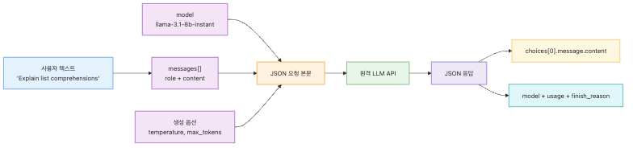
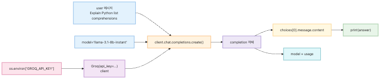
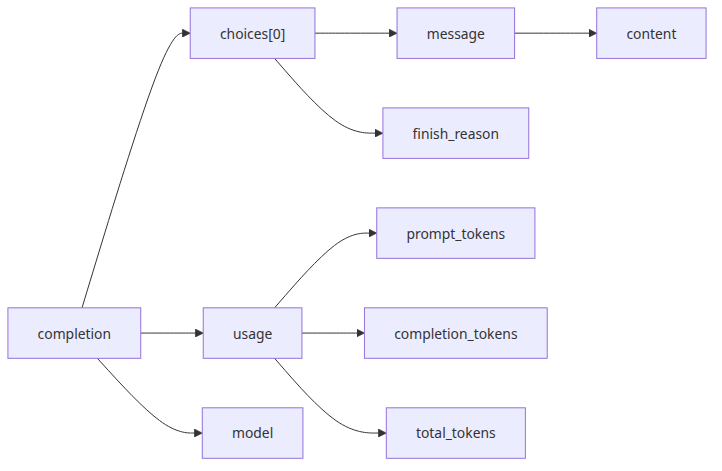
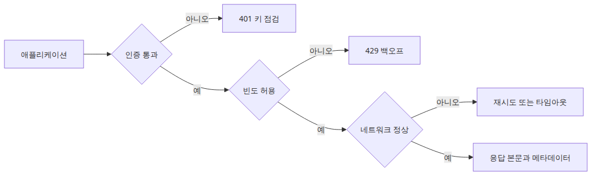
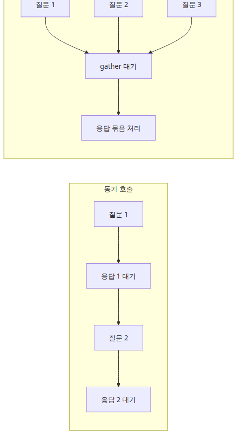

# LLM API 첫걸음 — 모델에게 첫 번째 요청 보내기

LLM 애플리케이션을 처음 만들 때 가장 먼저 흐려지는 지점은 모델 성능이 아닙니다. 내 코드와 모델 서비스 사이에 어떤 계약이 있는지, 그 계약이 어디서 실패하는지, 응답에서 무엇을 읽어야 하는지가 더 먼저 헷갈립니다. 채팅 UI는 이 경계를 감추지만, 런타임에서는 결국 HTTP 요청 하나와 JSON 응답 하나가 전부입니다.

이 구조를 초기에 정확히 잡아 두면 이후 주제들이 훨씬 또렷해집니다. 토큰 비용을 읽는 일도, 프롬프트 구조를 설계하는 일도, 스트리밍을 붙이는 일도 모두 첫 호출의 요청-응답 구조 위에 쌓입니다. 반대로 이 지점이 흐리면 이후의 기능은 전부 “뭔가 되긴 되는데 왜 그런지 모르겠다”는 상태로 남습니다.

특히 입문 단계에서는 프롬프트를 얼마나 영리하게 쓰느냐보다, 어떤 필드가 요청 본문에 들어가고 어떤 필드가 응답으로 돌아오는지부터 익히는 편이 좋습니다. 모델은 원격 서비스이고, 원격 서비스는 항상 명시적 계약과 실패 모드를 갖습니다. 이 감각이 있어야 이후 단계에서 문제를 추측이 아니라 로그와 구조로 설명할 수 있습니다.

이 글은 LLM App Foundations 101 시리즈의 첫 번째 글입니다.

여기서는 Groq Python SDK로 가장 작은 성공 경로를 만들고, 첫 호출을 운영 가능한 멘탈 모델로 바꾸겠습니다.

## 이 글에서 다룰 문제

- LLM API 호출은 SDK 아래에서 어떤 요청-응답 구조로 동작할까요?
- API 키는 어디서 만들고, 왜 코드가 아니라 환경변수에 둬야 할까요?
- `client.chat.completions.create()` 응답에서 최소한 무엇을 읽어야 할까요?
- 동기 호출과 비동기 호출은 코드 구조와 쓰임새가 어떻게 다를까요?
- 첫 호출이 실패했을 때 인증, 모델 ID, 메시지 형식 중 무엇부터 의심해야 할까요?

## 왜 이 글이 중요한가

첫 호출은 단순한 입문 예제가 아닙니다. 이후 모든 기능의 기준점입니다. 토큰 사용량을 읽는 위치, 응답 본문을 꺼내는 위치, 모델명을 기록하는 위치가 여기서 정해집니다. 이 단계에서 구조를 대충 넘기면 나중에 비용 분석과 장애 분석도 함께 흐려집니다.

또한 LLM을 “똑똑한 객체 하나”로 보면 문제를 잘못 찾기 쉽습니다. 실제로는 네트워크 요청, 인증 헤더, JSON 직렬화, 모델 선택, 응답 파싱이 얽힌 원격 호출입니다. 따라서 첫 호출을 이해한다는 말은 모델 자체보다 서비스 경계를 먼저 이해한다는 뜻입니다.

현업에서는 이 차이가 바로 드러납니다. `401`이면 프롬프트가 아니라 인증을 봐야 하고, `429`면 문장 표현보다 호출 빈도를 먼저 봐야 합니다. 첫 호출을 투명하게 보는 습관이 생기면, 이후의 LLM 개발은 훨씬 덜 신비롭고 훨씬 더 다루기 쉬워집니다.

## 첫 호출을 이해하는 가장 좋은 방법: SDK 메서드가 아니라 JSON 요청과 JSON 응답의 왕복으로 보는 것입니다

Groq SDK는 편리하지만, 실제 계약을 바꾸지는 않습니다. `client.chat.completions.create()`는 결국 JSON 요청을 만들고 JSON 응답을 Python 객체로 감싼 결과를 돌려줍니다. 그래서 첫 호출을 이해할 때는 “메서드를 어떻게 부르느냐”보다 “어떤 필드를 보내고 어떤 필드를 받느냐”를 먼저 보는 편이 정확합니다.

이 관점이 중요한 이유는 SDK 문법은 바뀌어도 기본 계약은 쉽게 바뀌지 않기 때문입니다. 모델 ID를 보내고, 메시지 배열을 보내고, 응답에서 생성 텍스트와 사용량과 메타데이터를 읽는 구조는 이후 스트리밍과 툴 호출로 가도 그대로 이어집니다.

> LLM 첫 호출의 핵심은 모델을 부르는 문법이 아니라, 원격 서비스와 맺는 입력·출력 계약을 눈에 보이는 구조로 이해하는 데 있습니다.

## 핵심 개념


*첫 번째 LLM API 호출의 최소 왕복 구조*

가장 먼저 기억할 문장은 단순합니다. LLM API도 결국 API입니다. 애플리케이션은 모델과 직접 대화하는 것이 아니라, 모델 서비스를 호출합니다. 따라서 요청에는 모델과 입력 메시지가 들어가고, 응답에는 생성 텍스트와 사용량 같은 메타데이터가 들어옵니다.



*텍스트 입력과 JSON 응답으로 이어지는 흐름*

개념적으로 요청 본문은 아래처럼 생깁니다.

```json
{
  "model": "llama-3.1-8b-instant",
  "messages": [
    {
      "role": "user",
      "content": "Show me a small Python example that reads an environment variable."
    }
  ]
}
```

응답에서 처음 봐야 할 세 블록은 `model`, `choices`, `usage`입니다.

```json
{
  "model": "llama-3.1-8b-instant",
  "choices": [
    {
      "message": {
        "role": "assistant",
        "content": "import os\nprint(os.environ['HOME'])"
      }
    }
  ],
  "usage": {
    "prompt_tokens": 24,
    "completion_tokens": 31,
    "total_tokens": 55
  }
}
```

실제 준비 단계는 길지 않습니다. 계정을 만들고, 키를 발급하고, 환경변수에 넣고, SDK를 설치하면 됩니다. 중요한 습관은 키를 코드에 박아 넣지 않는 것입니다.

```bash
export GROQ_API_KEY="your-issued-key"
```

```python
import os

api_key = os.environ["GROQ_API_KEY"]
print(f"API key loaded: {api_key[:6]}...")
```

```bash
python3 -m venv .venv
source .venv/bin/activate
pip install groq
```



*클라이언트 생성부터 첫 호출까지 이어지는 흐름*

가장 작은 성공 경로는 아래 코드입니다. 이 블록 하나로 “요청을 보냈고, 답이 돌아왔고, 본문을 읽었다”는 첫 번째 이정표를 확인할 수 있습니다.

```python
import os

from groq import Groq

client = Groq(api_key=os.environ["GROQ_API_KEY"])

completion = client.chat.completions.create(
    model="llama-3.1-8b-instant",
    messages=[
        {
            "role": "user",
            "content": "Explain Python list comprehensions in one paragraph.",
        }
    ],
)

print(completion.choices[0].message.content)
```

이제 본문만 보지 말고 응답 객체 전체를 읽어야 합니다. 그래야 모델명, 토큰 사용량, 종료 이유까지 함께 추적할 수 있습니다.



*응답 객체에서 본문과 메타데이터를 읽는 구조*

```python
import json
import os

from groq import Groq

client = Groq(api_key=os.environ["GROQ_API_KEY"])

completion = client.chat.completions.create(
    model="llama-3.1-8b-instant",
    messages=[
        {
            "role": "user",
            "content": "Explain the difference between an HTTP API and an SDK in three sentences.",
        }
    ],
)

print(json.dumps(completion.to_dict(), indent=2, ensure_ascii=False))
```

실전에서 최소한 기록할 값은 생성 텍스트, `usage`, 모델명, `finish_reason`입니다. 이 네 값만 있어도 비용과 잘림 문제를 설명할 재료가 생깁니다.



*인증 오류, 속도 제한, 재시도 분기로 이어지는 HTTP 경계*

SDK를 쓰더라도 네트워크 경계는 사라지지 않습니다. 느린 응답은 네트워크와 토큰 길이 문제일 수 있고, `401`은 인증 문제일 수 있으며, `429`는 속도 제한 문제일 수 있습니다. 그래서 첫 호출을 이해할 때는 프롬프트보다 경계 조건을 먼저 읽는 습관이 중요합니다.



*동기 대기와 비동기 병렬 실행의 차이*

동기 호출은 입문용으로 가장 단순합니다.

```python
import os

from groq import Groq

client = Groq(api_key=os.environ["GROQ_API_KEY"])

completion = client.chat.completions.create(
    model="llama-3.1-8b-instant",
    messages=[
        {
            "role": "user",
            "content": "Explain asynchronous programming in one paragraph.",
        }
    ],
)

print(completion.choices[0].message.content)
```

애플리케이션이 이미 async 런타임 위에 있거나 여러 I/O 작업을 함께 다뤄야 하면 비동기 호출이 자연스럽습니다.

```python
import asyncio
import os

from groq import AsyncGroq

client = AsyncGroq(api_key=os.environ["GROQ_API_KEY"])

async def main() -> None:
    completion = await client.chat.completions.create(
        model="llama-3.1-8b-instant",
        messages=[
            {
                "role": "user",
                "content": "Give me two situations where asyncio is useful.",
            }
        ],
    )

    print(completion.choices[0].message.content)

asyncio.run(main())
```

여러 요청을 동시에 다루는 구조는 이후 `asyncio.gather()` 같은 병렬 패턴으로 확장됩니다. 이 글에서는 첫 성공 경로와 구조 이해가 우선이므로, 마지막으로 기준점이 되는 완성 예제 하나만 남기겠습니다.

```python
import os

from groq import Groq

def main() -> None:
    client = Groq(api_key=os.environ["GROQ_API_KEY"])

    completion = client.chat.completions.create(
        model="llama-3.1-8b-instant",
        messages=[
            {
                "role": "system",
                "content": "You are a concise Python tutor.",
            },
            {
                "role": "user",
                "content": (
                    "Explain the difference between a Python function and a method "
                    "in no more than five sentences, and add one short example line."
                ),
            },
        ],
    )

    content = completion.choices[0].message.content or ""
    usage = completion.usage

    print("=== answer ===")
    print(content)
    print()
    print("=== metadata ===")
    print(f"model: {completion.model}")
    print(f"prompt_tokens: {usage.prompt_tokens}")
    print(f"completion_tokens: {usage.completion_tokens}")
    print(f"total_tokens: {usage.total_tokens}")

if __name__ == "__main__":
    main()
```

## 흔히 헷갈리는 지점

- SDK를 쓰면 HTTP 경계가 사라진다고 생각하기 쉽지만, 인증·속도 제한·네트워크 지연은 그대로 남습니다.
- `choices[0].message.content`만 읽으면 충분하다고 느끼기 쉽지만, 실제 운영에서는 `usage`, `model`, `finish_reason`도 함께 봐야 합니다.
- 비동기 호출은 더 고급 기능처럼 보이지만, 본질은 여러 I/O를 동시에 기다리는 구조 선택입니다. 품질 자체를 올려 주는 기능은 아닙니다.
- 첫 호출 실패를 프롬프트 문제로 오해하기 쉽지만, 입문 단계에서는 인증 키 누락, 잘못된 모델 ID, 메시지 형식 오류가 더 흔합니다.

## 운영 체크리스트

- [ ] `GROQ_API_KEY`를 환경변수로 주입했고 소스코드에 키 문자열을 넣지 않았습니다.
- [ ] `pip install groq` 이후 `import groq`가 정상 동작합니다.
- [ ] `client.chat.completions.create(model=..., messages=[...])` 호출이 정상 응답을 반환합니다.
- [ ] 응답에서 `choices[0].message.content`, `usage.total_tokens`, `model`을 함께 기록합니다.
- [ ] 같은 호출을 동기와 비동기 방식으로 각각 한 번씩 실행해 차이를 확인했습니다.

## 정리

첫 번째 LLM API 호출은 작아 보여도 이미 핵심 구조를 다 담고 있습니다. 환경변수에서 키를 읽고, 클라이언트를 만들고, 모델과 메시지를 보내고, 응답에서 본문과 메타데이터를 읽습니다. 이후의 모든 기능은 이 루프를 더 정교하게 다루는 과정에 가깝습니다.

이 글에서 꼭 가져가야 할 감각은 세 가지입니다. 첫째, SDK는 편의 계층일 뿐이고 기본 계약은 여전히 JSON 요청과 JSON 응답입니다. 둘째, 본문만 보지 말고 토큰 사용량과 모델명과 종료 이유까지 함께 읽어야 운영 감각이 생깁니다. 셋째, 동기와 비동기는 품질 문제가 아니라 애플리케이션 구조 문제입니다.

다음 글에서는 같은 호출을 유지한 채 토큰을 중심에 놓고 보겠습니다. 길이 제한, 비용, 지연 시간은 결국 토큰 예산 문제로 수렴합니다. 첫 호출의 구조를 이해했다면, 이제 그 구조를 숫자로 읽을 차례입니다.

<!-- toc:begin -->
## 시리즈 목차

- **LLM API 첫걸음 — 모델에게 첫 번째 요청 보내기 (현재 글)**
- 토큰 이해하기 — 비용, 한계, 컨텍스트 창 (예정)
- 프롬프트 엔지니어링 기초 — System·User·Assistant 역할 (예정)
- Few-shot과 Chain-of-Thought — 더 나은 답변 유도하기 (예정)
- 대화 상태 관리 — 멀티턴 챗봇 만들기 (예정)
- 스트리밍 응답 처리 — 실시간으로 출력 받기 (예정)

<!-- toc:end -->

## 참고 자료

### 공식 문서

- [Groq quickstart](https://console.groq.com/docs/quickstart)
- [Groq Python SDK](https://github.com/groq/groq-python)
- [Groq API reference](https://console.groq.com/docs/api-reference)
- [Groq models](https://console.groq.com/docs/models)

### 관련 시리즈

- [토큰 이해하기 — 비용, 한계, 컨텍스트 창](./02-understanding-tokens.md)
- [프롬프트 엔지니어링 기초 — System·User·Assistant 역할](./03-prompt-engineering-basics.md)
- [LLM API Production 101](../../llm-api-production-101/ko/01-structured-output.md) — 이 시리즈가 끝나는 지점, 즉 첫 호출·토큰·기본 프롬프트 다음 단계를 다룹니다. 구조화 출력, 툴 호출, 스트리밍, 재시도처럼 production 환경에서 부딪히는 문제로 넘어갈 때 권장합니다.

Tags: LLM, OpenAI, Prompt Engineering, Python
