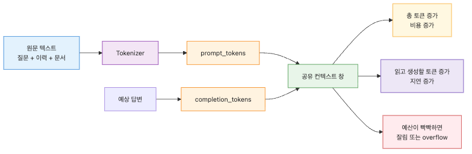
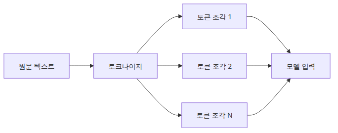
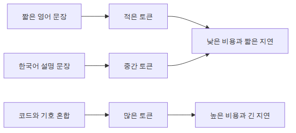
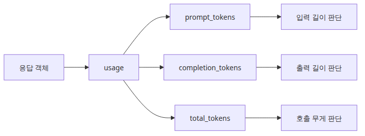
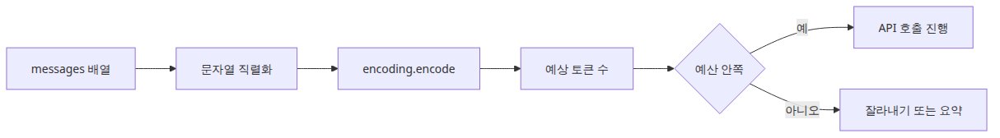
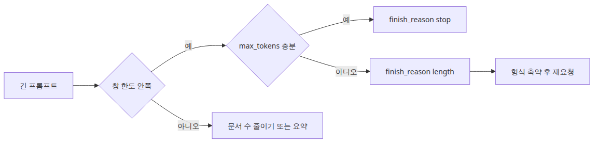

# 토큰 이해하기 — 비용, 한계, 컨텍스트 창

> LLM 앱 기초 시리즈 (2/6)

예제 코드: [github.com/yeongseon-books/llm-app-foundations-101](https://github.com/yeongseon-books/llm-app-foundations-101/tree/main/ko/02-understanding-tokens)

아래 다이어그램은 텍스트가 토큰으로 바뀌고 모델 예산으로 연결되는 흐름을 요약합니다.


LLM API를 처음 붙이면 응답 품질에 먼저 눈이 갑니다. 하지만 애플리케이션을 실제로 운영할 때 더 빨리 문제를 일으키는 쪽은 품질보다 예산과 한계입니다. 프롬프트가 조금만 길어져도 응답 속도가 늘어지고, 사용량 로그를 보면 호출마다 비용이 달라지며, 어느 시점부터는 입력이 잘리거나 출력이 중간에서 멈춥니다. 이 세 가지 뒤에는 거의 늘 같은 단위가 있습니다. 토큰입니다.

토큰은 LLM이 텍스트를 세는 기본 단위입니다. 사람은 문장과 단어를 읽지만, 모델은 그보다 작은 조각으로 나누어 입력을 처리합니다. 따라서 “문장 길이”를 감으로만 보면 운영 감각이 자꾸 어긋납니다. 한국어 한 문장이 생각보다 많은 토큰으로 쪼개질 수 있고, 영어 코드 블록은 공백과 기호 때문에 눈으로 본 길이보다 더 비싸질 수 있습니다.

이번 글에서는 토큰을 숫자로 읽는 습관을 잡겠습니다. 범위는 일곱 가지입니다.

- 토큰이 무엇인지
- 단어와 토큰이 왜 같지 않은지
- 비용과 속도가 왜 토큰 단위로 움직이는지
- `usage.prompt_tokens`, `completion_tokens`, `total_tokens`를 어떻게 읽는지
- `tiktoken`으로 프롬프트 길이를 어떻게 미리 재는지
- 컨텍스트 창이 무엇이고 `llama-3.1-8b-instant`의 128k가 무엇을 뜻하는지
- `max_tokens`와 `finish_reason`으로 출력 길이를 어떻게 제어하고 감시하는지

포인트는 단순합니다. **LLM 앱은 문자열이 아니라 토큰 예산 위에서 동작합니다.** 이 감각이 생기면 길이 제한, 비용 추적, 프롬프트 최적화가 한 줄로 이어집니다.

---

## 이 글에서 답할 질문

- 토큰은 문자도 단어도 아닌 무엇이며, 모델마다 왜 다르게 쪼개지는가?
- `prompt_tokens`, `completion_tokens`, `total_tokens`는 각각 어디에서 발생하는 비용인가?
- `tiktoken`으로 호출 전에 토큰 수를 미리 세는 가장 짧은 코드는 어떤 모양인가?
- 컨텍스트 창을 초과하면 어떤 에러가 발생하고, 어떻게 사전 방어하는가?
- 긴 입력을 잘라야 할 때 앞·뒤·중간 중 어디를 자르는 것이 안전한가?

## 토큰은 무엇인가


토큰은 모델이 텍스트를 다루기 위해 자른 조각입니다. 이 조각은 꼭 단어와 일치하지 않습니다. 짧은 영어 단어 하나가 토큰 하나일 때도 있지만, 긴 단어는 여러 조각으로 나뉠 수 있습니다. 한국어는 조사와 어미가 붙는 구조라 한 어절이 여러 토큰이 되기 쉽습니다. 숫자, 공백, 줄바꿈, 괄호, 코드 기호도 모두 토큰 계산에 들어갑니다.

예를 들어 사람이 보기에 아래 세 입력은 비슷한 길이처럼 느껴질 수 있습니다.

- `hello world`
- `unbelievable`
- `print(user_profile[0]["email"])`

하지만 토크나이저 입장에서는 완전히 다르게 쪼개질 수 있습니다. 흔히 쓰는 짧은 조합은 한 덩어리로 묶이고, 드문 조합은 더 잘게 나뉩니다. 코드 문자열은 괄호, 대괄호, 따옴표, 밑줄 때문에 토큰 수가 빨리 늘어납니다.

이 동작을 이해하려면 BPE(Byte Pair Encoding)라는 말을 한 번은 짚고 넘어가야 합니다. BPE는 자주 같이 나타나는 문자 조합을 합쳐서 점점 더 큰 단위로 만드는 방식입니다. 아주 거칠게 말하면 “자주 나오는 조각은 크게, 드문 조각은 잘게” 압축하는 전략에 가깝습니다. 그래서 `understanding` 같은 단어가 통째로 하나가 되는 것이 아니라, 모델이 학습한 어휘표에 따라 `under`, `standing` 혹은 더 작은 조각으로 나뉠 수 있습니다.

입문 단계에서 중요한 결론은 하나입니다. **단어 수를 세는 습관으로는 토큰 비용을 예측할 수 없습니다.** LLM API를 붙일 때는 문장 길이보다 토큰 길이를 봐야 합니다.

---

## 왜 토큰이 중요한가


토큰은 단순한 내부 구현 디테일이 아닙니다. 호출 비용, 응답 지연 시간, 모델 한계가 모두 여기에 묶입니다.

먼저 비용입니다. 대부분의 LLM API는 입력 토큰과 출력 토큰을 기준으로 과금합니다. 공급자마다 단가 표시는 다르지만 구조는 비슷합니다. 프롬프트가 길수록 입력 비용이 커지고, 모델이 길게 답할수록 출력 비용도 커집니다. 같은 질문이라도 시스템 프롬프트를 길게 붙이거나 긴 문서 조각을 여러 개 끼워 넣으면 총 토큰 수가 늘어납니다.

다음은 속도입니다. 응답 생성은 토큰 단위로 진행됩니다. 입력 토큰이 많으면 모델이 읽어야 할 양이 늘고, 출력 토큰이 많으면 생성해야 할 양이 늘어납니다. 그래서 긴 컨텍스트와 긴 답변은 대체로 더 느립니다. 모델 자체의 추론 속도, 네트워크 상태, 공급자 인프라도 영향이 있지만, 가장 안정적으로 볼 수 있는 설명 변수는 토큰 수입니다.

마지막은 한계입니다. 모델마다 한 번의 요청에서 처리할 수 있는 최대 토큰 수가 있습니다. 이것이 컨텍스트 창입니다. 입력만 보는 값이 아니라 입력과 출력을 함께 포함한 예산이라고 이해하는 편이 안전합니다. 프롬프트가 이미 너무 길다면, 모델은 답을 시작하기도 전에 한계에 가까워집니다. 이런 상태에서 `max_tokens`를 크게 잡아도 실제로는 충분히 생성하지 못하거나, 길이 제한 때문에 중간에서 멈춥니다.

운영 관점에서는 이렇게 정리하면 됩니다.

- 비용 질문은 토큰으로 답합니다.
- 속도 질문도 토큰으로 먼저 설명합니다.
- 길이 제한 문제는 거의 늘 토큰 예산 관리 문제입니다.

---

## `usage.prompt_tokens`, `completion_tokens`, `total_tokens` 다시 보기


Post 01에서 `usage` 필드를 잠깐 봤습니다. 이제는 이 숫자를 해석해야 합니다. 이 글의 예제 코드는 모두 그대로 복사해 실행할 수 있게 구성했습니다. 아래 코드는 Groq API를 실제로 호출한 뒤 사용량을 읽는 가장 작은 예제입니다.

```python
import os

from groq import Groq

client = Groq(api_key=os.environ["GROQ_API_KEY"])

completion = client.chat.completions.create(
    model="llama-3.1-8b-instant",
    messages=[
        {
            "role": "user",
            "content": "Python에서 데코레이터를 두 문단 이내로 설명해 주세요.",
        }
    ],
)

usage = completion.usage

print(completion.choices[0].message.content)
print()
print(f"finish_reason={completion.choices[0].finish_reason}")
print(f"prompt_tokens={usage.prompt_tokens}")
print(f"completion_tokens={usage.completion_tokens}")
print(f"total_tokens={usage.total_tokens}")
```

<!-- injected-output:start -->
**출력 결과**

    **데코레이터의 개념**

    데코레이터는 함수의 실행 이전에 다른 함수를 실행하고, 그 결과를 원래 함수의 결과와 덮어써서, 원래 함수의 기능에 접근할 수 있도록 하는 기법입니다.

    데코레이터는 함수에 대한 정보를 저장하고 있는 데이터 구조인 `descriptor`를 사용하여 구현이 됩니다. 데코레이터 내에서 원래 함수를 실행하고 결과를 리턴할 수 있고, 이 방법으로 원래 함수를 변경하거나, 주변 로직을 추가할 수 있습니다.

    **데코레이터의 사용법**

    데코레이터를 사용하는 방법은 다음과 같이 나타낼 수 있습니다.

    ```python
    def 데코레이터_이름(원래_함수):
        def 데코레이팅_함수():
            # 원래 함수를 실행하는 코드
            print("데코레이션 실행")
            원래_함수()
            # 원래 함수를 실행한 후 추가 로직
            print("다음")
        return 데코레이팅_함수

    @데코레이터_이름
    def 원래_함수():
        print("원래 함수 실행")

    원래_함수()
    ```

    **데코레이터의 특징**

    * 데코레이터는 원래 함수의 기능을 변경하거나 주변 로직을 추가할 수 있습니다.
    * 데코레이터는 함수에 대한 정보를 저장하고 있는 데이터 구조인 `descriptor`를 사용하여 구현이 됩니다.
    * 데코레이터 내에서 원래 함수를 실행하고 결과를 리턴할 수 있습니다.

    finish_reason=stop
    prompt_tokens=53
    completion_tokens=349
    total_tokens=402

<!-- injected-output:end -->

세 필드는 각자 역할이 분명합니다.

### `prompt_tokens`

요청에 실려 들어간 입력 토큰 수입니다. `messages` 배열 전체가 대상입니다. `user` 메시지 하나만 들어간다고 끝이 아닙니다. 나중에 `system` 메시지, 이전 대화 이력, RAG에서 가져온 문서 조각까지 붙이면 이 값이 빠르게 커집니다.

### `completion_tokens`

모델이 생성한 출력 토큰 수입니다. 답변이 길수록 커집니다. 스트리밍이든 비스트리밍이든 최종 사용량 집계는 같은 방향으로 봅니다.

### `total_tokens`

입력과 출력의 합입니다. 운영 로그에서는 보통 이 값을 가장 먼저 모니터링합니다. 호출 하나가 전체적으로 얼마나 무거웠는지 빠르게 보여주기 때문입니다.

실전에서는 이 세 숫자를 따로 보아야 하는 순간이 자주 있습니다. `prompt_tokens`만 크다면 프롬프트 설계 문제일 가능성이 높습니다. `completion_tokens`만 과도하게 크다면 답변 길이 제어가 부족한 경우가 많습니다. 둘 다 크다면 긴 문맥에 긴 출력까지 붙은 비싼 요청일 수 있습니다.

토큰 사용량 로그를 남길 때는 모델명과 함께 묶어 두는 편이 좋습니다. 예를 들어 `model`, `prompt_tokens`, `completion_tokens`, `total_tokens`, `finish_reason`를 한 줄 로그로 저장해 두면 나중에 비용과 실패 패턴을 훨씬 쉽게 설명할 수 있습니다.

---

## `tiktoken`으로 토큰 수 미리 세기


응답을 받은 뒤 사용량을 읽는 것만으로는 부족합니다. 요청을 보내기 전에 길이를 미리 재야 프롬프트를 잘라야 할지, 요약해야 할지, 여러 요청으로 나눌지 판단할 수 있습니다. 이때 많이 쓰는 도구가 `tiktoken`입니다.

설치는 아래처럼 합니다.

```bash
pip install tiktoken
```

가장 단순한 사용 예제는 문자열 하나를 토큰으로 인코딩한 뒤 길이를 보는 방식입니다.

```python
import tiktoken

encoding = tiktoken.get_encoding("cl100k_base")

text = "토큰 길이를 미리 재면 긴 프롬프트를 더 안전하게 다룰 수 있습니다."
tokens = encoding.encode(text)

print(tokens)
print(f"token_count={len(tokens)}")
```

<!-- injected-output:start -->
**출력 결과**

    [169, 228, 58260, 223, 108, 41871, 116, 13094, 18918, 5251, 107, 116, 29102, 16633, 105, 33390, 41871, 112, 85355, 15291, 105, 169, 63644, 29726, 18918, 5251, 235, 242, 96270, 66965, 16582, 58901, 50467, 53987, 108, 29833, 36439, 39331, 13]
    token_count=39

<!-- injected-output:end -->

여기서 한 가지는 분명히 구분해야 합니다. `cl100k_base`는 OpenAI 계열에서 널리 알려진 인코딩입니다. Groq의 `llama-3.1-8b-instant`가 내부적으로 완전히 같은 토크나이저를 쓴다고 단정할 수는 없습니다. 따라서 이 숫자는 **청구 기준의 절대값**이라기보다 **사전 점검용 근사치**로 보는 편이 안전합니다. 실제 청구와 한계 판정은 공급자가 반환한 `usage`가 기준입니다.

그렇더라도 이 근사치가 쓸모없는 것은 아닙니다. 운영에서 필요한 판단은 대개 “지금 프롬프트가 짧은가, 긴가, 너무 긴가”입니다. 수천 토큰 규모에서 대략적인 길이를 미리 아는 것만으로도 입력 잘라내기, 문서 청크 크기 조절, 대화 이력 축약 같은 결정을 훨씬 빨리 내릴 수 있습니다.

실전에서는 메시지 목록 전체를 하나의 문자열처럼 합쳐서 길이를 재는 방식이 자주 쓰입니다. 아주 정교한 계산은 모델별 포맷 차이 때문에 달라질 수 있지만, 입문 단계에서는 아래 정도면 충분합니다.

```python
import tiktoken

encoding = tiktoken.get_encoding("cl100k_base")

messages = [
    {"role": "system", "content": "You are a concise Python tutor."},
    {"role": "user", "content": "리스트와 튜플의 차이를 설명해 주세요."},
    {"role": "assistant", "content": "리스트는 변경 가능하고, 튜플은 변경 불가능합니다."},
    {"role": "user", "content": "예제 코드도 짧게 덧붙여 주세요."},
]

serialized = "\n".join(f"{m['role']}: {m['content']}" for m in messages)
estimated_prompt_tokens = len(encoding.encode(serialized))

print(serialized)
print()
print(f"estimated_prompt_tokens={estimated_prompt_tokens}")
```

<!-- injected-output:start -->
**출력 결과**

    system: You are a concise Python tutor.
    user: 리스트와 튜플의 차이를 설명해 주세요.
    assistant: 리스트는 변경 가능하고, 튜플은 변경 불가능합니다.
    user: 예제 코드도 짧게 덧붙여 주세요.

    estimated_prompt_tokens=71

<!-- injected-output:end -->

이 계산은 공급자 내부 포맷과 1:1로 같지 않습니다. 하지만 길이 감시용으로는 충분히 실용적입니다. 대화 이력이 누적되는 챗봇이라면 요청 직전에 이 값을 재고, 임계치를 넘으면 오래된 메시지를 줄이거나 요약하는 흐름을 넣으면 됩니다.

---

## 컨텍스트 창이란 무엇인가

컨텍스트 창은 한 번의 요청에서 모델이 볼 수 있는 최대 토큰 범위입니다. 흔히 “입력 길이 제한”처럼 들리지만, 실제 운영에서는 입력과 출력을 함께 두는 예산으로 보는 편이 덜 헷갈립니다. 프롬프트가 길면 그만큼 출력이 들어갈 자리가 줄어들기 때문입니다.

이 시리즈에서 사용하는 `llama-3.1-8b-instant`는 128k 컨텍스트를 지원합니다. 숫자만 보면 매우 커 보입니다. 짧은 질문 몇 개를 보내는 수준에서는 사실상 넉넉한 편입니다. 문제는 LLM 앱이 생각보다 빨리 이 예산을 먹는다는 점입니다.

예를 들어 아래 항목이 모두 같은 요청 안에서 토큰을 차지합니다.

- 시스템 프롬프트
- 현재 사용자 질문
- 이전 대화 이력
- 검색으로 붙인 문서 조각
- 모델이 새로 생성할 답변

즉, 128k라는 숫자를 “사용자 질문만 128k까지 넣을 수 있다”로 받아들이면 운영에서 자주 실수합니다. 이미 대화 이력이 40k, 문서 컨텍스트가 60k라면 남은 예산은 생각보다 많지 않습니다. 여기에 긴 답변을 기대하면 길이 문제를 만날 수 있습니다.

입문 단계에서 기억할 운영 공식은 아래 하나면 충분합니다.

`입력 토큰 + 출력 토큰 <= 컨텍스트 창`

실제 서비스에서는 완전히 한계까지 밀어 붙이기보다 여유를 두는 편이 안전합니다. 이유는 간단합니다. 메시지 직렬화 오버헤드, 시스템 프롬프트 변경, 사용자 입력 변동 때문에 요청마다 길이가 조금씩 흔들리기 때문입니다. 128k 한계에 바짝 붙는 설계는 디버깅 비용이 큽니다.

---

## `max_tokens`로 completion 길이 제어하기

입력이 길어지는 것만 관리해서는 충분하지 않습니다. 출력도 제한해야 합니다. 이때 가장 직접적인 손잡이가 `max_tokens`입니다. 이름 그대로 모델이 생성할 최대 토큰 수를 제한합니다.

아래 코드는 같은 질문에 대해 `max_tokens`를 작게 주는 예제입니다.

```python
import os

from groq import Groq

client = Groq(api_key=os.environ["GROQ_API_KEY"])

completion = client.chat.completions.create(
    model="llama-3.1-8b-instant",
    messages=[
        {
            "role": "user",
            "content": "파이썬 제너레이터와 리스트의 차이를 예제와 함께 자세히 설명해 주세요.",
        }
    ],
    max_tokens=80,
)

print(completion.choices[0].message.content)
print()
print(f"completion_tokens={completion.usage.completion_tokens}")
print(f"finish_reason={completion.choices[0].finish_reason}")
```

<!-- injected-output:start -->
**출력 결과**

    파이썬 제너레이터와 리스트의 차이를 이해하기 위해서는 먼저 각각의 개념을 이해하고 예제를 통해서 살펴보겠습니다.

    ### 리스트 (List)

    리스트는 순서가 있으면서, 중복 허용이 되는 데이터의 수열입니다. 각 요소는 인덱스에 따라 접근할 수 있습니다.

    completion_tokens=80
    finish_reason=length

<!-- injected-output:end -->

`max_tokens`는 길이 비용과 응답 스타일을 함께 바꿉니다.

- 값을 작게 주면 짧고 빠른 답이 나올 가능성이 큽니다.
- 값을 크게 주면 자세한 답을 허용하지만 비용과 지연 시간도 커질 수 있습니다.
- 프롬프트가 이미 긴 상태라면 큰 `max_tokens`를 넣어도 실제로는 충분히 생성하지 못할 수 있습니다.

중요한 점은 `max_tokens`가 “정확히 이 길이만큼 생성하라”는 뜻이 아니라는 사실입니다. 모델은 더 일찍 멈출 수도 있습니다. 충분히 답했다고 판단하면 더 적은 토큰만 쓰고 종료합니다. 따라서 운영에서는 `completion_tokens`의 실제 사용량과 `finish_reason`을 함께 봐야 합니다.

---

## 긴 프롬프트를 보낼 때 주의할 점


긴 프롬프트를 다루기 시작하면 두 가지 상황이 자주 생깁니다. 하나는 요청 자체가 너무 길어지는 경우이고, 다른 하나는 출력이 제한에 걸려 중간에서 잘리는 경우입니다. 두 경우 모두 토큰 감시 코드가 있어야 바로 알아차릴 수 있습니다.

아래 예제는 긴 본문을 여러 번 반복해 넣고, `max_tokens`를 작게 잡은 뒤 `finish_reason`을 확인하는 코드입니다.

```python
import os

import tiktoken
from groq import Groq

client = Groq(api_key=os.environ["GROQ_API_KEY"])
encoding = tiktoken.get_encoding("cl100k_base")

long_text = " ".join(
    [
        "Python 웹 애플리케이션에서 요청 로그와 예외 로그를 함께 남기는 이유를 설명해 주세요."
    ]
    * 200
)

instruction = "다음 문장을 읽고 핵심만 10개 불릿으로 정리해 주세요."
user_content = instruction + "\n\n" + long_text
estimated_prompt_tokens = len(encoding.encode(user_content))
print(f"estimated_prompt_tokens={estimated_prompt_tokens}")

completion = client.chat.completions.create(
    model="llama-3.1-8b-instant",
    messages=[
        {
            "role": "user",
            "content": user_content,
        }
    ],
    max_tokens=60,
)

choice = completion.choices[0]

print(choice.message.content)
print()
print(f"prompt_tokens={completion.usage.prompt_tokens}")
print(f"completion_tokens={completion.usage.completion_tokens}")
print(f"total_tokens={completion.usage.total_tokens}")
print(f"finish_reason={choice.finish_reason}")

if choice.finish_reason == "length":
    print("경고: 출력이 길이 제한에 걸려 중간에서 끝났습니다.")
```

<!-- injected-output:start -->
**출력 결과**

    estimated_prompt_tokens=8827
    Python 웹 애플리케이션에서 요청 로그와 예외 로그를 함께 남기는 이유에 대한 핵심 10 개의 정리:

    1. **로그 분석의 용이성**: 요청 로그와 예외 로그를 하나의 단위로 남기

    prompt_tokens=5856
    completion_tokens=60
    total_tokens=5916
    finish_reason=length
    경고: 출력이 길이 제한에 걸려 중간에서 끝났습니다.

<!-- injected-output:end -->

이 코드에서 볼 포인트는 세 가지입니다.

첫째, 요청 전에 `estimated_prompt_tokens`를 계산합니다. 사전 점검용 근사치입니다.

둘째, 실제 호출 뒤에는 공급자가 계산한 `usage`를 읽습니다. 최종 판단 기준은 이 값입니다.

셋째, `finish_reason == "length"`를 감지합니다. 이 값이 나오면 답변이 모델 의도대로 자연스럽게 끝난 것이 아니라 길이 제한 때문에 멈췄을 가능성이 큽니다.

운영에서는 이 상황을 조용히 넘기면 안 됩니다. 길이 제한으로 잘린 답을 그대로 사용자에게 보여 주면 문장이 중간에서 끊기거나, 항목이 덜 나온 채 끝나거나, 코드가 닫히지 않은 상태로 노출될 수 있습니다. 최소한 로그와 메트릭에 남기고, 필요하면 재요청 전략을 붙여야 합니다.

자주 쓰는 대응은 아래와 같습니다.

- 프롬프트를 더 짧게 만든다.
- 검색 문서 조각 수를 줄인다.
- `max_tokens`를 늘린다.
- 답변 형식을 더 압축적으로 요청한다.
- 한 번에 처리하지 말고 여러 단계 요청으로 나눈다.

특히 RAG나 멀티턴 챗봇에서는 오래된 대화 이력과 검색 문서가 함께 누적되기 쉬우므로, “토큰 예산이 부족할 때 무엇을 먼저 줄일지” 규칙을 미리 정해 두는 편이 좋습니다.

---

## 운영 감각으로 정리하는 토큰 관리 습관

이 시점에서 필요한 것은 복잡한 이론보다 몇 가지 습관입니다.

첫째, 요청이 비싸졌다면 프롬프트 문구보다 `usage`부터 봅니다. 감으로 길이를 추정하지 말고 숫자를 먼저 읽는 편이 빠릅니다.

둘째, 요청 전에 토큰 수를 대략이라도 셉니다. `tiktoken.get_encoding("cl100k_base")`는 Groq 청구값의 절대 기준은 아니어도, 길이 경보 장치로는 충분히 쓸 만합니다.

셋째, 컨텍스트 창은 입력 전용 제한이 아니라 입력과 출력의 공동 예산으로 생각합니다. 긴 문서와 긴 답변을 동시에 원하면 곧바로 한계와 비용 문제가 따라옵니다.

넷째, `max_tokens`를 무심코 크게 두지 않습니다. 출력 길이는 품질 옵션이면서 동시에 비용 옵션입니다.

다섯째, `finish_reason`을 로그에 남깁니다. `length`는 나중에 장애처럼 돌아오는 경우가 많습니다.

LLM 앱 초반에는 프롬프트 문구를 조금 고치는 일이 가장 중요한 작업처럼 보일 수 있습니다. 실제 운영에서는 토큰 예산을 읽고 제어하는 능력이 더 빨리 팀을 살립니다. 짧은 요청은 싸고 빠르며 예측하기 쉽습니다. 긴 요청은 더 많은 맥락을 주지만, 그만큼 관리 포인트도 늘어납니다. 어느 쪽을 택하든 판단 기준은 결국 토큰입니다.

---

## 마무리

오늘은 LLM API에서 토큰이 왜 핵심 단위인지 살펴봤습니다. 토큰은 단어 수의 다른 표현이 아닙니다. 모델이 텍스트를 읽고 쓰는 실제 계산 단위이며, 비용, 속도, 길이 제한, 컨텍스트 창이 모두 이 숫자 위에서 움직입니다. `usage`를 읽고, `tiktoken`으로 사전 점검을 하고, `max_tokens`와 `finish_reason`을 함께 보는 습관만 잡아도 다음 단계가 훨씬 쉬워집니다.

다음 글에서는 같은 채팅 API를 두고 메시지의 역할을 분리해 보겠습니다. `system`, `user`, `assistant`가 각각 어떤 책임을 가지는지 이해하면, 같은 모델로도 훨씬 일관된 출력을 만들 수 있습니다.

## 운영 체크리스트

- [ ] 최근 호출 한 번의 `usage` 필드 세 값을 직접 확인해 본 적이 있다
- [ ] `tiktoken.encoding_for_model()` 또는 `get_encoding()`으로 입력을 미리 토큰화해 보았다
- [ ] 사용 모델의 컨텍스트 윈도우 한계를 문서에서 확인했다
- [ ] 한 호출의 비용을 토큰 단가 × 토큰 수로 계산해 보았다
- [ ] 컨텍스트 초과를 일으키는 입력에 대해 사전 길이 검사 로직이 있다

<!-- toc:begin -->
## 시리즈 목차

- [LLM API 첫걸음 — 모델에게 첫 번째 요청 보내기](./01-llm-api-first-call.md)
- **토큰 이해하기 — 비용, 한계, 컨텍스트 창 (현재 글)**
- 프롬프트 엔지니어링 기초 — System·User·Assistant 역할 (예정)
- Few-shot과 Chain-of-Thought — 더 나은 답변 유도하기 (예정)
- 대화 상태 관리 — 멀티턴 챗봇 만들기 (예정)
- 스트리밍 응답 처리 — 실시간으로 출력 받기 (예정)

<!-- toc:end -->

---

## 참고 자료

- [Groq API reference](https://console.groq.com/docs/api-reference)
- [Groq models](https://console.groq.com/docs/models)
- [Groq Python SDK](https://github.com/groq/groq-python)
- [tiktoken GitHub repository](https://github.com/openai/tiktoken)
- [OpenAI tokenizer](https://platform.openai.com/tokenizer)

Tags: LLM, OpenAI, Prompt Engineering, Python
