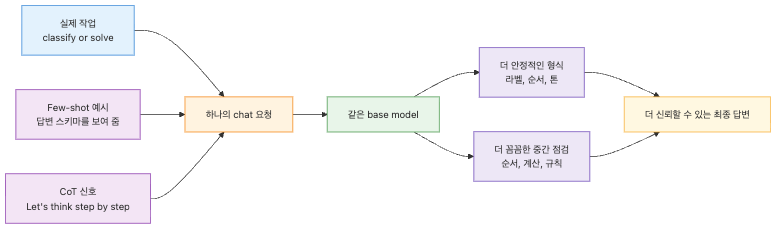
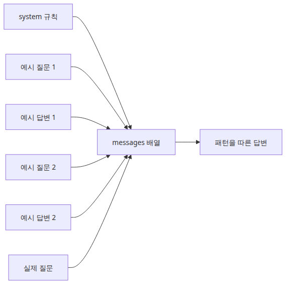
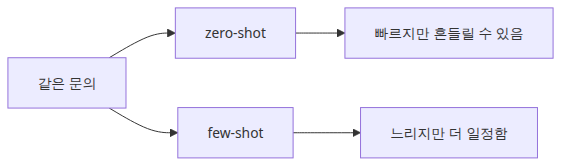
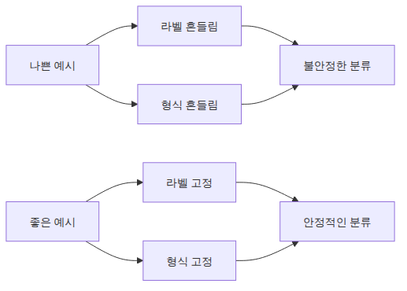
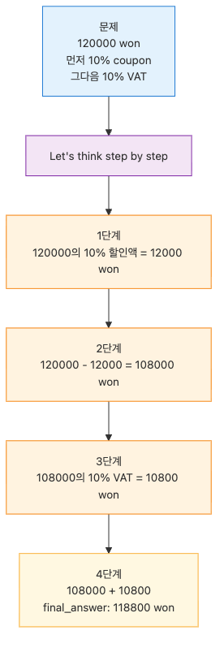
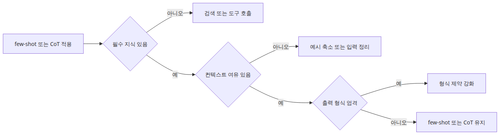

# Few-shot과 Chain-of-Thought — 더 나은 답변 유도하기

이전 글에서 역할 기반 프롬프트 구조를 잡았다면 곧 다음 질문이 따라옵니다. 같은 모델인데도 어떤 요청은 원하는 형식을 안정적으로 따르고, 어떤 요청은 거의 맞지만 자동화하기에는 애매하게 흔들리는 이유가 무엇일까요. 이 차이는 모델 교체보다 입력 설계의 차이에서 먼저 나오는 경우가 많습니다.

실무에서 초기에 가장 자주 꺼내는 손잡이 두 개가 few-shot prompting과 chain-of-thought prompting입니다. 전자는 예시를 보여 주어 답변 패턴을 유도하고, 후자는 문제를 단계적으로 풀게 하여 중간 판단을 놓치지 않게 만듭니다. 둘 다 모델을 새로 학습시키는 기법이 아니라, 이미 있는 능력을 더 예측 가능하게 끌어내는 입력 설계입니다.

이때 중요한 오해도 함께 정리해야 합니다. 예시를 많이 넣는다고 자동으로 좋아지지 않고, “step by step”이라는 문장을 붙인다고 없던 지식이 생기지도 않습니다. 결국 핵심은 어떤 작업에 어떤 유도 장치가 필요한지 구분하는 데 있습니다.

이 글은 LLM App Foundations 101 시리즈의 네 번째 글입니다.

여기서는 few-shot과 chain-of-thought를 예시 기반 유도와 단계 기반 유도로 나누어 보고, 각각이 언제 효과적인지 정리하겠습니다.

## 이 글에서 다룰 문제

- few-shot은 채팅 API 안에서 어떤 방식으로 패턴을 가르칠까요?
- zero-shot과 few-shot은 같은 작업에서 어떤 차이를 만들까요?
- 예시 개수보다 예시 품질이 중요한 이유는 무엇일까요?
- chain-of-thought는 어떤 종류의 실수를 줄이는 데 특히 유리할까요?
- few-shot과 CoT를 함께 쓰면 무엇이 좋아지고, 어디서 한계가 올까요?

## 왜 이 글이 중요한가

초기 LLM 애플리케이션은 대개 “대충 맞는 답”까지는 빨리 갑니다. 문제는 그다음입니다. 형식이 조금씩 바뀌고, 분류 라벨이 흔들리고, 다단계 계산에서 순서를 놓치고, 정책 판단에서 중간 조건을 건너뜁니다. 이 지점부터는 모델 자체의 일반 능력보다 입력으로 패턴을 얼마나 선명하게 보여 줬는지가 더 중요해집니다.

few-shot과 CoT는 그 차이를 메우는 가장 실용적인 도구입니다. few-shot은 원하는 답의 모양을 먼저 보여 주고, CoT는 최종 답에 도달하는 과정의 리듬을 느리게 만듭니다. 그래서 하나는 형식 안정화에, 다른 하나는 다단계 추론 안정화에 강합니다.

또한 이 두 기법은 결과 품질만이 아니라 디버깅에도 도움을 줍니다. 답이 틀렸을 때 예시가 나빴는지, reasoning 순서가 잘못됐는지, 아니면 애초에 모델 지식 밖의 문제였는지를 구분할 수 있기 때문입니다. 즉, 좋은 유도 기법은 더 좋은 답뿐 아니라 더 설명 가능한 실패도 만듭니다.

## 더 나은 응답 유도를 이해하는 가장 좋은 방법: 정답을 직접 강요하는 것이 아니라 따라야 할 패턴과 점검 순서를 보여 주는 것으로 보는 것입니다

few-shot의 본질은 “이런 질문에는 이런 모양으로 답하라”는 패턴 시연입니다. CoT의 본질은 “한 번에 뛰지 말고 중간 단계를 확인하라”는 절차 유도입니다. 둘 다 모델의 가중치를 바꾸지 않지만, 현재 요청 안에서 좋은 답의 기준을 더 명확하게 드러냅니다.

이 관점이 중요한 이유는 많은 팀이 프롬프트를 길게 쓰는 것과 프롬프트를 잘 설계하는 것을 혼동하기 때문입니다. 좋은 유도는 길이 자체가 아니라 패턴의 명료함에서 옵니다. 짧고 선명한 예시 두 개가 긴 예시 여섯 개보다 낫고, 단순한 단계 유도 한 줄이 장황한 설명보다 더 안정적일 때가 많습니다.

> few-shot은 답변의 모양을 보여 주고, chain-of-thought는 답에 이르는 순서를 보여 줍니다. 좋은 프롬프트는 둘 중 필요한 축을 정확히 고르는 데서 시작합니다.

## 핵심 개념



*예시 기반 유도와 단계적 추론의 전체 그림*

few-shot prompting은 실제 질문 앞에 모범 질문-답변 쌍을 배치하는 방식입니다. 채팅 API에서는 별도 학습 필드가 아니라 같은 `messages` 배열 안에 `user`와 `assistant` 쌍으로 들어갑니다.



*예시 쌍이 마지막 요청의 답변 형식을 유도하는 구조*

```python
import os

from groq import Groq

client = Groq(api_key=os.environ["GROQ_API_KEY"])

messages = [
    {
        "role": "system",
        "content": (
            "You classify customer support tickets. "
            "Always answer in exactly this format:\n"
            "category: <billing|technical|account>\n"
            "priority: <low|medium|high>\n"
            "reason: <one sentence>"
        ),
    },
    {"role": "user", "content": "The payment went through, but I never received the receipt email."},
    {
        "role": "assistant",
        "content": (
            "category: billing\n"
            "priority: medium\n"
            "reason: The issue is part of the payment follow-up flow rather than a product bug."
        ),
    },
    {"role": "user", "content": "I changed my password, but I still cannot log in."},
    {
        "role": "assistant",
        "content": (
            "category: account\n"
            "priority: high\n"
            "reason: Loss of account access can block the user from using the service at all."
        ),
    },
    {"role": "user", "content": "The server throws an error whenever I upload a CSV file."},
]

completion = client.chat.completions.create(
    model="llama-3.1-8b-instant",
    messages=messages,
    temperature=0.2,
)

print(completion.choices[0].message.content)
```

<!-- injected-output:start -->
**출력 예시**

    category: technical
    priority: high
    reason: The upload flow breaks on a core product action and needs technical investigation first.

<!-- injected-output:end -->

예시는 “관련 주제”가 아니라 “원하는 출력 패턴”을 보여 줘야 합니다. few-shot은 상식을 더하는 도구가 아니라 형식과 해석 리듬을 안정화하는 도구입니다.

zero-shot과 few-shot을 같은 요청에 비교하면 이 차이가 더 잘 보입니다.



*zero-shot과 few-shot의 안정성 차이 비교*

```python
import os

from groq import Groq

client = Groq(api_key=os.environ["GROQ_API_KEY"])

ticket = "We are on the team plan, but this month's invoice is almost double what we expected."

system_prompt = (
    "You classify SaaS support tickets. "
    "Always answer in exactly this format:\n"
    "category: <billing|technical|account>\n"
    "priority: <low|medium|high>\n"
    "reason: <one sentence>"
)

zero_shot = client.chat.completions.create(
    model="llama-3.1-8b-instant",
    messages=[
        {"role": "system", "content": system_prompt},
        {"role": "user", "content": ticket},
    ],
    temperature=0.2,
)

few_shot = client.chat.completions.create(
    model="llama-3.1-8b-instant",
    messages=[
        {"role": "system", "content": system_prompt},
        {"role": "user", "content": "My refund still does not appear on my card statement."},
        {
            "role": "assistant",
            "content": (
                "category: billing\n"
                "priority: medium\n"
                "reason: The problem is part of payment reconciliation after the original charge."
            ),
        },
        {"role": "user", "content": "I receive the two-factor code, but login still fails."},
        {
            "role": "assistant",
            "content": (
                "category: account\n"
                "priority: high\n"
                "reason: An access failure can immediately block the user from their work."
            ),
        },
        {"role": "user", "content": ticket},
    ],
    temperature=0.2,
)

print("[zero-shot]")
print(zero_shot.choices[0].message.content)
print()
print("[few-shot]")
print(few_shot.choices[0].message.content)
```

<!-- injected-output:start -->
**출력 예시**

    [zero-shot]
    category: billing
    priority: high
    reason: The invoice amount suggests an unexpected billing change that affects the customer financially.

    [few-shot]
    category: billing
    priority: high
    reason: Unexpected invoice inflation creates immediate billing risk and should be resolved quickly.

<!-- injected-output:end -->

few-shot의 가치는 정답률보다 반복 가능성에서 더 자주 드러납니다. 라벨 어휘, 줄 순서, 설명 길이, 애매한 케이스 해석이 더 안정적으로 맞춰집니다.

하지만 예시 품질이 나쁘면 오히려 성능이 흔들립니다.



*나쁜 예시와 좋은 예시가 만드는 차이*

나쁜 예시는 라벨이 일관되지 않거나, 답변 형식이 매번 바뀌거나, 실제 업무 입력과 너무 멀리 떨어져 있습니다. 반대로 좋은 예시는 짧고, 서로 일관되고, 실제로 들어올 요청과 닮아 있습니다. 예시 수보다 패턴이 얼마나 또렷한지가 더 중요합니다.

예시 품질은 눈으로만 보지 말고 작은 검증 스크립트로 반복 확인하는 편이 안전합니다.

```python
import os

from groq import Groq

client = Groq(api_key=os.environ["GROQ_API_KEY"])

system_prompt = (
    "You classify SaaS support tickets. "
    "Always answer in exactly this format:\n"
    "category: <billing|technical|account>\n"
    "priority: <low|medium|high>\n"
    "reason: <one sentence>"
)

evaluation_tickets = [
    "The API returns 500 whenever I upload an image.",
    "My receipt never arrived after the payment completed.",
    "I cannot access the account even after resetting the password.",
]

few_shot_prefix = [
    {"role": "system", "content": system_prompt},
    {"role": "user", "content": "My refund still does not appear on my card statement."},
    {
        "role": "assistant",
        "content": (
            "category: billing\n"
            "priority: medium\n"
            "reason: The problem is part of payment reconciliation after the original charge."
        ),
    },
]

for ticket in evaluation_tickets:
    completion = client.chat.completions.create(
        model="llama-3.1-8b-instant",
        messages=[*few_shot_prefix, {"role": "user", "content": ticket}],
        temperature=0.2,
    )
    print("---")
    print(ticket)
    print(completion.choices[0].message.content)
```

이 검증을 돌려 보면 몇 개의 예시만으로도 라벨 어휘와 줄 순서가 얼마나 안정되는지 빠르게 확인할 수 있습니다. 실전에서는 이런 샘플 묶음을 저장해 두고, 예시를 바꾼 뒤 출력 안정성이 나빠지지 않았는지 회귀 점검하는 편이 좋습니다.

chain-of-thought는 답변 모양이 아니라 풀이 과정의 순서를 안정화합니다.



*중간 단계를 따라 final_answer로 가는 추론 경로*

```python
import os

from groq import Groq

client = Groq(api_key=os.environ["GROQ_API_KEY"])

question = (
    "An online course costs 120000 won. Apply a 10% coupon first, "
    "then add 10% VAT to the discounted price. What is the final payment amount?"
)

completion = client.chat.completions.create(
    model="llama-3.1-8b-instant",
    messages=[
        {
            "role": "system",
            "content": "You explain calculations carefully and stay numerically precise.",
        },
        {
            "role": "user",
            "content": (
                question
                + " Let's think step by step. Put the last line in the form final_answer: <number> won."
            ),
        },
    ],
    temperature=0.0,
)

print(completion.choices[0].message.content)
```

<!-- injected-output:start -->
**출력 예시**

    1) 원가 120000원에서 10% 할인액은 12000원입니다.
    2) 할인 적용 후 금액은 108000원입니다.
    3) 여기에 부가세 10%인 10800원을 더합니다.
    final_answer: 118800 won

<!-- injected-output:end -->

이 패턴은 특히 “먼저”, “그다음”, “예외적으로”, “조건이 맞으면만” 같은 순서 의존형 작업에서 유용합니다.

zero-shot CoT와 few-shot CoT는 다른 도구입니다. 전자는 단계적으로 생각하라고만 지시하고, 후자는 단계적으로 푸는 예시까지 함께 보여 줍니다. 따라서 few-shot CoT는 더 강하지만 토큰 비용도 더 큽니다. 보통은 zero-shot CoT부터 시작하고, reasoning 리듬이 계속 흔들릴 때만 few-shot CoT로 올리는 편이 실용적입니다.

둘을 함께 쓰는 패턴은 정책 판단처럼 답변 스키마와 판단 순서가 모두 중요한 작업에서 특히 강합니다. 예를 들어 환불 정책처럼 시간 조건과 진행률 조건을 함께 따져야 하는 경우, few-shot은 출력 형식을 고정하고 CoT는 조건 확인 순서를 고정합니다. 다만 모델이 원래 모르는 사실이 필요하면 검색이나 툴이 필요하고, 이미 컨텍스트가 꽉 찼다면 예시를 더 넣는 것이 오히려 역효과일 수 있습니다.

프롬프트 예산을 넘기지 않으면서 few-shot과 CoT를 함께 쓰려면, 호출 전에 예시 비용을 재는 습관이 필요합니다.

```python
import tiktoken

encoding = tiktoken.get_encoding("cl100k_base")

messages = [
    {"role": "system", "content": "You review refund requests carefully."},
    {"role": "user", "content": "Example 1 input ..."},
    {"role": "assistant", "content": "Example 1 reasoning ..."},
    {"role": "user", "content": "Example 2 input ..."},
    {"role": "assistant", "content": "Example 2 reasoning ..."},
    {"role": "user", "content": "Real request ... Let's think step by step."},
]

serialized = "\n".join(f"{m['role']}: {m['content']}" for m in messages)
estimated_tokens = len(encoding.encode(serialized))

print(f"estimated_tokens={estimated_tokens}")
if estimated_tokens > 2000:
    print("Trim examples before shipping this prompt.")
```

failure mode도 분명합니다. 예시가 길어질수록 답변은 좋아지기보다 느려지고, reasoning 지시가 길어질수록 엄격한 형식 출력은 오히려 흔들릴 수 있습니다. 그래서 분류·추출처럼 출력 스키마가 중요한 작업은 few-shot부터, 계산·정책 판단처럼 순서가 중요한 작업은 CoT부터 시작하는 편이 대개 더 안전합니다.



*프롬프트 기법보다 다른 도구가 먼저 필요한 경계*

## 흔히 헷갈리는 지점

- few-shot은 모델 재학습이 아닙니다. 현재 요청 안에서 패턴을 보여 주는 문맥 유도입니다.
- 예시를 많이 넣을수록 좋아진다고 생각하기 쉽지만, 긴 예시는 토큰만 쓰고 패턴은 흐릴 수 있습니다.
- CoT는 정답을 새로 만들지 않습니다. 이미 아는 지식을 더 질서 있게 쓰도록 유도할 뿐입니다.
- 모든 작업에 CoT가 좋은 것은 아닙니다. 엄격한 JSON이나 CSV처럼 출력이 아주 빡빡해야 하면 오히려 장황해질 수 있습니다.
- few-shot과 CoT를 합치면 항상 최고라고 느끼기 쉽지만, 컨텍스트 예산과 지연 시간 비용이 함께 올라갑니다.

## 운영 체크리스트

- [ ] few-shot 예시는 입력이 아니라 원하는 출력 형식까지 명시적으로 보여 줍니다.
- [ ] 예시 수를 늘릴 때 안정성 개선과 토큰 비용 증가를 함께 비교합니다.
- [ ] 다단계 계산·정책 판단·순서 의존 작업에는 CoT 유도 문장을 명시합니다.
- [ ] 예시가 실제 업무 입력과 충분히 닮았는지, 잘못된 방향으로 유도하지 않는지 검토합니다.
- [ ] few-shot + CoT 조합이 모델의 컨텍스트 창 안에 안전하게 들어가는지 사전 추정합니다.

## 정리

few-shot은 답변 패턴을 예시로 보여 주는 기술이고, chain-of-thought는 중간 판단 과정을 단계적으로 펼치게 만드는 기술입니다. 하나는 형식과 어휘의 안정화에, 다른 하나는 다단계 추론의 안정화에 특히 강합니다. 두 기법을 구분해서 쓰면 같은 모델에서도 훨씬 더 설명 가능한 결과를 얻을 수 있습니다.

이 글에서 가져가야 할 보수적인 원칙은 분명합니다. 더 많은 예시가 항상 더 좋은 것은 아니고, CoT 한 줄이 없던 지식을 만들어 주지도 않습니다. 짧고 일관된 예시, 명시적 출력 규칙, 낮은 temperature, 적절한 토큰 예산 관리가 대부분의 성과를 만듭니다.

다음 글에서는 정적인 프롬프트 설계에서 동적인 대화 상태로 넘어갑니다. few-shot 예시는 고정된 문맥이지만, 멀티턴 챗봇의 이력은 계속 변합니다. 그 차이를 이해해야 프롬프트 설계가 진짜 애플리케이션 설계로 넘어갑니다.

<!-- toc:begin -->
## 시리즈 목차

- [LLM API 첫걸음 — 모델에게 첫 번째 요청 보내기](./01-llm-api-first-call.md)
- [토큰 이해하기 — 비용, 한계, 컨텍스트 창](./02-understanding-tokens.md)
- [프롬프트 엔지니어링 기초 — System·User·Assistant 역할](./03-prompt-engineering-basics.md)
- **Few-shot과 Chain-of-Thought — 더 나은 답변 유도하기 (현재 글)**
- 대화 상태 관리 — 멀티턴 챗봇 만들기 (예정)
- 스트리밍 응답 처리 — 실시간으로 출력 받기 (예정)

<!-- toc:end -->

## 참고 자료

### 공식 문서

- [Groq Docs: Text chat](https://console.groq.com/docs/text-chat)
- [Groq Python SDK](https://github.com/groq/groq-python)
- [OpenAI: Prompt engineering](https://platform.openai.com/docs/guides/prompt-engineering)
- [Anthropic Docs: Prompt engineering overview](https://docs.anthropic.com/en/docs/build-with-claude/prompt-engineering/overview)
- [Chain-of-Thought Prompting Elicits Reasoning in Large Language Models](https://arxiv.org/abs/2201.11903)

### 관련 시리즈

- [대화 상태 관리 — 멀티턴 챗봇 만들기](./05-conversation-state.md)
- [프롬프트 엔지니어링 기초 — System·User·Assistant 역할](./03-prompt-engineering-basics.md)
- [툴 호출 — 함수를 모델에 연결하기](../../llm-api-production-101/ko/02-tool-calling.md)

Tags: LLM, OpenAI, Prompt Engineering, Python
