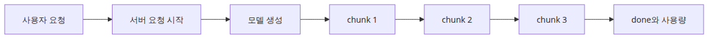
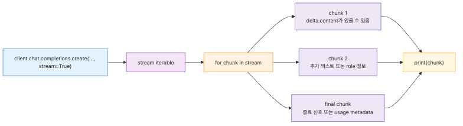
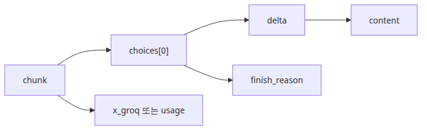
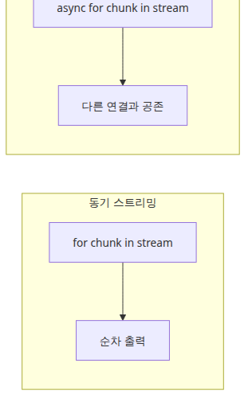
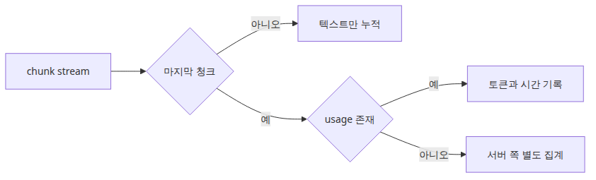
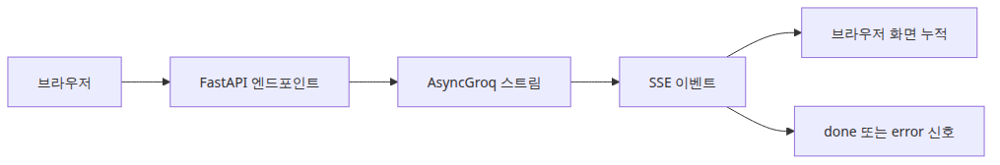

# 스트리밍 응답 처리 — 실시간으로 출력 받기

LLM 애플리케이션을 느리게 만드는 가장 쉬운 방법 중 하나는 모델 호출을 일반적인 블로킹 API처럼 다루는 것입니다. 서버는 프롬프트를 보내고, 몇 초 동안 조용히 기다린 뒤, 답변 전체가 끝났을 때 한 번에 돌려줍니다. 기능은 동작하지만 사용자 경험은 필요 이상으로 답답해집니다.

문제는 총 생성 시간이 아니라 보이는 방식입니다. 사용자는 기다리는 동안 모델이 실제로 작업 중인지, 네트워크가 멈췄는지, 애플리케이션이 고장 났는지 알 수 없습니다. 반대로 몇백 밀리초 안에 첫 글자가 나타나고 뒤이어 텍스트가 이어지면, 같은 5초라도 체감은 완전히 달라집니다.

스트리밍의 가치는 바로 여기에 있습니다. 모델을 더 똑똑하게 만들지도, 총 생성 시간을 마법처럼 줄이지도 않습니다. 대신 기다림을 눈에 보이게 바꿉니다. 긴 답변일수록 이 차이는 더 커지고, 챗봇·초안 작성·브라우저 UI 같은 경로에서는 거의 제품 경험의 일부가 됩니다.

이 글은 LLM App Foundations 101 시리즈의 마지막 글입니다.

여기서는 스트리밍을 성능 트릭이 아니라 사용자에게 생성 과정을 드러내는 응답 전달 방식으로 보고, Groq SDK 기준의 기본 패턴을 정리하겠습니다.

## 이 글에서 다룰 문제

- 스트리밍은 총 생성 시간 대신 무엇을 개선할까요?
- Groq SDK에서 가장 작은 스트리밍 호출은 어떤 모양일까요?
- 청크마다 `delta.content`를 안전하게 읽는 패턴은 무엇일까요?
- 스트리밍과 동기·비동기 모델은 어디서 구분해야 할까요?
- FastAPI를 통해 브라우저로 릴레이할 때 어떤 종료 신호와 메타데이터를 고려해야 할까요?

## 왜 이 글이 중요한가

응답 품질이 충분해진 뒤 사용자가 가장 먼저 체감하는 문제는 종종 속도가 아니라 침묵입니다. 애플리케이션이 아무 반응 없이 몇 초를 보내면, 사용자는 모델이 답을 생성 중인지조차 확신할 수 없습니다. 이때 스트리밍은 실제 지연 시간을 숨기는 기능이 아니라, 진행 중인 작업을 사용자에게 노출하는 기능이 됩니다.

또한 스트리밍은 텍스트를 다루는 방식 자체를 바꿉니다. 비스트리밍에서는 응답이 하나의 완성 객체입니다. 스트리밍에서는 응답이 이벤트 시퀀스가 됩니다. 일부 청크는 텍스트를 담고, 일부 청크는 종료 신호나 메타데이터만 담습니다. UI를 만들기 시작하면 이 이벤트 중심 모델이 오히려 더 자연스럽습니다.

운영 관점에서도 의미가 큽니다. 시간당 처리량을 갑자기 올려 주지는 않더라도, time to first token, 사용자 취소율, 장문 응답 이탈률 같은 제품 지표를 개선할 수 있습니다. 즉, 스트리밍은 단순한 코드 패턴이 아니라 측정 가능한 UX 전략입니다.

## 스트리밍을 이해하는 가장 좋은 방법: 응답 본문 하나를 받는 것이 아니라 생성 이벤트의 흐름을 소비하는 것으로 보는 것입니다

`stream=True`를 켜는 순간 멘탈 모델이 바뀝니다. 이전에는 완료된 문자열 하나를 받았지만, 이제는 조각들이 순서대로 도착하는 흐름을 다뤄야 합니다. 따라서 소비자 코드는 세 가지를 동시에 신경 써야 합니다. 사용자에게 보일 부분 텍스트, 나중에 저장할 최종 텍스트, 마지막에만 나타날 수 있는 사용량 메타데이터입니다.

이 시각이 중요한 이유는 스트리밍을 단순한 화면 출력 기능으로만 보면 나중에 저장, 로깅, 후속 파이프라인 연결, 중단 처리에서 다시 막히기 때문입니다. 스트림은 텍스트가 아니라 이벤트 흐름입니다. 그렇게 이해해야 UI와 서버 설계가 함께 정리됩니다.

> 스트리밍의 핵심은 모델을 더 빨리 끝내는 데 있지 않고, 생성 중인 답을 이벤트 흐름으로 드러내어 기다림을 읽을 수 있게 만드는 데 있습니다.

## 핵심 개념



*스트리밍 응답의 전체 이벤트 흐름*

비스트리밍과 스트리밍의 차이는 총 시간보다 관찰 가능성에 있습니다. 비스트리밍에서는 모든 토큰이 끝난 뒤 최종 payload 하나가 옵니다. 스트리밍에서는 첫 청크가 준비되는 즉시 전송이 시작됩니다.

가장 작은 Groq 스트리밍 호출은 아래와 같습니다.



*완성 전 청크가 먼저 도착하는 최소 예제*

```python
import os

from groq import Groq

client = Groq(api_key=os.environ["GROQ_API_KEY"])

stream = client.chat.completions.create(
    model="llama-3.1-8b-instant",
    messages=[
        {
            "role": "system",
            "content": "You are a concise Python tutor.",
        },
        {
            "role": "user",
            "content": "Explain Python generators in five sentences.",
        },
    ],
    temperature=0.3,
    stream=True,
)

for chunk in stream:
    print(chunk)
```

이제 응답은 하나의 문자열이 아니라 청크들의 시퀀스입니다. 애플리케이션은 이 시퀀스에서 사용자에게 보여 줄 텍스트만 골라내야 합니다.



*청크 안에서 텍스트와 종료 정보를 읽는 구조*

```python
import os

from groq import Groq

client = Groq(api_key=os.environ["GROQ_API_KEY"])

stream = client.chat.completions.create(
    model="llama-3.1-8b-instant",
    messages=[
        {
            "role": "user",
            "content": "Explain the difference between FastAPI and Flask for beginners.",
        }
    ],
    temperature=0.2,
    stream=True,
)

parts: list[str] = []

for chunk in stream:
    delta = chunk.choices[0].delta.content
    if delta:
        print(delta, end="", flush=True)
        parts.append(delta)

final_text = "".join(parts)
print("\n---")
print(final_text)
```

여기서 중요한 습관은 `delta.content`가 비어 있을 수 있음을 정상으로 취급하는 것입니다. 일부 청크는 텍스트가 아니라 역할 정보나 종료 신호만 담을 수 있습니다.

스트리밍과 async는 같은 개념이 아닙니다.



*동기 스트리밍과 비동기 스트리밍의 구조 차이*

스트리밍은 응답이 조각으로 오는 방식이고, async는 애플리케이션이 그 조각을 기다리는 방식입니다. 따라서 동기 스트리밍도 가능하고 비동기 스트리밍도 가능합니다.

```python
import asyncio
import os

from groq import AsyncGroq

client = AsyncGroq(api_key=os.environ["GROQ_API_KEY"])

async def main() -> None:
    stream = await client.chat.completions.create(
        model="llama-3.1-8b-instant",
        messages=[
            {
                "role": "user",
                "content": "Explain why asyncio helps in web servers.",
            }
        ],
        temperature=0.2,
        stream=True,
    )

    parts: list[str] = []

    async for chunk in stream:
        delta = chunk.choices[0].delta.content
        if delta:
            print(delta, end="", flush=True)
            parts.append(delta)

    final_text = "".join(parts)
    print("\n---")
    print(final_text)

asyncio.run(main())
```

작은 CLI 도구라면 동기 스트리밍이 충분하고, FastAPI 같은 다중 사용자 서버라면 비동기 스트리밍이 더 자연스럽습니다.

스트리밍에서는 사용량 메타데이터를 언제 읽을지도 달라집니다.



*마지막 청크와 별도 집계로 사용량을 읽는 구조*

```python
import os

from groq import Groq

client = Groq(api_key=os.environ["GROQ_API_KEY"])

stream = client.chat.completions.create(
    model="llama-3.1-8b-instant",
    messages=[{"role": "user", "content": "Explain Python decorators."}],
    stream=True,
)

parts: list[str] = []
last_chunk = None

for chunk in stream:
    last_chunk = chunk
    delta = chunk.choices[0].delta.content
    if delta:
        parts.append(delta)

final_text = "".join(parts)
print(final_text)

usage = None
if last_chunk is not None:
    groq_meta = getattr(last_chunk, "x_groq", None)
    if groq_meta is not None:
        usage = getattr(groq_meta, "usage", None)

if usage is not None:
    print("prompt_tokens:", usage.prompt_tokens)
    print("completion_tokens:", usage.completion_tokens)
    print("total_tokens:", usage.total_tokens)
else:
    print("usage metadata was not present in the final chunk")
```

현업에서는 보통 마지막 청크 메타데이터와 서버 쪽 요청 단위 계측을 함께 둡니다. 이유는 스트리밍 경로가 중간 연결 종료, 프록시 동작, SDK 변경 같은 운영 변수에 더 민감하기 때문입니다.

스트리밍은 UI뿐 아니라 파일 저장과 파이프라인 연결에도 유용합니다. 긴 초안 생성 중간 결과를 바로 파일에 flush할 수도 있고, 문장 단위로 버퍼링해 다른 소비자에게 넘길 수도 있습니다. 핵심은 스트림을 “터미널 출력”이 아니라 “중간에 끼워 넣을 수 있는 데이터 흐름”으로 보는 것입니다. 이제 서버에서 브라우저로 릴레이하는 패턴까지 보면 스트리밍의 제품적 위치가 더 선명해집니다.



*FastAPI가 모델 스트림을 브라우저로 전달하는 구조*

```python
import os

from fastapi import FastAPI
from fastapi.responses import StreamingResponse
from groq import AsyncGroq

app = FastAPI()
client = AsyncGroq(api_key=os.environ["GROQ_API_KEY"])

@app.get("/chat/stream")
async def chat_stream(prompt: str) -> StreamingResponse:
    async def event_gen():
        stream = await client.chat.completions.create(
            model="llama-3.1-8b-instant",
            messages=[{"role": "user", "content": prompt}],
            temperature=0.2,
            stream=True,
        )

        async for chunk in stream:
            delta = chunk.choices[0].delta.content
            if delta:
                yield f"data: {delta}\n\n"

        yield "data: [done]\n\n"

    return StreamingResponse(event_gen(), media_type="text/event-stream")
```

이 패턴에서는 브라우저에 API 키를 노출하지 않고, 인증·프롬프트 정책·사용량 로깅을 서버에 유지할 수 있습니다. 또한 `[done]` 같은 명시적 종료 이벤트를 보내야 클라이언트가 정상 종료와 네트워크 실패를 구분하기 쉬워집니다.

## 흔히 헷갈리는 지점

- 스트리밍이 총 생성 시간을 크게 줄여 준다고 기대하기 쉽지만, 실제 가치는 체감 지연과 가시성 개선에 있습니다.
- 스트리밍과 async를 같은 개념으로 보지만, 하나는 응답 전달 방식이고 다른 하나는 대기 방식입니다.
- 모든 청크에 텍스트가 있다고 가정하면 소비 루프가 쉽게 깨집니다. 빈 `delta`는 정상입니다.
- 중간 렌더링만 신경 쓰고 최종 문자열 재구성을 빼먹기 쉽지만, 저장·캐시·후속 처리에는 전체 본문이 필요합니다.
- 마지막 종료 신호를 명시하지 않으면 브라우저 UI는 정상 완료와 연결 문제를 구분하기 어렵습니다.

## 운영 체크리스트

- [ ] `stream=True` 호출이 기본 응답 객체와 다른 소비 패턴을 만든다는 점을 확인했습니다.
- [ ] 청크 처리 루프에서 `chunk.choices[0].delta.content`가 `None`일 수 있음을 정상 처리합니다.
- [ ] 누적한 스트림 결과가 비스트리밍 최종 본문과 같은지 검증했습니다.
- [ ] 동기 `for`와 비동기 `async for` 소비 패턴을 각각 한 번씩 구현했습니다.
- [ ] FastAPI 스트리밍 경로에서 `StreamingResponse`, 올바른 `media_type`, 명시적 종료 이벤트를 사용합니다.

## 정리

스트리밍은 모델을 더 빠르게 끝내는 기능이 아니라, 생성 중인 답을 사용자와 시스템에 더 일찍 보여 주는 기능입니다. 이 한 가지 차이만으로도 체감 속도, 장문 응답 경험, 취소 가능성, 후속 파이프라인 연결 방식이 모두 달라집니다.

이 글에서 기억해야 할 핵심은 세 가지입니다. 응답은 이제 문자열 하나가 아니라 이벤트 시퀀스이고, 소비자는 부분 렌더링과 최종 재구성과 메타데이터 수집을 함께 해야 하며, 서버는 스트림을 브라우저로 안전하게 릴레이하는 중간 계층이 되어야 합니다.

이 시리즈는 여기서 기초를 마칩니다. 첫 호출, 토큰, 역할 기반 프롬프트, few-shot 유도, 대화 상태, 스트리밍까지 이해했다면 이제 작은 LLM 앱을 설계하고 설명할 수 있는 기반이 생긴 것입니다. 다음 단계는 구조화 출력, 툴 호출, 더 깊은 스트리밍 운영 패턴, 캐싱과 재시도처럼 프로덕션 쪽 관심사로 넘어가는 일입니다.

<!-- toc:begin -->
## 이 시리즈의 다른 글

- [LLM API 첫걸음 — 모델에게 첫 번째 요청 보내기](./01-llm-api-first-call.md)
- [토큰 이해하기 — 비용, 한계, 컨텍스트 창](./02-understanding-tokens.md)
- [프롬프트 엔지니어링 기초 — System·User·Assistant 역할](./03-prompt-engineering-basics.md)
- [Few-shot과 Chain-of-Thought — 더 나은 답변 유도하기](./04-few-shot-and-cot.md)
- [대화 상태 관리 — 멀티턴 챗봇 만들기](./05-conversation-state.md)
- **스트리밍 응답 처리 — 실시간으로 출력 받기 (현재 글)**

<!-- toc:end -->

## 참고 자료

### 공식 문서

- [Groq text generation docs](https://console.groq.com/docs/text-chat)
- [Groq Python SDK repository](https://github.com/groq/groq-python)
- [FastAPI StreamingResponse](https://fastapi.tiangolo.com/advanced/custom-response/#streamingresponse)
- [MDN Server-sent events](https://developer.mozilla.org/en-US/docs/Web/API/Server-sent_events)

### 관련 시리즈

- [대화 상태 관리 — 멀티턴 챗봇 만들기](./05-conversation-state.md)
- [스트리밍 심화 — 청크 처리와 오류 복구](../../llm-api-production-101/ko/03-streaming-in-depth.md)
- [챗봇 패턴 — 대화 이력 관리와 상태](../../ai-app-patterns-101/ko/01-chatbot-pattern.md)

Tags: LLM, OpenAI, Prompt Engineering, Python
