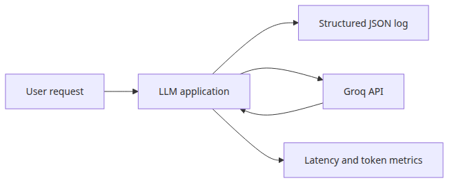

# Monitoring and logging for LLM apps

## Questions this post answers
- Which fields belong in every LLM request log?
- How do you tie latency, token usage, and response preview into one record?
- What log shape survives a later move to Datadog, BigQuery, or Elasticsearch?

> Treat one log line as the operating contract for one LLM call, and cost, latency, and debugging questions stop fragmenting across separate systems.

## Big picture

## Why this layer matters
Observability starts with a log record that can fully explain one call after the fact.

A normal API can often get away with status code and response time. An LLM app cannot. Two calls may both succeed with HTTP 200 while one burns far more tokens or returns a suspiciously short answer.

Example file: `/root/Github/llm-apps-ops-101/en/01-monitoring-and-logging/main.py`

## Minimal runnable example
```python
import json
import logging
import os
import time
import uuid
from datetime import datetime, timezone

from groq import Groq

MODEL = "llama-3.1-8b-instant"

class JsonFormatter(logging.Formatter):
    def format(self, record: logging.LogRecord) -> str:
        payload = {
            "timestamp": datetime.now(timezone.utc).isoformat(),
            "level": record.levelname,
            "event": record.getMessage(),
        }
        extra = getattr(record, "payload", None)
        if extra:
            payload.update(extra)
        return json.dumps(payload, ensure_ascii=False)

def build_logger() -> logging.Logger:
    logger = logging.getLogger("llm_monitoring")
    logger.setLevel(logging.INFO)
    if not logger.handlers:
        handler = logging.StreamHandler()
        handler.setFormatter(JsonFormatter())
        logger.addHandler(handler)
    logger.propagate = False
    return logger

LOGGER = build_logger()

def ask_llm(client: Groq, prompt: str) -> dict:
    request_id = str(uuid.uuid4())[:8]
    started = time.perf_counter()
    LOGGER.info(
        "llm_request",
        extra={
            "payload": {
                "request_id": request_id,
                "model": MODEL,
                "prompt_preview": prompt[:80],
            }
        },
    )
    response = client.chat.completions.create(
        model=MODEL,
        temperature=0,
        messages=[
            {
                "role": "system",
                "content": "You are a concise Python assistant.",
            },
            {"role": "user", "content": prompt},
        ],
    )
    latency_ms = round((time.perf_counter() - started) * 1000, 1)
    usage = response.usage
    if usage is None:
        raise RuntimeError("usage metadata missing from Groq response")
    answer = response.choices[0].message.content or ""
    record = {
        "request_id": request_id,
        "model": MODEL,
        "latency_ms": latency_ms,
        "prompt_tokens": usage.prompt_tokens,
        "completion_tokens": usage.completion_tokens,
        "total_tokens": usage.total_tokens,
        "response_preview": answer[:120],
    }
    LOGGER.info("llm_response", extra={"payload": record})
    return record | {"answer": answer}

def main() -> None:
    client = Groq(api_key=os.environ["GROQ_API_KEY"])
    prompts = [
        "Explain Python list comprehensions in two sentences.",
        "Explain the difference between a generator and an iterator in two sentences.",
    ]
    results = [ask_llm(client, prompt) for prompt in prompts]
    summary = {
        "calls": len(results),
        "latency_ms": [result["latency_ms"] for result in results],
        "total_tokens": sum(result["total_tokens"] for result in results),
    }
    print("=== monitoring summary ===")
    print(json.dumps(summary, indent=2, ensure_ascii=False))

if __name__ == "__main__":
    main()
```

## What to notice in this code
- `JsonFormatter` keeps every event in one schema, so downstream ingestion stays simple.
- Putting `request_id` and `total_tokens` in the same record keeps debugging and cost analysis connected.
- Logging a short preview instead of the full answer reduces both data leakage risk and log volume.

## Where engineers get confused
- Structured logs do not replace metrics. Metrics show trends; logs explain individual failures.
- Token counts include system instructions and generated output, not just the visible user prompt.
- Full-response logging feels convenient early on, but it becomes a privacy and storage liability fast.

## Checklist
- [ ] Always log request_id, model, latency_ms, and total_tokens
- [ ] Log previews instead of full answers by default
- [ ] Keep success and error events in the same schema
- [ ] Track P95 latency separately from average latency

## Summary
The goal is not pretty logs. The goal is one record shape that can answer later questions about incidents, cost spikes, and model behavior.

<!-- blog-only:start -->
Next: [LLM cost tracking and optimization](./02-cost-tracking.md)
<!-- blog-only:end -->

<!-- toc:begin -->
## In this series

- **Monitoring and logging for LLM apps (current)**
- LLM cost tracking and optimization (upcoming)
- Evaluating LLM output quality (upcoming)
- LLM app security (upcoming)
- LLM app deployment strategies (upcoming)
- Completing the LLM ops pipeline (upcoming)

<!-- toc:end -->

---

## References

- [Groq API Reference](https://console.groq.com/docs/api-reference)
- [Python logging cookbook](https://docs.python.org/3/howto/logging-cookbook.html)
- [OpenTelemetry Python](https://opentelemetry.io/docs/instrumentation/python/)

Tags: LLMOps, Observability, Python, LLM
