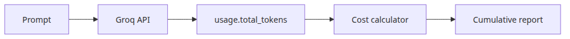
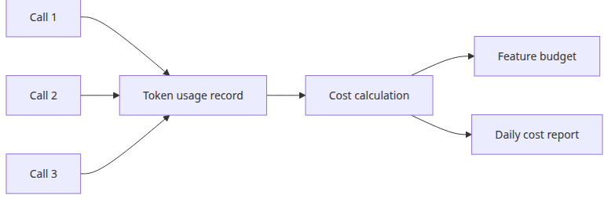
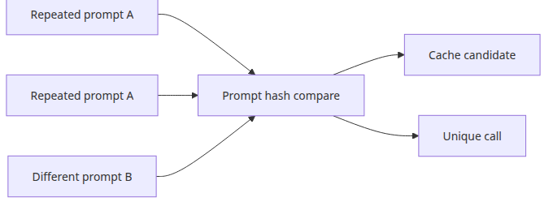
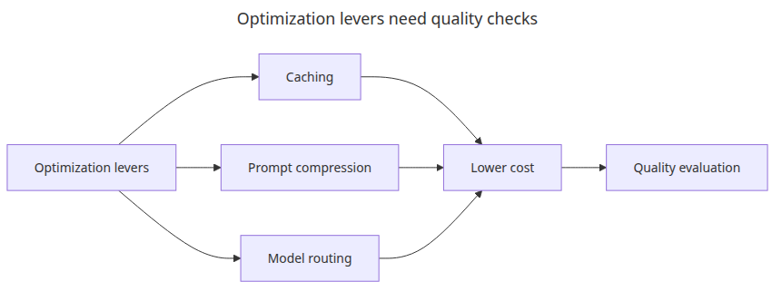

# LLM cost tracking and optimization

LLM costs often look harmless until repeated prompts, traffic growth, or background jobs make them visible all at once. If you do not measure cost per call early, optimization decisions stay qualitative much longer than they should.

This is the second post in the LLM Apps Ops 101 series. Here, we will turn token usage into an explicit cost feedback loop that supports caching, prompt compression, and routing decisions.

## Questions this post answers
- How should token usage accumulate across repeated calls?
- How much abstraction is enough for a simple price-per-million model?
- Which numbers reveal the highest-value cost-saving opportunities first?

> Cost tracking is not bookkeeping for its own sake. It is the feedback loop that makes caching, prompt compression, and routing decisions measurable.

## Big picture


*Cost tracking flow and optimization points*
## Why this layer matters


*Per-call tokens become cumulative cost*
Cost becomes more important as the feature succeeds, which is exactly why the math should exist in code early.

LLM costs usually start small enough to ignore, then jump when repeated prompts, background jobs, or traffic growth hit at once. If you do not record usage per call, optimization becomes guesswork.

Example file: `en/02-cost-tracking/main.py`

## Minimal runnable example
```python
import json
import os
from dataclasses import asdict, dataclass

from groq import Groq

MODEL = "llama-3.1-8b-instant"
PRICE_PER_MILLION_TOKENS = 0.05

@dataclass
class CostRecord:
    prompt: str
    prompt_tokens: int
    completion_tokens: int
    total_tokens: int
    cost_usd: float

def estimate_cost(total_tokens: int) -> float:
    return round((total_tokens / 1_000_000) * PRICE_PER_MILLION_TOKENS, 8)

def run_prompt(client: Groq, prompt: str) -> CostRecord:
    response = client.chat.completions.create(
        model=MODEL,
        temperature=0,
        messages=[
            {"role": "system", "content": "You are a concise Python assistant."},
            {"role": "user", "content": prompt},
        ],
    )
    usage = response.usage
    if usage is None:
        raise RuntimeError("usage metadata missing from Groq response")
    return CostRecord(
        prompt=prompt,
        prompt_tokens=usage.prompt_tokens,
        completion_tokens=usage.completion_tokens,
        total_tokens=usage.total_tokens,
        cost_usd=estimate_cost(usage.total_tokens),
    )

def main() -> None:
    client = Groq(api_key=os.environ["GROQ_API_KEY"])
    prompts = [
        "Summarize Python decorators in one sentence.",
        "Summarize Python decorators in one sentence.",
        "Summarize asyncio.gather in one sentence.",
    ]
    records = [run_prompt(client, prompt) for prompt in prompts]
    report = {
        "price_per_million_tokens": PRICE_PER_MILLION_TOKENS,
        "total_calls": len(records),
        "total_tokens": sum(record.total_tokens for record in records),
        "total_cost_usd": round(sum(record.cost_usd for record in records), 8),
        "records": [asdict(record) for record in records],
    }
    print(json.dumps(report, indent=2, ensure_ascii=False))

if __name__ == "__main__":
    main()
```

## What to notice in this code


*Repeated prompts become cache candidates*
- A single `PRICE_PER_MILLION_TOKENS` constant keeps the math obvious and easy to replace later.
- Persisting one `CostRecord` per call lets you analyze outliers without recomputing reports.
- Repeating one prompt on purpose gives you a baseline for later cache experiments.

## Where engineers get confused


*Optimization levers need quality checks*
- Many vendors price input and output tokens differently. Even if the example is simple, design for that split mentally.
- A total-cost number alone hides spikes. You also need call count and token distribution.
- Cost optimization without quality checks often means quietly making the product worse.

## Checklist
- [ ] Store total_tokens per call
- [ ] Keep pricing constants in one place
- [ ] Report both cumulative and per-call cost
- [ ] Mark repeated prompts as cache candidates

## Summary
You cannot reduce spend responsibly until you can point to the exact calls that create it.

<!-- toc:begin -->
## In this series

- [Monitoring and logging for LLM apps](./01-monitoring-and-logging.md)
- **LLM cost tracking and optimization (current)**
- Evaluating LLM output quality (upcoming)
- LLM app security (upcoming)
- LLM app deployment strategies (upcoming)
- Completing the LLM ops pipeline (upcoming)

<!-- toc:end -->

---

## References

- [Groq pricing](https://groq.com/pricing/)
- [OpenAI pricing](https://openai.com/api/pricing/)
- [Anthropic API pricing](https://www.anthropic.com/pricing#api)

Tags: LLMOps, Observability, Python, LLM
