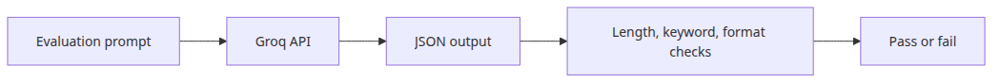

# Evaluating LLM output quality

## Questions this post answers
- How do you automate max-length checks for model output?
- When does keyword coverage become a useful quality gate?
- How far should format validation go before you add schema validation?

> The first useful evaluation layer is not a perfect semantic judge. It is a cheap filter that catches obviously bad answers quickly and consistently.

## Big picture

## Why this layer matters
Before adding complex judges, build a rule layer that catches obviously bad output cheaply and consistently.

At scale, nobody reads every answer. A practical pipeline starts by blocking machine-detectable failures: malformed JSON, missing keywords, and answers that are far too short or too long.

Example file: `/root/Github/llm-apps-ops-101/en/03-evaluation/main.py`

## Minimal runnable example
```python
import json
import os
from dataclasses import asdict, dataclass

from groq import Groq

MODEL = "llama-3.1-8b-instant"

@dataclass
class EvalResult:
    passed: bool
    length_ok: bool
    keywords_ok: bool
    format_ok: bool
    missing_keywords: list[str]
    answer_length: int

def ask_for_json(client: Groq, topic: str) -> str:
    response = client.chat.completions.create(
        model=MODEL,
        temperature=0,
        messages=[
            {
                "role": "system",
                "content": (
                    "Return JSON only with keys 'answer' and 'keywords'. "
                    "The answer must be concise and technical."
                ),
            },
            {
                "role": "user",
                "content": f"Explain {topic} in JSON. Include one short answer and a keyword list.",
            },
        ],
        response_format={"type": "json_object"},
    )
    return response.choices[0].message.content or "{}"

def evaluate(text: str, expected_keywords: list[str]) -> EvalResult:
    try:
        payload = json.loads(text)
        answer = payload["answer"]
        keywords = payload["keywords"]
        format_ok = isinstance(answer, str) and isinstance(keywords, list)
    except Exception:
        return EvalResult(False, False, False, False, expected_keywords, 0)

    normalized_answer = answer.lower()
    normalized_keywords = {str(item).lower() for item in keywords}
    missing = [
        keyword
        for keyword in expected_keywords
        if keyword.lower() not in normalized_answer and keyword.lower() not in normalized_keywords
    ]
    length_ok = 60 <= len(answer) <= 280
    keywords_ok = not missing
    format_ok = format_ok
    return EvalResult(
        passed=length_ok and keywords_ok and format_ok,
        length_ok=length_ok,
        keywords_ok=keywords_ok,
        format_ok=format_ok,
        missing_keywords=missing,
        answer_length=len(answer),
    )

def main() -> None:
    client = Groq(api_key=os.environ["GROQ_API_KEY"])
    raw = ask_for_json(client, "Python's GIL")
    result = evaluate(raw, ["CPython", "thread", "lock"])
    print(json.dumps({"raw": json.loads(raw), "evaluation": asdict(result)}, indent=2, ensure_ascii=False))

if __name__ == "__main__":
    main()
```

~~~
Output
{
  "raw": {
    "answer": "The Global Interpreter Lock (GIL) is a mechanism in CPython that prevents multiple native threads from executing Python bytecodes at once.",
    "keywords": [
      "Global Interpreter Lock",
      "GIL",
      "CPython",
      "threading",
      "concurrency",
      "parallelism"
    ]
  },
  "evaluation": {
    "passed": true,
    "length_ok": true,
    "keywords_ok": true,
    "format_ok": true,
    "missing_keywords": [],
    "answer_length": 138
  }
}
~~~

## What to notice in this code
- Forcing JSON output narrows the shape of the problem before evaluation starts.
- Returning `missing_keywords` makes failures actionable instead of mysterious.
- Length thresholds should reflect the product, not an abstract best practice.

## Where engineers get confused
- Passing format checks does not mean the answer is good. Failing format checks usually means the answer is unusable.
- Keyword checks work best in domains with explicit terminology, not creative tasks.
- Even if you later add LLM-as-judge, rule-based checks remain a cheap first-pass guardrail.

## Checklist
- [ ] Force JSON-only output
- [ ] Define numeric length thresholds
- [ ] Set expected_keywords per test case
- [ ] Log missing keywords on failure

## Summary
Evaluation becomes operationally useful when it fails fast on obvious mistakes before humans ever need to look.

<!-- toc:begin -->
## In this series

- [Monitoring and logging for LLM apps](./01-monitoring-and-logging.md)
- [LLM cost tracking and optimization](./02-cost-tracking.md)
- **Evaluating LLM output quality (current)**
- LLM app security (upcoming)
- LLM app deployment strategies (upcoming)
- Completing the LLM ops pipeline (upcoming)

<!-- toc:end -->

---

## References

- [Structured Outputs guide](https://platform.openai.com/docs/guides/structured-outputs)
- [JSON Schema](https://json-schema.org/)
- [G-Eval paper](https://arxiv.org/abs/2303.16634)

Tags: LLMOps, Observability, Python, LLM
