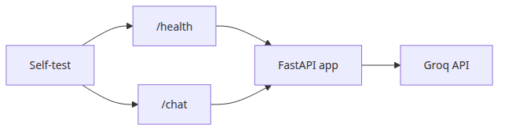
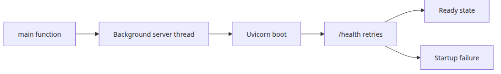
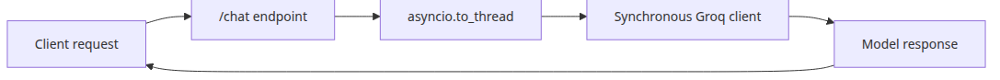

# LLM app deployment strategies

## Questions this post answers
- How much should a health check prove for a FastAPI LLM endpoint?
- How do you call the synchronous Groq client safely from an async endpoint?
- What is the simplest self-test flow that proves the server really starts?

> A deployable example is not defined by nice-looking server code. It is defined by whether the same script can start the server, hit health, and complete a real chat request.

## Big picture


*Self-test flow for health and chat*
## Why this layer matters


*Startup verification reaches health check*
A deployment example is only credible when it can start the server and verify a real request on its own.

The most common documentation mistake is showing server code without proving that it actually boots. For an operations-focused post, health check plus one representative request is the minimum bar.

Example file: `/root/Github/llm-apps-ops-101/en/05-deployment/main.py`

## Minimal runnable example
```python
import asyncio
import os
import threading
import time
from contextlib import asynccontextmanager

import httpx
import uvicorn
from fastapi import FastAPI
from pydantic import BaseModel, Field
from groq import Groq

MODEL = "llama-3.1-8b-instant"

class ChatRequest(BaseModel):
    message: str = Field(min_length=1, max_length=4000)

class ChatResponse(BaseModel):
    response: str
    model: str

def call_model(client: Groq, message: str) -> str:
    response = client.chat.completions.create(
        model=MODEL,
        temperature=0,
        messages=[
            {"role": "system", "content": "You are a concise Python assistant."},
            {"role": "user", "content": message},
        ],
    )
    return response.choices[0].message.content or ""

@asynccontextmanager
async def lifespan(app: FastAPI):
    app.state.client = Groq(api_key=os.environ["GROQ_API_KEY"])
    yield

app = FastAPI(title="llm-deployment-demo", lifespan=lifespan)

class ThreadSafeServer(uvicorn.Server):
    def install_signal_handlers(self) -> None:
        return None

@app.get("/health")
async def health() -> dict:
    return {"status": "ok", "model": MODEL}

@app.post("/chat", response_model=ChatResponse)
async def chat(request: ChatRequest) -> ChatResponse:
    answer = await asyncio.to_thread(call_model, app.state.client, request.message)
    return ChatResponse(response=answer, model=MODEL)

def run_server(server: uvicorn.Server) -> None:
    server.run()

def main() -> None:
    config = uvicorn.Config(app, host="127.0.0.1", port=8015, log_level="warning")
    server = ThreadSafeServer(config)
    thread = threading.Thread(target=run_server, args=(server,), daemon=True)
    thread.start()

    for _ in range(40):
        try:
            health = httpx.get("http://127.0.0.1:8015/health", timeout=2.0)
            if health.status_code == 200:
                break
        except Exception:
            time.sleep(0.25)
    else:
        raise RuntimeError("server did not start")

    print("HEALTH:", health.json())
    response = httpx.post(
        "http://127.0.0.1:8015/chat",
        json={"message": "Explain Python async functions in two sentences."},
        timeout=30.0,
    )
    print("CHAT:", response.json())

    server.should_exit = True
    thread.join(timeout=10)
    if thread.is_alive():
        raise RuntimeError("server did not stop cleanly")

if __name__ == "__main__":
    main()
```

## What to notice in this code


*Async endpoint offloads sync model calls*
- `asyncio.to_thread` prevents the synchronous Groq SDK from blocking the FastAPI event loop.
- Starting `uvicorn.Server` in code keeps documentation and verification in one place.
- Hitting both `/health` and `/chat` checks more than process startup; it verifies the real dependency path.

## Where engineers get confused


*Self-test verifies startup and shutdown*
- A health endpoint does not guarantee model quality. It only confirms basic service readiness.
- Using an async web framework does not magically make every external SDK async.
- A local self-test passing does not remove the need to verify secrets, networking, and timeout settings in deployment.

## Checklist
- [ ] Call /health automatically after startup
- [ ] Send one real /chat request in the self-test
- [ ] Move blocking SDK calls into to_thread
- [ ] Confirm the background server exits cleanly

## Summary
In deployment examples, the self-test is often more valuable than the endpoint code because it proves the instructions are real.

<!-- toc:begin -->
## In this series

- [Monitoring and logging for LLM apps](./01-monitoring-and-logging.md)
- [LLM cost tracking and optimization](./02-cost-tracking.md)
- [Evaluating LLM output quality](./03-evaluation.md)
- [LLM app security](./04-security.md)
- **LLM app deployment strategies (current)**
- Completing the LLM ops pipeline (upcoming)

<!-- toc:end -->

---

## References

- [FastAPI](https://fastapi.tiangolo.com/)
- [Uvicorn settings](https://www.uvicorn.org/settings/)
- [HTTPX quickstart](https://www.python-httpx.org/quickstart/)

Tags: LLMOps, Observability, Python, LLM
