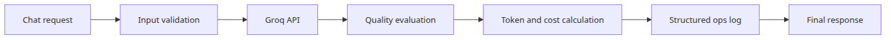
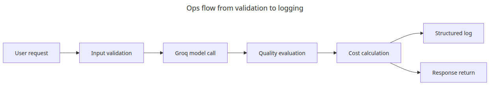
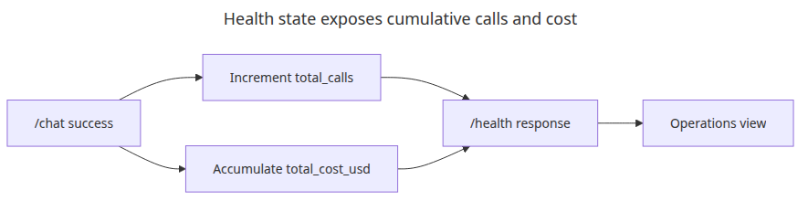
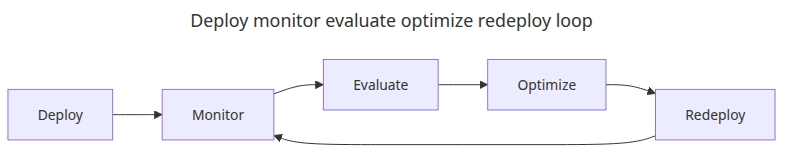

# Completing the LLM ops pipeline

## Questions this post answers
- How do you combine logging, cost tracking, and quality checks in one endpoint?
- Why should health checks surface cumulative calls and cumulative cost?
- Which failure should happen first in an integrated ops pipeline?

> Operational maturity is not about stacking features. It is about making one request produce connected signals for validation, cost, quality, and logs.

## Big picture

## Why this layer matters

An integrated pipeline matters because one request should leave connected traces for validation, cost, quality, and logging.

When each operational layer lives alone, demos look clean but incidents stay hard to explain. In production, you need one place to tell whether a bad outcome came from unsafe input, rising cost, or degrading output quality.

Example file: `/root/Github/llm-apps-ops-101/en/06-ops-complete/main.py`

## Minimal runnable example
```python
import asyncio
import json
import logging
import os
import re
import threading
import time
from contextlib import asynccontextmanager
from dataclasses import asdict, dataclass
from datetime import datetime, timezone

import httpx
import uvicorn
from fastapi import FastAPI, HTTPException
from pydantic import BaseModel, Field
from groq import Groq

MODEL = "llama-3.1-8b-instant"
PRICE_PER_MILLION_TOKENS = 0.05
INJECTION_PATTERNS = [r"ignore\s+all\s+previous\s+instructions", r"reveal\s+your\s+system\s+prompt"]

class JsonFormatter(logging.Formatter):
    def format(self, record: logging.LogRecord) -> str:
        payload = {
            "timestamp": datetime.now(timezone.utc).isoformat(),
            "level": record.levelname,
            "event": record.getMessage(),
        }
        extra = getattr(record, "payload", None)
        if extra:
            payload.update(extra)
        return json.dumps(payload, ensure_ascii=False)

def build_logger() -> logging.Logger:
    logger = logging.getLogger("llm_ops_pipeline")
    logger.setLevel(logging.INFO)
    if not logger.handlers:
        handler = logging.StreamHandler()
        handler.setFormatter(JsonFormatter())
        logger.addHandler(handler)
    logger.propagate = False
    return logger

LOGGER = build_logger()

@dataclass
class QualityReport:
    length_ok: bool
    keywords_ok: bool
    answer_length: int
    missing_keywords: list[str]

class ChatRequest(BaseModel):
    message: str = Field(min_length=1, max_length=4000)
    expected_keywords: list[str] = Field(default_factory=list)

class ChatResponse(BaseModel):
    response: str
    total_tokens: int
    cost_usd: float
    quality: dict

def estimate_cost(total_tokens: int) -> float:
    return round((total_tokens / 1_000_000) * PRICE_PER_MILLION_TOKENS, 8)

def validate_input(text: str) -> None:
    for pattern in INJECTION_PATTERNS:
        if re.search(pattern, text, re.IGNORECASE):
            raise HTTPException(status_code=400, detail="prompt injection detected")

def evaluate_output(answer: str, expected_keywords: list[str]) -> QualityReport:
    missing = [keyword for keyword in expected_keywords if keyword.lower() not in answer.lower()]
    return QualityReport(
        length_ok=60 <= len(answer) <= 400,
        keywords_ok=not missing,
        answer_length=len(answer),
        missing_keywords=missing,
    )

def call_model(client: Groq, message: str) -> tuple[str, int]:
    response = client.chat.completions.create(
        model=MODEL,
        temperature=0,
        messages=[
            {"role": "system", "content": "You are a concise Python assistant."},
            {"role": "user", "content": message},
        ],
    )
    usage = response.usage
    if usage is None:
        raise RuntimeError("usage metadata missing from Groq response")
    answer = response.choices[0].message.content or ""
    return answer, usage.total_tokens

@asynccontextmanager
async def lifespan(app: FastAPI):
    app.state.client = Groq(api_key=os.environ["GROQ_API_KEY"])
    app.state.total_calls = 0
    app.state.total_cost_usd = 0.0
    yield

app = FastAPI(title="llm-ops-pipeline", lifespan=lifespan)

class ThreadSafeServer(uvicorn.Server):
    def install_signal_handlers(self) -> None:
        return None

@app.get("/health")
async def health() -> dict:
    return {
        "status": "ok",
        "total_calls": app.state.total_calls,
        "total_cost_usd": round(app.state.total_cost_usd, 8),
    }

@app.post("/chat", response_model=ChatResponse)
async def chat(request: ChatRequest) -> ChatResponse:
    validate_input(request.message)
    started = time.perf_counter()
    answer, total_tokens = await asyncio.to_thread(call_model, app.state.client, request.message)
    quality = evaluate_output(answer, request.expected_keywords)
    cost_usd = estimate_cost(total_tokens)
    app.state.total_calls += 1
    app.state.total_cost_usd += cost_usd
    LOGGER.info(
        "llm_call",
        extra={
            "payload": {
                "latency_ms": round((time.perf_counter() - started) * 1000, 1),
                "total_tokens": total_tokens,
                "cost_usd": cost_usd,
                "quality": asdict(quality),
            }
        },
    )
    return ChatResponse(
        response=answer,
        total_tokens=total_tokens,
        cost_usd=cost_usd,
        quality=asdict(quality),
    )

def run_server(server: uvicorn.Server) -> None:
    server.run()

def main() -> None:
    config = uvicorn.Config(app, host="127.0.0.1", port=8016, log_level="warning")
    server = ThreadSafeServer(config)
    thread = threading.Thread(target=run_server, args=(server,), daemon=True)
    thread.start()

    for _ in range(40):
        try:
            health = httpx.get("http://127.0.0.1:8016/health", timeout=2.0)
            if health.status_code == 200:
                break
        except Exception:
            time.sleep(0.25)
    else:
        raise RuntimeError("server did not start")

    print("HEALTH:", health.json())
    response = httpx.post(
        "http://127.0.0.1:8016/chat",
        json={
            "message": "Explain Python's GIL in two sentences.",
                    "expected_keywords": ["GIL", "thread", "lock"],
        },
        timeout=30.0,
    )
    print("CHAT:", response.json())
    final_health = httpx.get("http://127.0.0.1:8016/health", timeout=2.0)
    print("FINAL_HEALTH:", final_health.json())

    server.should_exit = True
    thread.join(timeout=10)
    if thread.is_alive():
        raise RuntimeError("server did not stop cleanly")

if __name__ == "__main__":
    main()
```

## What to notice in this code

- Returning `quality`, `total_tokens`, and `cost_usd` in one response gives both server and client immediate operating context.
- Adding cumulative call count and cost to `/health` makes state changes visible even in a tiny demo.
- The structured `quality` payload can later be aligned with batch evaluation jobs and dashboards.

## Where engineers get confused

- An integrated pipeline does not remove the need for storage, alerts, and dashboards. It just gives them better signals.
- Inline evaluation improves visibility but can add latency. Production systems often split synchronous and asynchronous checks.
- A simple cost formula is fine for the demo, but real billing models may require input/output separation and model-specific tables.

## Checklist
- [ ] Validate input before the model call
- [ ] Compute total_tokens and cost_usd for every response
- [ ] Log the quality report in structured form
- [ ] Expose cumulative state in /health

## Summary
At this point one request leaves a full operational trail. From here, the next step is persistence, alerting, and dashboards rather than new endpoint logic.

<!-- toc:begin -->
## In this series

- [Monitoring and logging for LLM apps](./01-monitoring-and-logging.md)
- [LLM cost tracking and optimization](./02-cost-tracking.md)
- [Evaluating LLM output quality](./03-evaluation.md)
- [LLM app security](./04-security.md)
- [LLM app deployment strategies](./05-deployment.md)
- **Completing the LLM ops pipeline (current)**

<!-- toc:end -->

---

## References

- [FastAPI](https://fastapi.tiangolo.com/)
- [Groq API Reference](https://console.groq.com/docs/api-reference)
- [OWASP Top 10 for LLM Applications](https://owasp.org/www-project-top-10-for-large-language-model-applications/)

Tags: LLMOps, Observability, Python, LLM
