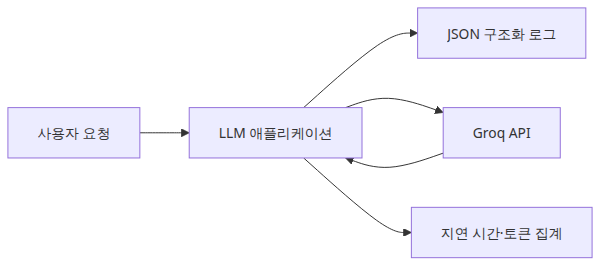
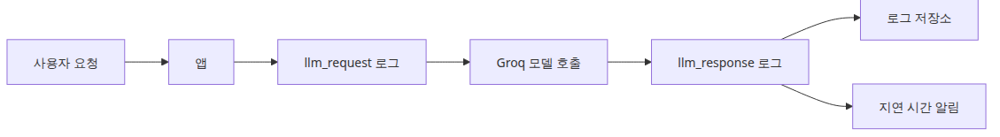
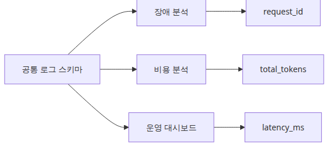
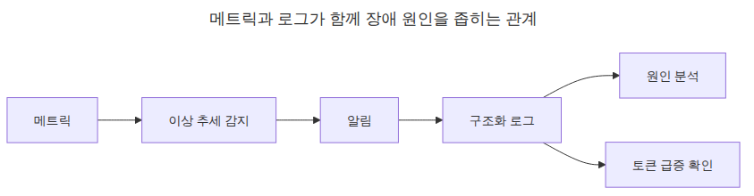

# LLM 앱 모니터링과 로깅

<!-- a-grade-intro:begin -->
## 핵심 질문

LLM 앱 모니터링과 로깅을 어떻게 구축해야 사고를 빠르게 잡을 수 있을까요?

이 글은 그 질문에 답하기 위해 LLM 모니터링과 로깅의 핵심 결정과 운영 함정을 살펴봅니다.

<!-- a-grade-intro:end -->

## 이 글에서 답할 질문
- LLM 호출 로그에 최소한 어떤 필드를 남겨야 할까요?
- 토큰 수, 지연 시간, 응답 미리보기를 한 번에 어떻게 묶을까요?
- 나중에 Datadog이나 BigQuery로 보내도 다시 가공하지 않으려면 무엇을 지켜야 할까요?

> 로그 한 줄이 곧 호출 한 건의 운영 계약서라고 생각하면, 나중에 비용·장애·품질 문제를 같은 레코드에서 추적할 수 있습니다.

## 큰 그림


*모니터링과 로깅 컴포넌트 구성*
## 왜 이 레이어가 필요한가


*요청과 응답 로그가 한 호출을 잇는 흐름*
관측 가능성의 시작은 화려한 대시보드가 아니라, 호출 한 건을 다시 설명할 수 있는 로그 레코드입니다.

일반 API 로그는 상태 코드와 응답 시간만으로도 어느 정도 운영이 됩니다. 하지만 LLM 앱은 같은 200 응답이라도 토큰 수가 폭증하거나, 응답 길이가 비정상적으로 짧거나, 특정 프롬프트에서만 지연 시간이 튈 수 있습니다.

예제 파일: `/root/Github/llm-apps-ops-101/ko/01-monitoring-and-logging/main.py`

## 최소 실행 예제
```python
import json
import logging
import os
import time
import uuid
from datetime import datetime, timezone

from groq import Groq

MODEL = "llama-3.1-8b-instant"

class JsonFormatter(logging.Formatter):
    def format(self, record: logging.LogRecord) -> str:
        payload = {
            "timestamp": datetime.now(timezone.utc).isoformat(),
            "level": record.levelname,
            "event": record.getMessage(),
        }
        extra = getattr(record, "payload", None)
        if extra:
            payload.update(extra)
        return json.dumps(payload, ensure_ascii=False)

def build_logger() -> logging.Logger:
    logger = logging.getLogger("llm_monitoring")
    logger.setLevel(logging.INFO)
    if not logger.handlers:
        handler = logging.StreamHandler()
        handler.setFormatter(JsonFormatter())
        logger.addHandler(handler)
    logger.propagate = False
    return logger

LOGGER = build_logger()

def ask_llm(client: Groq, prompt: str) -> dict:
    request_id = str(uuid.uuid4())[:8]
    started = time.perf_counter()
    LOGGER.info(
        "llm_request",
        extra={
            "payload": {
                "request_id": request_id,
                "model": MODEL,
                "prompt_preview": prompt[:80],
            }
        },
    )
    response = client.chat.completions.create(
        model=MODEL,
        temperature=0,
        messages=[
            {
                "role": "system",
                "content": "You are a concise Python assistant.",
            },
            {"role": "user", "content": prompt},
        ],
    )
    latency_ms = round((time.perf_counter() - started) * 1000, 1)
    usage = response.usage
    if usage is None:
        raise RuntimeError("usage metadata missing from Groq response")
    answer = response.choices[0].message.content or ""
    record = {
        "request_id": request_id,
        "model": MODEL,
        "latency_ms": latency_ms,
        "prompt_tokens": usage.prompt_tokens,
        "completion_tokens": usage.completion_tokens,
        "total_tokens": usage.total_tokens,
        "response_preview": answer[:120],
    }
    LOGGER.info("llm_response", extra={"payload": record})
    return record | {"answer": answer}

def main() -> None:
    client = Groq(api_key=os.environ["GROQ_API_KEY"])
    prompts = [
        "Explain Python list comprehensions in two sentences.",
        "Explain the difference between a generator and an iterator in two sentences.",
    ]
    results = [ask_llm(client, prompt) for prompt in prompts]
    summary = {
        "calls": len(results),
        "latency_ms": [result["latency_ms"] for result in results],
        "total_tokens": sum(result["total_tokens"] for result in results),
    }
    print("=== monitoring summary ===")
    print(json.dumps(summary, indent=2, ensure_ascii=False))

if __name__ == "__main__":
    main()
```

## 이 코드에서 봐야 할 것


*공통 로그 스키마가 운영 질문을 푸는 구조*
- `JsonFormatter`가 모든 로그를 같은 스키마로 맞춰서 후처리 없이 적재할 수 있습니다.
- `request_id`와 `usage.total_tokens`를 같은 레코드에 넣어 두면 장애 분석과 비용 분석이 분리되지 않습니다.
- 응답 전체 대신 `response_preview`만 남겨서 로그 폭증과 민감 정보 노출을 줄입니다.

## 실무에서 헷갈리는 지점


*메트릭과 로그가 함께 장애 원인을 좁히는 관계*
- 구조화 로그와 메트릭은 대체 관계가 아니라 보완 관계입니다. 메트릭은 추세를 보고, 로그는 원인을 찾습니다.
- 토큰 수는 프롬프트 길이뿐 아니라 시스템 메시지와 모델 응답 길이에도 영향을 받습니다.
- 응답 전문을 로그에 남기면 디버깅은 쉬워지지만 개인정보와 비용이 동시에 늘어납니다.

## 시니어 엔지니어는 이렇게 생각합니다

- **입력·출력·결정을 모두 기록** — 사고 추적의 단일 출처입니다.
- **token·latency·error를 표준 지표로** — P99 latency가 가장 빠른 신호입니다.
- **trace로 호출 그래프를 본다** — 복잡한 chain·agent 진단의 기본입니다.
- **PII는 로그에서도 마스킹** — 로그가 새로운 유출 채널이 됩니다.
- **샘플링 정책을 의식적으로** — 전수는 비용, 부족은 신호가 약합니다.

## 체크리스트
- [ ] request_id, model, latency_ms, total_tokens를 항상 남긴다
- [ ] 응답 전문 대신 preview와 길이만 남긴다
- [ ] 에러 로그에도 동일한 스키마를 유지한다
- [ ] 운영 대시보드에서 P95 지연 시간을 따로 본다

## 정리
이 단계의 목표는 보기 좋은 로그가 아니라, 나중에 비용·장애·품질 질문에 같은 데이터로 답할 수 있는 로그를 만드는 것입니다.

<!-- toc:begin -->
## 시리즈 목차

- **LLM 앱 모니터링과 로깅 (현재 글)**
- LLM 비용 추적과 최적화 (예정)
- LLM 출력 품질 평가 (예정)
- LLM 앱 보안 (예정)
- LLM 앱 배포 전략 (예정)
- LLM 앱 운영 완성 (예정)

<!-- toc:end -->

---

## 참고 자료

- [Groq API Reference](https://console.groq.com/docs/api-reference)
- [Python logging cookbook](https://docs.python.org/3/howto/logging-cookbook.html)
- [OpenTelemetry Python](https://opentelemetry.io/docs/instrumentation/python/)

Tags: LLMOps, Observability, Python, LLM
