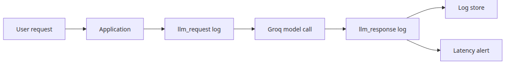
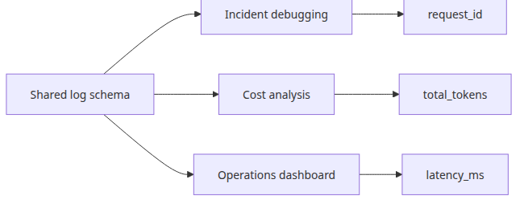
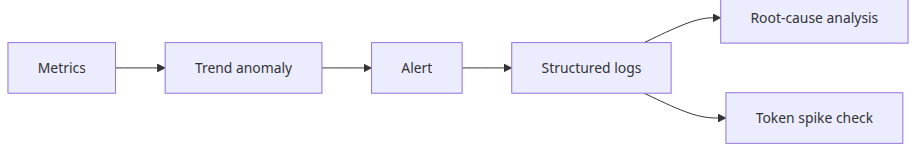

# LLM 앱 모니터링과 로깅

LLM 앱이 데모를 넘어 실제 트래픽을 받기 시작하면, 가장 먼저 드러나는 문제는 장애 자체보다도 “이 요청에서 정확히 무슨 일이 있었지?”를 다시 설명하지 못하는 상태입니다. 이 글은 LLM Apps Ops 101 시리즈의 첫 번째 글입니다. 여기서는 요청 한 건의 지연 시간, 토큰 사용량, 디버깅 맥락을 나중에 한 번에 복원할 수 있도록, 모니터링과 로깅의 최소 기준을 어디서부터 세워야 하는지 정리하겠습니다.

보통 API 운영에서는 상태 코드와 응답 시간만으로도 출발할 수 있습니다. 하지만 LLM 앱은 같은 200 응답이어도 토큰 사용량이 크게 다를 수 있고, 응답 길이만 이상해도 바로 품질 문제로 이어질 수 있습니다. 그래서 관측 가능성의 출발점은 예쁜 대시보드가 아니라, 호출 한 건을 다시 설명할 수 있는 로그 레코드입니다.

## 이 글에서 다룰 문제

- 모든 LLM 요청 로그에 어떤 필드가 반드시 들어가야 하는가?
- 지연 시간, 토큰 사용량, 응답 미리보기를 어떻게 한 레코드에 묶는가?
- 나중에 Datadog, BigQuery, Elasticsearch로 옮겨도 버틸 로그 형태는 무엇인가?

> 로그 한 줄을 LLM 호출 한 건의 운영 계약서라고 보면, 비용·지연 시간·디버깅 질문이 서로 다른 시스템으로 흩어지지 않습니다.

## 큰 그림


*모니터링과 로깅 컴포넌트 구성*

## 왜 이 레이어가 중요한가



*요청과 응답 로그가 한 호출을 잇는 흐름*

관측 가능성의 시작은 화려한 시각화가 아니라, 호출 한 건을 나중에 설명할 수 있는 기록입니다.

일반적인 웹 API는 상태 코드와 응답 시간만 있어도 1차 분석이 가능합니다. 하지만 LLM 앱은 같은 성공 요청 안에서도 비용, 지연 시간, 응답 품질 신호가 크게 갈립니다. 두 요청이 모두 200이어도 한쪽은 토큰을 과하게 태우고 있을 수 있고, 다른 한쪽은 비정상적으로 짧은 답을 내고 있을 수 있습니다. 운영자가 정말 알고 싶은 것은 “성공했는가”만이 아니라 “어떤 비용과 맥락으로 성공했는가”입니다.

그래서 요청 로그와 응답 로그를 서로 다른 관심사로 분리해 두되, `request_id` 같은 공통 키로 다시 합칠 수 있어야 합니다. 이 기준이 있어야 나중에 장애 분석, 비용 분석, 품질 분석이 서로 다른 저장소로 흩어지지 않습니다.

예제 파일: `en/01-monitoring-and-logging/main.py`

## 최소 실행 예제

```python
import json
import logging
import os
import time
import uuid
from datetime import datetime, timezone

from groq import Groq

MODEL = "llama-3.1-8b-instant"

class JsonFormatter(logging.Formatter):
    def format(self, record: logging.LogRecord) -> str:
        payload = {
            "timestamp": datetime.now(timezone.utc).isoformat(),
            "level": record.levelname,
            "event": record.getMessage(),
        }
        extra = getattr(record, "payload", None)
        if extra:
            payload.update(extra)
        return json.dumps(payload, ensure_ascii=False)

def build_logger() -> logging.Logger:
    logger = logging.getLogger("llm_monitoring")
    logger.setLevel(logging.INFO)
    if not logger.handlers:
        handler = logging.StreamHandler()
        handler.setFormatter(JsonFormatter())
        logger.addHandler(handler)
    logger.propagate = False
    return logger

LOGGER = build_logger()

def ask_llm(client: Groq, prompt: str) -> dict:
    request_id = str(uuid.uuid4())[:8]
    started = time.perf_counter()
    LOGGER.info(
        "llm_request",
        extra={
            "payload": {
                "request_id": request_id,
                "model": MODEL,
                "prompt_preview": prompt[:80],
            }
        },
    )
    response = client.chat.completions.create(
        model=MODEL,
        temperature=0,
        messages=[
            {
                "role": "system",
                "content": "You are a concise Python assistant.",
            },
            {"role": "user", "content": prompt},
        ],
    )
    latency_ms = round((time.perf_counter() - started) * 1000, 1)
    usage = response.usage
    if usage is None:
        raise RuntimeError("usage metadata missing from Groq response")
    answer = response.choices[0].message.content or ""
    record = {
        "request_id": request_id,
        "model": MODEL,
        "latency_ms": latency_ms,
        "prompt_tokens": usage.prompt_tokens,
        "completion_tokens": usage.completion_tokens,
        "total_tokens": usage.total_tokens,
        "response_preview": answer[:120],
    }
    LOGGER.info("llm_response", extra={"payload": record})
    return record | {"answer": answer}

def main() -> None:
    client = Groq(api_key=os.environ["GROQ_API_KEY"])
    prompts = [
        "Explain Python list comprehensions in two sentences.",
        "Explain the difference between a generator and an iterator in two sentences.",
    ]
    results = [ask_llm(client, prompt) for prompt in prompts]
    summary = {
        "calls": len(results),
        "latency_ms": [result["latency_ms"] for result in results],
        "total_tokens": sum(result["total_tokens"] for result in results),
    }
    print("=== monitoring summary ===")
    print(json.dumps(summary, indent=2, ensure_ascii=False))

if __name__ == "__main__":
    main()
```

## 이 코드에서 먼저 볼 점



*공통 로그 스키마가 운영 질문을 하나로 묶는 구조*

- `JsonFormatter`가 모든 이벤트를 같은 형태로 밀어 넣기 때문에, 나중에 수집기나 저장소가 바뀌어도 스키마를 다시 뒤엎지 않아도 됩니다.
- `request_id`와 `total_tokens`가 같은 레코드에 있어야 디버깅 정보와 비용 정보가 분리되지 않습니다.
- 전체 답변 대신 짧은 미리보기만 남기면 민감 정보 노출 위험과 로그 저장 비용을 동시에 줄일 수 있습니다.

이 예제의 핵심은 로깅 라이브러리 사용법 자체가 아닙니다. 더 중요한 점은 요청 시작 시점과 응답 완료 시점에 어떤 정보를 남겨야 나중 질문에 답할 수 있는가입니다. `latency_ms`, `model`, `prompt_preview`, `response_preview`, `total_tokens`가 한 구조 안에 있으면 “왜 느렸지?”, “왜 비쌌지?”, “무슨 답이 나왔지?”를 같은 출처에서 다시 볼 수 있습니다.

## 어디서 자주 헷갈릴까요?



*메트릭과 로그가 함께 실패 범위를 좁히는 구조*

- 구조화 로그가 메트릭을 대체하지는 않습니다. 메트릭은 추세를 보고, 로그는 개별 호출을 설명합니다.
- 토큰 수는 사용자가 눈으로 보는 프롬프트만이 아니라 system message와 생성된 출력까지 함께 포함합니다.
- 응답 전문 로깅은 초반에는 편리해 보여도, 곧 개인정보와 저장 비용 문제로 돌아옵니다.

실무에서 특히 자주 나오는 오해는 “로그만 잘 남기면 observability가 끝난다”는 생각입니다. 실제로는 메트릭이 먼저 이상 징후를 보여 주고, 로그가 그 원인을 설명합니다. 평균 지연 시간만 보면 멀쩡한데 P95가 급등하는 상황은 메트릭이 먼저 알려 주고, 그 뒤에 어떤 요청이 길어졌는지는 로그가 설명하는 식입니다.

## 체크리스트

- [ ] 항상 `request_id`, `model`, `latency_ms`, `total_tokens`를 남긴다
- [ ] 기본값은 전체 답변이 아니라 preview 로깅으로 둔다
- [ ] 성공 이벤트와 실패 이벤트를 같은 스키마로 유지한다
- [ ] 평균 지연 시간과 별도로 P95 지연 시간을 추적한다

## 정리

목표는 예쁜 로그를 만드는 것이 아닙니다. 나중에 장애, 비용 급증, 모델 이상 동작에 대한 질문이 들어왔을 때, 같은 형태의 레코드 하나로 그 요청을 다시 설명할 수 있게 만드는 것입니다.

<!-- toc:begin -->
## 이 시리즈의 글

- **LLM 앱 모니터링과 로깅 (현재 글)**
- LLM 비용 추적과 최적화 (예정)
- LLM 출력 품질 평가 (예정)
- LLM 앱 보안 (예정)
- LLM 앱 배포 전략 (예정)
- LLM 앱 운영 완성 (예정)

<!-- toc:end -->

---

## 참고 자료

- [Groq API Reference](https://console.groq.com/docs/api-reference)
- [Python logging cookbook](https://docs.python.org/3/howto/logging-cookbook.html)
- [OpenTelemetry Python](https://opentelemetry.io/docs/instrumentation/python/)

Tags: LLMOps, Observability, Python, LLM
