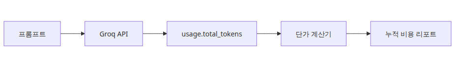
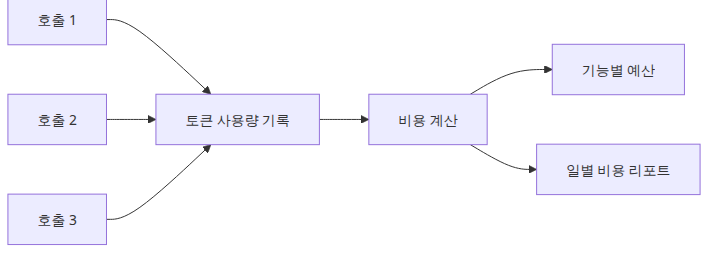
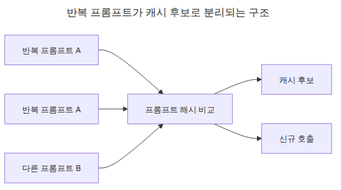
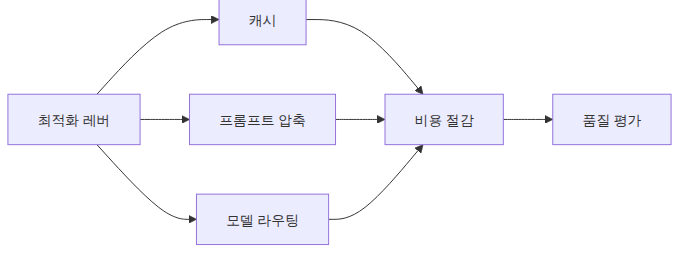

# LLM 비용 추적과 최적화

LLM 비용은 데모 단계에서는 별일 아닌 것처럼 보이지만, 반복 프롬프트와 트래픽 증가, 배치 작업이 한꺼번에 붙는 순간 갑자기 눈에 띄기 시작합니다. 이 글은 LLM Apps Ops 101 시리즈의 두 번째 글입니다. 여기서는 호출별 토큰 사용량을 실제 비용 피드백 루프로 바꿔서, 캐시·프롬프트 압축·모델 라우팅 같은 최적화 판단을 수치로 검증하는 출발점을 만들겠습니다.

비용 최적화는 “조금 덜 쓰자” 같은 구호로는 잘 되지 않습니다. 어떤 호출이 얼마를 만들었는지 먼저 남겨야, 무엇을 줄이면 실제로 가장 큰 절감이 나는지 보입니다. 비용 추적은 회계가 아니라 운영 의사결정의 계측 장치입니다.

## 이 글에서 다룰 문제

- 반복 호출이 생길 때 토큰 사용량은 어떻게 누적해서 봐야 하는가?
- 단순한 백만 토큰당 단가 모델에는 어느 정도 추상화가 적당한가?
- 비용 절감 효과가 큰 지점을 가장 먼저 드러내는 숫자는 무엇인가?

> 비용 추적은 회계를 위한 회계가 아닙니다. 캐시, 프롬프트 압축, 라우팅 결정이 실제로 효과가 있는지 보여 주는 피드백 루프입니다.

## 큰 그림



*비용 추적 흐름과 최적화 지점*

## 왜 이 레이어가 중요한가



*호출별 토큰이 누적 비용으로 모이는 흐름*

비용은 기능이 실패할 때보다 오히려 성공할 때 더 중요해지는 지표입니다. 사용량이 늘수록 눈에 띄기 때문입니다.

LLM 비용은 대부분 작게 시작했다가, 반복 호출과 백그라운드 작업이 붙는 순간 갑자기 커집니다. 개발 단계에서는 몇 번의 테스트 호출이라 눈에 잘 띄지 않지만, 같은 프롬프트가 반복되거나 조금 긴 입력이 늘어나기 시작하면 누적 토큰 수가 먼저 튀어 오릅니다.

이 시점에서 호출별 기록이 없으면 최적화는 추측으로 흐릅니다. “캐시를 붙이면 줄어들 것 같다”, “프롬프트를 조금 줄이면 되지 않을까” 같은 말은 방향 정도만 제시할 뿐입니다. 실제로는 어떤 요청이 얼마나 많은 토큰을 쓰는지, 반복 호출이 어느 정도인지, 비용이 입력과 출력 중 어디에서 많이 생기는지를 먼저 봐야 합니다.

예제 파일: `en/02-cost-tracking/main.py`

## 최소 실행 예제

```python
import json
import os
from dataclasses import asdict, dataclass

from groq import Groq

MODEL = "llama-3.1-8b-instant"
INPUT_PRICE_PER_MILLION_TOKENS = 0.05
OUTPUT_PRICE_PER_MILLION_TOKENS = 0.08

@dataclass
class CostRecord:
    prompt: str
    prompt_tokens: int
    completion_tokens: int
    total_tokens: int
    cost_usd: float

def estimate_cost(prompt_tokens: int, completion_tokens: int) -> float:
    prompt_cost = (prompt_tokens / 1_000_000) * INPUT_PRICE_PER_MILLION_TOKENS
    completion_cost = (completion_tokens / 1_000_000) * OUTPUT_PRICE_PER_MILLION_TOKENS
    return round(prompt_cost + completion_cost, 8)

def run_prompt(client: Groq, prompt: str) -> CostRecord:
    response = client.chat.completions.create(
        model=MODEL,
        temperature=0,
        messages=[
            {"role": "system", "content": "You are a concise Python assistant."},
            {"role": "user", "content": prompt},
        ],
    )
    usage = response.usage
    if usage is None:
        raise RuntimeError("usage metadata missing from Groq response")
    return CostRecord(
        prompt=prompt,
        prompt_tokens=usage.prompt_tokens,
        completion_tokens=usage.completion_tokens,
        total_tokens=usage.total_tokens,
        cost_usd=estimate_cost(usage.prompt_tokens, usage.completion_tokens),
    )

def main() -> None:
    client = Groq(api_key=os.environ["GROQ_API_KEY"])
    prompts = [
        "Summarize Python decorators in one sentence.",
        "Summarize Python decorators in one sentence.",
        "Summarize asyncio.gather in one sentence.",
    ]
    records = [run_prompt(client, prompt) for prompt in prompts]
    report = {
        "input_price_per_million_tokens": INPUT_PRICE_PER_MILLION_TOKENS,
        "output_price_per_million_tokens": OUTPUT_PRICE_PER_MILLION_TOKENS,
        "total_calls": len(records),
        "total_tokens": sum(record.total_tokens for record in records),
        "total_cost_usd": round(sum(record.cost_usd for record in records), 8),
        "records": [asdict(record) for record in records],
    }
    print(json.dumps(report, indent=2, ensure_ascii=False))

if __name__ == "__main__":
    main()
```

## 이 코드에서 먼저 볼 점



*반복 프롬프트가 캐시 후보가 되는 구조*

- 입력 단가 상수와 출력 단가 상수를 분리해 두면, 이 모델의 실제 Groq 과금 방식과 예제가 맞아떨어집니다.
- 호출마다 `CostRecord`를 남기면 나중에 리포트를 다시 계산하지 않아도 이상치와 반복 패턴을 바로 볼 수 있습니다.
- 예제에서 같은 프롬프트를 일부러 반복한 이유는 캐시 후보를 보여 주기 위해서입니다.

이 코드가 좋은 출발점인 이유는 계산이 단순해서가 아니라, 비용이 호출 단위로 분해되어 남기 때문입니다. 누적 합계만 있으면 “비싸다”는 사실만 알 수 있습니다. 하지만 호출별 레코드가 있으면 어떤 프롬프트가 반복되고 있는지, 특정 작업이 유난히 토큰을 많이 쓰는지, 비용이 어디서 새고 있는지를 나중에 다시 추적할 수 있습니다.

## 어디서 자주 헷갈릴까요?



*최적화 레버에 품질 검증이 함께 필요한 구조*

- 많은 벤더는 입력 토큰과 출력 토큰의 단가를 다르게 책정합니다. 비용 레코드도 처음부터 그 분리를 반영하는 편이 안전합니다.
- 총비용 한 숫자만 보면 어디서 급증했는지가 가려집니다. 호출 수와 토큰 분포를 같이 봐야 합니다.
- 품질 검증 없이 비용만 줄이면, 결국 더 싼 대신 더 나쁜 제품을 만들 가능성이 큽니다.

현업에서는 “비용 최적화”라는 말을 너무 빨리 쓰는 경우가 많습니다. 실제로는 비용을 줄이는 행동이 품질을 함께 망가뜨릴 수 있습니다. 긴 프롬프트를 무조건 자르면 정확도가 떨어질 수 있고, 더 싼 모델로 라우팅하면 재시도와 사용자 불만이 늘 수 있습니다. 그래서 비용 추적은 반드시 품질 측정과 나란히 가야 합니다.

## 체크리스트

- [ ] 호출별 `total_tokens`를 저장한다
- [ ] 단가 상수는 한 곳에 모은다
- [ ] 누적 비용과 호출별 비용을 함께 리포트한다
- [ ] 반복 프롬프트를 캐시 후보로 표시한다

## 정리

책임 있게 비용을 줄이려면, 무엇이 비용을 만들었는지 호출 단위로 먼저 가리킬 수 있어야 합니다. 그래야 캐시, 프롬프트 압축, 모델 라우팅이 감이 아니라 검증 가능한 최적화가 됩니다.

<!-- toc:begin -->
## 시리즈 목차

- [LLM 앱 모니터링과 로깅](./01-monitoring-and-logging.md)
- **LLM 비용 추적과 최적화 (현재 글)**
- LLM 출력 품질 평가 (예정)
- LLM 앱 보안 (예정)
- LLM 앱 배포 전략 (예정)
- LLM 앱 운영 완성 (예정)

<!-- toc:end -->

---

## 참고 자료

- [Groq pricing](https://groq.com/pricing/)
- [OpenAI pricing](https://openai.com/api/pricing/)
- [Anthropic API pricing](https://www.anthropic.com/pricing#api)

Tags: LLMOps, Observability, Python, LLM
