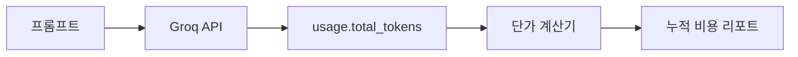

# LLM 비용 추적과 최적화

## 이 글에서 답할 질문
- 토큰 사용량을 호출별로 어떻게 누적해야 할까요?
- 단가가 단순할 때 비용 계산 코드는 어디까지 추상화하면 충분할까요?
- 같은 프롬프트를 여러 번 호출했을 때 어떤 숫자를 먼저 봐야 절감 포인트가 보일까요?

> 비용 추적은 회계가 아니라 피드백 루프입니다. 호출 한 건이 얼마였는지 알아야 캐시, 프롬프트 압축, 모델 라우팅이 의미를 가집니다.

## 큰 그림


## 왜 이 레이어가 필요한가
비용은 LLM 기능이 성공할수록 더 중요해지는 운영 지표입니다. 그래서 초기에 계산식을 코드로 박아 두는 편이 낫습니다.

LLM 비용은 대부분 작게 시작해서 갑자기 커집니다. 개발 단계에서는 몇 원 수준이라 무시되지만, 배치 작업이나 반복 질문이 붙는 순간 토큰 누적량이 먼저 폭발합니다.

예제 파일: `/root/Github/llm-apps-ops-101/ko/02-cost-tracking/main.py`

## 최소 실행 예제
```python
import json
import os
from dataclasses import asdict, dataclass

from groq import Groq

MODEL = "llama-3.1-8b-instant"
PRICE_PER_MILLION_TOKENS = 0.05

@dataclass
class CostRecord:
    prompt: str
    prompt_tokens: int
    completion_tokens: int
    total_tokens: int
    cost_usd: float

def estimate_cost(total_tokens: int) -> float:
    return round((total_tokens / 1_000_000) * PRICE_PER_MILLION_TOKENS, 8)

def run_prompt(client: Groq, prompt: str) -> CostRecord:
    response = client.chat.completions.create(
        model=MODEL,
        temperature=0,
        messages=[
            {"role": "system", "content": "You are a concise Python assistant."},
            {"role": "user", "content": prompt},
        ],
    )
    usage = response.usage
    if usage is None:
        raise RuntimeError("usage metadata missing from Groq response")
    return CostRecord(
        prompt=prompt,
        prompt_tokens=usage.prompt_tokens,
        completion_tokens=usage.completion_tokens,
        total_tokens=usage.total_tokens,
        cost_usd=estimate_cost(usage.total_tokens),
    )

def main() -> None:
    client = Groq(api_key=os.environ["GROQ_API_KEY"])
    prompts = [
        "Summarize Python decorators in one sentence.",
        "Summarize Python decorators in one sentence.",
        "Summarize asyncio.gather in one sentence.",
    ]
    records = [run_prompt(client, prompt) for prompt in prompts]
    report = {
        "price_per_million_tokens": PRICE_PER_MILLION_TOKENS,
        "total_calls": len(records),
        "total_tokens": sum(record.total_tokens for record in records),
        "total_cost_usd": round(sum(record.cost_usd for record in records), 8),
        "records": [asdict(record) for record in records],
    }
    print(json.dumps(report, indent=2, ensure_ascii=False))

if __name__ == "__main__":
    main()
```

## 이 코드에서 봐야 할 것
- `PRICE_PER_MILLION_TOKENS`를 상수로 두면 공급자나 플랜이 바뀌어도 계산식은 유지됩니다.
- 호출별 `CostRecord`를 남겨 두면 어떤 프롬프트가 비싼지 다시 계산하지 않아도 됩니다.
- 동일 프롬프트 두 번 호출을 일부러 넣어 두면 캐시 전후 비교 실험의 기준점이 생깁니다.

## 실무에서 헷갈리는 지점
- 입력 토큰과 출력 토큰 단가가 다른 모델도 많습니다. 예제가 단순하더라도 분리 가능한 구조를 염두에 두는 편이 좋습니다.
- 누적 비용만 보면 이상 징후를 놓칩니다. 호출 수, 평균 토큰, 최댓값을 같이 봐야 합니다.
- 비용 최적화는 품질 저하와 함께 오기 쉽기 때문에 다음 장의 평가 레이어와 붙여서 봐야 합니다.

## 체크리스트
- [ ] 호출별 total_tokens를 저장한다
- [ ] 단가 상수를 코드 한 곳에서 관리한다
- [ ] 누적 비용과 호출별 비용을 함께 출력한다
- [ ] 반복 프롬프트를 분리해서 캐시 후보를 찾는다

## 정리
비용을 줄이려면 먼저 비용이 어디서 생기는지 보여야 합니다. 그 출발점이 호출별 토큰 기록입니다.

<!-- blog-only:start -->
다음 글: [LLM 출력 품질 평가](./03-evaluation.md)
<!-- blog-only:end -->

<!-- toc:begin -->
## 시리즈 목차

- [LLM 앱 모니터링과 로깅](./01-monitoring-and-logging.md)
- **LLM 비용 추적과 최적화 (현재 글)**
- LLM 출력 품질 평가 (예정)
- LLM 앱 보안 (예정)
- LLM 앱 배포 전략 (예정)
- LLM 앱 운영 완성 (예정)

<!-- toc:end -->

---

## 참고 자료

- [Groq pricing](https://groq.com/pricing/)
- [OpenAI pricing patterns](https://openai.com/api/pricing/)
- [Anthropic API pricing](https://www.anthropic.com/pricing#api)

Tags: LLMOps, Observability, Python, LLM
