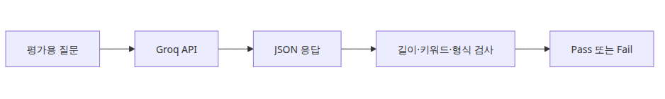

# LLM 출력 품질 평가

## 이 글에서 답할 질문
- 모델 응답이 길이 제한을 지켰는지 자동으로 어떻게 확인할까요?
- 핵심 키워드 포함 여부를 품질 게이트로 쓰려면 어떤 구조가 단순할까요?
- 형식 검사를 JSON 파싱 수준에서 끝낼지, 스키마 검증까지 갈지 어떻게 판단할까요?

> 평가 자동화의 첫 단계는 의미를 완벽히 이해하는 심판을 만드는 것이 아니라, 명확하게 실패한 응답을 빠르게 걸러내는 체를 만드는 것입니다.

## 큰 그림

## 왜 이 레이어가 필요한가
자동 평가는 모델을 심판으로 쓰기 전에, 기계적으로 실패를 걸러내는 규칙층부터 만드는 편이 실용적입니다.

실무에서는 모든 응답을 사람이 읽을 수 없습니다. 그래서 처음부터 완벽한 semantic judge를 만들기보다, 길이 초과·키워드 누락·형식 오류 같은 기계적으로 잡히는 실패를 먼저 막는 편이 훨씬 효율적입니다.

예제 파일: `/root/Github/llm-apps-ops-101/ko/03-evaluation/main.py`

## 최소 실행 예제
```python
import json
import os
from dataclasses import asdict, dataclass

from groq import Groq

MODEL = "llama-3.1-8b-instant"

@dataclass
class EvalResult:
    passed: bool
    length_ok: bool
    keywords_ok: bool
    format_ok: bool
    missing_keywords: list[str]
    answer_length: int

def ask_for_json(client: Groq, topic: str) -> str:
    response = client.chat.completions.create(
        model=MODEL,
        temperature=0,
        messages=[
            {
                "role": "system",
                "content": (
                    "Return JSON only with keys 'answer' and 'keywords'. "
                    "The answer must be concise and technical."
                ),
            },
            {
                "role": "user",
                "content": f"Explain {topic} in JSON. Include one short answer and a keyword list.",
            },
        ],
        response_format={"type": "json_object"},
    )
    return response.choices[0].message.content or "{}"

def evaluate(text: str, expected_keywords: list[str]) -> EvalResult:
    try:
        payload = json.loads(text)
        answer = payload["answer"]
        keywords = payload["keywords"]
        format_ok = isinstance(answer, str) and isinstance(keywords, list)
    except Exception:
        return EvalResult(False, False, False, False, expected_keywords, 0)

    normalized_answer = answer.lower()
    normalized_keywords = {str(item).lower() for item in keywords}
    missing = [
        keyword
        for keyword in expected_keywords
        if keyword.lower() not in normalized_answer and keyword.lower() not in normalized_keywords
    ]
    length_ok = 60 <= len(answer) <= 280
    keywords_ok = not missing
    format_ok = format_ok
    return EvalResult(
        passed=length_ok and keywords_ok and format_ok,
        length_ok=length_ok,
        keywords_ok=keywords_ok,
        format_ok=format_ok,
        missing_keywords=missing,
        answer_length=len(answer),
    )

def main() -> None:
    client = Groq(api_key=os.environ["GROQ_API_KEY"])
    raw = ask_for_json(client, "Python's GIL")
    result = evaluate(raw, ["CPython", "thread", "lock"])
    print(json.dumps({"raw": json.loads(raw), "evaluation": asdict(result)}, indent=2, ensure_ascii=False))

if __name__ == "__main__":
    main()
```

~~~
출력 결과
{
  "raw": {
    "answer": "The Global Interpreter Lock (GIL) is a mechanism in CPython that prevents multiple native threads from executing Python bytecodes at once.",
    "keywords": [
      "Global Interpreter Lock",
      "GIL",
      "CPython",
      "threading",
      "concurrency",
      "parallelism"
    ]
  },
  "evaluation": {
    "passed": true,
    "length_ok": true,
    "keywords_ok": true,
    "format_ok": true,
    "missing_keywords": [],
    "answer_length": 138
  }
}
~~~

## 이 코드에서 봐야 할 것
- `response_format={"type": "json_object"}`로 모델 출력 형태를 먼저 좁혀 두면 검사기가 단순해집니다.
- 평가 함수가 `missing_keywords`를 반환하면 fail 이유를 바로 대시보드에 올릴 수 있습니다.
- 길이 기준을 너무 빡빡하게 잡으면 좋은 응답도 버려집니다. 제품 문맥에 맞는 범위를 직접 정해야 합니다.

## 실무에서 헷갈리는 지점
- 형식 검사가 통과했다고 품질이 좋은 것은 아닙니다. 반대로 형식 실패는 거의 항상 운영 실패입니다.
- 키워드 기반 평가는 도메인 용어가 분명할 때만 강력합니다. 창의적 글쓰기에는 맞지 않습니다.
- LLM-as-judge를 나중에 붙이더라도, 규칙 기반 평가층은 여전히 값싼 1차 방어선으로 남습니다.

## 체크리스트
- [ ] 모델에게 JSON only를 강제한다
- [ ] 길이 기준을 숫자로 명시한다
- [ ] expected_keywords를 테스트 케이스마다 정의한다
- [ ] 실패 시 missing_keywords를 함께 기록한다

## 정리
품질 평가는 거창한 점수 체계보다도, 명확한 실패를 얼마나 빨리 발견하느냐에서 운영 가치가 생깁니다.

<!-- toc:begin -->
## 시리즈 목차

- [LLM 앱 모니터링과 로깅](./01-monitoring-and-logging.md)
- [LLM 비용 추적과 최적화](./02-cost-tracking.md)
- **LLM 출력 품질 평가 (현재 글)**
- LLM 앱 보안 (예정)
- LLM 앱 배포 전략 (예정)
- LLM 앱 운영 완성 (예정)

<!-- toc:end -->

---

## 참고 자료

- [Structured Outputs guide](https://platform.openai.com/docs/guides/structured-outputs)
- [JSON Schema](https://json-schema.org/)
- [G-Eval paper](https://arxiv.org/abs/2303.16634)

Tags: LLMOps, Observability, Python, LLM
