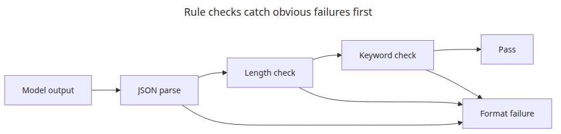
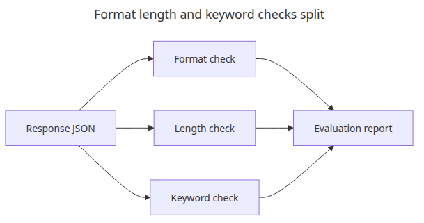
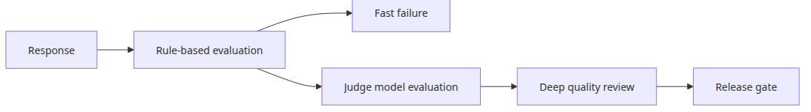

# LLM 출력 품질 평가

트래픽이 늘어나기 시작하면 누구도 모든 모델 응답을 손으로 읽어 볼 수 없습니다. 이 글은 LLM Apps Ops 101 시리즈의 세 번째 글입니다. 여기서는 완벽한 의미 판정기를 먼저 만들려 하기보다, 길이·키워드·형식 같은 신호로 명백히 잘못된 답변을 빠르고 일관되게 걸러내는 최소 평가 레이어를 구성해 보겠습니다.

운영 초기에 정말 필요한 것은 “아주 똑똑한 평가기”보다 “싼 비용으로 자주 돌릴 수 있는 규칙층”입니다. 잘못된 JSON, 핵심 키워드 누락, 지나치게 짧거나 긴 답변은 모델 심판을 붙이기 전에도 충분히 자동으로 막을 수 있습니다.

## 이 글에서 다룰 문제

- 모델 출력에 최대 길이 검사를 어떻게 자동화하는가?
- 키워드 포함 여부가 언제 유용한 품질 게이트가 되는가?
- 스키마 검증을 붙이기 전에 형식 검증은 어디까지 해야 하는가?

> 처음에 필요한 평가 레이어는 완벽한 의미 판단기가 아닙니다. 명백히 나쁜 답변을 빠르고 일관되게 걸러내는 값싼 필터입니다.

## 큰 그림


*LLM 출력 품질 평가 파이프라인*

## 왜 이 레이어가 중요한가



*규칙 기반 평가가 명확한 실패를 거르는 흐름*

평가 자동화는 처음부터 거대한 시스템일 필요가 없습니다. 오히려 기계적으로 실패를 잡아내는 규칙층부터 만드는 편이 훨씬 실용적입니다.

실무에서는 모든 응답을 사람이 읽을 수 없습니다. 그래서 처음부터 완벽한 semantic judge를 만들려 하기보다, 길이 초과, 키워드 누락, 형식 오류처럼 명백한 실패를 먼저 차단하는 편이 훨씬 효율적입니다. 이런 규칙은 설명하기 쉽고, 빠르며, 나중에 회귀 테스트에도 그대로 재사용하기 좋습니다.

이 관점이 중요한 이유는 평가를 운영 도구로 만들기 위해서입니다. 사람이 봐야만 알 수 있는 기준만 쌓아 두면 자동화가 느려지고 비용도 커집니다. 반대로 규칙 기반 1차 필터가 있으면, 더 무거운 평가기는 정말 필요한 경우에만 뒤에 붙이면 됩니다.

예제 파일: `/root/Github/llm-apps-ops-101/en/03-evaluation/main.py`

## 최소 실행 예제

```python
import json
import os
from dataclasses import asdict, dataclass

from groq import Groq

MODEL = "llama-3.1-8b-instant"

@dataclass
class EvalResult:
    passed: bool
    length_ok: bool
    keywords_ok: bool
    format_ok: bool
    missing_keywords: list[str]
    answer_length: int

def ask_for_json(client: Groq, topic: str) -> str:
    response = client.chat.completions.create(
        model=MODEL,
        temperature=0,
        messages=[
            {
                "role": "system",
                "content": (
                    "Return JSON only with keys 'answer' and 'keywords'. "
                    "The answer must be concise and technical."
                ),
            },
            {
                "role": "user",
                "content": f"Explain {topic} in JSON. Include one short answer and a keyword list.",
            },
        ],
        response_format={"type": "json_object"},
    )
    return response.choices[0].message.content or "{}"

def evaluate(text: str, expected_keywords: list[str]) -> EvalResult:
    try:
        payload = json.loads(text)
        answer = payload["answer"]
        keywords = payload["keywords"]
        format_ok = isinstance(answer, str) and isinstance(keywords, list)
    except Exception:
        return EvalResult(False, False, False, False, expected_keywords, 0)

    normalized_answer = answer.lower()
    normalized_keywords = {str(item).lower() for item in keywords}
    missing = [
        keyword
        for keyword in expected_keywords
        if keyword.lower() not in normalized_answer and keyword.lower() not in normalized_keywords
    ]
    length_ok = 60 <= len(answer) <= 280
    keywords_ok = not missing
    format_ok = format_ok
    return EvalResult(
        passed=length_ok and keywords_ok and format_ok,
        length_ok=length_ok,
        keywords_ok=keywords_ok,
        format_ok=format_ok,
        missing_keywords=missing,
        answer_length=len(answer),
    )

def main() -> None:
    client = Groq(api_key=os.environ["GROQ_API_KEY"])
    raw = ask_for_json(client, "Python's GIL")
    result = evaluate(raw, ["CPython", "thread", "lock"])
    print(json.dumps({"raw": json.loads(raw), "evaluation": asdict(result)}, indent=2, ensure_ascii=False))

if __name__ == "__main__":
    main()
```

## 이 코드에서 먼저 볼 점



*형식·길이·키워드 검사가 분리된 구조*

- JSON 출력 강제는 평가 이전에 문제의 형태부터 좁혀 줍니다.
- `missing_keywords`를 반환하면 실패 이유가 모호하지 않고 바로 수정 지점으로 이어집니다.
- 길이 기준은 추상적인 모범 사례가 아니라 제품이 실제로 기대하는 답변 길이에 맞아야 합니다.

이 코드가 보여 주는 핵심은 평가를 한 번에 뭉뚱그리지 않는다는 점입니다. 먼저 JSON 파싱이 되는지 보고, 그다음 길이를 보고, 마지막으로 핵심 용어가 빠졌는지를 봅니다. 이렇게 나누어 두면 실패했을 때도 “그냥 품질이 낮다”가 아니라 “형식 오류인지, 길이 문제인지, 키워드 누락인지”를 바로 분류할 수 있습니다.

## 어디서 자주 헷갈릴까요?



*규칙층 위에 judge 모델이 올라가는 구조*

- 형식 검사를 통과했다고 해서 곧바로 좋은 답변인 것은 아닙니다. 하지만 형식 검사를 실패한 답변은 대체로 바로 사용하기 어렵습니다.
- 키워드 검사는 창의적 글쓰기보다, 반드시 들어가야 할 용어가 있는 도메인에서 더 유용합니다.
- 나중에 LLM-as-judge를 붙이더라도, 규칙 기반 검사는 값싼 1차 가드레일로 계속 남습니다.

특히 많이 생기는 착각은 “정교한 의미 평가가 없으면 평가가 아니다”라는 생각입니다. 실제 운영에서는 그 반대인 경우가 많습니다. 형식이 틀렸거나 핵심 용어가 빠진 응답은 이미 충분히 실패입니다. 이런 명백한 실패를 값싸게 걸러내는 것만으로도 운영 품질은 크게 좋아집니다.

## 체크리스트

- [ ] JSON-only 출력을 강제한다
- [ ] 숫자로 된 길이 기준을 정한다
- [ ] 테스트 케이스별 `expected_keywords`를 정의한다
- [ ] 실패 시 누락 키워드를 로그에 남긴다

## 정리

평가가 운영적으로 유용해지는 시점은, 사람이 보기 전에 명백한 실수를 빠르게 실패시키기 시작할 때입니다. 그 위에 더 무거운 judge 모델이나 배치 평가를 쌓는 것은 그다음 단계입니다.

<!-- toc:begin -->
## 이 시리즈의 글

- [LLM 앱 모니터링과 로깅](./01-monitoring-and-logging.md)
- [LLM 비용 추적과 최적화](./02-cost-tracking.md)
- **LLM 출력 품질 평가 (현재 글)**
- LLM 앱 보안 (예정)
- LLM 앱 배포 전략 (예정)
- LLM 앱 운영 완성 (예정)

<!-- toc:end -->

---

## 참고 자료

- [Structured Outputs guide](https://platform.openai.com/docs/guides/structured-outputs)
- [JSON Schema](https://json-schema.org/)
- [G-Eval paper](https://arxiv.org/abs/2303.16634)

Tags: LLMOps, Observability, Python, LLM
