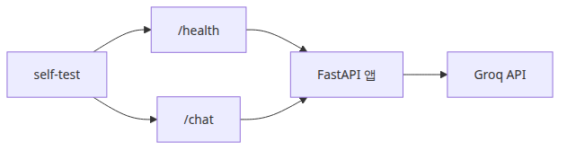
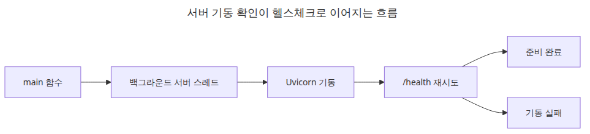
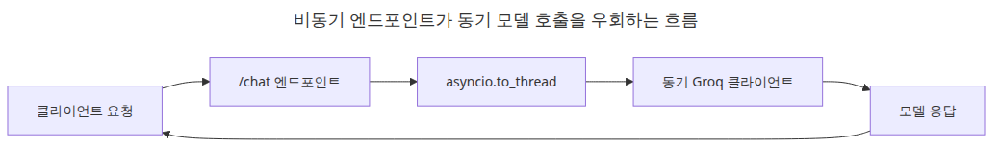

# LLM 앱 배포 전략

## 이 글에서 답할 질문
- FastAPI 기반 LLM 엔드포인트에서 health check는 어디까지 확인하면 충분할까요?
- 동기 Groq 클라이언트를 async 엔드포인트에서 안전하게 호출하려면 어떻게 감싸야 할까요?
- 로컬 self-test로 서버 기동 여부를 자동 확인하려면 어떤 흐름이 가장 단순할까요?

> 배포 가능한 예제의 기준은 코드가 예쁘게 보이는지가 아니라, 서버를 띄우고 헬스체크와 실제 채팅 요청을 같은 스크립트에서 검증할 수 있느냐입니다.

## 큰 그림

## 왜 이 레이어가 필요한가

서버가 실제로 뜨고 응답하는지 스스로 증명하는 self-test가 있어야 배포 예제가 완성됩니다.

배포 글에서 가장 흔한 실수는 서버 코드만 보여 주고 실제로 떠 있는지 확인하지 않는 것입니다. 운영 준비가 된 예제라면 최소한 health check와 대표 요청 한 건은 자동으로 검증해야 합니다.

예제 파일: `/root/Github/llm-apps-ops-101/ko/05-deployment/main.py`

## 최소 실행 예제
```python
import asyncio
import os
import threading
import time
from contextlib import asynccontextmanager

import httpx
import uvicorn
from fastapi import FastAPI
from pydantic import BaseModel, Field
from groq import Groq

MODEL = "llama-3.1-8b-instant"

class ChatRequest(BaseModel):
    message: str = Field(min_length=1, max_length=4000)

class ChatResponse(BaseModel):
    response: str
    model: str

def call_model(client: Groq, message: str) -> str:
    response = client.chat.completions.create(
        model=MODEL,
        temperature=0,
        messages=[
            {"role": "system", "content": "You are a concise Python assistant."},
            {"role": "user", "content": message},
        ],
    )
    return response.choices[0].message.content or ""

@asynccontextmanager
async def lifespan(app: FastAPI):
    app.state.client = Groq(api_key=os.environ["GROQ_API_KEY"])
    yield

app = FastAPI(title="llm-deployment-demo", lifespan=lifespan)

class ThreadSafeServer(uvicorn.Server):
    def install_signal_handlers(self) -> None:
        return None

@app.get("/health")
async def health() -> dict:
    return {"status": "ok", "model": MODEL}

@app.post("/chat", response_model=ChatResponse)
async def chat(request: ChatRequest) -> ChatResponse:
    answer = await asyncio.to_thread(call_model, app.state.client, request.message)
    return ChatResponse(response=answer, model=MODEL)

def run_server(server: uvicorn.Server) -> None:
    server.run()

def main() -> None:
    config = uvicorn.Config(app, host="127.0.0.1", port=8015, log_level="warning")
    server = ThreadSafeServer(config)
    thread = threading.Thread(target=run_server, args=(server,), daemon=True)
    thread.start()

    for _ in range(40):
        try:
            health = httpx.get("http://127.0.0.1:8015/health", timeout=2.0)
            if health.status_code == 200:
                break
        except Exception:
            time.sleep(0.25)
    else:
        raise RuntimeError("server did not start")

    print("HEALTH:", health.json())
    response = httpx.post(
        "http://127.0.0.1:8015/chat",
        json={"message": "Explain Python async functions in two sentences."},
        timeout=30.0,
    )
    print("CHAT:", response.json())

    server.should_exit = True
    thread.join(timeout=10)
    if thread.is_alive():
        raise RuntimeError("server did not stop cleanly")

if __name__ == "__main__":
    main()
```

## 이 코드에서 봐야 할 것

- `asyncio.to_thread`로 동기 Groq 호출을 분리해 FastAPI 이벤트 루프를 막지 않습니다.
- `uvicorn.Server`를 코드에서 직접 띄우면 문서의 실행 예제와 검증 코드가 하나로 합쳐집니다.
- self-test가 `/health`와 `/chat`를 모두 치면 단순 기동 확인을 넘어 실제 의존성 경로까지 점검할 수 있습니다.

## 실무에서 헷갈리는 지점

- 헬스체크는 모델 품질을 보장하지 않습니다. 이 엔드포인트는 프로세스와 기본 의존성 상태만 확인합니다.
- 비동기 프레임워크를 쓴다고 외부 SDK 호출까지 자동으로 비동기가 되는 것은 아닙니다.
- 로컬 self-test가 통과해도 배포 환경에서는 네트워크 제한, 시크릿 주입, 타임아웃 값을 다시 확인해야 합니다.

## 체크리스트
- [ ] 서버 시작 후 /health를 자동 호출한다
- [ ] 실제 /chat 요청 한 건을 보내 응답을 확인한다
- [ ] 이벤트 루프를 막는 동기 호출을 to_thread로 분리한다
- [ ] 종료 시 서버 스레드가 정상 종료되는지 확인한다

## 정리
배포 예제는 서버 코드보다 self-test가 더 중요합니다. 스스로 기동과 요청을 증명하지 못하면 운영 문서로 쓰기 어렵습니다.

<!-- toc:begin -->
## 시리즈 목차

- [LLM 앱 모니터링과 로깅](./01-monitoring-and-logging.md)
- [LLM 비용 추적과 최적화](./02-cost-tracking.md)
- [LLM 출력 품질 평가](./03-evaluation.md)
- [LLM 앱 보안](./04-security.md)
- **LLM 앱 배포 전략 (현재 글)**
- LLM 앱 운영 완성 (예정)

<!-- toc:end -->

---

## 참고 자료

- [FastAPI](https://fastapi.tiangolo.com/)
- [Uvicorn settings](https://www.uvicorn.org/settings/)
- [HTTPX quickstart](https://www.python-httpx.org/quickstart/)

Tags: LLMOps, Observability, Python, LLM
