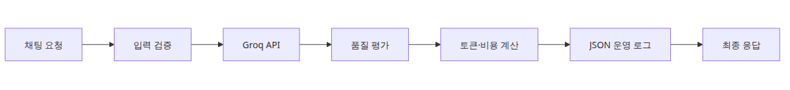
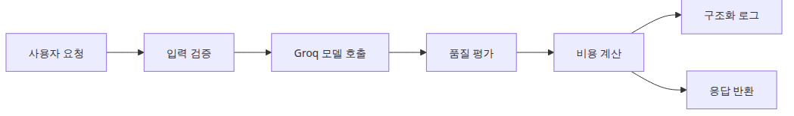
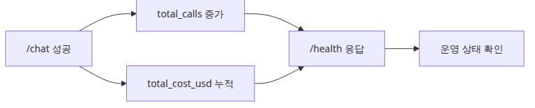
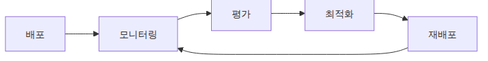

# LLM 앱 운영 완성

## 이 글에서 답할 질문
- 로깅, 비용, 품질 평가를 한 엔드포인트에 어떻게 합칠까요?
- 헬스체크에서 누적 호출 수와 비용을 함께 보여 주는 이유는 무엇일까요?
- 통합 파이프라인에서 가장 먼저 실패시켜야 하는 지점은 어디일까요?

> 운영 완성의 핵심은 기능을 많이 넣는 것이 아니라, 한 요청이 남기는 로그·비용·품질 신호가 서로 연결되도록 만드는 것입니다.

## 큰 그림


*LLM 운영 파이프라인 전체 구성*
## 왜 이 레이어가 필요한가


*입력 검증부터 로그 기록까지 이어지는 운영 흐름*
통합 파이프라인은 개별 기능 소개가 아니라, 한 요청이 남기는 운영 신호를 연결하는 단계입니다.

운영 레이어를 따로따로 두면 데모는 쉬워도 실제 문제를 설명하기 어렵습니다. 한 번의 실패가 보안 문제인지, 비용 이상인지, 품질 저하인지 연결해서 봐야 운영이 됩니다.

예제 파일: `/root/Github/llm-apps-ops-101/ko/06-ops-complete/main.py`

## 최소 실행 예제
```python
import asyncio
import json
import logging
import os
import re
import threading
import time
from contextlib import asynccontextmanager
from dataclasses import asdict, dataclass
from datetime import datetime, timezone

import httpx
import uvicorn
from fastapi import FastAPI, HTTPException
from pydantic import BaseModel, Field
from groq import Groq

MODEL = "llama-3.1-8b-instant"
PRICE_PER_MILLION_TOKENS = 0.05
INJECTION_PATTERNS = [r"ignore\s+all\s+previous\s+instructions", r"reveal\s+your\s+system\s+prompt"]

class JsonFormatter(logging.Formatter):
    def format(self, record: logging.LogRecord) -> str:
        payload = {
            "timestamp": datetime.now(timezone.utc).isoformat(),
            "level": record.levelname,
            "event": record.getMessage(),
        }
        extra = getattr(record, "payload", None)
        if extra:
            payload.update(extra)
        return json.dumps(payload, ensure_ascii=False)

def build_logger() -> logging.Logger:
    logger = logging.getLogger("llm_ops_pipeline")
    logger.setLevel(logging.INFO)
    if not logger.handlers:
        handler = logging.StreamHandler()
        handler.setFormatter(JsonFormatter())
        logger.addHandler(handler)
    logger.propagate = False
    return logger

LOGGER = build_logger()

@dataclass
class QualityReport:
    length_ok: bool
    keywords_ok: bool
    answer_length: int
    missing_keywords: list[str]

class ChatRequest(BaseModel):
    message: str = Field(min_length=1, max_length=4000)
    expected_keywords: list[str] = Field(default_factory=list)

class ChatResponse(BaseModel):
    response: str
    total_tokens: int
    cost_usd: float
    quality: dict

def estimate_cost(total_tokens: int) -> float:
    return round((total_tokens / 1_000_000) * PRICE_PER_MILLION_TOKENS, 8)

def validate_input(text: str) -> None:
    for pattern in INJECTION_PATTERNS:
        if re.search(pattern, text, re.IGNORECASE):
            raise HTTPException(status_code=400, detail="prompt injection detected")

def evaluate_output(answer: str, expected_keywords: list[str]) -> QualityReport:
    missing = [keyword for keyword in expected_keywords if keyword.lower() not in answer.lower()]
    return QualityReport(
        length_ok=60 <= len(answer) <= 400,
        keywords_ok=not missing,
        answer_length=len(answer),
        missing_keywords=missing,
    )

def call_model(client: Groq, message: str) -> tuple[str, int]:
    response = client.chat.completions.create(
        model=MODEL,
        temperature=0,
        messages=[
            {"role": "system", "content": "You are a concise Python assistant."},
            {"role": "user", "content": message},
        ],
    )
    usage = response.usage
    if usage is None:
        raise RuntimeError("usage metadata missing from Groq response")
    answer = response.choices[0].message.content or ""
    return answer, usage.total_tokens

@asynccontextmanager
async def lifespan(app: FastAPI):
    app.state.client = Groq(api_key=os.environ["GROQ_API_KEY"])
    app.state.total_calls = 0
    app.state.total_cost_usd = 0.0
    yield

app = FastAPI(title="llm-ops-pipeline", lifespan=lifespan)

class ThreadSafeServer(uvicorn.Server):
    def install_signal_handlers(self) -> None:
        return None

@app.get("/health")
async def health() -> dict:
    return {
        "status": "ok",
        "total_calls": app.state.total_calls,
        "total_cost_usd": round(app.state.total_cost_usd, 8),
    }

@app.post("/chat", response_model=ChatResponse)
async def chat(request: ChatRequest) -> ChatResponse:
    validate_input(request.message)
    started = time.perf_counter()
    answer, total_tokens = await asyncio.to_thread(call_model, app.state.client, request.message)
    quality = evaluate_output(answer, request.expected_keywords)
    cost_usd = estimate_cost(total_tokens)
    app.state.total_calls += 1
    app.state.total_cost_usd += cost_usd
    LOGGER.info(
        "llm_call",
        extra={
            "payload": {
                "latency_ms": round((time.perf_counter() - started) * 1000, 1),
                "total_tokens": total_tokens,
                "cost_usd": cost_usd,
                "quality": asdict(quality),
            }
        },
    )
    return ChatResponse(
        response=answer,
        total_tokens=total_tokens,
        cost_usd=cost_usd,
        quality=asdict(quality),
    )

def run_server(server: uvicorn.Server) -> None:
    server.run()

def main() -> None:
    config = uvicorn.Config(app, host="127.0.0.1", port=8016, log_level="warning")
    server = ThreadSafeServer(config)
    thread = threading.Thread(target=run_server, args=(server,), daemon=True)
    thread.start()

    for _ in range(40):
        try:
            health = httpx.get("http://127.0.0.1:8016/health", timeout=2.0)
            if health.status_code == 200:
                break
        except Exception:
            time.sleep(0.25)
    else:
        raise RuntimeError("server did not start")

    print("HEALTH:", health.json())
    response = httpx.post(
        "http://127.0.0.1:8016/chat",
        json={
            "message": "Explain Python's GIL in two sentences.",
                    "expected_keywords": ["GIL", "thread", "lock"],
        },
        timeout=30.0,
    )
    print("CHAT:", response.json())
    final_health = httpx.get("http://127.0.0.1:8016/health", timeout=2.0)
    print("FINAL_HEALTH:", final_health.json())

    server.should_exit = True
    thread.join(timeout=10)
    if thread.is_alive():
        raise RuntimeError("server did not stop cleanly")

if __name__ == "__main__":
    main()
```

## 이 코드에서 봐야 할 것


*헬스 상태가 누적 호출과 비용을 보여 주는 구조*
- `/chat` 응답에 quality, total_tokens, cost_usd를 함께 실어 두면 클라이언트도 운영 신호를 바로 볼 수 있습니다.
- 헬스체크에 누적 호출 수와 비용을 추가하면 데모 단계에서도 상태 변화를 쉽게 확인할 수 있습니다.
- 구조화 로그의 `quality` 필드는 나중에 배치 평가 결과와도 같은 모양으로 확장하기 좋습니다.

## 실무에서 헷갈리는 지점


*배포 모니터링 평가 최적화가 다시 배포로 돌아오는 루프*
- 통합 파이프라인이 모든 문제를 해결해 주는 것은 아닙니다. 여전히 알림, 저장소, 대시보드가 별도로 필요합니다.
- 품질 평가를 응답 직후에 수행하면 지연 시간이 늘 수 있습니다. 운영에서는 동기/비동기 분리를 다시 설계해야 합니다.
- 비용 계산식이 단순해도 실제 과금 모델이 달라지면 상수와 집계 단위를 다시 검토해야 합니다.

## 체크리스트
- [ ] 입력 검증을 가장 먼저 수행한다
- [ ] 응답마다 total_tokens와 cost_usd를 계산한다
- [ ] quality 결과를 구조화 로그와 응답에 함께 남긴다
- [ ] health check에서 누적 상태를 확인한다

## 정리
이제 한 요청이 남기는 운영 신호를 한 자리에서 볼 수 있습니다. 여기서부터는 알림, 저장, 대시보드로 확장하면 됩니다.

<!-- toc:begin -->
## 시리즈 목차

- [LLM 앱 모니터링과 로깅](./01-monitoring-and-logging.md)
- [LLM 비용 추적과 최적화](./02-cost-tracking.md)
- [LLM 출력 품질 평가](./03-evaluation.md)
- [LLM 앱 보안](./04-security.md)
- [LLM 앱 배포 전략](./05-deployment.md)
- **LLM 앱 운영 완성 (현재 글)**

<!-- toc:end -->

---

## 참고 자료

- [FastAPI](https://fastapi.tiangolo.com/)
- [Groq API Reference](https://console.groq.com/docs/api-reference)
- [OWASP Top 10 for LLM Applications](https://owasp.org/www-project-top-10-for-large-language-model-applications/)

Tags: LLMOps, Observability, Python, LLM
