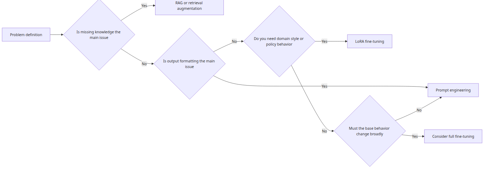
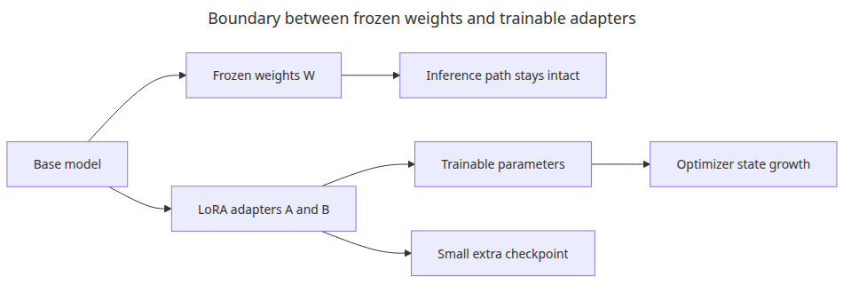
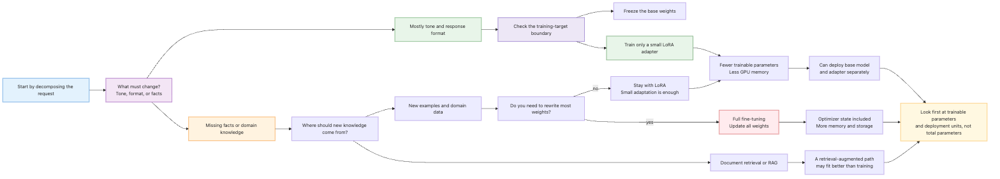
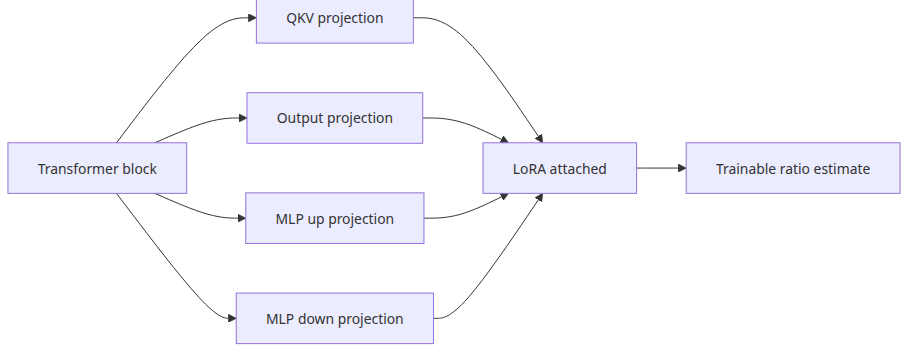
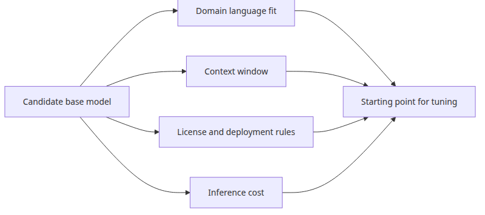

# LLM Fine-tuning Primer

Fine-tuning looks like a training task, but the real first step is deciding what changes, what stays fixed, and how those choices interact. This article frames that decision around three variables so the rest of the series has a stable mental model.

This is the first post in the LLM Fine-tuning 101 series.

## Questions this post answers



*Questions this post answers*

- How can we calculate why LoRA is so much lighter than full fine-tuning?
- How do we tell apart problems that need fine-tuning from those a prompt can solve?
- What can we verify in post 1 without a GPU?
- Does LoRA shrink model size, or does it shrink trainable parameter count?

> If full fine-tuning is rebuilding an entire building, LoRA is bolting reinforcement onto a few load-bearing columns.

Example code: [github.com/yeongseon-books/llm-finetuning-101](https://github.com/yeongseon-books/llm-finetuning-101/tree/main/en/01-intro)

## Why this matters

LLM fine-tuning does not have to start with a GPU lab. If we throw a large model at the problem first, learning rate, dataset format, and adapter rank all wobble at once, and we lose the ability to tell which knob actually moved the result. The point of post 1 is to defer the model run and align our **arithmetic intuition** first.

Understanding numerically why LoRA is cheap and fast, how few parameters it really trains, and when this trade-off is rational keeps the dataset, training, evaluation, and serving posts that follow from getting tangled. The ratio we compute here once (≈ 1.5% of total linear parameters for a LoRA adapter) reappears in post 3 when we choose `LoraConfig(r=8)`, in post 4 when we estimate training time, and in post 6 when we ship adapter weights independently of the base model.

## Mental model

A fine-tuning experiment is a decision about how to slice three variables:

```text
                  ┌───────────────────────────────────────┐
                  │ ① What are we changing? (target params)│
                  ├───────────────────────────────────────┤
one fine-tune  =  │ ② With what? (dataset)                 │
                  ├───────────────────────────────────────┤
                  │ ③ How? (optimizer)                     │
                  └───────────────────────────────────────┘
```

Full fine-tuning sets ① to "everything," which inflates ② and ③. LoRA narrows ① to "small adapters strapped onto a few linear layers," which simultaneously lightens ② (small datasets work) and ③ (tiny optimizer state). For the same dataset and learning rate, the GPU memory requirement can differ by 10× depending only on how ① is defined.

## Core concepts

| Term | Meaning |
| --- | --- |
| Full fine-tuning | Updates every weight of the base model. With optimizer state, peak memory is 4× model size or more |
| LoRA | Freezes the base weights and trains two low-rank matrices (A, B). Extra parameters are usually 1–3% |
| Rank (r) | LoRA adapter's middle dimension. Larger r increases expressiveness but also trainable parameters linearly |
| Target module | Linear layers where LoRA is injected (`q_proj`, `v_proj`, …) |
| Adapter weight | Small file saved/deployed separately after training. Combined with the base at inference time |

## Before vs. after

**Before** — Asked "GPT-4's answers feel off, do we need to retrain a model?", you cannot give a quick answer. You vaguely recall that full fine-tuning was expensive and that LoRA is supposed to be cheap, and the meeting drags on.

**After** — After post 1 you can put the following on the table:

```
Model size                       124M params (GPT-2 small class)
Full fine-tuning trainable        ≈ 124M (100%)
LoRA(r=8) trainable               ≈ 1.8M (≈ 1.5%)
GPU memory (incl. optimizer)      Full: ~5GB / LoRA: ~1.5GB
Adapter file size                 ~7MB (one per domain)
```

With this table in hand, "we just want to nudge the response tone" branches naturally to LoRA, while "we need to teach new facts" branches to full fine-tuning or RAG.

## What to understand first



*base weights vs trainable boundary in fine-tuning*

The point most easily missed in fine-tuning is **what we choose as the training target**. Full fine-tuning updates every existing weight, so memory and optimizer state both balloon. LoRA freezes the existing weights and adds two low-rank matrices instead. So when discussing cost, look at the **trainable parameter count** separately from the total model parameters.



*What to understand first*

## Step-by-step walkthrough

### Step 1 — Express the transformer shape as a dataclass

```python
from dataclasses import dataclass

@dataclass
class TransformerShape:
    hidden_size: int
    intermediate_size: int
    num_layers: int
```

### Step 2 — Count the linear-layer parameters

```python
def total_linear_params(shape: TransformerShape) -> int:
    return shape.num_layers * (
        4 * shape.hidden_size * shape.hidden_size
        + 2 * shape.hidden_size * shape.intermediate_size
    )
```

We sum the four attention projections (Q, K, V, O) and the two MLP projections (up, down). Embeddings and layer norm are deliberately excluded so the slot LoRA fills into is visible.

### Step 3 — Count the LoRA adapter parameters

```python
def lora_params_per_layer(hidden_size: int, intermediate_size: int, rank: int) -> int:
    attention = 4 * rank * (hidden_size + hidden_size)
    mlp = rank * (hidden_size + intermediate_size) + rank * (intermediate_size + hidden_size)
    return attention + mlp
```

Each LoRA adapter consists of two matrices, `A: (in, r)` and `B: (r, out)`. Their product has the same shape as the original matrix, but trainable parameters drop to `r * (in + out)`. Smaller r yields a larger saving.

### Step 4 — Compare the ratio

```python
shape = TransformerShape(hidden_size=768, intermediate_size=3072, num_layers=12)
rank = 8
base_linear_params = total_linear_params(shape)
lora_params = shape.num_layers * lora_params_per_layer(
    shape.hidden_size, shape.intermediate_size, rank
)
print(base_linear_params, lora_params)
print(f"ratio = {lora_params / base_linear_params:.4%}")
```

You will see a ratio around 1.5%. Try `rank` 16 and 32 to feel how the number scales — that intuition pays off when estimating training time in post 4.

## What to notice in this code



*LoRA's surface area per linear layer measured by the script*

- `hidden_size=768`, `intermediate_size=3072`, `num_layers=12` mimic GPT-2 small.
- The script measures LoRA's surface area against attention/MLP linear layers, not against total model parameters.
- The printed ratio becomes the calibration point in post 3 when picking `LoraConfig(r=8)`.

## Common mistakes



*picking a base model by problem type*

- **Confusing model size with trainable parameters** — LoRA still requires the base model in VRAM at inference time. If the base model itself does not fit, LoRA alone will not help; pair it with quantization (QLoRA).
- **Assuming bigger rank is better** — At rank 64 or 128 trainable parameters can balloon to 10–20% of full fine-tuning while generalization often gets worse. Start from r=8–16.
- **Applying LoRA to every linear layer** — `target_modules=["q_proj", "v_proj"]` is often enough. Including the MLP doubles or triples parameter count.
- **Hoping LoRA rescues bad data** — A small adapter still overfits to bad labels. Post 1's math is a cost story, not a substitute for data quality.
- **Mismatching tokenizer between base and adapter** — An adapter trained on a different base will misalign tokens and produce garbage. Adapter and base are a pair.

## Field notes

- **Write a one-liner decision rule**: "Style change → LoRA, new facts → RAG, domain vocabulary/format → LoRA + good data" and share it with the team.
- **Validate the pipeline with a tiny base first**: prove the loop with GPT-2 small or Phi-2, then move to Llama-3-8B; you will avoid expensive misconfiguration accidents.
- **Version both base and adapter hashes**: log them together. It becomes essential in post 6 when you A/B test adapters by swapping them.
- **Sweep rank in a small range**: `r ∈ {4, 8, 16}` to start. Three 30-minute experiments give more information than one 3-hour run.

## Checklist

- [ ] You can distinguish what LoRA shrinks: model size vs. trainable parameter count.
- [ ] You understand that trainable parameters grow linearly with rank.
- [ ] You ran `python main.py` and saw the parameter calculation execute.
- [ ] You can connect why dataset format (post 2) matters next.
- [ ] You can describe in one sentence each when to use full fine-tuning, LoRA, and RAG.

## Exercises

1. Loop `rank` over {4, 8, 16, 32, 64} and print the ratio table. At what point does the "LoRA is light" claim weaken?
2. Increase only `intermediate_size` to 4096 (others fixed) and recompute. Explain why narrowing LoRA targets to attention makes more sense for MLP-heavy models.
3. Add a switch that restricts `target_modules` to `["q_proj", "v_proj"]`. How does the ratio change? Compare with Hugging Face PEFT's `print_trainable_parameters()` and reconcile any difference.

## Wrap-up · next post

The point of post 1 is to stop treating fine-tuning as a mystical GPU ritual. Just by understanding parameter counting you can explain why LoRA became the default and when full fine-tuning still belongs in the conversation.

Post 2 covers dataset preparation. We compare three formats — instruction, chat, completion — and verify in code why label masking and `eos_token` handling are decisive for training stability.

<!-- toc:begin -->
## In this series

- **LLM Fine-tuning Primer (current)**
- Dataset Preparation and Preprocessing (upcoming)
- Configuring LoRA Adapters (upcoming)
- Training Loop and Hyperparameters (upcoming)
- Model Evaluation (upcoming)
- Model Serving (upcoming)

<!-- toc:end -->

---

## References

- [LoRA paper](https://arxiv.org/abs/2106.09685)
- [Hugging Face PEFT documentation](https://huggingface.co/docs/peft)
- [QLoRA paper](https://arxiv.org/abs/2305.14314)
- [GPT-2 model card](https://huggingface.co/gpt2)

Tags: Fine-tuning, LoRA, LLM, Python
