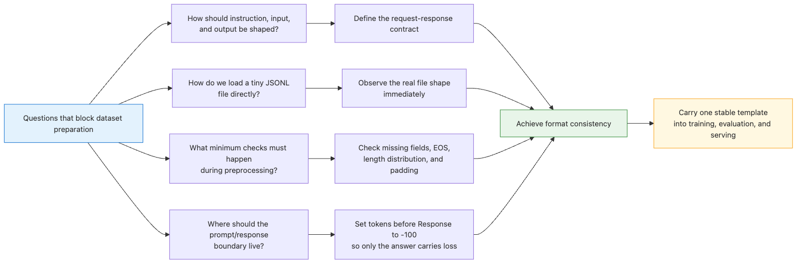
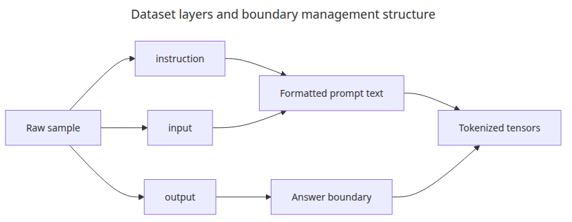
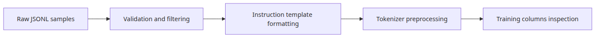
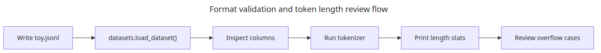
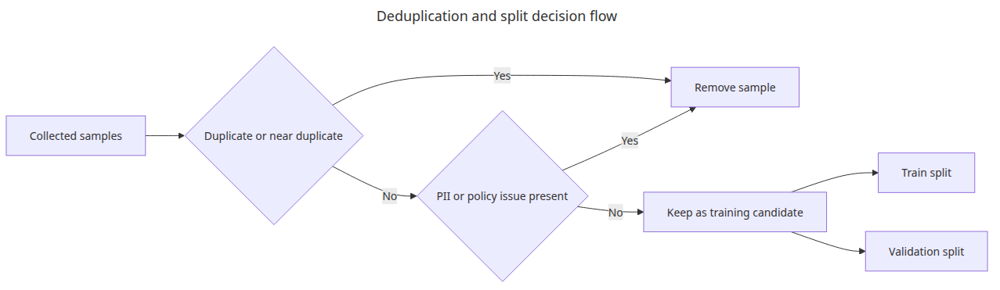

# Dataset Preparation and Preprocessing

## Questions this post answers



- How should we shape the three fields instruction / input / output?
- How do we read a small JSONL file directly with Hugging Face datasets?
- What minimum verification points must we hit during preprocessing?
- Where should the prompt/response boundary live so training stays stable?

> A good fine-tuning dataset is not a pile of sentences but a **request-response contract** the model is asked to imitate, repeatedly.

Example code: [github.com/yeongseon-books/llm-finetuning-101](https://github.com/yeongseon-books/llm-finetuning-101/tree/main/en/02-dataset)

## Why this matters

At the dataset stage, what matters most is not volume but **format consistency**. If it is unclear what counts as input and which span the model should learn as a response, the loss may drop while the answers stay blurry. With the same 1,000 samples a consistent prompt format lets LoRA r=8 succeed; a mixed format may not converge even at r=64 with 5× more data.

Nailing the format in post 2 means the same template flows untouched into the training loop (post 4), evaluation (post 5), and serving (post 6). Skim past it and you get the contradictory situation where loss drops in post 4 but answer quality looks broken in post 5.

## Mental model

Treat the dataset as three layers:

```
┌───────────────────────────────┐
│ Layer 1: Raw samples (JSONL)  │  ← humans read and review here
├───────────────────────────────┤
│ Layer 2: Templated text       │  ← prompt + response as one string
├───────────────────────────────┤
│ Layer 3: Tokenized tensors    │  ← input_ids, attention_mask, labels
└───────────────────────────────┘
```

- **Layer 1** is where humans add, edit, and review. Field names, line breaks, and trailing whitespace must be consistent.
- **Layer 2** is one string per sample, after a model-specific chat template has been applied. Llama-3 and Qwen use different special tokens.
- **Layer 3** is built right before training. The prompt portion of `labels` must be set to -100 so it is excluded from loss.

Separating the three layers lets you diagnose "filtering problems," "token length problems," and "masking problems" independently.

## Core concepts

| Term | Meaning |
| --- | --- |
| Instruction format | `{instruction, input?, output}` shape. Alpaca-style standard |
| Chat format | `[{role, content}, ...]`. Best for multi-turn |
| Completion format | Plain prefix → continuation. Closer to base model pretraining |
| Label masking | Setting prompt tokens to -100 so they do not contribute to loss |
| EOS token | End-of-response signal. Without it the model never learns to stop |

## Before vs. after

**Before** — You collected data, but some rows use `prompt/response`, others `q/a`, others jam everything into a single column. Training runs, but in evaluation answers cut off mid-sentence or repeat the same phrase.

**After** — Every sample passes through the same instruction template and becomes one string:

```
### Instruction:
Explain two ways to reverse a Python list.

### Input:
Include a one-line example.

### Response:
You can use lst[::-1] or lst.reverse().<eos>
```

The prompt prefix (everything up to `### Response:`) is masked to -100; only the response carries loss. EOS is explicit, so the model also learns when to stop at inference.

## What to fix first about the dataset



Fine-tuning data is usually three layers: **raw samples**, **template-applied text**, and **tokenized tensors**. Separating them is what lets you isolate filtering issues from token-length issues.



## Step-by-step walkthrough

### Step 1 — Author the JSONL source

```python
import json
from pathlib import Path

ROOT = Path(__file__).resolve().parent
DATA_PATH = ROOT / "toy.jsonl"

with DATA_PATH.open("w", encoding="utf-8") as file:
    file.write(json.dumps({
        "instruction": "Explain two ways to reverse a Python list.",
        "input": "Include a one-line example.",
        "output": "You can use lst[::-1] or lst.reverse().",
    }, ensure_ascii=False) + "\n")
```

### Step 2 — Load with datasets

```python
from datasets import load_dataset

dataset = load_dataset("json", data_files=str(DATA_PATH), split="train")
print(dataset.column_names)   # ['instruction', 'input', 'output']
print(len(dataset))           # 1
```

`load_dataset()` builds a cache, so the second load of the same JSONL takes milliseconds.

### Step 3 — Apply the template

```python
TEMPLATE = (
    "### Instruction:\n{instruction}\n\n"
    "### Input:\n{input}\n\n"
    "### Response:\n{output}"
)

def render(example):
    return {"text": TEMPLATE.format(**example)}

dataset = dataset.map(render)
print(dataset[0]["text"][:120])
```

### Step 4 — Tokenize

```python
from transformers import AutoTokenizer

tokenizer = AutoTokenizer.from_pretrained("sshleifer/tiny-gpt2")
tokenizer.pad_token = tokenizer.eos_token

def tokenize(example):
    return tokenizer(
        example["text"],
        truncation=True,
        padding="max_length",
        max_length=64,
    )

tokenized = dataset.map(tokenize, batched=True)
print(tokenized.column_names)
print(len(tokenized[0]["input_ids"]))   # 64
```

`padding="max_length"` and `max_length=64` are not training settings — they exist so length statistics show up immediately in this small exercise. Real training uses dynamic padding via a data collator.

## What to notice in this code



- `datasets.load_dataset()` mimics the JSONL shape you typically receive in production.
- Splitting templating from tokenization makes it easy to swap a model-specific chat template later.
- The example fixes `padding="max_length"` and `max_length=64` so length stats are visible even in a tiny exercise.
- A tokenizer with no `pad_token` will crash training. For GPT-2 family the standard trick is to reuse `eos_token` as `pad_token`.

## Common mistakes



- **Assuming more data is always better** — Duplicate answers or mixed formats break small models faster. 500 consistent samples almost always beat 5,000 noisy ones for LoRA.
- **Not building `labels` at the dataset stage** — That is fine. The collator in post 4 builds them while masking the prompt to -100.
- **Missing EOS** — Without `<eos>` after the response, the model never learns to stop. If inference produces unbounded continuations, suspect this first.
- **`max_length` too short** — Training at 64 and expecting 256-token answers truncates them. Decide based on the 95th percentile of your training data.
- **No train/eval split** — Reusing the same data for evaluation in post 5 grades memorization. Hold out at least a 90/10 split.

## Field notes

- **Start with 50 samples**: validate length distribution, missing prompts, and EOS presence on a tiny set before scaling.
- **Keep a golden set aside**: 100–200 samples reserved exclusively for evaluation. They become decisive in post 5.
- **Version your dataset**: name files like `dataset_v2025-04-30.jsonl` and record the version in model metadata.
- **Automate PII and dedup**: regex-based PII masking and MinHash deduplication should be in from day one. Adding them later forces you to rerun every experiment.
- **Visualize length distribution**: `tokenized.with_format("pandas")["input_ids"].apply(len).describe()` ends the `max_length` debate in one shot.

## Checklist

- [ ] Raw JSONL samples follow the instruction / input / output structure.
- [ ] You actually loaded the file with `datasets.load_dataset()`.
- [ ] After tokenization you inspected columns and lengths.
- [ ] `pad_token` is set, and EOS is appended to responses.
- [ ] train/eval split is in place.
- [ ] You connected which modules will receive LoRA in post 3 to your data length distribution.

## Exercises

1. Add five more instructions to the example and print the mean and 95th percentile token length. What `max_length` would you pick?
2. Add a sample where the `input` field is empty (a short-answer question) and harden `render()` so the template does not break.
3. Apply a Llama-3 chat template to the same data and re-tokenize. Explain why the same text now has a different token count.

## Wrap-up · next post

The point of dataset preparation is to make the input/output boundary the model must learn unmistakably clear. Locking in structure on a tiny set keeps the training loop debuggable later.

Post 3 moves on to LoRA adapter configuration. We dissect `LoraConfig`'s `r`, `alpha`, `target_modules`, and `dropout` line by line and see how each one shows up in training behavior.

<!-- toc:begin -->
## In this series

- [LLM Fine-tuning Primer](./01-intro.md)
- **Dataset Preparation and Preprocessing (current)**
- Configuring LoRA Adapters (upcoming)
- Training Loop and Hyperparameters (upcoming)
- Model Evaluation (upcoming)
- Model Serving (upcoming)

<!-- toc:end -->

---

## References

- [Hugging Face Datasets documentation](https://huggingface.co/docs/datasets)
- [Instruction tuning overview](https://arxiv.org/abs/2203.02155)
- [Alpaca dataset format](https://github.com/tatsu-lab/stanford_alpaca#data-release)
- [Llama 3 chat template](https://huggingface.co/docs/transformers/main/en/chat_templating)

Tags: Fine-tuning, LoRA, LLM, Python
