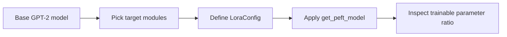

# Configuring the LoRA adapter

## Questions this post answers

- Which `LoraConfig` fields matter most in practice?
- What goes wrong when `target_modules` is chosen poorly?
- How small does the trainable ratio become on a tiny GPT-2 model?

> A LoRA adapter is not a replacement model. It is a small corrective layer attached beside selected linear projections.

Example code: [github.com/yeongseon-books/llm-finetuning-101](https://github.com/yeongseon-books/llm-finetuning-101/tree/main/en/03-lora)

Post 03 is the first time we touch a real model object, but the goal is still validation, not benchmark quality. Because this series targets a CPU-friendly environment, every executable example uses `sshleifer/tiny-gpt2` or an equally small model.

The script for this post defines a `LoraConfig`, applies it with `get_peft_model()`, and prints the trainable parameter ratio. Running `python main.py` confirms that the adapter was attached correctly and that the trainable slice is tiny compared with the base model.

## The fields with real operational impact

`r` controls the low-rank width, `lora_alpha` controls scaling, and `lora_dropout` regularizes only the adapter path. The field that most often breaks real projects is `target_modules`. If that list is wrong, the adapter attaches nowhere useful—or nowhere at all.



## Minimal runnable example

```python
from peft import LoraConfig, TaskType, get_peft_model
from transformers import AutoModelForCausalLM

model = AutoModelForCausalLM.from_pretrained("sshleifer/tiny-gpt2")
config = LoraConfig(
    task_type=TaskType.CAUSAL_LM,
    r=8,
    lora_alpha=16,
    lora_dropout=0.05,
    target_modules=["c_attn", "c_proj"],
)
peft_model = get_peft_model(model, config)
peft_model.print_trainable_parameters()
```

## What to notice in this code

- On GPT-2-style models, `c_attn` and `c_proj` are the names you usually need to target for a minimal demo.
- The `fan_in_fan_out` warning is expected here because PEFT adapts GPT-2's `Conv1D` wrapper internally.
- This post is about correct attachment. The actual optimizer step comes in Post 04.

## Where engineers get confused

- Attaching an adapter is not the same as training it. You still need a training loop to update those new parameters.
- A larger `r` is not a free win. It also increases memory use and overfitting risk.
- Module names do not transfer automatically across model families. Always inspect the target architecture.

## Checklist

- [ ] I can explain the core fields inside `LoraConfig`.
- [ ] I understand why `target_modules` is model-specific.
- [ ] I ran `python main.py` and confirmed that the adapter attached successfully.
- [ ] I am ready to connect this model to a one-step training loop.

## Summary

The main job of adapter configuration is connection validation. Once you know where the adapter lives and how many parameters it exposes, the training loop becomes much less mysterious.

<!-- blog-only:start -->
Next: [Training loop and hyperparameters](./04-training.md)
<!-- blog-only:end -->

<!-- toc:begin -->
## In this series

- [Introduction to LLM Fine-tuning](./01-intro.md)
- [Dataset preparation and preprocessing](./02-dataset.md)
- **Configuring the LoRA adapter (current)**
- Training loop and hyperparameters (upcoming)
- Model evaluation (upcoming)
- Model serving (upcoming)

<!-- toc:end -->

---

## References

- [PEFT quicktour](https://huggingface.co/docs/peft/quicktour)
- [Transformers model classes](https://huggingface.co/docs/transformers/index)

Tags: Fine-tuning, LoRA, LLM, Python
