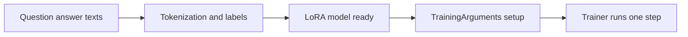

# Training loop and hyperparameters

## Questions this post answers

- Which `TrainingArguments` fields are required for a one-step fine-tuning demo?
- Why do even tiny experiments still need labels and a data collator?
- Which outputs should you inspect first when debugging a training loop?

> A training loop is not a giant black box. It is just a repeated pattern: batch, loss, backward pass, optimizer step.

Example code: [github.com/yeongseon-books/llm-finetuning-101](https://github.com/yeongseon-books/llm-finetuning-101/tree/main/en/04-training)

This post is the first one that performs a real parameter update. Even here, the goal is not model quality. The goal is proving that the fine-tuning loop itself is alive in a CPU-friendly environment. That means shrinking the dataset and step count while keeping the essential training pieces intact.

The example wraps a tiny GPT-2 model with LoRA, builds a two-row question-answer dataset, and runs `Trainer` for exactly one step. If `python main.py` ends with `global_step=1` and a printed training loss, the forward and backward paths are wired correctly.

## What you can shrink and what you cannot

You can shrink the number of rows and the number of optimizer steps aggressively. What you cannot remove is the training structure itself: tokenized inputs, labels, loss computation, and an optimizer step. Remove those, and you no longer have a training test—you only have an inference test.



## Minimal runnable example

```python
from datasets import Dataset
from transformers import Trainer, TrainingArguments

texts = [
    "Question: How do you sort a Python list? Answer: Use sorted(lst) or lst.sort().",
    "Question: What does HTTP 404 mean? Answer: It means the requested resource was not found.",
]

rows = []
for text in texts:
    encoded = tokenizer(text, truncation=True, padding="max_length", max_length=64)
    encoded["labels"] = encoded["input_ids"].copy()
    rows.append(encoded)

dataset = Dataset.from_list(rows)
args = TrainingArguments(output_dir="artifacts", per_device_train_batch_size=2, max_steps=1, learning_rate=5e-4)
trainer = Trainer(model=peft_model, args=args, train_dataset=dataset)
trainer.train()
```

## What to notice in this code

- `labels = input_ids.copy()` is the minimal causal-LM setup for next-token loss.
- `max_steps=1` still executes a real backward pass and optimizer update.
- For this kind of smoke test, `training_loss` and `global_step` matter more than the absolute loss value.

## Where engineers get confused

- A tiny dataset does not mean the collator is optional. Batch shaping still matters.
- A high loss is not a failure here. One step on a tiny random-sized model is meant to validate the loop, not to converge.
- Trainer feels simple only after the columns are correct. That is exactly why the previous post focused on preprocessing structure.

## Checklist

- [ ] I can read and modify the essential `TrainingArguments` fields.
- [ ] I understand why the training dataset needs `labels`.
- [ ] I ran `python main.py` and verified the one-step training output.
- [ ] I can now move from training to evaluation without changing the core model setup.

## Summary

A fine-tuning loop can be verified with surprisingly little data. Once a single step works, the next scaling problems are about time and data—not about the shape of the loop.

<!-- blog-only:start -->
Next: [Model evaluation](./05-evaluation.md)
<!-- blog-only:end -->

<!-- toc:begin -->
## In this series

- [Introduction to LLM Fine-tuning](./01-intro.md)
- [Dataset preparation and preprocessing](./02-dataset.md)
- [Configuring the LoRA adapter](./03-lora.md)
- **Training loop and hyperparameters (current)**
- Model evaluation (upcoming)
- Model serving (upcoming)

<!-- toc:end -->

---

## References

- [Transformers Trainer documentation](https://huggingface.co/docs/transformers/main_classes/trainer)
- [TrainingArguments reference](https://huggingface.co/docs/transformers/main_classes/trainer#transformers.TrainingArguments)

Tags: Fine-tuning, LoRA, LLM, Python
