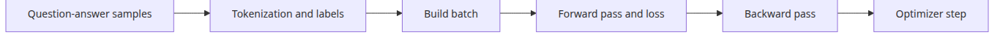
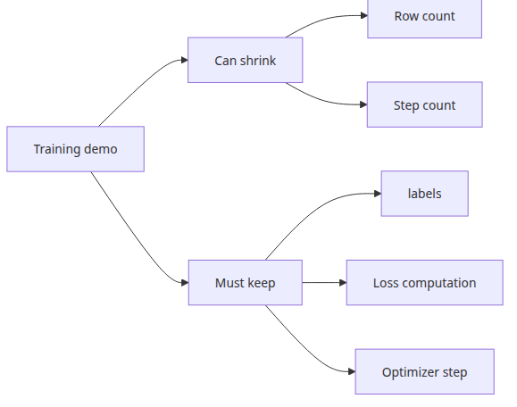
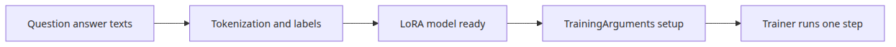
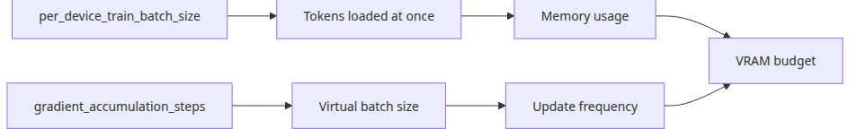
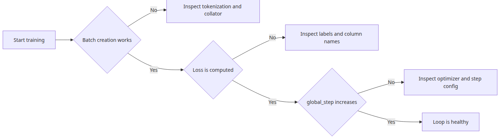

# Training Loop and Hyperparameters

## Questions this post answers



*Questions this post answers*

- What is the minimum you must set in `TrainingArguments` for a single training step to run?
- Why do `labels` and a data collator matter even in tiny experiments?
- When debugging a training loop, which output should you read first?
- How do learning rate, batch size, and gradient accumulation interact?

> The training loop is not a giant black box. It is a repetition: feed a tokenized batch into the model and reduce the loss once.

Example code: [github.com/yeongseon-books/llm-finetuning-101](https://github.com/yeongseon-books/llm-finetuning-101/tree/main/en/04-training)

## Why this matters

Episode 4 is the first article in this series where actual weight updates happen. But the goal is still not high accuracy — it is to **prove that the training loop is alive**. Once you verify a single end-to-end step, future failures become easy to triage: is it the environment, the data, or the hyperparameters?

Episode 4 also breaks the habit of tuning many hyperparameters at once. If you change the learning rate by 10x and the batch size by 4x in the same run, you cannot tell which change moved the loss. Practicing one-change-at-a-time here pays off in episode 5 (evaluation), where "why is the score low?" gets answered much faster.

## Mental Model

A single training step decomposes into six stages:

```
1. batch = data_collator([sample_i, sample_j, ...])
2. outputs = model(input_ids=..., attention_mask=..., labels=...)
3. loss = outputs.loss
4. loss.backward()                       # compute gradients
5. optimizer.step()                       # update parameters
6. lr_scheduler.step(); optimizer.zero_grad()
```

`Trainer` simply wraps these six stages. If any one of them is broken, the whole step is broken. So the 1-step run in this article is an integrity check: "all six stages passed once."

Two more relationships worth memorizing:

- **Effective batch size** = `per_device_train_batch_size × gradient_accumulation_steps × num_devices`. If this value is the same, the loss curves should look similar.
- **Learning rate** scales with effective batch size. If you grew the batch 4x, scale lr by something between √4 and 4x.

## Core concepts

| Item | Meaning |
| --- | --- |
| `labels` | Ground truth for next-token prediction. For causal LM, copy `input_ids` (mask the prompt with -100) |
| Data collator | Bundles variable-length samples into a batch and handles padding/masking in one place |
| `learning_rate` | LoRA typically uses 10x the value of full fine-tuning (1e-4 ~ 5e-4) |
| `per_device_train_batch_size` | Samples per GPU per forward pass |
| `gradient_accumulation_steps` | Accumulate small batches N times to emulate a large batch when memory is tight |
| `max_steps` / `num_train_epochs` | Use one or the other. `max_steps` wins if both are set |
| `warmup_ratio` | Linearly increases lr from 0 in the early steps |

## Before vs. After

**Before** — You call `Trainer.train()` and immediately get `KeyError: 'labels'` or NaN loss. You have no idea where to start.

**After** — Following the 1-step pattern in this article produces this single line:

```
{'train_runtime': 1.42, 'train_samples_per_second': 1.41,
 'train_steps_per_second': 0.7, 'train_loss': 8.7421, 'epoch': 0.5}
```

The absolute loss value (8.74) is meaningless. What matters is (1) the run completed, (2) loss is a finite number (not NaN/Inf), and (3) `global_step=1`. When all three hold, your environment, data, adapter, and optimizer all worked at least once.

## What you can shrink and what you cannot



*Comparison of shrinkable and must-keep components*

Sample count and step count can be cut down. But **tokenized inputs, labels, optimizer step, and loss computation** cannot be removed — drop any of them and you no longer have a training validation, just an inference test. That is why even the smallest example in this article keeps every training-related component intact.



*What you can shrink and what you cannot*

## Step-by-step practice

### Step 1 — Build a two-line dataset

```python
from datasets import Dataset

texts = [
    "Q: How do I sort a Python list? A: Use sorted(lst) or lst.sort().",
    "Q: What does HTTP 404 mean? A: The requested resource was not found.",
]

rows = []
for text in texts:
    encoded = tokenizer(text, truncation=True, padding="max_length", max_length=64)
    encoded["labels"] = encoded["input_ids"].copy()
    rows.append(encoded)

dataset = Dataset.from_list(rows)
```

`labels = input_ids.copy()` is the simplest possible setup. In production you would mask the prompt portion with -100 so it does not contribute to the loss.

### Step 2 — Define `TrainingArguments`

```python
from transformers import TrainingArguments

args = TrainingArguments(
    output_dir="artifacts",
    per_device_train_batch_size=2,
    max_steps=1,
    learning_rate=5e-4,
    save_strategy="no",
    report_to=[],
)
```

Setting `report_to=[]` disables auto-connection to wandb/tensorboard. For a small validation run, an empty list is faster and cleaner.

### Step 3 — Run the Trainer

```python
from transformers import Trainer

trainer = Trainer(model=peft_model, args=args, train_dataset=dataset)
trainer.train()
```

### Step 4 — Verify the result

If the output shows `'train_loss': <number>` and `'global_step': 1`, you are done. If loss is exactly 0.0 or NaN, something is broken in your data, masking, or model dtype.

### Step 5 — Effective batch size experiment (optional)

```python
args.per_device_train_batch_size = 1
args.gradient_accumulation_steps = 2
args.max_steps = 1
```

The two configurations have the same effective batch size, so the loss output should be nearly identical. If it differs, there is a data leak somewhere.

## What to notice in this code



*Relationship between batch size and gradient accumulation*

- `labels = input_ids.copy()` is the minimum setup needed for next-token prediction loss in causal LM.
- Even with `max_steps=1`, the backward pass and optimizer step actually execute.
- For this example, checking `training_loss` and `global_step` is enough. Whether the loop finishes matters more than the number itself.
- Setting `report_to=[]` disables wandb/tensorboard auto-connection and keeps small validations clean.

## Common mistakes



*Decision flow for training debug output priority*

- **Skipping the collator because samples are few** — once variable-length samples mix in, the run breaks immediately without a collator. Use `DataCollatorForLanguageModeling` even in tiny experiments.
- **Trusting the absolute loss value** — for a tiny model with 1 step, loss values of 8 to 10 are normal. Watch the trend and the NaN status, not the absolute number.
- **Column name mismatches** — Trainer silently drops any column that is not `input_ids`, `attention_mask`, or `labels`. A mistyped column will be invisible in your loss.
- **Changing lr by a huge factor at once** — jumping from 5e-4 to 5e-3 often produces NaN. Increase by 2-3x and observe.
- **Leaving `save_strategy="epoch"` on** — small validations fill the disk fast. Use `"no"` and call `trainer.save_model()` only at the end.
- **Ignoring fp16/bf16** — on bf16-capable GPUs (A100, H100, RTX 30+), `bf16=True` improves both memory and speed. For tiny model validation it is not necessary.

## Production application

- **Automate a 3-step smoke test**: every PR runs three steps, not one, and asserts loss is monotonically decreasing (or at least varying).
- **Sweep learning rate on a log scale**: try {1e-5, 5e-5, 1e-4, 5e-4, 1e-3} — five points is enough. Linear sweeps carry too little information.
- **Use gradient accumulation**: if GPU memory allows only batch=2 and you need effective batch=16, set `gradient_accumulation_steps=8`.
- **Evaluate on step intervals**: `eval_steps=50, evaluation_strategy="steps"` catches regressions early instead of waiting for an epoch.
- **Checkpoint policy**: `save_total_limit=2` protects the disk, and `load_best_model_at_end=True` lets episode 5 evaluate the best checkpoint automatically.
- **Wire wandb in**: once you compare two or more experiments, switch to `report_to=["wandb"]`. Overlaying loss curves and lr schedules in one view sharpens intuition fast.

## Checklist

- [ ] I can read and edit the required fields in `TrainingArguments`.
- [ ] I understand why `labels` is required.
- [ ] I ran `python main.py` and confirmed a 1-step training loss output.
- [ ] The loss was a finite number, not NaN.
- [ ] I can explain the effective batch size formula = `per_device × accum × devices`.
- [ ] I am ready to evaluate the same model in the next article.

## Exercises

1. Change `learning_rate` to 1e-5, 1e-4, and 1e-3, run 5 steps each, and compare loss curves. At which value does NaN appear?
2. Run `per_device_train_batch_size=1, gradient_accumulation_steps=4` and `per_device_train_batch_size=4, gradient_accumulation_steps=1` with the same lr. Are the loss curves similar? If not, list possible causes.
3. Build a collator that masks the prompt portion with -100. How does the loss change before and after masking?

## Summary · Next article

The training loop can be validated in surprisingly small units. Once a single step succeeds, the things that need to grow are data and time, not the basic structure. If the environment, data, adapter, or optimizer is broken, you will see the signal in step 1.

The next article (episode 5) covers evaluation. We will use perplexity as a quick sanity check and combine it with golden-set qualitative and quantitative evaluation, all in code.

<!-- toc:begin -->
## In this series

- [LLM Fine-tuning Primer](./01-intro.md)
- [Dataset Preparation and Preprocessing](./02-dataset.md)
- [Configuring LoRA Adapters](./03-lora.md)
- **Training Loop and Hyperparameters (current)**
- Model Evaluation (upcoming)
- Model Serving (upcoming)

<!-- toc:end -->

---

## References

- [Transformers Trainer documentation](https://huggingface.co/docs/transformers/main_classes/trainer)
- [TrainingArguments reference](https://huggingface.co/docs/transformers/main_classes/trainer#transformers.TrainingArguments)
- [DataCollatorForLanguageModeling](https://huggingface.co/docs/transformers/main_classes/data_collator)
- [Mixed precision training](https://huggingface.co/docs/transformers/perf_train_gpu_one)

Tags: Fine-tuning, LoRA, LLM, Python
