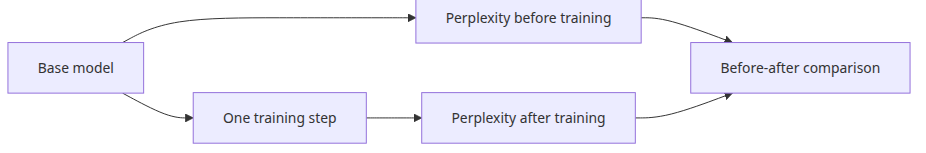
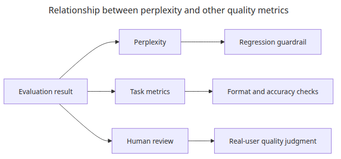
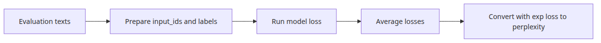
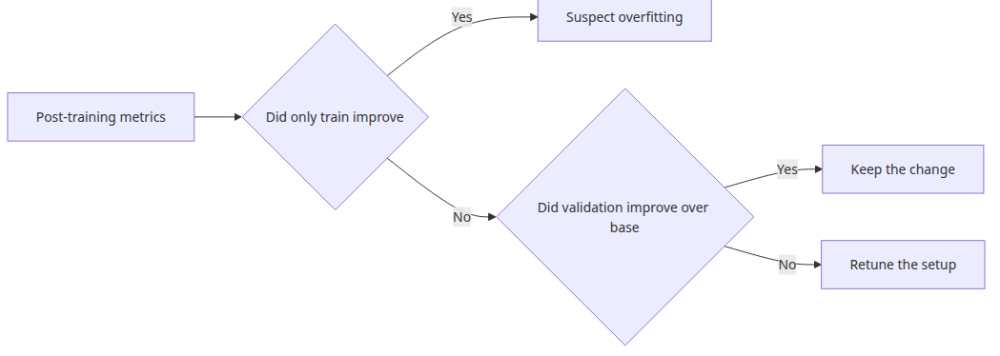

# Model Evaluation

Evaluation is where many fine-tuning demos become misleading. This article separates internal model signals from user-facing quality so you can measure improvement and catch regressions with a repeatable loop.

This is the fifth post in the LLM Fine-tuning 101 series.

## Questions this post answers



*Questions this post answers*

- How do you compute perplexity, the first quantitative signal to look at right after fine-tuning?
- Why is comparing perplexity before and after training not a complete quality evaluation?
- Why keep a separate evaluation loop even in a tiny model demo?
- How should you combine perplexity with golden-set evaluation?

> Perplexity measures how unsurprised the model is by the next token. It does not directly guarantee that humans will find the output good.

Example code: [github.com/yeongseon-books/llm-finetuning-101](https://github.com/yeongseon-books/llm-finetuning-101/tree/main/en/05-evaluation)

## Why this matters

Right after training, the temptation is to look only at generated samples. In production you must look at quantitative signals first. The most basic one is perplexity, which shows how naturally the model predicts tokens in your evaluation data.

The real goal of episode 5 is to make evaluation an **automatable pipeline**. Eyeballing every output does not scale. Use perplexity as a regression baseline and stack a golden-set qualitative evaluation on top — building this two-tier structure with the same discipline as the 1-step training run from episode 4.

## Mental Model

Evaluation works best when you separate "internal model signals" from "user-facing quality."

```text
[Internal signals]              [User-facing quality]
- perplexity                    - answer match rate
- token-level accuracy          - format compliance
- gradient norm                 - human rating
        |                              |
        +--- fast regression line --+  |
                  |                    |
            run in CI            run on a separate
                                 schedule with golden set
```

Internal signals run fast (seconds to minutes); user-facing quality runs slow (minutes to hours). When the fast signal regresses, block the change; track the slow signal nightly.

Two more facts to memorize:

- **perplexity = exp(mean cross-entropy loss)**. If loss drops, perplexity drops. They carry the same information.
- **Evaluation data must be separate from training data.** Demos can share them for clarity, but production needs a hold-out set.

## Core concepts

| Item | Meaning |
| --- | --- |
| Perplexity | Average "surprise" when predicting the next token. Lower is better |
| Cross-entropy loss | Per-token gap between predicted distribution and ground truth. Source of perplexity |
| `model.eval()` | Switches dropout / batch normalization to inference mode |
| `torch.no_grad()` | Disables gradient computation, saving memory and time |
| Golden set | Human-curated input/output pairs for evaluation. The baseline for regression detection |
| Hold-out set | Data not used in training. Used for perplexity measurement |
| Task metric | Domain-specific metrics like exact match, BLEU, ROUGE |

## Before vs. After

**Before** — All you have is a vague impression that "loss went down so it must have learned." A few days later, when someone asks for the result, it is hard to reproduce.

**After** — Adopting the evaluation loop in episode 5 condenses the result into one line:

```text
{'before_ppl': 27431.84, 'after_ppl': 26890.17, 'delta_pct': -1.97}
```

The absolute value does not matter. What matters is (1) evaluation is separated from training, (2) the same data was measured twice to compare trends, and (3) CI produces the same numbers.

## How to read perplexity correctly



*Relationship between perplexity and quality metrics*

Perplexity is "lower is better," but you cannot judge quality from the absolute value alone. Tiny demo models, small datasets, and short context lengths cause large swings. So in practice, perplexity is best used as a **regression baseline** — strong at detecting whether things got worse, or whether a setting change improved the trend.



*How to read perplexity correctly*

## Step-by-step practice

### Step 1 — Write the evaluation function

```python
import math
import torch

def perplexity(model, dataset) -> float:
    losses = []
    model.eval()
    for row in dataset:
        batch = {key: torch.tensor([value]) for key, value in row.items()}
        with torch.no_grad():
            loss = model(**batch).loss
        losses.append(loss.item())
    return math.exp(sum(losses) / len(losses))
```

### Step 2 — Measure before and after training

```python
before = perplexity(peft_model, eval_dataset)
trainer.train()
after = perplexity(peft_model, eval_dataset)

delta = (after - before) / before * 100
print({"before_ppl": before, "after_ppl": after, "delta_pct": delta})
```

### Step 3 — Define a golden set

```python
golden = [
    {"prompt": "Q: How to sort a Python list?", "expected_contains": "sorted"},
    {"prompt": "Q: What is HTTP 404?", "expected_contains": "not found"},
]
```

Each item is a "prompt" and an "expected keyword." Keyword containment is more realistic than exact match for small models.

### Step 4 — Score the golden set

```python
def score_golden(model, tokenizer, golden) -> float:
    hits = 0
    for item in golden:
        ids = tokenizer(item["prompt"], return_tensors="pt").input_ids
        out = model.generate(ids, max_new_tokens=32)
        text = tokenizer.decode(out[0], skip_special_tokens=True)
        if item["expected_contains"] in text:
            hits += 1
    return hits / len(golden)
```

### Step 5 — Print both signals together

```python
print({
    "ppl_after": after,
    "golden_score": score_golden(peft_model, tokenizer, golden),
})
```

The moment these two lines print together, you see the regression baseline and user-facing quality on one screen.

## What to notice in this code


*Calculation flow from average loss to perplexity*

- The evaluation function must be separate from the training loop. Otherwise you risk mutating parameters while reading the loss.
- `torch.no_grad()` and `model.eval()` are basic protections that stabilize memory usage and dropout behavior.
- This example is for trend confirmation only. Real projects need a hold-out set, task metric, and human review together.
- Golden-set scoring is the lightest possible automation that catches regressions without a human reading every output.

## Common mistakes



*Decision flow for overfit signals and comparison baselines*

- **Shipping based on perplexity alone** — format compliance, factuality, and safety need separate evaluation. Perplexity is one axis only.
- **Using the same data for training and evaluation** — numbers look optimistically good. The demo shares them for clarity, but real projects must split them.
- **Building a golden set once and forgetting it** — as the model evolves, evaluation items must grow too. A weekly habit of adding 5-10 cases works well.
- **Forgetting `model.eval()`** — dropout stays active and the same input produces different outputs. Reproducibility breaks.
- **Evaluating only the last step** — if you only score the final checkpoint, you cannot tell when things broke. Use `eval_steps` to measure periodically.
- **Skipping evaluation in CI** — when humans run it manually, regressions slip in the moment someone forgets. A 5-minute perplexity check is worth running on every PR.

## Production application

- **Two-tier structure**: fast perplexity check + slow golden-set evaluation. Fast in CI, both in nightly.
- **Regression budget**: block PRs when perplexity regresses by more than 5%. Ignore small fluctuations.
- **Categorize the golden set**: format, factuality, safety, domain knowledge — 4-5 categories make weak spots visible at a glance.
- **Pair human evaluation**: show outputs from two models side by side and ask only "which is better?" The signal is stronger than absolute scores.
- **Acknowledge automatic-eval limits**: BLEU and ROUGE see surface overlap, not meaning. Even LLM-as-judge has bias. Treat automatic scores as a guide for human evaluation.
- **Persist evaluation results as logs**: store model name, data version, and code commit hash so you can compare six months later.

## Checklist

- [ ] I understand that perplexity is the exponential of mean loss.
- [ ] I can explain why the evaluation loop uses `no_grad` and `eval`.
- [ ] I ran `python main.py` and verified the before/after perplexity output.
- [ ] I can explain the meaning and limits of a golden set.
- [ ] I have a habit of running minimum quantitative evaluation before serving.

## Exercises

1. Grow the eval dataset from 2 to 20 entries and observe how perplexity behaves. Does variance shrink?
2. Add 5 "math computation" items to the golden set and compare scores before and after fine-tuning. Does fine-tuning improve every category equally?
3. Remove the `model.eval()` call and run the perplexity function twice. How do the results differ?

## Summary · Next article

Evaluation is unglamorous, but it is the step that earns trust in a fine-tuning pipeline. Establishing a baseline before looking at generated samples makes future experiments depend less on intuition. The production pattern is the two-tier setup: fast quantitative signals (perplexity) below, slow qualitative evaluation (golden set, human review) above.

The next article (episode 6) covers serving. We will deploy the LoRA adapter separated from the base model and reduce inference memory and latency in code.

<!-- toc:begin -->
## In this series

- [LLM Fine-tuning Primer](./01-intro.md)
- [Dataset Preparation and Preprocessing](./02-dataset.md)
- [Configuring LoRA Adapters](./03-lora.md)
- [Training Loop and Hyperparameters](./04-training.md)
- **Model Evaluation (current)**
- Model Serving (upcoming)

<!-- toc:end -->

---

## References

- [Example repository — llm-finetuning-101](https://github.com/yeongseon-books/llm-finetuning-101)
- [Perplexity of fixed-length models](https://huggingface.co/docs/transformers/perplexity)
- [Evaluation best practices for language models](https://huggingface.co/docs/evaluate/index)
- [LLM-as-a-judge survey](https://arxiv.org/abs/2306.05685)
- [HELM: Holistic Evaluation of Language Models](https://crfm.stanford.edu/helm/)

Tags: Fine-tuning, LoRA, LLM, Python
