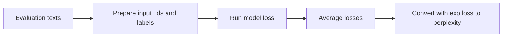

# Model evaluation

## Questions this post answers

- How do you compute perplexity right after fine-tuning?
- Why is perplexity useful but still incomplete as a quality signal?
- Why should evaluation live outside the training loop even in a tiny demo?

> Perplexity measures how unsurprised the model is by the next token. It does not directly guarantee that the answer is useful to a human reader.

Example code: [github.com/yeongseon-books/llm-finetuning-101](https://github.com/yeongseon-books/llm-finetuning-101/tree/main/en/05-evaluation)

After training, it is tempting to jump straight to generated examples. In practice, it is worth checking a quantitative baseline first. Perplexity is one of the simplest ways to do that: it tells you how comfortably the model predicts the evaluation tokens.

The example in this post trains a tiny LoRA-wrapped GPT-2 model for one step and computes perplexity before and after training on a tiny evaluation dataset. Running `python main.py` prints both numbers, which is enough to validate that the evaluation path is separate from the training path.

## The right way to read perplexity

Lower perplexity is usually better, but the absolute value can be noisy on tiny models, tiny datasets, and short contexts. That is why perplexity is most useful as a regression guardrail. It is excellent for asking whether a change made things worse or better relative to a baseline.



## Minimal runnable example

```python
import math
import torch

def perplexity(model, dataset) -> float:
    losses = []
    model.eval()
    for row in dataset:
        batch = {key: torch.tensor([value]) for key, value in row.items()}
        with torch.no_grad():
            loss = model(**batch).loss
        losses.append(loss.item())
    return math.exp(sum(losses) / len(losses))

before = perplexity(peft_model, eval_dataset)
trainer.train()
after = perplexity(peft_model, eval_dataset)
```

## What to notice in this code

- The evaluation function stays separate from training so you do not accidentally update parameters while measuring them.
- `model.eval()` and `torch.no_grad()` keep dropout and memory usage stable during evaluation.
- In real work, perplexity should sit beside task metrics and human review, not replace them.

## Where engineers get confused

- Better perplexity does not automatically mean better answer formatting or factuality.
- Using identical train and eval text can make metrics look optimistic. This demo accepts that trade-off to keep the example small.
- Small numeric changes are normal in a one-step tiny-model example. The point is validating the evaluation pipeline.

## Checklist

- [ ] I understand that perplexity is `exp(mean_loss)`.
- [ ] I can explain why evaluation uses `eval()` and `no_grad()`.
- [ ] I ran `python main.py` and saw both pre-training and post-training perplexity outputs.
- [ ] I would not ship a model without at least one quantitative baseline anymore.

## Summary

Evaluation is not glamorous, but it is what makes the rest of the pipeline trustworthy. Once you have a baseline, future experiments become far less subjective.

<!-- blog-only:start -->
Next: [Model serving](./06-serving.md)
<!-- blog-only:end -->

<!-- toc:begin -->
## In this series

- [Introduction to LLM Fine-tuning](./01-intro.md)
- [Dataset preparation and preprocessing](./02-dataset.md)
- [Configuring the LoRA adapter](./03-lora.md)
- [Training loop and hyperparameters](./04-training.md)
- **Model evaluation (current)**
- Model serving (upcoming)

<!-- toc:end -->

---

## References

- [Perplexity of fixed-length models](https://huggingface.co/docs/transformers/perplexity)
- [Evaluation best practices for language models](https://huggingface.co/docs/evaluate/index)

Tags: Fine-tuning, LoRA, LLM, Python
