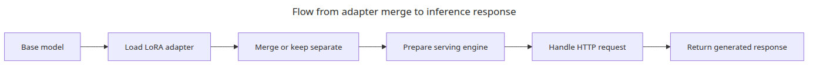
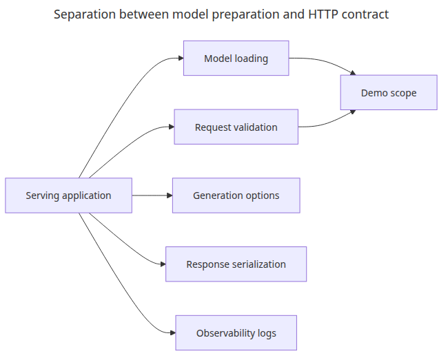
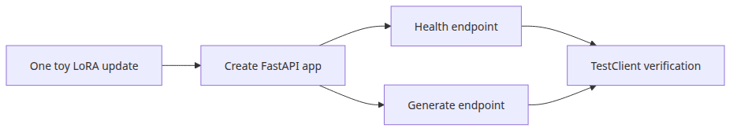
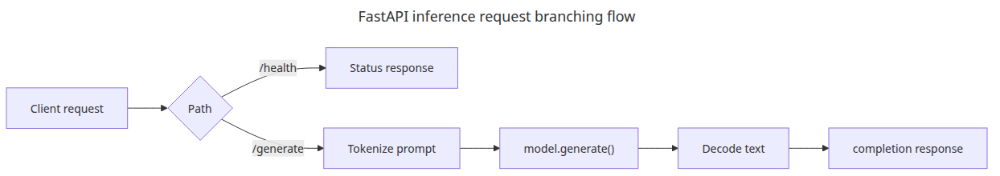
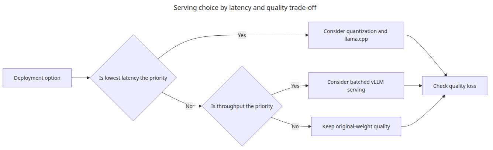

# Model serving

## Questions this post answers


- What is the smallest FastAPI shape for serving a fine-tuned language model?
- Where should you separate training concerns from inference concerns?
- How can you verify an endpoint without manually starting a browser or server process?

> Serving is not the stage where the model gets smarter. It is the stage where a prepared model is placed behind a predictable HTTP contract.

Example code: [github.com/yeongseon-books/llm-finetuning-101](https://github.com/yeongseon-books/llm-finetuning-101/tree/main/en/06-serving)

The final post wraps the tuned adapter behind an API. In production, training and serving should be separate systems. In a learning-friendly demo, however, running a tiny update and then exposing the model through FastAPI makes the full pipeline visible in one place.

The example script applies one toy LoRA update to a tiny GPT-2 model, builds a FastAPI app, and uses `TestClient` to call `/health` and `/generate`. Running `python main.py` verifies the serving path without starting uvicorn manually.

## What this demo isolates on purpose


Real serving systems also need request validation, authentication, observability, batching, and timeout policy. This post intentionally isolates two concerns only: **preparing a model object for inference** and **wrapping it in a stable HTTP interface**. Even that small boundary is worth learning cleanly.


## Minimal runnable example

```python
from fastapi import FastAPI
from fastapi.testclient import TestClient

app = FastAPI()

@app.get("/health")
def health() -> dict:
    return {"status": "ok"}

@app.post("/generate")
def generate(payload: dict) -> dict:
    prompt = payload["prompt"]
    outputs = model.generate(**tokenizer(prompt, return_tensors="pt"), max_new_tokens=20)
    return {"completion": tokenizer.decode(outputs[0], skip_special_tokens=True)}

client = TestClient(app)
print(client.get("/health").json())
print(client.post("/generate", json={"prompt": "Example Python function"}).json())
```

## What to notice in this code


- This script performs a single toy fine-tuning step before exposing the model, so the endpoint is not serving a pristine base model.
- `TestClient` is ideal for CI-friendly endpoint validation because it exercises the HTTP contract without booting a standalone server.
- Separating `/health` from `/generate` makes it easier to isolate infrastructure failures from inference failures later.

## Where engineers get confused


- Keeping training logic inside serving code is not the production default. This post does it only to keep the demo self-contained.
- The generated text is not meant to be beautiful. Tiny models validate control flow, not product-quality completions.
- A working FastAPI endpoint is only the beginning. Operational concerns still need their own design.

## Checklist

- [ ] I can separate model preparation from HTTP endpoint design.
- [ ] I verified both `/health` and `/generate` with `TestClient`.
- [ ] I understand the gap between a tiny demo endpoint and a production serving system.
- [ ] I can now describe the full fine-tuning path from concept to serving.

## Summary

The minimal end-to-end path is now complete: estimate LoRA cost, prepare data, attach adapters, run a training step, evaluate the result, and expose it through HTTP.

<!-- toc:begin -->
## In this series

- [Introduction to LLM Fine-tuning](./01-intro.md)
- [Dataset preparation and preprocessing](./02-dataset.md)
- [Configuring the LoRA adapter](./03-lora.md)
- [Training loop and hyperparameters](./04-training.md)
- [Model evaluation](./05-evaluation.md)
- **Model serving (current)**

<!-- toc:end -->

---

## References

- [FastAPI documentation](https://fastapi.tiangolo.com/)
- [Starlette TestClient reference](https://www.starlette.io/testclient/)

Tags: Fine-tuning, LoRA, LLM, Python
