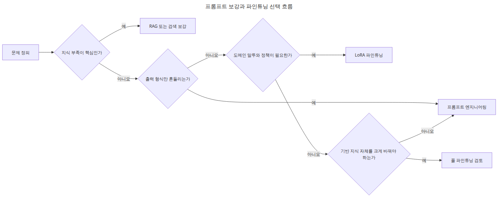
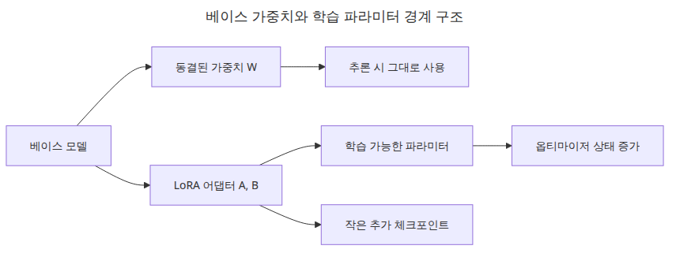
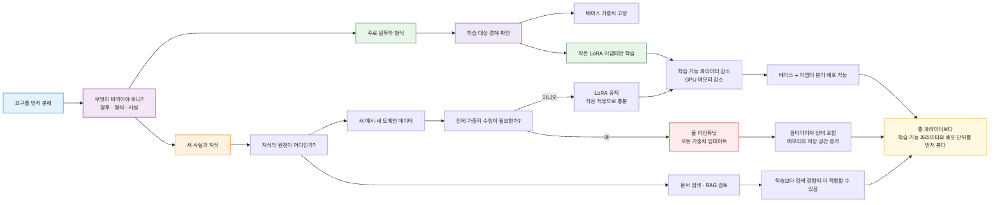
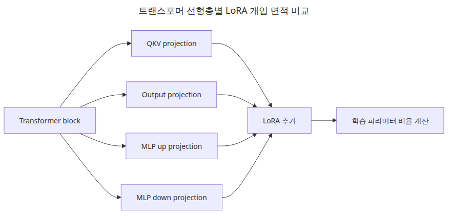
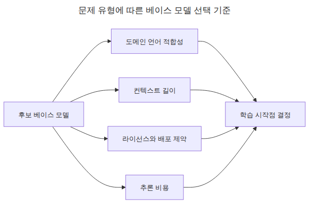

# LLM 파인튜닝 입문

## 이 글에서 답할 질문


- LoRA가 왜 풀 파인튜닝보다 훨씬 가벼운지 어떻게 계산할까?
- 파인튜닝이 필요한 문제와 프롬프트 엔지니어링으로 충분한 문제는 어떻게 구분할까?
- GPU 없이도 1편에서 무엇을 검증할 수 있을까?

> 풀 파인튜닝이 건물 전체를 다시 짓는 일이라면, LoRA는 하중이 걸리는 기둥 몇 개에만 보강재를 덧대는 일입니다.

예제 코드: [github.com/yeongseon-books/llm-finetuning-101](https://github.com/yeongseon-books/llm-finetuning-101/tree/main/ko/01-intro)

파인튜닝 시리즈의 첫 글에서는 모델을 크게 돌리기보다 먼저 계산 감각을 맞춥니다. LLM 파인튜닝이 무조건 GPU 실습부터 시작해야 하는 주제는 아닙니다. LoRA가 왜 싸고 빠른지, 어느 정도 파라미터만 학습하는지, 언제 이 선택이 합리적인지를 숫자로 먼저 이해해야 이후 데이터셋, 학습, 평가, 서빙 단계가 흔들리지 않습니다.

이 글의 예제 코드는 실제 모델을 로드하지 않습니다. 대신 GPT-2 small에 가까운 구조를 가정해 선형 레이어 파라미터 수와 LoRA 어댑터 파라미터 수를 수식으로 계산합니다. `python main.py` 실행만으로 1.5% 안팎의 학습 비율을 확인할 수 있으므로, GPU가 없는 환경에서도 출발점을 검증할 수 있습니다.

## 먼저 감을 잡아야 하는 것


파인튜닝에서 가장 먼저 놓치기 쉬운 지점은 **어디를 학습 대상으로 잡느냐**입니다. 풀 파인튜닝은 기존 가중치 전체를 업데이트하므로 메모리와 옵티마이저 상태가 함께 불어납니다. 반면 LoRA는 기존 가중치를 고정한 채 저랭크 행렬 두 개만 추가합니다. 그래서 비용 이야기를 할 때는 모델 전체 파라미터보다 **학습 가능한 파라미터 수**를 따로 봐야 합니다.


## 최소 실행 예제

```python
from dataclasses import dataclass

@dataclass
class TransformerShape:
    hidden_size: int
    intermediate_size: int
    num_layers: int

def total_linear_params(shape: TransformerShape) -> int:
    return shape.num_layers * (
        4 * shape.hidden_size * shape.hidden_size
        + 2 * shape.hidden_size * shape.intermediate_size
    )

def lora_params_per_layer(hidden_size: int, intermediate_size: int, rank: int) -> int:
    attention = 4 * rank * (hidden_size + hidden_size)
    mlp = rank * (hidden_size + intermediate_size) + rank * (intermediate_size + hidden_size)
    return attention + mlp

shape = TransformerShape(hidden_size=768, intermediate_size=3072, num_layers=12)
rank = 8
base_linear_params = total_linear_params(shape)
lora_params = shape.num_layers * lora_params_per_layer(shape.hidden_size, shape.intermediate_size, rank)
print(base_linear_params, lora_params)
```

## 이 코드에서 봐야 할 것


- `hidden_size=768`, `intermediate_size=3072`, `num_layers=12`는 GPT-2 small 급 구조를 흉내 낸 값입니다.
- 이 스크립트는 전체 모델 파라미터가 아니라 attention/MLP 선형 레이어를 기준으로 LoRA가 개입하는 면적을 계산합니다.
- 실행 결과로 나온 비율은 이후 3편에서 `LoraConfig(r=8)`를 고를 때 감각 기준이 됩니다.

## 실무에서 헷갈리는 지점


- LoRA가 전체 모델 크기를 줄여주는 것은 아닙니다. **학습 가능한 파라미터 수**와 **저장해야 할 추가 가중치**를 줄여줄 뿐입니다.
- 풀 파인튜닝보다 싸다고 해서 아무 데이터셋에나 잘 맞는 것은 아닙니다. 데이터가 나쁘면 작은 어댑터도 그대로 나쁜 방향으로 학습합니다.
- 1편의 숫자는 근사치입니다. 실제 모델마다 target module과 tied weight 구조가 달라 정확한 비율은 조금씩 달라집니다.

## 체크리스트

- [ ] LoRA가 줄이는 대상이 모델 크기인지 학습 파라미터 수인지 구분했다.
- [ ] rank가 커질수록 학습 파라미터가 선형으로 늘어난다는 점을 이해했다.
- [ ] `python main.py`로 파라미터 계산이 실제로 실행되는지 확인했다.
- [ ] 다음 글에서 다룰 데이터셋 형식이 왜 중요한지 연결 지었다.

## 정리

1편의 목적은 파인튜닝을 신비한 GPU 작업으로 보지 않는 데 있습니다. 파라미터 계산만 정확히 이해해도 LoRA가 왜 실무 기본값이 되었는지 설명할 수 있습니다.

<!-- toc:begin -->
## 시리즈 목차

- **LLM 파인튜닝 입문 (현재 글)**
- 데이터셋 준비와 전처리 (예정)
- LoRA 어댑터 구성 (예정)
- 학습 루프와 하이퍼파라미터 (예정)
- 모델 평가 (예정)
- 모델 서빙 (예정)

<!-- toc:end -->

---

## 참고 자료

- [LoRA paper](https://arxiv.org/abs/2106.09685)
- [Hugging Face PEFT documentation](https://huggingface.co/docs/peft)

Tags: Fine-tuning, LoRA, LLM, Python
