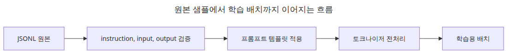

# 데이터셋 준비와 전처리

파인튜닝 데이터셋은 대개 크기보다 모양 때문에 더 자주 실패합니다. 이 글은 LLM Finetuning 101 시리즈의 두 번째 글입니다. 여기서는 원본 샘플, 템플릿이 적용된 텍스트, 토큰화된 텐서라는 세 층으로 문제를 나눠서, 학습 전에 무엇을 확인해야 하는지 차근차근 정리하겠습니다.

같은 1,000개 샘플이어도 형식이 일관되면 LoRA `r=8`로 충분할 수 있고, 형식이 섞이면 더 큰 랭크와 더 많은 데이터로도 수렴이 흔들릴 수 있습니다. 2편의 목표는 데이터 양을 늘리는 방법이 아니라, 모델이 정확히 무엇을 모방해야 하는지 분명하게 만드는 것입니다.

## 이 글에서 다룰 문제



*이 글에서 다룰 문제*

- `instruction / input / output` 세 필드를 어떤 형태로 잡아야 할까요?
- Hugging Face `datasets`로 작은 JSONL 파일을 어떻게 바로 읽을 수 있을까요?
- 전처리 단계에서 반드시 확인해야 할 최소 검증 포인트는 무엇일까요?
- 학습이 안정적으로 되려면 프롬프트와 응답의 경계를 어디에 두어야 할까요?

> 좋은 파인튜닝 데이터셋은 문장 더미가 아니라, 모델이 반복해서 흉내 내야 하는 **요청-응답 계약**입니다.

예제 코드: [github.com/yeongseon-books/llm-finetuning-101](https://github.com/yeongseon-books/llm-finetuning-101/tree/main/en/02-dataset)

## 왜 이 글이 중요한가

데이터셋 단계에서 가장 중요한 것은 양이 아니라 **형식 일관성**입니다. 무엇이 입력인지, 어디부터가 모델이 학습해야 할 응답인지 애매하면 손실은 내려가도 실제 답변은 흐릿하게 남습니다. 작은 LoRA 실험일수록 이 경계가 더 중요합니다.

2편에서 템플릿을 확실히 잡아 두면 4편의 학습 루프, 5편의 평가, 6편의 서빙까지 같은 구조가 끊기지 않고 이어집니다. 반대로 여기서 대충 넘어가면 4편에서는 손실이 내려가는데 5편에서는 답변 품질이 이상한, 가장 해석하기 어려운 상황을 만나게 됩니다.

## 멘탈 모델

데이터셋은 세 층으로 나눠서 봐야 합니다.

```text
┌───────────────────────────────┐
│ Layer 1: Raw samples (JSONL)  │  ← humans read and review here
├───────────────────────────────┤
│ Layer 2: Templated text       │  ← prompt + response as one string
├───────────────────────────────┤
│ Layer 3: Tokenized tensors    │  ← input_ids, attention_mask, labels
└───────────────────────────────┘
```

- **Layer 1**은 사람이 추가하고 수정하고 검수하는 층입니다. 필드 이름, 줄바꿈, 공백까지 일관돼야 합니다.
- **Layer 2**는 모델별 템플릿이 적용된 하나의 문자열입니다. Llama-3와 Qwen은 같은 텍스트라도 다른 특수 토큰을 사용합니다.
- **Layer 3**은 학습 직전에 만드는 텐서입니다. `labels`에서 프롬프트 구간은 `-100`으로 마스킹해 손실 계산에서 제외해야 합니다.

이 세 층을 분리하면 필터링 문제, 토큰 길이 문제, 마스킹 문제를 한꺼번에 뒤섞지 않고 따로 진단할 수 있습니다.

## 핵심 개념

| 용어 | 의미 |
| --- | --- |
| Instruction format | `{instruction, input?, output}` 구조입니다. Alpaca 스타일이 대표적입니다. |
| Chat format | `[{role, content}, ...]` 구조입니다. 멀티턴 대화에 적합합니다. |
| Completion format | 단순한 prefix 뒤에 continuation이 붙는 형태입니다. 베이스 모델의 사전학습 형식과 더 가깝습니다. |
| Label masking | 프롬프트 토큰을 `-100`으로 두어 손실 계산에서 제외하는 방식입니다. |
| EOS token | 응답 종료를 알리는 토큰입니다. 이것이 없으면 모델은 멈추는 법을 배우지 못합니다. |

## Before vs. After

**Before**

데이터를 모아 보니 어떤 행은 `prompt/response`, 어떤 행은 `q/a`, 어떤 행은 한 칼럼에 모든 내용이 들어 있습니다. 학습은 돌아가지만, 평가에서는 응답이 중간에 끊기거나 같은 표현을 반복합니다.

**After**

모든 샘플이 같은 템플릿을 거치면 각 샘플은 아래 같은 문자열이 됩니다.

```text
### Instruction:
Explain two ways to reverse a Python list.

### Input:
Include a one-line example.

### Response:
You can use lst[::-1] or lst.reverse().<eos>
```

`### Response:` 직전까지는 `-100`으로 마스킹되고, 응답 구간에만 손실이 걸립니다. `<eos>`도 명시되어 있으므로 모델은 어디에서 멈춰야 하는지도 함께 배웁니다.

## 데이터셋에서 먼저 고칠 것


*데이터셋 준비의 세 층*

파인튜닝 데이터는 보통 **원본 샘플**, **템플릿이 적용된 텍스트**, **토큰화된 텐서**라는 세 층으로 나뉩니다. 이 분리를 유지해야 필터링 문제와 토큰 길이 문제를 분리해서 볼 수 있습니다.


*데이터셋에서 먼저 고칠 것*

## 단계별 설명

### 1단계 — JSONL 원본을 작성합니다

```python
import json
from pathlib import Path

ROOT = Path(__file__).resolve().parent
DATA_PATH = ROOT / "toy.jsonl"

with DATA_PATH.open("w", encoding="utf-8") as file:
    file.write(json.dumps({
        "instruction": "Explain two ways to reverse a Python list.",
        "input": "Include a one-line example.",
        "output": "You can use lst[::-1] or lst.reverse().",
    }, ensure_ascii=False) + "\n")
```

### 2단계 — `datasets`로 파일을 읽습니다

```python
from datasets import load_dataset

dataset = load_dataset("json", data_files=str(DATA_PATH), split="train")
print(dataset.column_names)   # ['instruction', 'input', 'output']
print(len(dataset))           # 1
```

`load_dataset()`은 캐시를 만들어 두므로 같은 JSONL을 다시 읽을 때는 훨씬 빨라집니다.

### 3단계 — 템플릿을 적용합니다

```python
TEMPLATE = (
    "### Instruction:\n{instruction}\n\n"
    "### Input:\n{input}\n\n"
    "### Response:\n{output}"
)

def render(example):
    return {"text": TEMPLATE.format(**example)}

dataset = dataset.map(render)
print(dataset[0]["text"][:120])
```

### 4단계 — 토큰화합니다

```python
from transformers import AutoTokenizer

tokenizer = AutoTokenizer.from_pretrained("sshleifer/tiny-gpt2")
tokenizer.pad_token = tokenizer.eos_token

def tokenize(example):
    return tokenizer(
        example["text"],
        truncation=True,
        padding="max_length",
        max_length=64,
    )

tokenized = dataset.map(tokenize, batched=True)
print(tokenized.column_names)
print(len(tokenized[0]["input_ids"]))   # 64
```

여기서 `padding="max_length"`와 `max_length=64`는 학습용 최적값이 아니라, 작은 실습에서도 길이 통계를 빨리 확인하기 위한 설정입니다. 실제 학습에서는 데이터 콜레이터를 통해 동적 패딩을 쓰는 편이 보통 더 낫습니다.

## 이 코드에서 봐야 할 것


*형식 점검과 길이 검증 흐름*

- `datasets.load_dataset()`은 실전에서 흔히 받는 JSONL 구조를 그대로 다뤄 보게 해 줍니다.
- 템플릿 적용과 토큰화를 분리해 두면 나중에 모델별 채팅 템플릿으로 바꾸기 쉽습니다.
- 예제는 `padding="max_length"`, `max_length=64`를 고정해 작은 샘플에서도 길이 분포를 바로 드러내게 합니다.
- `pad_token`이 없는 토크나이저는 학습을 바로 깨뜨립니다. GPT-2 계열은 `eos_token`을 `pad_token`으로 재사용하는 방식이 흔합니다.

## 자주 하는 실수


*중복 제거와 분할 결정 흐름*

- **데이터가 많을수록 무조건 좋다고 생각하는 실수**: 중복과 형식 혼합은 작은 모델을 더 빨리 망가뜨립니다. LoRA에서는 5,000개의 시끄러운 샘플보다 500개의 일관된 샘플이 더 나은 경우가 많습니다.
- **데이터셋 단계에서 `labels`를 꼭 만들어야 한다고 생각하는 실수**: 지금 당장 만들지 않아도 됩니다. 4편의 데이터 콜레이터가 프롬프트를 `-100`으로 마스킹하면서 생성할 수 있습니다.
- **EOS를 빼먹는 실수**: 응답 뒤에 `<eos>`가 없으면 모델은 멈추는 규칙을 배우지 못합니다. 추론에서 답이 끝없이 이어지면 가장 먼저 여기부터 의심해야 합니다.
- **`max_length`를 지나치게 짧게 잡는 실수**: 학습을 64 토큰으로 해 놓고 256 토큰 답변을 기대할 수는 없습니다. 데이터 길이의 95퍼센타일을 보고 정해야 합니다.
- **train/eval 분할을 생략하는 실수**: 같은 데이터를 평가에 다시 쓰면 5편에서 외운 답을 채점하게 됩니다. 최소한 90/10 분할은 두는 편이 좋습니다.

## 실무 메모

- **50개 샘플부터 시작합니다**: 길이 분포, 누락 필드, EOS 유무를 작은 세트에서 먼저 검증합니다.
- **골든 세트를 따로 빼 둡니다**: 100~200개 정도의 평가 전용 샘플은 5편에서 큰 역할을 합니다.
- **데이터셋 버전을 남깁니다**: `dataset_v2025-04-30.jsonl`처럼 버전이 드러나게 이름을 붙이고, 모델 메타데이터에도 같이 기록합니다.
- **PII 마스킹과 중복 제거를 초기에 자동화합니다**: 뒤늦게 도입하면 기존 실험을 모두 다시 돌려야 합니다.
- **길이 분포를 숫자로 확인합니다**: `tokenized.with_format("pandas")["input_ids"].apply(len).describe()` 같은 한 줄이면 `max_length` 논쟁이 빠르게 정리됩니다.

## 체크리스트

- [ ] JSONL 원본 샘플이 `instruction / input / output` 구조를 따릅니다.
- [ ] `datasets.load_dataset()`으로 실제 파일을 읽어 봤습니다.
- [ ] 토큰화 후 컬럼과 길이를 확인했습니다.
- [ ] `pad_token`이 설정되어 있고, 응답 뒤에 EOS가 붙습니다.
- [ ] train/eval 분할이 준비되어 있습니다.
- [ ] 3편에서 어떤 모듈에 LoRA를 붙일지와 데이터 길이 분포를 함께 생각할 수 있습니다.

## 연습 문제

1. 예제에 지시문 다섯 개를 더 추가하고 평균 길이와 95퍼센타일 길이를 출력해 보세요. `max_length`를 얼마로 잡겠습니까?
2. `input`이 빈 샘플 하나를 추가하고, 템플릿이 깨지지 않도록 `render()`를 보강해 보세요.
3. 같은 데이터에 Llama-3 채팅 템플릿을 적용해 다시 토큰화해 보세요. 왜 텍스트는 같은데 토큰 수가 달라지는지 설명해 보세요.

## 정리 · 다음 글

데이터셋 준비의 핵심은 모델이 배워야 할 입력과 출력의 경계를 분명하게 만드는 일입니다. 작은 샘플에서 구조를 먼저 고정해 두면, 나중에 학습 루프를 디버깅할 때 훨씬 덜 흔들립니다.

다음 글인 3편에서는 LoRA 어댑터 구성을 다룹니다. `LoraConfig`의 `r`, `alpha`, `target_modules`, `dropout`이 실제 학습 동작에 어떻게 나타나는지 한 줄씩 뜯어 보겠습니다.

<!-- toc:begin -->
## 시리즈 목차

- [LLM 파인튜닝 입문](./01-intro.md)
- **데이터셋 준비와 전처리 (현재 글)**
- LoRA 어댑터 구성 (예정)
- 학습 루프와 하이퍼파라미터 (예정)
- 모델 평가 (예정)
- 모델 서빙 (예정)

<!-- toc:end -->

---

## 참고 자료

- [예제 저장소 — llm-finetuning-101](https://github.com/yeongseon-books/llm-finetuning-101)
- [Hugging Face Datasets documentation](https://huggingface.co/docs/datasets)
- [Instruction tuning overview](https://arxiv.org/abs/2203.02155)
- [Alpaca dataset format](https://github.com/tatsu-lab/stanford_alpaca#data-release)
- [Llama 3 chat template](https://huggingface.co/docs/transformers/main/en/chat_templating)

Tags: Fine-tuning, LoRA, LLM, Python
