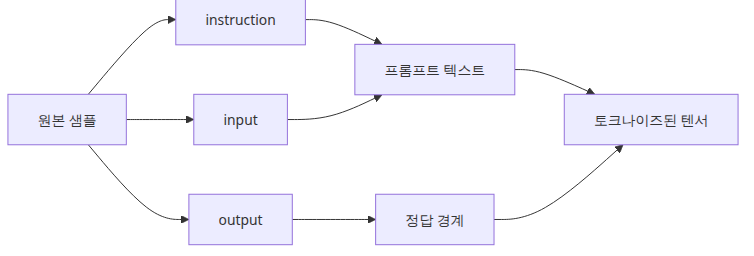
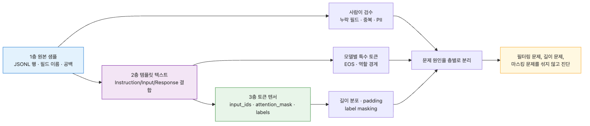
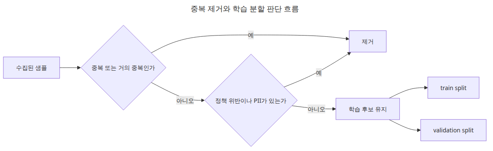

# 데이터셋 준비와 전처리

## 핵심 질문

파인튜닝 데이터셋을 어떻게 준비해야 학습이 의도대로 진행될까요?

이 글은 그 질문에 답하기 위해 데이터셋 준비의 핵심 결정과 운영 함정을 살펴봅니다.

## 이 글에서 다룰 문제

데이터셋 단계에서 가장 중요한 것은 양보다 **형식의 일관성**입니다. 모델이 무엇을 입력으로 보고, 어디까지를 응답으로 학습해야 하는지 애매하면 학습 손실이 내려가도 결과는 흐릿합니다. 같은 1,000개 샘플이라도 prompt 형식이 일관되면 LoRA r=8로 충분하고, 형식이 섞이면 r=64에 데이터를 5배 늘려도 수렴이 잘 되지 않습니다.

2편에서 형식을 정확히 잡아 두면 4편의 학습 루프, 5편의 평가, 6편의 서빙에서 같은 템플릿을 그대로 재사용할 수 있습니다. 반대로 2편을 대충 넘기면 4편에서 손실은 떨어지는데 5편에서 답변 품질이 이상하다는 모순적인 상황이 자주 생깁니다.

## Mental Model

데이터셋은 세 층으로 분리해서 다룹니다.

```
┌─────────────────────────────┐
│ Layer 1: 원본 샘플 (JSONL)   │  ← 사람이 읽고 검수하는 곳
├─────────────────────────────┤
│ Layer 2: 템플릿 적용 텍스트  │  ← prompt + response 한 문자열
├─────────────────────────────┤
│ Layer 3: 토큰화된 텐서       │  ← input_ids, attention_mask, labels
└─────────────────────────────┘
```

- **Layer 1**은 사람이 추가/수정/검수하는 영역입니다. 필드 이름, 줄바꿈, 줄 끝 공백까지 일관되어야 합니다.
- **Layer 2**는 모델별 chat template이 적용되어 한 문자열이 됩니다. Llama-3와 Qwen은 다른 special token을 씁니다.
- **Layer 3**은 학습 직전에 만들어집니다. `labels`에서 prompt 부분은 -100으로 마스킹해 loss 계산에서 빼야 합니다.

세 층을 분리해야 "필터링 문제"와 "토큰 길이 문제"와 "마스킹 문제"를 따로 진단할 수 있습니다.

## 핵심 개념

| 용어 | 의미 |
| --- | --- |
| Instruction format | `{instruction, input?, output}` 구조. Alpaca 계열이 표준 |
| Chat format | `[{role, content}, ...]` 구조. 멀티턴 대화에 적합 |
| Completion format | 단순 prefix → continuation. base model 학습에 가까움 |
| Label masking | prompt 부분을 -100으로 두어 loss에서 제외 |
| EOS token | 응답 종료 신호. 빠뜨리면 모델이 멈추는 법을 배우지 못함 |

## Before vs. After

**Before** — 데이터를 모았는데 어떤 행은 `prompt/response`, 어떤 행은 `q/a`, 어떤 행은 한 칼럼에 모두 들어 있습니다. 학습은 돌아가지만 평가에서 답변이 갑자기 끝나거나 같은 말을 반복합니다.

**After** — 모든 샘플이 동일한 instruction 템플릿을 거쳐 다음과 같은 한 문자열이 됩니다.

```
### Instruction:
파이썬 리스트를 뒤집는 두 가지 방법을 설명하세요.

### Input:
예제 코드 한 줄을 함께 보여주세요.

### Response:
lst[::-1]과 lst.reverse()를 쓸 수 있습니다.<eos>
```

prompt 끝(`### Response:` 직전까지)은 -100으로 마스킹되고, 뒤쪽 응답에만 loss가 걸립니다. EOS가 명시적으로 붙어 있어 추론 시 멈추는 법도 배웁니다.

## 데이터셋에서 먼저 고정할 것



*데이터셋 세 층과 경계 관리 구조*

파인튜닝 데이터는 보통 세 층으로 나뉩니다. **원본 샘플**, **프롬프트 템플릿을 적용한 텍스트**, **토크나이즈된 텐서**입니다. 이 세 층을 분리해서 생각해야 필터링 문제와 토큰 길이 문제를 따로 잡을 수 있습니다.



*데이터셋에서 먼저 고정할 것*

## 단계별 실습

### 1단계 — JSONL 원본 작성

```python
import json
from pathlib import Path

ROOT = Path(__file__).resolve().parent
DATA_PATH = ROOT / "toy.jsonl"

with DATA_PATH.open("w", encoding="utf-8") as file:
    file.write(json.dumps({
        "instruction": "파이썬 리스트를 뒤집는 두 가지 방법을 설명하세요.",
        "input": "예제 코드 한 줄을 함께 보여주세요.",
        "output": "lst[::-1]과 lst.reverse()를 쓸 수 있습니다.",
    }, ensure_ascii=False) + "\n")
```

### 2단계 — datasets로 로드

```python
from datasets import load_dataset

dataset = load_dataset("json", data_files=str(DATA_PATH), split="train")
print(dataset.column_names)   # ['instruction', 'input', 'output']
print(len(dataset))           # 1
```

`load_dataset()`은 캐시도 만들어 주므로, 같은 JSONL을 두 번째 로드할 때는 ms 단위로 끝납니다.

### 3단계 — 템플릿 적용

```python
TEMPLATE = (
    "### Instruction:\n{instruction}\n\n"
    "### Input:\n{input}\n\n"
    "### Response:\n{output}"
)

def render(example):
    return {"text": TEMPLATE.format(**example)}

dataset = dataset.map(render)
print(dataset[0]["text"][:120])
```

### 4단계 — 토크나이즈

```python
from transformers import AutoTokenizer

tokenizer = AutoTokenizer.from_pretrained("sshleifer/tiny-gpt2")
tokenizer.pad_token = tokenizer.eos_token

def tokenize(example):
    return tokenizer(
        example["text"],
        truncation=True,
        padding="max_length",
        max_length=64,
    )

tokenized = dataset.map(tokenize, batched=True)
print(tokenized.column_names)
print(len(tokenized[0]["input_ids"]))   # 64
```

`padding="max_length"`와 `max_length=64`는 학습용 설정이 아니라 **길이 통계를 빨리 보기 위한** 실습용입니다. 실제 학습에서는 dynamic padding(데이터 콜레이터)로 대체합니다.

## 이 코드에서 봐야 할 것


*포맷 검증과 토큰 길이 확인 순서 흐름*

- `datasets.load_dataset()`을 쓰면 실전에서 받는 JSONL 구조를 그대로 흉내 낼 수 있습니다.
- 템플릿 적용과 토크나이즈를 분리하면 나중에 모델별 chat template으로 교체하기 쉽습니다.
- 예제는 `padding="max_length"`, `max_length=64`로 고정해 아주 작은 실습에서도 길이 통계를 바로 볼 수 있게 했습니다.
- 토크나이저에 `pad_token`이 없으면 학습이 죽습니다. GPT-2 계열은 `eos_token`을 그대로 재사용하는 것이 표준입니다.

## 자주 하는 실수



*중복 제거와 학습 분할 판단 흐름*

- **데이터가 많을수록 좋다고 가정** — 중복 답변이 많거나 형식이 섞이면 작은 모델은 더 빨리 망가집니다. 5,000개의 노이즈 데이터보다 500개의 일관된 데이터가 LoRA에는 거의 항상 더 낫습니다.
- **`labels`를 데이터셋 단계에서 만들지 않음** — 정상입니다. 4편에서 데이터 콜레이터가 prompt를 -100으로 마스킹하면서 만듭니다.
- **EOS 토큰 누락** — 응답 끝에 `<eos>`가 없으면 모델이 멈추는 법을 배우지 못합니다. 추론에서 답변이 무한히 이어지면 가장 먼저 의심해야 할 지점입니다.
- **`max_length`를 너무 짧게** — `max_length=64`로 학습하고 추론 시 256짜리 응답을 기대하면 잘립니다. 학습 데이터의 95퍼센타일을 보고 결정합니다.
- **train/eval split을 하지 않음** — 같은 데이터로 평가하면 5편에서 모델이 외운 답을 채점하게 됩니다. 최소 90/10 split을 두세요.

## 실무 적용

- **샘플 50개부터 시작**: 작은 세트로 토크나이즈 길이 분포, prompt 누락, EOS 유무를 점검한 뒤 본 데이터셋을 만듭니다.
- **golden set 따로 보관**: 평가에 절대 학습으로 쓰지 않을 100~200개의 황금 세트를 분리해 보관합니다. 5편에서 이 세트가 결정적입니다.
- **데이터셋 버전 관리**: `dataset_v2025-04-30.jsonl`처럼 날짜를 파일명에 박고, 모델 가중치 메타에 함께 기록합니다.
- **PII/중복 제거 자동화**: regex 기반 PII 마스킹과 MinHash 중복 제거 정도는 첫 실험부터 깔아 둡니다. 나중에 도입하면 모든 실험을 다시 돌려야 합니다.
- **샘플 길이 분포 시각화**: `tokenized.with_format("pandas")["input_ids"].apply(len).describe()`만 한 번 찍어 보면 `max_length` 결정이 즉시 끝납니다.

## 실무에서는 이렇게 생각한다

데이터셋 준비를 가볍게 여기고 모델 학습으로 바로 넘어가는 팀이 많습니다. 하지만 경험이 쌓일수록 "데이터 30분, 학습 5분"이 아니라 "데이터 3일, 학습 30분"이 현실에 가깝다는 것을 깨닫게 됩니다. 형식이 흔들리면 LoRA rank를 아무리 올려도 수렴이 불안정하고, 형식이 일관되면 rank 8로도 충분한 경우가 대부분입니다.

팀 단위로 일할 때는 데이터셋 스키마를 문서화하고 버전을 관리하는 것이 모델 실험 속도를 결정합니다. 스키마가 바뀔 때마다 이전 실험 결과와의 비교가 무의미해지기 때문입니다. 처음부터 PII 마스킹과 중복 제거 파이프라인을 깔아 두면, 나중에 데이터를 10배 늘려도 같은 품질 기준을 유지할 수 있습니다.

## 체크리스트

- [ ] JSONL 원본 샘플이 instruction, input, output 구조로 정리되었다.
- [ ] `datasets.load_dataset()`으로 실제 파일을 읽어 왔다.
- [ ] 토크나이저 전처리 후 컬럼과 길이를 확인했다.
- [ ] `pad_token`이 설정되어 있고, 응답 끝에 EOS가 붙도록 했다.
- [ ] train/eval split이 분리되어 있다.
- [ ] 다음 글에서 어떤 모듈에 LoRA를 꽂을지 데이터 길이와 함께 생각해 봤다.

## 정리 · 다음 글

데이터셋 준비의 핵심은 모델이 배워야 할 입출력 경계를 분명히 만드는 것입니다. 작은 샘플로 먼저 구조를 맞춰 두면 이후 학습 루프를 디버깅할 때 훨씬 덜 흔들립니다.

다음 글(3편)에서는 LoRA 어댑터 구성으로 넘어갑니다. `LoraConfig`의 `r`, `alpha`, `target_modules`, `dropout`이 학습 결과에 어떻게 작용하는지 한 줄씩 파헤칩니다.

<!-- toc:begin -->
## 시리즈 목차

- [LLM 파인튜닝 입문](./01-intro.md)
- **데이터셋 준비와 전처리 (현재 글)**
- LoRA 어댑터 구성 (예정)
- 학습 루프와 하이퍼파라미터 (예정)
- 모델 평가 (예정)
- 모델 서빙 (예정)

<!-- toc:end -->

---

## 참고 자료

- [Hugging Face Datasets documentation](https://huggingface.co/docs/datasets)
- [Instruction tuning overview](https://arxiv.org/abs/2203.02155)
- [Alpaca dataset format](https://github.com/tatsu-lab/stanford_alpaca#data-release)
- [Llama 3 chat template](https://huggingface.co/docs/transformers/main/en/chat_templating)

Tags: Fine-tuning, LoRA, LLM, Python
