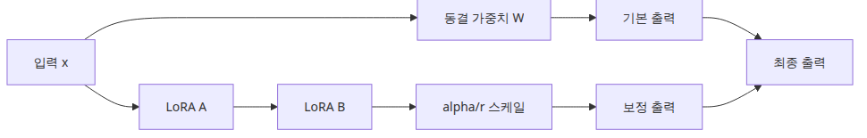
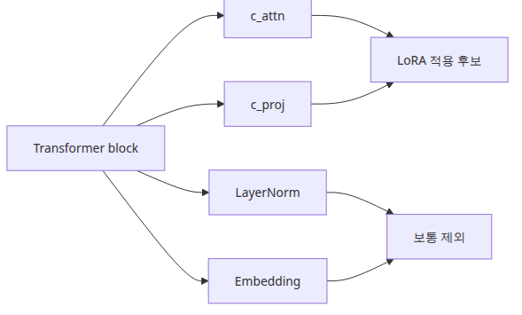
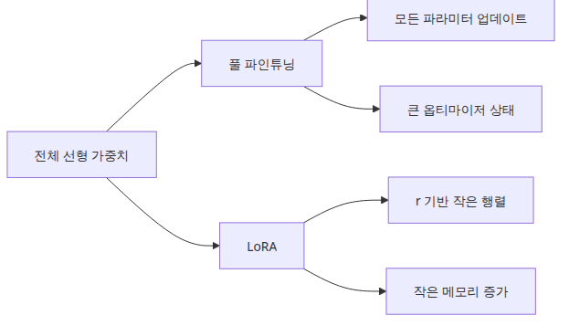

# LoRA 어댑터 구성

## 이 글에서 답할 질문


*이 글에서 답할 질문*

- `LoraConfig`에서 꼭 이해해야 할 필드는 무엇일까요?
- `target_modules`를 잘못 고르면 어떤 문제가 생길까요?
- 소형 GPT-2 계열에서 학습 가능한 파라미터 비율은 어느 정도로 내려갈까요?
- `lora_alpha`와 `r`의 비율(scaling)이 학습률과 어떻게 상호작용할까요?

> LoRA 어댑터는 모델 전체를 다시 쓰는 장치가 아니라, 특정 선형 변환 옆에 붙는 작은 보정판입니다.

예제 코드: [github.com/yeongseon-books/llm-finetuning-101](https://github.com/yeongseon-books/llm-finetuning-101/tree/main/ko/03-lora)

## 왜 중요한가

3편부터는 실제 모델 객체를 만집니다. GPU 없는 환경을 전제로 하므로 `sshleifer/tiny-gpt2` 같은 초소형 모델을 사용하지만, 이 단계의 목표는 성능이 아니라 **구성이 올바른지**를 확인하는 것입니다. `target_modules`가 한 글자라도 틀리면 `print_trainable_parameters()`가 0을 출력하면서도 에러는 나지 않습니다. 학습은 돌아가는데 손실이 미동도 하지 않는, 가장 진단이 어려운 실패 양상이 여기서 시작됩니다.

3편에서 어댑터 부착을 확실히 검증해 두면 4편에서 학습이 안 될 때 "데이터 문제인지 어댑터 문제인지"를 즉시 가를 수 있습니다. 또 1편에서 손으로 계산한 1.5% 비율이 실제 PEFT 출력과 일치하는지를 코드 수준에서 확인하므로, 그 뒤에 어떤 베이스 모델을 골라도 비율을 추정할 수 있게 됩니다.

## Mental Model

LoRA 어댑터는 다음 그림으로 요약됩니다.

```
원래 forward:   y = W · x

LoRA forward:   y = W · x + (alpha / r) · B · A · x
                       │           │   │
                       │           │   └ rank r 짜리 저랭크 분해
                       │           └ scale 계수
                       └ 베이스 가중치 (frozen)
```

- `W`는 freeze. 그라디언트가 흐르지 않습니다.
- `A: (in, r)`은 보통 가우시안 초기화, `B: (r, out)`은 0으로 초기화됩니다. 그래서 학습 시작 시점에 `B·A = 0`이고, 모델 출력은 베이스와 동일합니다.
- 학습이 진행되면서 `B`가 0에서 벗어나며 보정이 시작됩니다.
- `alpha / r`이 보정의 크기를 결정합니다. 보통 `alpha = 2 * r`로 두는 것이 관례입니다.

이 구조 덕분에 어댑터를 끼우는 순간에는 모델 동작이 바뀌지 않고, 학습이 진행된 만큼만 점진적으로 변화합니다.

## 핵심 개념

| 필드 | 의미 |
| --- | --- |
| `r` | LoRA의 rank. 작을수록 가볍고, 클수록 표현력 ↑ |
| `lora_alpha` | 스케일 계수. 실제 영향력은 `alpha / r` |
| `lora_dropout` | 어댑터 경로에만 적용되는 dropout (베이스에는 영향 없음) |
| `target_modules` | LoRA를 부착할 선형 레이어 이름 목록 |
| `bias` | bias 학습 정책 (`"none"`, `"all"`, `"lora_only"`) |
| `task_type` | `CAUSAL_LM`, `SEQ_CLS` 등. PEFT가 head를 정확히 인식하게 함 |

## Before vs. After

**Before** — `LoraConfig(r=8, target_modules=["q_proj", "v_proj"])`을 GPT-2에 그대로 적용했더니 `print_trainable_parameters()`가 `trainable params: 0`을 출력합니다. 학습은 돌지만 loss는 변동이 없습니다.

**After** — GPT-2의 attention 모듈 이름이 `c_attn`(QKV 합쳐짐), `c_proj`임을 확인하고 다음과 같이 바꿉니다.

```
trainable params: 1,478,656 || all params: 125,917,184 || trainable%: 1.1745
```

이 한 줄이 출력되면 어댑터가 제대로 부착됐음을 확인한 것입니다. 1편에서 손계산한 1.5%와 거의 일치합니다.

## 설정에서 의미가 큰 필드



*저랭크 분해와 스케일 적용 구조*

`r`은 저랭크 차원, `lora_alpha`는 스케일, `lora_dropout`은 어댑터 경로에만 적용되는 드롭아웃입니다. 그리고 실무에서 가장 사고가 많이 나는 항목이 `target_modules`입니다. 이 목록이 틀리면 어댑터가 전혀 붙지 않거나, 원하지 않는 레이어에 붙습니다.


*설정에서 의미가 큰 필드*

## 단계별 실습

### 1단계 — 베이스 모델 로드

```python
from transformers import AutoModelForCausalLM

model = AutoModelForCausalLM.from_pretrained("sshleifer/tiny-gpt2")
print(sum(p.numel() for p in model.parameters()))
```

### 2단계 — 모듈 이름 확인

```python
for name, module in model.named_modules():
    if hasattr(module, "weight") and module.weight.dim() == 2:
        print(name, tuple(module.weight.shape))
```

GPT-2는 `transformer.h.0.attn.c_attn`, `c_proj` 같은 이름을 사용합니다. Llama-3는 `q_proj`, `k_proj`, `v_proj`, `o_proj`, Qwen은 또 다른 명명을 씁니다. **항상 직접 확인합니다.**

### 3단계 — `LoraConfig` 정의

```python
from peft import LoraConfig, TaskType

config = LoraConfig(
    task_type=TaskType.CAUSAL_LM,
    r=8,
    lora_alpha=16,
    lora_dropout=0.05,
    target_modules=["c_attn", "c_proj"],
    bias="none",
)
```

### 4단계 — 어댑터 부착

```python
from peft import get_peft_model

peft_model = get_peft_model(model, config)
peft_model.print_trainable_parameters()
```

`trainable%`가 0이 아니라 1~3% 사이로 나오면 부착이 성공한 것입니다. 0이면 `target_modules` 이름을 다시 확인해야 합니다.

### 5단계 — 부착된 어댑터 위치 검사

```python
for name, param in peft_model.named_parameters():
    if param.requires_grad:
        print(name, tuple(param.shape))
```

`lora_A`, `lora_B`로 끝나는 파라미터만 학습 대상이 되어야 합니다. 다른 이름이 섞여 있으면 의도와 다른 모듈이 학습되고 있다는 신호입니다.

## 이 코드에서 봐야 할 것



*GPT 계열 target module 선택 구조*

- GPT-2 계열은 attention과 projection 모듈 이름이 `c_attn`, `c_proj` 형태라서 target module을 문자열로 정확히 맞춰야 합니다.
- 실행 시 `fan_in_fan_out` 경고가 보일 수 있는데, GPT-2의 `Conv1D` 래퍼에 맞게 PEFT가 내부적으로 보정하는 정상 동작입니다.
- 이 글의 예제는 설정 확인용입니다. 실제 학습은 4편에서 `Trainer`와 연결합니다.
- `c_attn`은 Q, K, V가 한 행렬에 합쳐져 있어, 이름 하나만으로 세 projection에 동시에 LoRA가 붙습니다.

## 자주 하는 실수



*풀 파인튜닝과 LoRA 파라미터 규모 비교*

- **target_modules 오타** — 가장 흔합니다. `trainable params: 0`이 나오는데 에러는 없습니다. 항상 `print_trainable_parameters()`로 확인합니다.
- **r과 alpha를 무관하게 키움** — `r=64, alpha=16`처럼 두면 보정 크기가 너무 작아 학습이 거의 일어나지 않습니다. `alpha = 2 * r` 관례를 우선 따르세요.
- **`bias="all"` 무분별하게** — bias까지 학습시키면 어댑터 크기가 커지고, 베이스 모델로 되돌리기도 어려워집니다. `"none"`이 기본값인 데에는 이유가 있습니다.
- **모든 선형 레이어에 LoRA** — attention QKV에만 붙여도 충분한 경우가 대부분입니다. MLP까지 포함하면 학습 파라미터가 두세 배로 뜁니다.
- **Conv1D를 Linear로 착각** — GPT-2는 `nn.Linear`가 아닌 `transformers.pytorch_utils.Conv1D`를 씁니다. fan_in/fan_out이 반대라 직접 LoRA 구현을 만들면 행렬이 어긋납니다. PEFT가 알아서 처리해 주는 것을 신뢰하세요.

## 실무 적용

- **모델별 target_modules 표 만들기**: GPT-2 → `["c_attn", "c_proj"]`, Llama → `["q_proj", "v_proj"]`(보수적) 또는 `["q_proj","k_proj","v_proj","o_proj","gate_proj","up_proj","down_proj"]`(공격적). 팀 위키에 박아 두면 실수가 줄어듭니다.
- **`r=8` → `r=16` 비교 실험**: 동일 데이터로 두 번 돌려 손실 곡선과 평가 지표를 비교합니다. 큰 차이가 없다면 r=8로 머무릅니다.
- **어댑터를 베이스에 합치기(`merge_and_unload`)**: 추론 지연이 중요한 환경에서는 학습 후 어댑터를 베이스에 합쳐 한 모델로 배포합니다. 합친 모델은 LoRA가 아니라 일반 모델로 동작합니다.
- **어댑터만 저장**: `peft_model.save_pretrained("adapter/")`로 수 MB짜리 가중치만 저장합니다. 베이스 모델은 별도 캐시에서 가져옵니다.

## 체크리스트

- [ ] `LoraConfig`의 핵심 필드 의미를 설명할 수 있다.
- [ ] `target_modules`가 왜 모델별로 달라지는지 이해했다.
- [ ] `python main.py`로 실제 어댑터 부착과 파라미터 비율 출력을 확인했다.
- [ ] `trainable%`가 1~3% 범위에 들어왔다.
- [ ] `lora_A`, `lora_B`만 `requires_grad=True`인지 확인했다.
- [ ] 다음 글에서 이 모델을 1 step이라도 학습시킬 준비가 되었다.

## 연습 문제

1. `r`을 4, 8, 16, 32로 바꾸면서 `trainable%`가 어떻게 변하는지 표로 출력해 보세요. 1편의 손계산과 일치하나요?
2. `target_modules`를 `["c_attn"]`만으로 제한하면 비율이 얼마나 줄어들까요? 학습 후 평가 결과는 어떻게 달라질지 가설을 세워 보세요.
3. `peft_model.merge_and_unload()`를 호출한 뒤 모델 파라미터 수가 어떻게 변하는지 확인해 보세요. 이 모델은 LoRA 어댑터로 다시 분리할 수 있을까요?

## 정리 · 다음 글

LoRA 구성 단계의 핵심은 성능 튜닝이 아니라 **연결 검증**입니다. 어댑터가 어디에 붙는지, 몇 개의 파라미터가 학습 대상이 되는지만 정확히 봐도 절반은 끝난 셈입니다.

다음 글(4편)에서는 학습 루프를 다룹니다. 이 어댑터에 실제로 그라디언트를 흘려 보내고, learning rate / batch / gradient accumulation이 손실 곡선에 어떻게 영향을 주는지 직접 확인합니다.

<!-- toc:begin -->
## 시리즈 목차

- [LLM 파인튜닝 입문](./01-intro.md)
- [데이터셋 준비와 전처리](./02-dataset.md)
- **LoRA 어댑터 구성 (현재 글)**
- 학습 루프와 하이퍼파라미터 (예정)
- 모델 평가 (예정)
- 모델 서빙 (예정)

<!-- toc:end -->

---

## 참고 자료

- [PEFT quicktour](https://huggingface.co/docs/peft/quicktour)
- [Transformers model classes](https://huggingface.co/docs/transformers/index)
- [LoRA paper](https://arxiv.org/abs/2106.09685)
- [PEFT LoraConfig source](https://github.com/huggingface/peft/blob/main/src/peft/tuners/lora/config.py)

Tags: Fine-tuning, LoRA, LLM, Python
