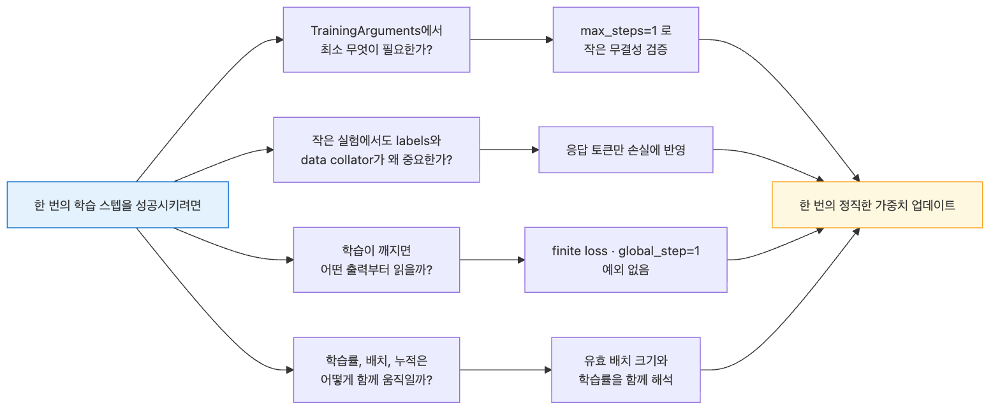
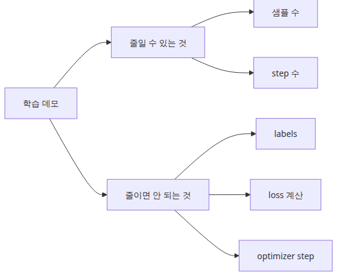
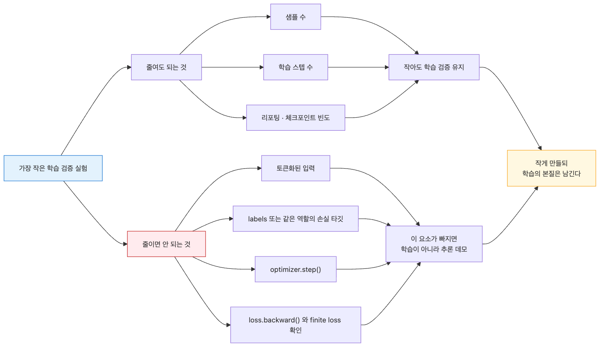
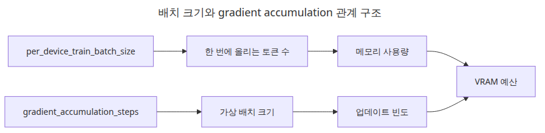
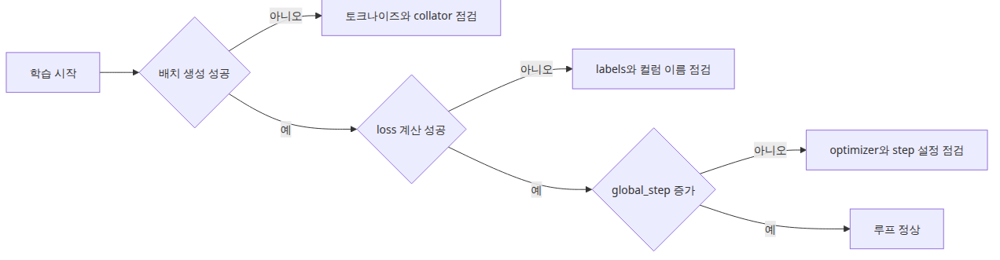

# 학습 루프와 하이퍼파라미터

학습 루프는 프레임워크 마법처럼 보일 때보다, 한 스텝 안에서 무슨 일이 일어나는지 쪼개 볼 때 훨씬 디버깅하기 쉬워집니다.

이 글은 LLM Finetuning 101 시리즈의 네 번째 글입니다.

여기서는 학습 루프 한 번을 이루는 여섯 단계로 문제를 나눠 보고, 수렴과 하이퍼파라미터를 원리부터 생각하는 습관을 잡겠습니다. 아직 목표는 낮은 손실 수치가 아닙니다. 실제 가중치 업데이트가 한 번은 정직하게 일어났다는 사실을 확인하는 것이 먼저입니다.

4편은 시리즈에서 처음으로 실제 가중치 업데이트가 일어나는 글입니다. 하지만 목표는 여전히 높은 정확도가 아니라 **학습 루프가 살아 있음을 증명하는 것**입니다. 한 번의 end-to-end 스텝만 검증해 두어도, 이후 실패를 환경 문제, 데이터 문제, 하이퍼파라미터 문제로 훨씬 빨리 나눌 수 있습니다.

## 이 글에서 다룰 문제



*이 글에서 다룰 문제*

- `TrainingArguments`에서 한 번의 학습 스텝을 돌리려면 최소 무엇을 설정해야 할까요?
- 작은 실험에서도 `labels`와 데이터 콜레이터가 왜 중요할까요?
- 학습 루프를 디버깅할 때 어떤 출력부터 읽어야 할까요?
- 학습률, 배치 크기, 그래디언트 누적은 어떻게 서로 얽혀 있을까요?

> 학습 루프는 거대한 블랙박스가 아닙니다. 토큰화된 배치를 모델에 넣고 손실을 한 번 줄이는 동작의 반복입니다.

예제 코드: [github.com/yeongseon-books/llm-finetuning-101](https://github.com/yeongseon-books/llm-finetuning-101/tree/main/en/04-training)

## 왜 이 글이 중요한가

4편은 실제 가중치가 바뀌는 첫 단계입니다. 그렇다고 여기서부터 정확도를 올리는 게임으로 들어가면 안 됩니다. 먼저 필요한 것은 학습 스텝이 한 번이라도 정상적으로 끝난다는 사실입니다. 이 무결성 검증이 끝나야 이후의 모든 조정이 의미를 가집니다.

또 4편은 하이퍼파라미터를 한꺼번에 여러 개 건드리는 습관을 끊는 역할도 합니다. 학습률을 10배 바꾸고 배치 크기를 4배 바꾼 뒤 결과를 보면 무엇이 손실을 움직였는지 설명할 수 없습니다. 여기서 한 번에 하나만 바꾸는 연습을 해 두면 5편의 평가에서도 원인 추적이 훨씬 빨라집니다.

## 멘탈 모델

학습 루프 한 스텝은 여섯 단계로 분해할 수 있습니다.

```text
1. batch = data_collator([sample_i, sample_j, ...])
2. outputs = model(input_ids=..., attention_mask=..., labels=...)
3. loss = outputs.loss
4. loss.backward()                       # compute gradients
5. optimizer.step()                       # update parameters
6. lr_scheduler.step(); optimizer.zero_grad()
```

`Trainer`는 이 여섯 단계를 감싸는 래퍼일 뿐입니다. 어느 한 단계라도 깨지면 전체 스텝이 깨집니다. 그래서 이 글의 1-step 실행은 "위 여섯 단계가 적어도 한 번은 모두 통과했다"는 무결성 확인입니다.

추가로 꼭 기억할 관계는 두 가지입니다.

- **유효 배치 크기** = `per_device_train_batch_size × gradient_accumulation_steps × num_devices`
- 학습률은 유효 배치 크기와 함께 움직입니다. 배치를 4배 키웠다면 학습률도 대략 `√4`배에서 4배 사이를 검토해야 합니다.

## 핵심 개념

| 항목 | 의미 |
| --- | --- |
| `labels` | 다음 토큰 예측의 정답입니다. causal LM에서는 보통 `input_ids`를 복사하고, 프롬프트 구간은 `-100`으로 마스킹합니다. |
| Data collator | 길이가 다른 샘플을 하나의 배치로 묶고, 패딩과 마스킹을 한곳에서 처리합니다. |
| `learning_rate` | LoRA에서는 풀 파인튜닝보다 큰 값인 `1e-4 ~ 5e-4`를 자주 사용합니다. |
| `per_device_train_batch_size` | 디바이스 한 개당 한 번의 forward에 들어가는 샘플 수입니다. |
| `gradient_accumulation_steps` | 메모리가 부족할 때 작은 배치를 여러 번 누적해 큰 배치 효과를 냅니다. |
| `max_steps` / `num_train_epochs` | 둘 다 설정하면 `max_steps`가 우선합니다. 작은 검증에서는 `max_steps`가 해석하기 쉽습니다. |
| `warmup_ratio` | 초기 스텝에서 학습률을 0에서 선형으로 끌어올리는 비율입니다. |

## Before vs. After

**Before**

`Trainer.train()`을 호출하자마자 `KeyError: 'labels'`가 나거나, 손실이 NaN으로 터집니다. 어디부터 봐야 할지 막막합니다.

**After**

이 글의 1-step 패턴을 따르면 아래와 같은 한 줄이 나옵니다.

```text
{'train_runtime': 1.42, 'train_samples_per_second': 1.41,
 'train_steps_per_second': 0.7, 'train_loss': 8.7421, 'epoch': 0.5}
```

여기서 8.74라는 숫자 자체는 중요하지 않습니다. 중요한 것은 실행이 끝났는지, 손실이 NaN이나 Inf가 아닌 유한한 값인지, 그리고 `global_step=1`이 찍혔는지입니다. 이 세 조건이 맞으면 환경, 데이터, 어댑터, 옵티마이저가 최소 한 번은 함께 정상 동작했다고 볼 수 있습니다.

## 줄여도 되는 것과 줄이면 안 되는 것



*줄일 수 있는 요소와 유지해야 할 요소*

샘플 수와 스텝 수는 줄일 수 있습니다. 하지만 **토큰화된 입력, labels, 옵티마이저 스텝, 손실 계산**은 줄이면 안 됩니다. 하나라도 빠지면 그것은 학습 검증이 아니라 추론 테스트가 됩니다. 그래서 이 글의 가장 작은 예제도 학습 관련 구성요소만큼은 그대로 유지합니다.



*줄여도 되는 것과 줄이면 안 되는 것*

## 단계별 설명

### 1단계 — 두 줄짜리 데이터셋을 만듭니다

```python
from datasets import Dataset

texts = [
    "Q: How do I sort a Python list? A: Use sorted(lst) or lst.sort().",
    "Q: What does HTTP 404 mean? A: The requested resource was not found.",
]

rows = []
for text in texts:
    encoded = tokenizer(text, truncation=True, padding="max_length", max_length=64)
    encoded["labels"] = encoded["input_ids"].copy()
    rows.append(encoded)

dataset = Dataset.from_list(rows)
```

`labels = input_ids.copy()`는 가장 단순한 시작점입니다. 실제 운영에서는 프롬프트 구간을 `-100`으로 마스킹해 응답에만 손실이 걸리도록 만듭니다.

### 2단계 — `TrainingArguments`를 정의합니다

```python
from transformers import TrainingArguments

args = TrainingArguments(
    output_dir="artifacts",
    per_device_train_batch_size=2,
    max_steps=1,
    learning_rate=5e-4,
    save_strategy="no",
    report_to=[],
)
```

`report_to=[]`는 wandb나 tensorboard와의 자동 연결을 끕니다. 작은 검증에서는 외부 리포팅 없이 빠르게 끝나는 편이 더 해석하기 쉽습니다.

### 3단계 — `Trainer`를 실행합니다

```python
from transformers import Trainer

trainer = Trainer(model=peft_model, args=args, train_dataset=dataset)
trainer.train()
```

### 4단계 — 결과를 확인합니다

출력에 `'train_loss': <number>`와 `'global_step': 1`이 보이면 최소 무결성 검증은 통과한 것입니다. 손실이 정확히 0.0이거나 NaN이면 데이터, 마스킹, 혹은 dtype 설정 중 하나가 잘못됐을 가능성이 큽니다.

### 5단계 — 유효 배치 크기 실험을 해 봅니다

```python
args.per_device_train_batch_size = 1
args.gradient_accumulation_steps = 2
args.max_steps = 1
```

위 설정은 유효 배치 크기가 같으므로 손실 출력도 거의 비슷해야 합니다. 큰 차이가 난다면 어딘가에 데이터 누수나 설정 차이가 숨어 있는 것입니다.

## 바로 돌려 볼 스모크 테스트

이 장에서 가장 실용적인 검증은 한 번의 진짜 가중치 업데이트를 직접 돌려 보는 것입니다. 아래 스크립트는 이후에 키울 요소를 그대로 둔 채, 딱 한 스텝만 학습합니다.

```python
from datasets import Dataset
from peft import LoraConfig, TaskType, get_peft_model
from transformers import (
    AutoModelForCausalLM,
    AutoTokenizer,
    DataCollatorForLanguageModeling,
    Trainer,
    TrainingArguments,
)

tokenizer = AutoTokenizer.from_pretrained("sshleifer/tiny-gpt2")
tokenizer.pad_token = tokenizer.eos_token

texts = [
    "Q: How do I sort a Python list? A: Use sorted(lst) or lst.sort().",
    "Q: What does HTTP 404 mean? A: The requested resource was not found.",
]

rows = []
for text in texts:
    encoded = tokenizer(text, truncation=True, padding="max_length", max_length=64)
    encoded["labels"] = encoded["input_ids"].copy()
    rows.append(encoded)

dataset = Dataset.from_list(rows)

base = AutoModelForCausalLM.from_pretrained("sshleifer/tiny-gpt2")
config = LoraConfig(
    task_type=TaskType.CAUSAL_LM,
    r=8,
    lora_alpha=16,
    lora_dropout=0.05,
    target_modules=["c_attn", "c_proj"],
    bias="none",
)
model = get_peft_model(base, config)

args = TrainingArguments(
    output_dir="artifacts",
    per_device_train_batch_size=2,
    max_steps=1,
    learning_rate=5e-4,
    save_strategy="no",
    logging_steps=1,
    report_to=[],
)

trainer = Trainer(
    model=model,
    args=args,
    train_dataset=dataset,
    data_collator=DataCollatorForLanguageModeling(tokenizer=tokenizer, mlm=False),
)

metrics = trainer.train().metrics
print(metrics)
```

실행은 이렇게 합니다.

```bash
python main.py
```

**예상 출력:**

```text
{'train_runtime': 1.2, 'train_samples_per_second': 1.6,
 'train_steps_per_second': 0.8, 'train_loss': 8.7, 'epoch': 1.0}
```

정확한 런타임과 손실 값은 하드웨어와 시드에 따라 달라질 수 있습니다. 대신 아래 네 가지만 확인하면 충분합니다.

1. 프로세스가 오류 없이 끝나는가
2. `train_loss`가 유한한 수인가
3. `train_steps_per_second`가 0이 아닌가
4. 학습 스텝이 정확히 한 번 완료됐는가

## 스텝이 깨졌을 때 먼저 볼 것

| 증상 | 먼저 볼 곳 | 흔한 원인 |
| --- | --- | --- |
| `KeyError: 'labels'` | 데이터셋 컬럼 | `labels`를 만들지 않았거나 이름을 잘못 썼습니다. |
| 1스텝째부터 `NaN` | 학습률, dtype | 학습률이 너무 크거나 입력이 깨졌을 수 있습니다. |
| 학습은 도는데 손실이 전혀 안 움직임 | 어댑터 연결 | `target_modules`가 틀렸거나 학습 파라미터가 0입니다. |
| CUDA OOM | 유효 배치 크기 | 배치, 시퀀스 길이, 누적 스텝 중 하나가 과합니다. |
| 스텝이 지나치게 느림 | 모델 로드, 패딩 길이 | 베이스 모델이 너무 크거나 `max_length`가 불필요하게 큽니다. |

## 디버깅이 가능한 스윕 순서

1스텝 스모크 테스트가 통과한 뒤에는 바꾸는 순서도 중요합니다.

1. **데이터셋을 고정한 채** `learning_rate`를 로그 스케일로 훑습니다.
2. **학습률을 고정한 채** 그래디언트 누적으로 유효 배치 크기를 바꿉니다.
3. **둘 다 고정한 채** `max_steps`나 epoch를 늘립니다.
4. **그 다음에야** LoRA rank나 target module 범위를 비교합니다.

이 순서를 지키면 결과가 나빠졌을 때 원인을 한 축으로 좁힐 수 있습니다. 여러 축을 동시에 바꾸면 "왜 나빠졌는가"를 말할 수 없게 됩니다.

## 이 코드에서 봐야 할 것



*배치 크기와 그래디언트 누적의 관계*

- `labels = input_ids.copy()`는 causal LM에서 다음 토큰 손실을 계산하기 위한 최소 구성입니다.
- `max_steps=1`이어도 backward와 optimizer step은 실제로 실행됩니다.
- 이 예제에서는 `train_loss`와 `global_step`만 확인해도 충분합니다. 숫자의 크기보다 루프가 끝까지 완주했는지가 더 중요합니다.
- `report_to=[]`는 작은 검증을 깔끔하게 유지해 줍니다.

## 자주 하는 실수



*학습 디버깅에서 먼저 볼 출력 판단 흐름*

- **샘플이 적다고 콜레이터를 생략하는 실수**: 길이가 다른 샘플이 섞이면 바로 깨집니다. 작은 실험에서도 `DataCollatorForLanguageModeling`을 쓰는 편이 안전합니다.
- **손실 절대값만 보는 실수**: 작은 모델로 1스텝 돌릴 때 손실이 8~10인 것은 이상하지 않습니다. 절대값보다 NaN 여부와 추세를 봐야 합니다.
- **컬럼 이름을 잘못 쓰는 실수**: `Trainer`는 `input_ids`, `attention_mask`, `labels`가 아닌 컬럼을 조용히 버립니다. 오타가 있으면 학습이 되는 척만 합니다.
- **학습률을 한 번에 크게 바꾸는 실수**: `5e-4`에서 `5e-3`로 바로 올리면 NaN이 나기 쉽습니다. 2배나 3배씩 움직이며 관찰하는 편이 낫습니다.
- **`save_strategy="epoch"`를 그대로 두는 실수**: 작은 검증인데도 체크포인트가 빠르게 쌓여 디스크를 잠식합니다. 이런 검증에서는 `"no"`가 맞습니다.
- **fp16/bf16을 무시하는 실수**: BF16을 지원하는 GPU에서는 메모리와 속도 이점이 큽니다. 다만 이 글의 작은 검증에서는 필수는 아닙니다.

## 실무 메모

- **3-step 스모크 테스트를 자동화합니다**: PR마다 세 스텝 정도 돌려 손실이 유한한 숫자인지, 스텝이 실제로 증가하는지 확인합니다.
- **학습률은 로그 스케일로 훑습니다**: `{1e-5, 5e-5, 1e-4, 5e-4, 1e-3}` 정도면 충분한 정보가 나옵니다.
- **그래디언트 누적을 적극 사용합니다**: 메모리가 batch=2까지만 허용해도 `gradient_accumulation_steps=8`로 유효 배치를 키울 수 있습니다.
- **평가는 스텝 단위로 넣습니다**: `eval_steps=50` 같은 설정은 문제가 언제 시작됐는지 더 빨리 보여 줍니다.
- **체크포인트 정책을 먼저 정합니다**: `save_total_limit=2`, `load_best_model_at_end=True` 같은 규칙은 5편 평가와 자연스럽게 연결됩니다.

## 체크리스트

- [ ] `TrainingArguments`의 필수 필드를 직접 읽고 수정할 수 있습니다.
- [ ] `labels`가 왜 필요한지 설명할 수 있습니다.
- [ ] `python main.py`를 실행해 1-step 학습 손실이 출력되는지 확인했습니다.
- [ ] 손실이 NaN이 아닌 유한한 숫자였습니다.
- [ ] 유효 배치 크기 공식 `per_device × accum × devices`를 설명할 수 있습니다.
- [ ] 같은 모델을 다음 글에서 평가할 준비가 되어 있습니다.

## 연습 문제

1. `learning_rate`를 `1e-5`, `1e-4`, `1e-3`로 바꿔 5스텝씩 실행해 보세요. 어느 지점에서 NaN이 나타나나요?
2. `per_device_train_batch_size=1, gradient_accumulation_steps=4`와 `per_device_train_batch_size=4, gradient_accumulation_steps=1`을 같은 학습률로 실행해 보세요. 손실 곡선이 비슷한가요? 다르다면 가능한 이유를 적어 보세요.
3. 프롬프트 구간을 `-100`으로 마스킹하는 콜레이터를 만들어 보세요. 마스킹 전후 손실이 어떻게 달라지나요?

## 정리 · 다음 글

학습 루프는 생각보다 훨씬 작은 단위로 검증할 수 있습니다. 한 스텝만 성공해도 이후에 키워야 할 것은 데이터 양과 학습 시간이지, 기본 구조가 아닙니다. 환경, 데이터, 어댑터, 옵티마이저 중 어디가 깨졌는지는 보통 바로 이 첫 스텝에서 신호가 나옵니다.

다음 글인 5편에서는 평가를 다룹니다. perplexity를 빠른 기준선으로 사용하고, 골든 세트 기반의 정성·정량 평가를 어떻게 함께 돌릴지 코드로 확인하겠습니다.

<!-- toc:begin -->
## 시리즈 목차

- [LLM 파인튜닝 입문](./01-intro.md)
- [데이터셋 준비와 전처리](./02-dataset.md)
- [LoRA 어댑터 구성](./03-lora.md)
- **학습 루프와 하이퍼파라미터 (현재 글)**
- 모델 평가 (예정)
- 모델 서빙 (예정)

<!-- toc:end -->

---

## 참고 자료

- [예제 저장소 — llm-finetuning-101](https://github.com/yeongseon-books/llm-finetuning-101)
- [Transformers Trainer documentation](https://huggingface.co/docs/transformers/main_classes/trainer)
- [TrainingArguments reference](https://huggingface.co/docs/transformers/main_classes/trainer#transformers.TrainingArguments)
- [DataCollatorForLanguageModeling](https://huggingface.co/docs/transformers/main_classes/data_collator)
- [Mixed precision training](https://huggingface.co/docs/transformers/perf_train_gpu_one)

Tags: Fine-tuning, LoRA, LLM, Python
