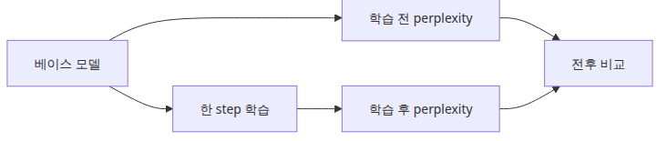
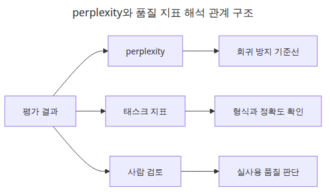
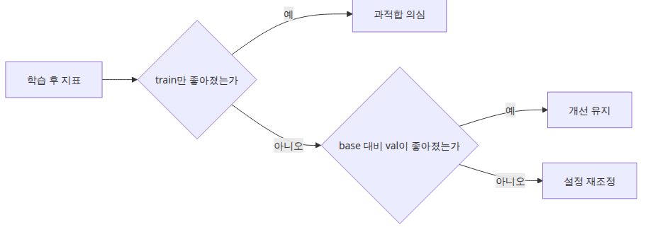

# 모델 평가

## 이 글에서 배울 것

- perplexity를 계산하고 학습 전후를 비교하는 평가 루프를 작성할 수 있습니다.
- perplexity의 한계와 golden set 평가가 필요한 이유를 이해합니다.
- "빠른 정량 지표 + 느린 정성 평가" 두 단 구조를 익힙니다.
- CI에 평가를 넣어 회귀를 자동으로 방지하는 습관을 들입니다.

<!-- a-grade-intro:begin -->
## 핵심 질문

파인튜닝 모델을 어떻게 평가해야 base 대비 개선과 회귀를 동시에 측정할 수 있을까요?

이 글은 그 질문에 답하기 위해 파인튜닝 모델 평가의 핵심 결정과 운영 함정을 살펴봅니다.

<!-- a-grade-intro:end -->

## 이 글에서 답할 질문



*이 글에서 답할 질문*

- 파인튜닝 직후 가장 먼저 볼 정량 지표로 perplexity를 어떻게 계산하나요?
- 학습 전후 perplexity 비교가 왜 완벽한 품질 평가가 아닌가요?
- tiny 모델 데모에서도 평가 루프를 따로 두는 이유는 무엇인가요?
- perplexity와 golden set 평가는 어떻게 함께 써야 하나요?

> perplexity는 모델이 다음 토큰을 얼마나 덜 놀라며 예측하는지 보는 지표이지, 사람이 읽기 좋은 답변을 직접 보장하는 지표는 아닙니다.

예제 코드: [github.com/yeongseon-books/llm-finetuning-101](https://github.com/yeongseon-books/llm-finetuning-101/tree/main/ko/05-evaluation)

## 왜 중요한가

학습이 끝나면 곧바로 생성 결과만 보고 싶어집니다. 하지만 실무에서는 생성 예시보다 먼저 정량 지표를 봐야 합니다. 그중 가장 기본이 perplexity입니다. 이 값은 모델이 평가 데이터의 토큰을 얼마나 자연스럽게 예측하는지 보여줍니다.

5편의 진짜 목적은 평가를 **자동화 가능한 파이프라인**으로 만드는 것입니다. 매번 사람이 답변을 눈으로 보는 평가는 확장되지 않습니다. perplexity 같은 정량 지표를 회귀 방지선으로 두고, 그 위에 golden set 기반의 정성 평가를 얹는 두 단 구조를 4편의 1-step 학습과 같은 호흡으로 만들어 둡니다.

## Mental Model

평가는 "모델 내부 신호"와 "사용자 관점 품질"을 분리해서 보는 것이 핵심입니다.

```
[모델 내부 신호]                 [사용자 관점 품질]
- perplexity                    - 정답 일치율
- token-level accuracy          - 포맷 준수율
- gradient norm                 - human rating
        |                              |
        +--- 빠른 회귀 방지선 ---+      |
                  |                    |
            CI에서 자동 실행      별도 골든셋으로 정기 측정
```

내부 신호는 빠르게(수 초~수 분), 사용자 관점 품질은 천천히(수 분~수 시간) 측정합니다. 빠른 신호가 나빠지면 즉시 차단하고, 느린 신호는 nightly로 추적합니다.

추가로 기억할 것:

- **perplexity = exp(mean cross-entropy loss)**. loss가 줄면 perplexity도 줄지만, 두 값은 같은 정보입니다.
- **평가 데이터는 학습 데이터와 분리**되어야 합니다. 데모에서는 구조 이해를 위해 같이 쓸 수 있지만, 실제로는 hold-out set이 필요합니다.

## 핵심 개념

| 항목 | 의미 |
| --- | --- |
| Perplexity | 모델이 다음 토큰을 예측할 때의 평균 "놀람" 정도. 낮을수록 좋음 |
| Cross-entropy loss | 토큰별 예측 분포와 정답의 차이. perplexity의 원료 |
| `model.eval()` | 드롭아웃 / 배치 정규화를 추론 모드로 전환 |
| `torch.no_grad()` | gradient 계산을 끄고 메모리·속도 절약 |
| Golden set | 사람이 직접 검수한 평가용 입력-출력 쌍. 회귀 측정의 기준 |
| Hold-out set | 학습에 쓰지 않은 데이터. perplexity 측정용 |
| Task metric | exact match, BLEU, ROUGE 등 도메인별 지표 |

## Before vs. After

**Before** — "loss가 줄었으니까 잘 학습된 것 같다"는 인상만 남습니다. 며칠 뒤 다른 사람이 결과를 물어보면 재현이 어렵습니다.

**After** — 5편의 평가 루프를 도입하면 출력이 다음 한 줄로 정리됩니다.

```
{'before_ppl': 27431.84, 'after_ppl': 26890.17, 'delta_pct': -1.97}
```

절대값은 의미가 없습니다. 중요한 것은 (1) 평가가 학습과 분리되어 있다, (2) 같은 데이터로 두 번 측정해 추세를 비교한다, (3) CI에서도 같은 숫자가 나온다는 것입니다.

## perplexity를 해석하는 기본 태도



*perplexity와 품질 지표 해석 관계 구조*

perplexity는 낮을수록 좋지만, 절대값만으로 품질을 단정하면 안 됩니다. 작은 데모 모델, 작은 데이터셋, 짧은 문맥에서는 값이 크게 튈 수 있습니다. 그래서 실무에서는 perplexity를 **회귀 방지용 기준선**으로 주로 씁니다. 학습 전보다 나빠졌는지, 설정을 바꿨을 때 추세가 개선되는지를 보는 데 강합니다.


*perplexity를 해석하는 기본 태도*

## 단계별 실습

### 1단계 — 평가 함수 작성

```python
import math
import torch

def perplexity(model, dataset) -> float:
    losses = []
    model.eval()
    for row in dataset:
        batch = {key: torch.tensor([value]) for key, value in row.items()}
        with torch.no_grad():
            loss = model(**batch).loss
        losses.append(loss.item())
    return math.exp(sum(losses) / len(losses))
```

### 2단계 — 학습 전후 측정

```python
before = perplexity(peft_model, eval_dataset)
trainer.train()
after = perplexity(peft_model, eval_dataset)

delta = (after - before) / before * 100
print({"before_ppl": before, "after_ppl": after, "delta_pct": delta})
```

### 3단계 — Golden set 정의

```python
golden = [
    {"prompt": "Q: 파이썬 리스트 정렬?", "expected_contains": "sorted"},
    {"prompt": "Q: HTTP 404?", "expected_contains": "찾지"},
]
```

각 항목은 "프롬프트"와 "기대 키워드"의 쌍입니다. exact match보다 키워드 포함 여부가 작은 모델 평가에는 더 현실적입니다.

### 4단계 — Golden set 채점

```python
def score_golden(model, tokenizer, golden) -> float:
    hits = 0
    for item in golden:
        ids = tokenizer(item["prompt"], return_tensors="pt").input_ids
        out = model.generate(ids, max_new_tokens=32)
        text = tokenizer.decode(out[0], skip_special_tokens=True)
        if item["expected_contains"] in text:
            hits += 1
    return hits / len(golden)
```

### 5단계 — 두 신호를 한 번에 출력

```python
print({
    "ppl_after": after,
    "golden_score": score_golden(peft_model, tokenizer, golden),
})
```

이 두 줄이 함께 출력되는 순간, 회귀 방지선과 사용자 관점 품질을 한 화면에서 보게 됩니다.

## 이 코드에서 봐야 할 것


*평균 loss에서 perplexity로 변환되는 계산 흐름*

- 평가 함수는 학습 루프와 분리되어 있어야 합니다. 그렇지 않으면 loss를 보는 순간에도 파라미터가 바뀌는 실수를 하게 됩니다.
- `torch.no_grad()`와 `model.eval()`은 메모리 사용과 드롭아웃 동작을 안정화하는 기본 장치입니다.
- 이 글의 예제는 추세 확인용입니다. 실제 프로젝트에서는 hold-out set, task metric, human review가 함께 필요합니다.
- golden set 채점은 모델 출력 전체를 사람이 읽지 않아도 회귀를 잡을 수 있게 해 주는 가장 가벼운 자동화입니다.

## 자주 하는 실수



*과적합 징후와 비교 기준 판단 흐름*

- **perplexity만 보고 배포 결정** — 포맷 준수, 사실성, 안전성은 별도 평가가 필요합니다. perplexity는 한 축일 뿐입니다.
- **평가 데이터와 학습 데이터를 같게 사용** — 수치가 낙관적으로 보입니다. 데모에서는 구조 이해를 위해 같게 썼지만, 실제 프로젝트에서는 반드시 분리합니다.
- **golden set을 한 번 만들고 방치** — 모델이 변하면 평가 항목도 늘어야 합니다. 매주 5~10개씩 추가하는 루틴이 좋습니다.
- **`model.eval()` 호출 누락** — 드롭아웃이 살아 있어 같은 입력에 다른 출력이 나옵니다. 평가 결과의 재현성이 깨집니다.
- **체크포인트마다 평가하지 않음** — 마지막 step만 평가하면 어디서 망가졌는지 알기 어렵습니다. `eval_steps`로 주기적으로 측정합니다.
- **CI에 평가를 넣지 않음** — 사람이 매번 실행하면 잊어버리는 순간 회귀가 들어옵니다. 5분짜리 perplexity 체크는 PR마다 돌릴 가치가 있습니다.

## 실무 적용

- **두 단 구조**: 빠른 perplexity 체크 + 느린 golden set 평가. CI에서는 빠른 것만, nightly에서는 둘 다.
- **regression budget**: perplexity가 5% 이상 나빠지면 PR을 차단합니다. 작은 변동은 무시합니다.
- **golden set은 카테고리별**: 포맷, 사실성, 안전성, 도메인 지식 등 4~5개 카테고리로 나누면 어디가 약한지 한 눈에 보입니다.
- **사람 평가는 페어로**: 두 모델의 출력을 나란히 보여주고 "어느 쪽이 더 나은가?"만 묻습니다. 절대 점수보다 신호가 강합니다.
- **자동 평가의 한계 인정**: BLEU, ROUGE는 의미보다 표면 일치를 봅니다. LLM-as-judge를 써도 편향이 있습니다. 자동 평가 점수는 항상 사람 평가의 보조선입니다.
- **평가 결과는 로그로 보존**: 모델 이름, 데이터 버전, 코드 commit hash와 함께 저장하면 6개월 뒤에도 비교 가능합니다.

## 시니어 엔지니어는 이렇게 생각합니다

- **base vs fine-tuned 비교가 기본** — 단독 점수는 의미가 없습니다.
- **task별 메트릭과 일반 능력 분리** — 한 task 학습이 다른 능력을 망칠 수 있습니다.
- **contamination 검사를 자동화** — 학습 데이터가 eval에 새지 않게 합니다.
- **hold-out과 ablation을 함께** — 어떤 결정이 효과를 냈는지 분리합니다.
- **프로덕션 eval을 별도로** — 오프라인 메트릭만으로는 부족합니다.

## 체크리스트

- [ ] perplexity가 평균 loss의 지수값이라는 점을 이해했다.
- [ ] 평가 루프에서 `no_grad`와 `eval`을 사용하는 이유를 설명할 수 있다.
- [ ] `python main.py`로 학습 전후 perplexity 출력이 실제로 나오는지 확인했다.
- [ ] golden set의 의미와 한계를 설명할 수 있다.
- [ ] 서빙 전에 최소 정량 평가를 거치는 습관을 잡았다.

## 연습 문제

1. eval 데이터셋의 크기를 2개에서 20개로 늘려 perplexity가 어떻게 변하는지 관찰하세요. 분산은 줄어드나요?
2. golden set에 "수학 계산" 항목을 5개 추가하고, 학습 전후 점수를 비교하세요. fine-tuning이 모든 카테고리에서 균등하게 좋아지나요?
3. `model.eval()` 호출을 빼고 같은 perplexity 함수를 두 번 실행해 결과가 어떻게 달라지는지 확인하세요.

## 정리 · 다음 글

평가는 화려하지 않지만 파인튜닝 파이프라인의 신뢰를 만드는 단계입니다. 생성 예시를 보기 전에 기준선을 만들면, 이후 실험이 훨씬 덜 감에 의존하게 됩니다. 빠른 정량 지표(perplexity)와 느린 정성 평가(golden set, human review)를 두 단으로 두는 것이 실무 패턴입니다.

다음 글(6편)에서는 서빙을 다룹니다. LoRA 어댑터를 base 모델과 분리해 배포하는 방법과, 추론 시 메모리·지연시간을 어떻게 줄일지 코드로 확인합니다.

<!-- toc:begin -->
## 시리즈 목차

- [LLM 파인튜닝 입문](./01-intro.md)
- [데이터셋 준비와 전처리](./02-dataset.md)
- [LoRA 어댑터 구성](./03-lora.md)
- [학습 루프와 하이퍼파라미터](./04-training.md)
- **모델 평가 (현재 글)**
- 모델 서빙 (예정)

<!-- toc:end -->

---

## 참고 자료

- [Perplexity of fixed-length models](https://huggingface.co/docs/transformers/perplexity)
- [Evaluation best practices for language models](https://huggingface.co/docs/evaluate/index)
- [LLM-as-a-judge survey](https://arxiv.org/abs/2306.05685)
- [HELM: Holistic Evaluation of Language Models](https://crfm.stanford.edu/helm/)

Tags: Fine-tuning, LoRA, LLM, Python
