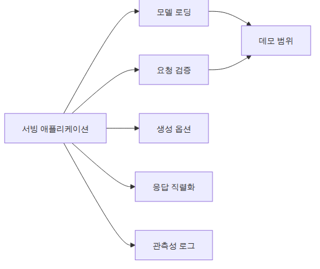
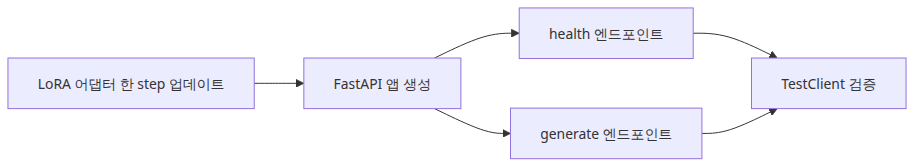
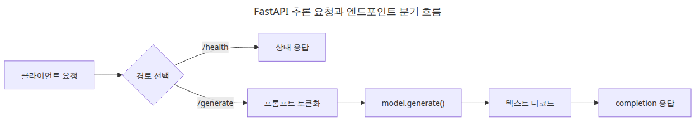
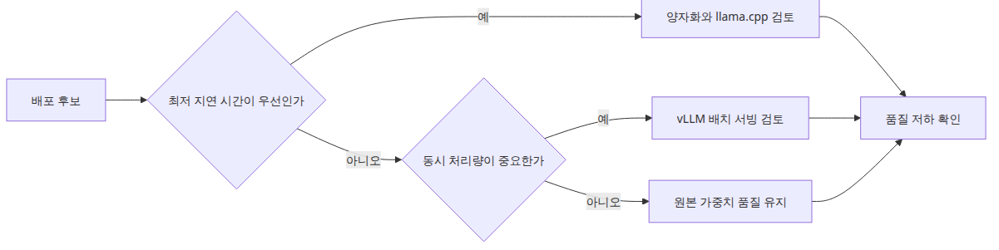

# 모델 서빙

## 핵심 질문

파인튜닝 모델을 어떻게 서빙해야 비용과 지연을 동시에 잡을 수 있을까요?

이 글은 그 질문에 답하기 위해 파인튜닝 모델 서빙의 핵심 결정과 운영 함정을 살펴봅니다.

> 서빙은 모델을 더 똑똑하게 만드는 단계가 아니라, 이미 준비된 모델을 예측 가능한 HTTP 계약 뒤에 두는 단계입니다.

## 이 글에서 다룰 문제

시리즈 마지막 글에서는 학습된 어댑터를 API 뒤에 놓습니다. 운영 환경에서는 학습과 서빙을 분리하는 것이 원칙이지만, 데모 단계에서는 작은 한 걸음 파인튜닝을 한 뒤 곧바로 엔드포인트로 감싸는 편이 전체 흐름을 이해하기 좋습니다.

서빙을 별도 단계로 잡는 이유는 분명합니다. 학습은 batch와 epoch 단위로 사고하지만, 서빙은 **단일 요청의 latency와 동시성**으로 사고해야 합니다. 같은 모델이라도 두 관점은 코드 구조, 메모리 정책, 에러 처리 방식이 달라집니다. 6편에서는 이 전환을 가장 작은 단위로 연습합니다.

## Mental Model

서빙 시스템은 4개 계층으로 분해할 수 있습니다.

```
[클라이언트] -> HTTP -> [API 계층] -> [모델 계층] -> [가중치 저장소]
                          |              |              |
                       FastAPI      tokenizer +     base model
                       Pydantic     model.generate  + adapter
```

- **API 계층**: 요청/응답 직렬화, 검증, 에러 처리, 인증, 관측성
- **모델 계층**: tokenizer, generation 옵션, 후처리
- **가중치 저장소**: base model (큰 파일) + LoRA adapter (작은 파일)

LoRA의 핵심 이점은 가중치 저장소에서 드러납니다. base 모델 한 벌만 메모리에 올려 두고, 어댑터를 여러 개 갈아끼우면 한 머신에서 여러 모델을 서빙할 수 있습니다.

추가로 기억할 것:

- **단일 요청 latency** = tokenize + generate + decode. generate가 90% 이상을 차지합니다.
- **batching**으로 throughput은 올라가지만 latency는 올라갑니다. 둘은 trade-off입니다.

## 핵심 개념

| 항목 | 의미 |
| --- | --- |
| `FastAPI` | Python 기반의 빠른 비동기 웹 프레임워크. Pydantic으로 자동 검증 |
| `TestClient` | uvicorn 없이 앱을 메모리 안에서 호출할 수 있는 테스트 도구 |
| `/health` | 서비스가 살아 있는지 묻는 가벼운 엔드포인트. load balancer가 사용 |
| `/generate` | 실제 추론을 수행하는 엔드포인트 |
| `model.generate()` | autoregressive하게 토큰을 한 개씩 만들어 내는 메서드 |
| `max_new_tokens` | 생성 길이 상한. 무한 루프 방지에 필수 |
| Adapter merge | LoRA 어댑터를 base에 합쳐 단일 가중치로 만드는 작업 (선택) |
| Cold start | 모델 로딩 시간. 첫 요청에만 큰 영향 |

## Before vs. After

**Before** — 모델을 학습한 노트북에서만 결과를 확인할 수 있고, 동료에게 공유하려면 매번 코드를 보내야 합니다.

**After** — 6편의 패턴을 도입하면 다음 한 줄로 동료가 결과를 호출할 수 있습니다.

```bash
curl -X POST http://localhost:8000/generate -d '{"prompt":"파이썬 함수 예시"}'
{"completion":"파이썬 함수 예시: def add(a, b): return a + b"}
```

핵심은 (1) 모델이 HTTP 계약 뒤에 있다, (2) `TestClient`로 CI에서도 검증된다, (3) 어댑터만 교체하면 같은 인프라에서 다른 모델로 바꿀 수 있다는 것입니다.

## 데모 서빙에서 꼭 분리해서 볼 것



*모델 준비와 HTTP 계약 분리 구조*

실전에서는 모델 로딩, 요청 검증, 생성 옵션, 응답 직렬화, 관측성 로그가 서로 다른 책임입니다. 이 글의 예제는 이 중 **모델 준비**와 **HTTP 계약**만 최소 단위로 보여 줍니다. 작은 데모라도 health check와 generate endpoint를 분리해 두면 운영 코드로 확장하기 쉬워집니다.



*데모 서빙에서 꼭 분리해서 볼 것*

## 단계별 실습

### 1단계 — FastAPI 앱 골격

```python
from fastapi import FastAPI

app = FastAPI()

@app.get("/health")
def health() -> dict:
    return {"status": "ok"}
```

### 2단계 — 모델 로딩 (앱 시작 시 한 번)

```python
from transformers import AutoModelForCausalLM, AutoTokenizer
from peft import PeftModel

base = AutoModelForCausalLM.from_pretrained("sshleifer/tiny-gpt2")
model = PeftModel.from_pretrained(base, "artifacts/lora-adapter")
tokenizer = AutoTokenizer.from_pretrained("sshleifer/tiny-gpt2")
model.eval()
```

`model.eval()`을 잊으면 dropout이 살아 있어 같은 입력에 다른 출력이 나옵니다. 서빙에서는 절대 빠뜨리면 안 됩니다.

### 3단계 — `/generate` 엔드포인트

```python
from pydantic import BaseModel

class GenerateRequest(BaseModel):
    prompt: str
    max_new_tokens: int = 32

@app.post("/generate")
def generate(req: GenerateRequest) -> dict:
    ids = tokenizer(req.prompt, return_tensors="pt").input_ids
    out = model.generate(ids, max_new_tokens=req.max_new_tokens)
    text = tokenizer.decode(out[0], skip_special_tokens=True)
    return {"completion": text}
```

Pydantic 모델로 요청을 검증하면 잘못된 payload가 모델 계층까지 내려가는 일을 막을 수 있습니다.

### 4단계 — `TestClient`로 자체 검증

```python
from fastapi.testclient import TestClient

client = TestClient(app)
assert client.get("/health").json() == {"status": "ok"}
print(client.post("/generate", json={"prompt": "파이썬 함수 예시"}).json())
```

`TestClient`는 uvicorn을 띄우지 않고 메모리 안에서 앱을 호출합니다. CI에 그대로 넣을 수 있습니다.

### 5단계 — 실제 서버 실행

```bash
uvicorn main:app --host 0.0.0.0 --port 8000
```

이제 다른 컴퓨터에서 `curl`로 호출하거나, Postman으로 테스트할 수 있습니다.

## 이 코드에서 봐야 할 것



*FastAPI 추론 요청과 엔드포인트 분기 흐름*

- 모델 로딩은 앱 시작 시 한 번만 실행됩니다. 매 요청마다 로드하면 latency가 수십 배 늘어납니다.
- `/health`와 `/generate`를 분리해 두면 모델 상태 확인과 추론 실패 원인 분리가 쉬워집니다.
- `TestClient`를 쓰면 uvicorn을 띄우지 않아도 엔드포인트 계약을 검증할 수 있어 CI 친화적입니다.
- Pydantic 검증은 garbage-in을 차단하는 가장 가벼운 방어선입니다.

## 자주 하는 실수



*지연 시간과 품질 사이 서빙 선택 기준*

- **요청마다 모델 로드** — cold start가 매번 발생해 latency가 수 초로 늘어납니다. 앱 시작 시 한 번만 로드합니다.
- **`max_new_tokens`을 지정하지 않음** — 기본값에 의존하면 의도치 않게 긴 응답이 생성되어 latency 폭발이 일어납니다.
- **`model.eval()` 누락** — dropout이 활성화되어 비결정적 출력이 나옵니다. 디버깅이 어렵습니다.
- **에러를 그대로 노출** — stack trace가 클라이언트에 보이면 보안 위험입니다. `HTTPException`으로 감쌉니다.
- **타임아웃 없음** — 한 요청이 30초 걸리면 전체 워커가 묶입니다. 클라이언트와 서버 양쪽에 타임아웃을 둡니다.
- **GPU 메모리 모니터링 없음** — OOM이 무음으로 발생하면 워커가 죽고 health check만 통과하는 상황이 생깁니다. `torch.cuda.memory_allocated()`를 metric으로 노출합니다.

## 실무 적용

- **학습과 서빙 코드 분리**: 같은 저장소라도 디렉터리를 분리합니다. 서빙 코드는 학습 의존성(`datasets`, `wandb`)을 import하지 않아야 합니다.
- **어댑터 multi-tenancy**: base 모델 한 벌 + 어댑터 N개로 한 머신에서 여러 모델을 서빙합니다. `PeftModel.set_adapter()`로 런타임 전환이 가능합니다.
- **batching**: vLLM이나 TGI 같은 서빙 엔진은 자동 dynamic batching을 제공합니다. 직접 FastAPI를 쓴다면 `asyncio.Queue`로 마이크로배칭을 구현합니다.
- **streaming 응답**: 긴 출력은 `StreamingResponse`로 토큰 단위 전송하면 사용자 체감 latency가 크게 줄어듭니다.
- **관측성**: 요청당 prompt token 수, completion token 수, 총 latency, GPU 메모리를 로그로 남깁니다. Prometheus + Grafana 조합이 일반적입니다.
- **카나리 배포**: 새 어댑터는 트래픽의 1%부터 시작합니다. perplexity와 latency가 안정되면 점진적으로 늘립니다.

## 실무에서는 이렇게 생각한다

서빙은 모델을 더 똑똑하게 만드는 단계가 아니라, 이미 준비된 모델을 예측 가능한 HTTP 계약 뒤에 놓는 단계입니다. 실무에서 가장 많이 간과하는 부분이 학습 코드와 서빙 코드의 의존성 분리입니다. 서빙 코드가 `datasets`나 `wandb`를 import하면 배포 환경이 불필요하게 무거워집니다.

또 한 가지 흔한 실수는 프로토타입에서 잘 되던 코드를 그대로 운영에 올리는 것입니다. 타임아웃, 에러 처리, 메모리 모니터링, health check 등 운영 관심사가 빠져 있으면 첫 장애 때 원인 분리가 어렵습니다. 데모 단계라도 `/health`와 `/generate`를 분리해 두는 습관이 운영 확장성을 결정합니다.

## 체크리스트

- [ ] 모델 준비와 HTTP 엔드포인트 책임을 구분해서 설명할 수 있다.
- [ ] `TestClient`로 `/health`와 `/generate`를 검증했다.
- [ ] tiny 모델 데모와 실제 운영 서빙의 차이를 이해했다.
- [ ] LoRA 어댑터를 base와 분리해서 배포하면 무엇이 좋아지는지 설명할 수 있다.
- [ ] 시리즈 1편부터 6편까지의 흐름을 한 번에 연결할 수 있다.

## 정리 · 시리즈 마무리

이제 파인튜닝 시리즈의 최소 전체 경로가 완성되었습니다. 수식으로 감을 잡고(1편), 데이터를 정리하고(2편), LoRA를 붙이고(3편), 한 step 학습하고(4편), 평가한 뒤(5편), 마지막에 HTTP 엔드포인트까지 연결했습니다(6편).

다음 단계는 시리즈를 떠나 본인의 도메인 데이터로 같은 흐름을 반복하는 것입니다. 데이터 100~1000개, LoRA rank 8~16, 1 epoch, perplexity + golden set 평가, FastAPI 서빙 — 이 한 줄짜리 레시피만 손에 익으면 어떤 작은 모델이든 서비스에 붙일 수 있습니다.

<!-- toc:begin -->
## 시리즈 목차

- [LLM 파인튜닝 입문](./01-intro.md)
- [데이터셋 준비와 전처리](./02-dataset.md)
- [LoRA 어댑터 구성](./03-lora.md)
- [학습 루프와 하이퍼파라미터](./04-training.md)
- [모델 평가](./05-evaluation.md)
- **모델 서빙 (현재 글)**

<!-- toc:end -->

---

## 참고 자료

- [FastAPI documentation](https://fastapi.tiangolo.com/)
- [Starlette TestClient reference](https://www.starlette.io/testclient/)
- [PEFT — Multiple adapters](https://huggingface.co/docs/peft/main/en/developer_guides/lora#multiple-adapters)
- [vLLM — high-throughput LLM serving](https://github.com/vllm-project/vllm)

Tags: Fine-tuning, LoRA, LLM, Python
