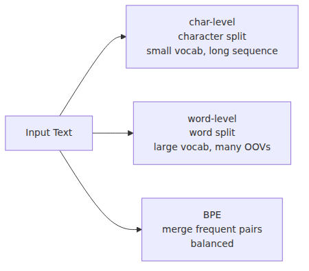

# Turning Text into Numbers

> LLM from Scratch 101 series (1/9)

The most jarring thing I noticed when first digging into LLM internals was that the model can't read at all. When we type "Hello" into a prompt, it looks like the machine understands our words, but inside the model, it's just an array of numbers. What looks like a greeting to us is simply a sequence of integers like `[31495, ...]` to the neural network.

I've found that accepting this reality early on makes everything else much easier. If you skim over the tokenizer, concepts like embeddings, attention, and loss functions will feel like they're floating in mid-air. Once you realize it's just a matter of reliably slicing strings into integer sequences, the "magic" of LLMs starts to fade away.

In this series, we're building a small GPT model from scratch using TinyShakespeare. We'll set aside the heavy frameworks for a moment and go all the way with just PyTorch 2.x and a few Python files.

Today's mental model is simple: **The model doesn't read text. It reads integer sequences created by the tokenizer.**

---

## Why Can't We Just Input Text?

Neural networks process tensors. You can't perform addition or matrix multiplication on a string. To process a line like "To be, or not to be," we first have to convert it into numbers. These numbers are called Token IDs.

There's one crucial point to keep in mind: Token IDs don't carry inherent meaning. They're just indices. There's no guarantee that token 5 is semantically close to token 6, and they aren't alphabetically ordered in a meaningful way. We just map them to integers for now, and later, during the embedding stage, we'll assign vector meanings to those integers.

Beginners often overlook this: if you change the tokenizer, the same sentence becomes a completely different sequence of IDs. This breaks compatibility with previously trained embeddings and checkpoints. While tokenization might look like a pre-processing step outside the model, it's more accurate to think of it as a part of the model itself.

## The Simplest Approach: Character-Level Tokenization

The easiest starting point is character-level tokenization. You build a vocabulary from the set of characters present in your text and assign a number to each. No complex exceptions, and debugging is straightforward.

```python
text = "hello world"
chars = sorted(set(text))
stoi = {ch: i for i, ch in enumerate(chars)}
itos = {i: ch for ch, i in stoi.items()}

def encode(s: str) -> list[int]:
    dropped = sorted({c for c in s if c not in stoi})
    if dropped:
        print(f"dropped unsupported characters: {dropped}")
    return [stoi[c] for c in s if c in stoi]

decode = lambda ids: "".join(itos[i] for i in ids)

ids = encode(text)
print(ids)
print(decode(ids))
```

Running this code gives you an immediate sense of how text moves back and forth between characters and numbers. One caveat is that a char-level tokenizer can only encode characters already present in its vocabulary, so unsupported input is dropped with a warning.

## Word-Level vs. Subword: The Trade-off

Character-level tokenization isn't always the answer. Word-level tokenization results in shorter sequences but causes the vocabulary size to explode and struggles with out-of-vocabulary (OOV) words. Subword tokenization aims for the middle ground.


This is why most production models use BPE (Byte Pair Encoding) variants. It provides a good balance between vocabulary size and representational power.

## Doing BPE by Hand — No Magic Involved

BPE might sound intimidating, but the idea is actually quite humble. You repeatedly merge the most frequent pairs of characters or character sequences. If you have words like `low`, `lower`, and `lowest`, you might merge `l + o`, then `lo + w`, gradually building longer pieces. Frequent patterns are essentially "promoted" to the vocabulary.

GPT-2 used a subword vocabulary of 50,257 tokens. It's not a black box; it's just a dictionary of text fragments optimized using statistics.

I usually describe BPE as something between compression and dictionary editing. Frequent patterns are reduced to a single short ID, while rare patterns are left as smaller pieces. Common words get shorter sequences, and the model never completely gives up on words it hasn't seen before.

## Trying GPT-2 Tokenizer with tiktoken

Theory is one thing, but seeing it in action is better. You can experiment with actual GPT-2 style tokenization using the following code:

```python
import tiktoken

enc = tiktoken.get_encoding("gpt2")
text = "Hello, tokenizer!"

ids = enc.encode(text)
decoded = enc.decode(ids)

print(ids)
print(decoded)
```

Just `pip install tiktoken` and you're good to go. You'll notice the ID array looks completely different from the character-level version for the same sentence.

## Why We're Using Character-Level Tokenization

For this series, we're sticking with character-level tokenization. There are three reasons: the code is shorter, training is faster on small datasets like TinyShakespeare, and debugging is more intuitive. Since we only have about 65 characters, the final softmax layer is also lightweight.

While this isn't enough for a production-scale model, it's perfect for a 101 series focused on core principles. In these first three posts, transparency is more important than performance.

## Data Prep: Downloading and Encoding TinyShakespeare

Now we'll create the first code file of the series, `data.py`. This script downloads TinyShakespeare, builds a character vocabulary, and saves the training and validation sets as binary files.

```python
from pathlib import Path
from urllib.request import urlretrieve

import numpy as np

DATA_DIR = Path("data")
DATA_DIR.mkdir(exist_ok=True)

input_file = DATA_DIR / "tinyshakespeare.txt"
if not input_file.exists():
    urlretrieve(
        "https://raw.githubusercontent.com/karpathy/char-rnn/master/data/tinyshakespeare/input.txt",
        input_file,
    )

text = input_file.read_text(encoding="utf-8")
chars = sorted(set(text))
vocab_size = len(chars)

stoi = {ch: i for i, ch in enumerate(chars)}
itos = {i: ch for ch, i in stoi.items()}

def encode(s: str) -> list[int]:
    dropped = sorted({c for c in s if c not in stoi})
    if dropped:
        print(f"dropped unsupported characters: {dropped}")
    return [stoi[c] for c in s if c in stoi]

def decode(ids: list[int]) -> str:
    return "".join(itos[i] for i in ids)

data = np.array(encode(text), dtype=np.uint16)
n = int(0.9 * len(data))
train_ids = data[:n]
val_ids = data[n:]

(DATA_DIR / "train.bin").write_bytes(train_ids.tobytes())
(DATA_DIR / "val.bin").write_bytes(val_ids.tobytes())

print(f"vocab_size={vocab_size}, train={len(train_ids)}, val={len(val_ids)}")
print(decode(train_ids[:80].tolist()))
```

Once you run this script, you'll be able to pull batches from the integer sequences for the next posts. I always keep the `decode()` function handy because debugging a model often involves turning numbers back into human-readable text.

## What's next

We have our integer sequences ready. In the next post, we'll assign vector meanings to these cold ID arrays. By combining token embeddings and positional embeddings, we'll create the first input tensor the model will actually read.

<!-- toc:begin -->
## In this series

- **Turning Text into Numbers (current)**
- From Integers to Vectors and Positions (upcoming)
- Deciding Which Tokens to Focus On (upcoming)
- The Transformer Block: A Unit of Depth (upcoming)
- Assembly: Completing the GPT Model Class (upcoming)
- Learning via Gradients (upcoming)
- Sampling — Generating Text from a Trained Model (upcoming)
- Adapting the Base Model to Specific Tasks (upcoming)
- Turning Your LLM into a Chatbot — FastAPI + Streaming (upcoming)

<!-- toc:end -->

## References

- [Karpathy minBPE](https://github.com/karpathy/minbpe)
- [OpenAI tiktoken](https://github.com/openai/tiktoken)
- [Language Models are Unsupervised Multitask Learners (GPT-2)](https://cdn.openai.com/better-language-models/language_models_are_unsupervised_multitask_learners.pdf)
- [Neural Machine Translation of Rare Words with Subword Units](https://arxiv.org/abs/1508.07909)

Tags: LLM, PyTorch, Transformer, Tutorial
