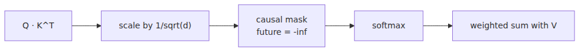

# Deciding Which Tokens to Focus On

Once embeddings are in place, every token is finally a vector. That still leaves the main question unanswered: how does one token know which other tokens matter? If the current character is part of a pronoun, a quote, or a repeated pattern, who decides which earlier positions it should consult?

That is where attention enters. Humans do something similar when reading. We do not assign the same weight to every earlier word. We glance back to find the noun behind a pronoun, or we check the opening of a clause when the verb lands near the end. Transformer attention gives the model a numerical version of that behavior.

In this post, we will add `CausalSelfAttention` to `model.py` and read it as a tensor pipeline rather than as a wall of symbols. For this series, traceability matters more than elegant shortcuts.

This is post 3 in the LLM from Scratch 101 series. Here we connect QKV projection, score calculation, causal masking, and multi-head recombination into one runnable path.

## Questions this chapter answers

- Why do Q, K, and V come from the same input but play different roles?
- Why do attention scores use `Q · K^T / sqrt(d)`?
- What breaks in autoregressive training if the causal mask is missing?
- What does multi-head attention capture that a single head often misses?
- Can we build the full attention path with only `nn.Linear`, `reshape`, and `transpose`?

> Attention is not a mechanism for blending all tokens equally. It is a dynamic lookup layer that lets the current token give more weight to the earlier positions it actually needs.

## Why this matters

Attention is the component that makes a Transformer behave like a Transformer. Embeddings turn token IDs into vectors, but attention is what lets those vectors interact. This is the point where the model stops acting like isolated characters and starts behaving like a sequence model.

It is also a topic where shape awareness matters as much as the concept. Many real bugs do not come from misunderstanding the equation. They come from a swapped axis in `transpose`, a broken mask range, or forgetting `contiguous()` before a `view()`. That is why this chapter stays close to tensors and printed outputs.

The same details matter operationally. Causal masking, score scaling, and head splitting all affect stability during training and quality during generation. If these mechanics feel concrete now, the next post on residual connections and Transformer blocks becomes much easier.

## The most useful mental model: attention is a dynamic lookup across tokens

If you treat attention as pure notation, it feels heavier than it really is. A more practical interpretation is this: **each token sends out a Query, matches it against Keys from other positions, and uses the resulting weights to retrieve Values**.

That framing makes the roles easier to remember. The Query says, “What kind of information am I looking for right now?” The Key says, “What kind of signal do I offer?” The Value is the actual content that gets mixed back into the residual stream.

For an autoregressive language model, one rule sits on top of that lookup: the token must not consult the future. That is why causal masking is not optional decoration. It is the rule that keeps training aligned with generation.

## Core ideas

### QKV are three linear projections of the same input

If the input tensor `x` is shaped `(B, T, C)`, attention creates three projections from it: `q = Wq x`, `k = Wk x`, and `v = Wv x`. They come from the same source, but they serve different jobs. The Query expresses what this position wants, the Key expresses what each position can offer, and the Value carries the content to retrieve.

At the implementation level, that means three linear layers. The intimidating names sometimes obscure how direct the code is. Early on, it helps to think in terms of “same source, three projections” rather than in terms of abstract terminology.

### Score calculation is dot product plus scale control

To decide how much one token should attend to another, we need a score. We get it by taking the dot product of Query and Key. Larger scores indicate a better match. Because dot products grow with dimension, we divide by `sqrt(d)` to keep the variance under control.

That division is not cosmetic. Without it, softmax can become too sharp too early. A few entries dominate, everything else collapses toward zero, and training becomes harder to stabilize. `sqrt(d)` is one of those lines that looks small in code and carries real weight in practice.

### The causal mask enforces the no-future rule

An autoregressive model learns next-token prediction. The current position must not peek at the answer to its right. We enforce that rule by masking the upper triangle of the score matrix and filling those entries with `-inf`, which softmax converts into zero probability.



*Causal mask blocking future-token attention.*

This is not a minor implementation detail. If the mask is missing, the model can cheat during training by looking ahead, which produces deceptively good loss and disappointing generation.

## Implementing attention step by step

### Step 1. Start with a single head and print the weight matrix

The smallest useful self-attention implementation is short enough to read in one sitting. This version returns both `out` and `wei` so we can inspect exactly where each token looked.

```python
import math

import torch
import torch.nn as nn
import torch.nn.functional as F

class SingleHeadAttention(nn.Module):
    def __init__(self, n_embd: int, head_size: int, block_size: int) -> None:
        super().__init__()
        self.key = nn.Linear(n_embd, head_size, bias=False)
        self.query = nn.Linear(n_embd, head_size, bias=False)
        self.value = nn.Linear(n_embd, head_size, bias=False)
        self.register_buffer("tril", torch.tril(torch.ones(block_size, block_size)))

    def forward(self, x: torch.Tensor):
        _, t, _ = x.shape
        k = self.key(x)
        q = self.query(x)
        wei = q @ k.transpose(-2, -1) / math.sqrt(k.size(-1))
        wei = wei.masked_fill(self.tril[:t, :t] == 0, float("-inf"))
        wei = F.softmax(wei, dim=-1)
        v = self.value(x)
        out = wei @ v
        return out, wei

x = torch.randn(2, 4, 8)
head = SingleHeadAttention(n_embd=8, head_size=8, block_size=8)
out, wei = head(x)
print(out.shape)
print(wei[0])
```

**Expected output:**

```text
torch.Size([2, 4, 8])
tensor([[1.0000, 0.0000, 0.0000, 0.0000],
        [0.47.., 0.52.., 0.0000, 0.0000],
        [0.31.., 0.28.., 0.40.., 0.0000],
        [0.22.., 0.19.., 0.27.., 0.30..]])
```

The exact numbers do not matter. The pattern does. The upper-right region must be zeroed out, because those are future positions.

### Step 2. Compare masked and unmasked scores on purpose

It helps to see what failure looks like. If you remove the mask temporarily and compare the two versions, the future positions remain active and the bug becomes obvious.

```python
import math

import torch
import torch.nn.functional as F

q = torch.randn(1, 4, 8)
k = torch.randn(1, 4, 8)
scores = q @ k.transpose(-2, -1) / math.sqrt(k.size(-1))

print("without mask")
print(F.softmax(scores, dim=-1)[0])

tril = torch.tril(torch.ones(4, 4))
masked_scores = scores.masked_fill(tril == 0, float("-inf"))

print("with mask")
print(F.softmax(masked_scores, dim=-1)[0])
```

**Expected output:**

```text
without mask
tensor([[0.20.., 0.29.., 0.24.., 0.25..],
        [0.10.., 0.31.., 0.27.., 0.30..],
        ...])

with mask
tensor([[1.0000, 0.0000, 0.0000, 0.0000],
        [0.24.., 0.75.., 0.0000, 0.0000],
        ...])
```

This is more than a demo. It is one of the fastest sanity checks when training loss looks suspiciously good but generation behaves badly.

### Step 3. Multi-head attention gives the model parallel viewpoints

A single head tends to emphasize one kind of relationship at a time. Multi-head attention splits the embedding dimension into several smaller parts so different heads can score different relationships in parallel. One head may focus on local context, another on repeated structures, and another on speaker shifts.

More heads are not automatically better. If `n_embd` stays fixed, each extra head reduces the per-head dimension. In our configuration of `n_embd=128` and `n_head=4`, each head gets 32 dimensions, which is a clean balance for a small educational model.

### Step 4. Build the series version without shortcuts

Now we can assemble the `CausalSelfAttention` module for this series. No `einsum`, no fancy abstractions—just linear projections, reshaping, transposition, masking, and projection back to the residual dimension.

```python
from dataclasses import dataclass
import math

import torch
import torch.nn as nn
import torch.nn.functional as F

@dataclass
class GPTConfig:
    vocab_size: int = 65
    block_size: int = 64
    n_layer: int = 6
    n_head: int = 4
    n_embd: int = 128

class CausalSelfAttention(nn.Module):
    def __init__(self, config: GPTConfig) -> None:
        super().__init__()
        assert config.n_embd % config.n_head == 0
        self.n_head = config.n_head
        self.head_size = config.n_embd // config.n_head
        self.key = nn.Linear(config.n_embd, config.n_embd, bias=False)
        self.query = nn.Linear(config.n_embd, config.n_embd, bias=False)
        self.value = nn.Linear(config.n_embd, config.n_embd, bias=False)
        self.proj = nn.Linear(config.n_embd, config.n_embd)
        self.register_buffer(
            "tril", torch.tril(torch.ones(config.block_size, config.block_size))
        )

    def forward(self, x: torch.Tensor):
        b, t, c = x.shape
        k = self.key(x).view(b, t, self.n_head, self.head_size).transpose(1, 2)
        q = self.query(x).view(b, t, self.n_head, self.head_size).transpose(1, 2)
        v = self.value(x).view(b, t, self.n_head, self.head_size).transpose(1, 2)

        wei = q @ k.transpose(-2, -1) / math.sqrt(self.head_size)
        wei = wei.masked_fill(self.tril[:t, :t] == 0, float("-inf"))
        wei = F.softmax(wei, dim=-1)

        out = wei @ v
        out = out.transpose(1, 2).contiguous().view(b, t, c)
        out = self.proj(out)
        self.last_attn = wei
        return out

config = GPTConfig()
attn = CausalSelfAttention(config)
x = torch.randn(2, 8, config.n_embd)
out = attn(x)
print(out.shape)
print(attn.last_attn.shape)
```

**Expected output:**

```text
torch.Size([2, 8, 128])
torch.Size([2, 4, 8, 8])
```

If those shapes line up, the split-head path and the merge-back path are both working. The most common failure here is not the formula. It is a tensor layout mistake.

### Step 5. Keep one inspectable hook for later debugging

Saving `self.last_attn = wei` is not elegant, but it is practical. Once you start stacking blocks in the next post, it gives you a fast way to inspect whether masks still hold, whether a head is saturating, or whether every head is behaving identically.

## Failure modes and the first thing to check

Attention bugs often repeat the same pattern. When something breaks, the quickest path is usually to inspect a shape, a mask, or a printed matrix—not to re-read the paper.

| Symptom | First thing to inspect | Common cause |
| --- | --- | --- |
| Training loss looks great but generation is terrible | Printed mask output | Future-token leakage |
| `view()` raises shape/layout errors | Tensor continuity after `transpose` | Missing `contiguous()` |
| Adding more heads breaks immediately | `n_embd % n_head` | Head dimension is not integral |
| Attention maps all look nearly identical | Score scale before softmax | Missing or incorrect `sqrt(d)` |
| Memory jumps quickly | `T x T` attention map size | `block_size` is too large |

This checklist is worth keeping nearby. Attention usually fails in concrete, inspectable ways.

## How to think about it in practice

This series uses a small char-level GPT, so the context window and head count stay modest. Even so, the attention cost still scales with `T²`. At `block_size=64`, that is manageable. At 512 or 2048, it becomes one of the first bottlenecks you feel.

That is why it helps to describe attention in engineering terms rather than in slogan form. Think in terms of shapes, score matrices, masks, projections, and residual-stream compatibility. That language scales from toy models to real ones.

## Common mistakes

- It is easy to think Q, K, and V come from different data sources, but in self-attention they are three projections of the same input.
- `sqrt(d)` can look like decorative math, but it is a real stabilizer for softmax.
- The causal mask can feel optional in code, but it is mandatory for autoregressive language modeling.
- More heads do not automatically mean a better model when `n_embd` stays fixed.
- Many attention bugs are not conceptual at all. They come from shapes, axis order, or mask ranges.

## Checklist

- [ ] Can explain the shapes of the score matrix and the causal mask by hand.
- [ ] Printed a single head's `wei` and confirmed the upper-right region is blocked.
- [ ] Traced the multi-head shape `(B, n_head, T, head_size)` end to end.
- [ ] Can explain why `out.transpose(...).contiguous().view(...)` is needed.
- [ ] Understand why preventing future-token access keeps training and inference aligned.

## Summary

In this post, we framed attention as a dynamic lookup mechanism across tokens. Q, K, and V are different projections of the same input, and softmax over their scores lets each position retrieve the context it needs.

We also saw why causal masking and multi-head structure matter so much. The mask preserves the autoregressive rule, while multiple heads let the model score different relationships in parallel. Together, they are what move GPT beyond simple local character prediction.

In the next post, we will add FeedForward, residual connections, and LayerNorm to turn this attention module into a full Transformer block.

<!-- toc:begin -->
## In this series

- [Turning Text into Numbers](./01-tokenizer.md)
- [From Integers to Vectors and Positions](./02-embedding.md)
- **Deciding Which Tokens to Focus On (current)**
- The Transformer Block: A Unit of Depth (upcoming)
- Assembly: Completing the GPT Model Class (upcoming)
- Learning via Gradients (upcoming)
- Sampling — Generating Text from a Trained Model (upcoming)
- Adapting the Base Model to Specific Tasks (upcoming)
- Turning Your LLM into a Chatbot — FastAPI + Streaming (upcoming)

<!-- toc:end -->

## References

### Official Docs

- [Attention Is All You Need](https://arxiv.org/abs/1706.03762)
- [nanoGPT model.py](https://github.com/karpathy/nanoGPT/blob/master/model.py)
- [PyTorch scaled_dot_product_attention](https://pytorch.org/docs/stable/generated/torch.nn.functional.scaled_dot_product_attention.html)
- [The Illustrated Transformer](https://jalammar.github.io/illustrated-transformer/)

### Related Series

- [LLM App Foundations 101 — Prompt engineering basics](../../llm-app-foundations-101/en/03-prompt-engineering-basics.md)
- [AI Agent 101 — Context engineering](../../ai-agent-101/en/02-context-engineering.md)
- [LangGraph 101 — State and checkpoints](../../langgraph-101/en/02-state-and-checkpoints.md)

Tags: LLM, PyTorch, Transformer, Tutorial
