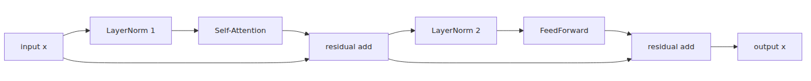

# The Transformer Block: A Unit of Depth

> LLM from Scratch 101 series (4/9)

Implementing `CausalSelfAttention` provides a momentary sense of relief. Tokens can finally look at each other, and you've verified the weight matrices. However, stacking these blocks reveals immediate limitations. While tokens can share information, the model still lacks the capacity to process those representations non-linearly within each position.

When I first implemented Transformer, this was the point where the architecture became crystal clear. Attention serves as the communication line between tokens, while the FeedForward network acts as a small, localized transformer for each token. Binding them together with residual connections makes it feel like a true unit of depth.

In GPT models, these blocks often seem like standard components. Writing them by hand makes their purpose obvious. For effective training, you must ensure that information can both flow through the transformations and survive via the original input path.

The mental model for today is simple: **Attention mixes information across tokens, FeedForward transforms it within each token, and Residual connections wrap them both for stability.**

---

<!-- a-grade-intro:begin -->

## Key Questions

- Why is a 2-layer MLP enough for FeedForward?
- How do residual connections rescue training?
- What's the practical difference between pre-norm and post-norm?
- Where do most of a block's parameters live?

<!-- a-grade-intro:end -->

## FeedForward is Just a 2-layer MLP

Stacking only attention layers allows tokens to reference each other extensively, but the representational power doesn't grow as expected. Each position lacks sufficient non-linear transformation. To fix this, we add an MLP with the structure `Linear(C, 4C) -> GELU -> Linear(4C, C)` to every block.

Expanding the intermediate dimension by four is a practical choice. This brief expansion allows the token to form richer combinations before projecting back to the original dimension in the final linear layer. Even in small models, the FeedForward network handles a significant portion of the heavy lifting.

```python
import torch
import torch.nn as nn

class FeedForward(nn.Module):
    def __init__(self, n_embd: int) -> None:
        super().__init__()
        self.net = nn.Sequential(
            nn.Linear(n_embd, 4 * n_embd),
            nn.GELU(),
            nn.Linear(4 * n_embd, n_embd),
        )

    def forward(self, x: torch.Tensor) -> torch.Tensor:
        return self.net(x)
```

## Residual Connections — Skip Connections Save Training

As models grow deeper, original input information tends to fade. Residual connections in the form `x = x + f(x)` mitigate this issue. In the early stages of training, when transformations are still crude, the model can at least pass the raw input to the next layer. This also ensures a clear path for gradients during backpropagation.

If you had to reduce the reason why deep models actually work into a single word, it would likely be residuals. I view this structure as a way for the model to add what it just learned without discarding existing representations. It also helps during debugging, as even if a block is poorly initialized, the input doesn't evaporate completely.

## LayerNorm — Pre-norm vs Post-norm

The original Transformer placed LayerNorm after the sub-layers, known as Post-norm. Since GPT-2, Pre-norm—placing it before the sub-layers—has become the standard. It provides much better stability during training as depth increases.

We will use Pre-norm for this series. We normalize the input first, pass it through Attention and FeedForward, and then add the residual. It might look like a single-line change in code, but the training stability feels quite different.


## Implementing a Single Block in PyTorch — 25 Lines

Now we add the block to `model.py`. Using the `CausalSelfAttention` from the previous post, we combine it with the `FeedForward` and two `LayerNorm` layers.

```python
import torch
import torch.nn as nn

class Block(nn.Module):
    def __init__(self, config) -> None:
        super().__init__()
        self.ln1 = nn.LayerNorm(config.n_embd)
        self.attn = CausalSelfAttention(config)
        self.ln2 = nn.LayerNorm(config.n_embd)
        self.ffn = FeedForward(config.n_embd)

    def forward(self, x: torch.Tensor) -> torch.Tensor:
        x = x + self.attn(self.ln1(x))
        x = x + self.ffn(self.ln2(x))
        return x
```

The logic is straightforward: normalize, run attention, and add to the original. Normalize again, run the MLP, and add again. Because `CausalSelfAttention.forward()` now returns only the residual-stream tensor, the residual addition stays shape-consistent all the way through.

## Stacking Blocks N Times

Transformer depth doesn't come from complex new parts but from repeating the same block. Implementation is as simple as using `nn.ModuleList`.

```python
self.blocks = nn.ModuleList([Block(config) for _ in range(config.n_layer)])

for block in self.blocks:
    x = block(x)
```

As these repetitions stack, early blocks refine local context while later blocks organize longer context relationships. Even with a small char-level model, stacking a few layers makes it act like a context-aware model rather than just a single-character predictor.

## Parameter Counting — Where the Weights Go

You can quickly estimate the cost of a single block. Attention consists of `Q`, `K`, `V`, and output projection, totaling roughly `4C²`. FeedForward is `C -> 4C -> C`, which is about `8C²`. The numbers show that the FeedForward network is twice as large.

With our setting of `C=128`, one block uses about 66k parameters for attention and 131k for FeedForward. Adding two LayerNorms brings the total for one block to roughly 198k. Six layers mean about 1.18M parameters are concentrated in the blocks. Working with a small GPT makes you realize that the FeedForward layers consume most of the model's capacity.

## What's next

The building blocks are ready. In the next post, we will wrap embeddings, `N` blocks, the final LayerNorm, and the LM head into a single `GPT(nn.Module)` class. We'll finish the model so it can produce both logits and loss in a single forward pass.

<!-- a-grade-example:begin -->

## Checklist

- [ ] Implemented one block in 25 lines and verified forward shapes.
- [ ] Can draw the pre-norm data flow as a diagram.
- [ ] Calculated how parameters grow when stacking N blocks.
- [ ] Compared the parameter share between FeedForward and attention.

<!-- a-grade-example:end -->

<!-- toc:begin -->
## In this series

- [Turning Text into Numbers](./01-tokenizer.md)
- [From Integers to Vectors and Positions](./02-embedding.md)
- [Deciding Which Tokens to Focus On](./03-attention.md)
- **The Transformer Block: A Unit of Depth (current)**
- Assembly: Completing the GPT Model Class (upcoming)
- Learning via Gradients (upcoming)
- Sampling — Generating Text from a Trained Model (upcoming)
- Adapting the Base Model to Specific Tasks (upcoming)
- Turning Your LLM into a Chatbot — FastAPI + Streaming (upcoming)

<!-- toc:end -->

## References

- [nanoGPT model.py](https://github.com/karpathy/nanoGPT/blob/master/model.py)
- [On Layer Normalization in the Transformer Architecture](https://arxiv.org/abs/2002.04745)
- [Language Models are Unsupervised Multitask Learners (GPT-2)](https://cdn.openai.com/better-language-models/language_models_are_unsupervised_multitask_learners.pdf)
- [PyTorch nn.LayerNorm](https://pytorch.org/docs/stable/generated/torch.nn.LayerNorm.html)

Tags: LLM, PyTorch, Transformer, Tutorial
