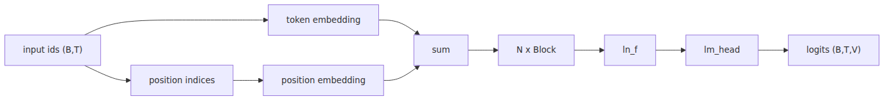

# Assembly: Completing the GPT Model Class

> LLM from Scratch 101 series (5/9)

We've built the input stage and attention mechanism, and in the last post, we established the core transformer block. Most of the components are now in place. The remaining task is surprisingly clean: start with embeddings, pass them through the blocks, apply a final normalization, and project to the vocab size to get the logits.

When I first reached this stage, I felt a sense of anticlimax. The name GPT sounds so massive that I expected something far more complex. However, at the implementation level, the structure is quite linear. It's about stacking the same blocks and adding a head that reads the distribution of the next character.

Details matter, of course. Without practical mechanisms like input length validation, loss reshaping, and weight tying, the code can quickly become messy. Today, we'll organize those parts.

The mental model for today is this: **GPT is an autoregressive model that stacks blocks on top of embeddings and converts the final hidden states into the next token distribution.**

---

## The Forward Pass at a Glance

The input is a tensor of token IDs with shape `(B, T)`. We add token and position embeddings, then pass them through six blocks sequentially. After a final `ln_f` layer, we project to the vocab dimension via `lm_head` to produce logits of shape `(B, T, vocab_size)`.


All the components we created earlier appear here. The model class acts more as assembly code than a new algorithm.

## class GPT(nn.Module) — An 80-line Model

The code below completes our `model.py`. Assuming `Block` and `CausalSelfAttention` are available from previous posts, we wrap things up with `GPTConfig` and the `GPT` class itself.

```python
from dataclasses import dataclass

import torch
import torch.nn as nn
import torch.nn.functional as F

@dataclass
class GPTConfig:
    vocab_size: int = 65
    n_layer: int = 6
    n_head: int = 4
    n_embd: int = 128
    block_size: int = 64

class GPT(nn.Module):
    def __init__(self, config: GPTConfig) -> None:
        super().__init__()
        self.config = config
        self.token_emb = nn.Embedding(config.vocab_size, config.n_embd)
        self.pos_emb = nn.Embedding(config.block_size, config.n_embd)
        self.blocks = nn.ModuleList([Block(config) for _ in range(config.n_layer)])
        self.ln_f = nn.LayerNorm(config.n_embd)
        self.lm_head = nn.Linear(config.n_embd, config.vocab_size, bias=False)
        self.lm_head.weight = self.token_emb.weight

    def forward(
        self, idx: torch.Tensor, targets: torch.Tensor | None = None
    ) -> tuple[torch.Tensor, torch.Tensor | None]:
        b, t = idx.shape
        if t > self.config.block_size:
            raise ValueError(f"cannot forward sequence of length {t}")

        pos = torch.arange(t, device=idx.device)
        tok_emb = self.token_emb(idx)
        pos_emb = self.pos_emb(pos)
        x = tok_emb + pos_emb

        for block in self.blocks:
            x = block(x)

        x = self.ln_f(x)
        logits = self.lm_head(x)

        loss = None
        if targets is not None:
            loss = F.cross_entropy(
                logits.view(b * t, self.config.vocab_size),
                targets.view(b * t),
            )

        return logits, loss
```

At this point, the model is ready for training. It produces logits from input IDs and calculates loss if targets are provided.

## Weight Tying: Linking the LM Head and Embedding Matrix

The line `self.lm_head.weight = self.token_emb.weight` is a small but common optimization. We share the same weights between the input token embedding and the output projection matrix.

It makes intuitive sense. The vector space used to read a character shouldn't be radically different from the space used to score which character to output next. Since the Press & Wolf paper, this has become a default practice. In small models, it saves parameters and often makes training more stable.

## Loss Function: A Single Line for Cross Entropy

Language modeling is ultimately about predicting the next character at each position. Logits have the shape `(B, T, vocab_size)`, and the targets are `(B, T)`. Since `F.cross_entropy` prefers 2D inputs where the class dimension is last, we flatten both to `(B*T, ...)`.

Understanding this reshape makes the training loop much cleaner later. From the loss function's perspective, it just sees `N` prediction rows and `N` ground truth labels, regardless of batch or sequence dimensions.

## Initializing the Model and Counting Parameters

Let's look at the numbers. With `vocab_size=65`, `n_layer=6`, `n_head=4`, `n_embd=128`, and `block_size=64`, the model isn't as large as the 10M figure mentioned in the original plan.

With weight tying, the total parameter count is approximately 1,204,096. Token and position embeddings take up about 16k, six blocks account for 1.18M, and the final LayerNorm uses 256. Seeing these numbers makes the model's scale feel much more grounded.

```python
config = GPTConfig()
model = GPT(config)
num_params = sum(p.numel() for p in model.parameters())
print(f"params: {num_params:,}")
```

## Sanity Check: Forward Pass Before Training

Before starting the training loop, it's good practice to check if the loss is around `ln(65)`. With 65 classes and random initialization, the model's initial guesses should be roughly uniform, which results in a loss of about 4.17.

```python
import torch

config = GPTConfig()
model = GPT(config)
idx = torch.randint(0, config.vocab_size, (4, config.block_size))
targets = torch.randint(0, config.vocab_size, (4, config.block_size))
logits, loss = model(idx, targets)

print(logits.shape)
print(loss.item())
```

A loss in the low 4s is usually normal. If you see 20 or `nan`, you should re-examine the block connections, reshaping, and mask ranges.

## Organizing Hyperparameters with a Config Dataclass

Even in small examples, scattering hyperparameters makes the code tedious to maintain. The `GPTConfig` dataclass keeps model dimensions, layer counts, head counts, and context length in one place, making it easy to pass to `train.py` or `generate.py`.

The default settings for this series are conservative. `n_layer=6`, `n_head=4`, `n_embd=128`, and `block_size=64` are small enough to run TinyShakespeare on a CPU or a modest GPU. While the numbers are small, the architecture is identical to GPT. At this stage, a traceable model is a better teacher than a massive one.

## What's next

The model core is finished. In the next post, we'll implement the training loop—pulling mini-batches and running the `forward -> loss -> backward -> optimizer.step()` cycle. You'll see the TinyShakespeare loss drop from 4.17 down to the 1.0 range.

<!-- toc:begin -->
## In this series

- [Turning Text into Numbers](./01-tokenizer.md)
- [From Integers to Vectors and Positions](./02-embedding.md)
- [Deciding Which Tokens to Focus On](./03-attention.md)
- [The Transformer Block: A Unit of Depth](./04-transformer-block.md)
- **Assembly: Completing the GPT Model Class (current)**
- Learning via Gradients (upcoming)
- Sampling — Generating Text from a Trained Model (upcoming)
- Adapting the Base Model to Specific Tasks (upcoming)
- Turning Your LLM into a Chatbot — FastAPI + Streaming (upcoming)

<!-- toc:end -->

## References

- [nanoGPT repository](https://github.com/karpathy/nanoGPT)
- [Using the Output Embedding to Improve Language Models](https://arxiv.org/abs/1608.05859)
- [PyTorch cross_entropy](https://pytorch.org/docs/stable/generated/torch.nn.functional.cross_entropy.html)
- [Language Models are Unsupervised Multitask Learners (GPT-2)](https://cdn.openai.com/better-language-models/language_models_are_unsupervised_multitask_learners.pdf)

Tags: LLM, PyTorch, Transformer, Tutorial
