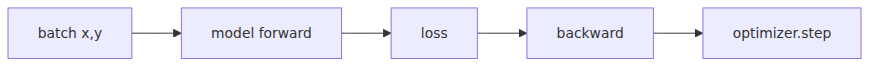

# Learning via Gradients

> LLM from Scratch 101 series (6/9)

Once the model class is complete, you're left with what seems like the most daunting phase: training. While the name suggests a complex control system, the PyTorch implementation is remarkably concise. You pull a mini-batch, calculate the loss, backpropagate, and let the optimizer nudge the parameters. You simply repeat these four steps for a long time.

When I first trained a model on TinyShakespeare, I actually enjoyed seeing the loss numbers decrease slowly. It lacks the flash of a large-scale model demo, but it provides a tangible sense that the model is genuinely learning the next character.

In this post, we'll implement `train.py`. We'll include AdamW, warmup, cosine decay, gradient clipping, periodic evaluation, and checkpointing, while keeping the code compact.

Today's mental model is this: **Training is about repeatedly showing the model quality batches, flowing gradients back based on its errors, and adjusting weights slightly in the direction of those gradients.**

---

## The 5-line Core of the Training Loop

The heart of the training loop consists of just five lines: `zero_grad()`, `forward`, `backward()`, `clip_grad_norm_`, and `step()`. Everything else is operational code—handling evaluation intervals, logging, and learning rate scheduling.


At first, `backward()` might seem like magic. In reality, autograd traverses the computation graph in reverse to populate the `grad` attribute for each parameter. The optimizer then reads those values and takes a step.

## Why AdamW Beats SGD for Transformers

For small language models like our char-level GPT, AdamW is much easier to manage than SGD. It combines momentum—remembering the direction of previous gradients—with adaptive variance estimation, which scales updates for each parameter automatically.

Decoupling weight decay from the update rule is another advantage. In Transformers with many embeddings and linear layers, this separation significantly improves the training experience. We'll use `lr=3e-4`, `weight_decay=0.1`, and `betas=(0.9, 0.95)`, which is a solid starting point for a small GPT.

## Learning Rate Warmup + Cosine Decay

Starting with a high learning rate can cause parameters to oscillate wildly when starting from a random initialization. We'll linearly increase the rate for the first 100 steps and then gradually decrease it following a cosine curve up to 5,000 steps.

Warmup is like letting an engine reach operating temperature before hitting the highway. The subsequent cosine decay helps the model converge by reducing the step size towards the end. This intuition, common in ResNet training, works perfectly for small GPT models as well.

```python
import math

def get_lr(it: int, learning_rate: float) -> float:
    warmup_iters = 100
    lr_decay_iters = 5000
    min_lr = learning_rate * 0.1

    if it < warmup_iters:
        return learning_rate * (it + 1) / warmup_iters
    if it > lr_decay_iters:
        return min_lr

    decay_ratio = (it - warmup_iters) / (lr_decay_iters - warmup_iters)
    coeff = 0.5 * (1.0 + math.cos(math.pi * decay_ratio))
    return min_lr + coeff * (learning_rate - min_lr)
```

## Gradient Clipping — A Single Line to Prevent Explosion

Even when training goes well, gradients can suddenly spike at certain steps, especially early on. Adding `torch.nn.utils.clip_grad_norm_(model.parameters(), 1.0)` is a simple way to prevent catastrophic instabilities.

Clipping is more of a safety mechanism than a performance trick. When loss spikes, it's hard to tell if the cause is the learning rate, the data batch, or a mask bug. Clipping allows you to rule out gradient explosion as the culprit.

## Monitoring Progress with eval_interval

Don't rely solely on training loss. By setting `eval_interval=500` and tracking both train and validation loss, you can quickly identify overfitting or data bugs. A quick average across several batches under `@torch.no_grad()` is sufficient for evaluation.

When monitoring small models, I focus on the trend rather than the absolute values. If train loss drops while validation loss plateaus, it's likely overfitting. If neither drops, the issue might be the learning rate or batching. The patterns in the numbers are often quite clear.

## Running train.py — 5 Minutes on CPU, 1 Minute on GPU

Let's combine the training script into a single file. This script assumes the `GPT` class and the `train.bin`/`val.bin` files from previous posts are available.

```python
from dataclasses import asdict
from pathlib import Path
import math

import numpy as np
import torch

from model import GPT, GPTConfig

batch_size = 32
block_size = 64
max_iters = 5000
eval_interval = 500
eval_iters = 50
learning_rate = 3e-4
weight_decay = 0.1
betas = (0.9, 0.95)
device = "cuda" if torch.cuda.is_available() else "cpu"

config = GPTConfig(block_size=block_size)
model = GPT(config).to(device)
optimizer = torch.optim.AdamW(
    model.parameters(),
    lr=learning_rate,
    weight_decay=weight_decay,
    betas=betas,
)

train_data = np.memmap(Path("data") / "train.bin", dtype=np.uint16, mode="r")
val_data = np.memmap(Path("data") / "val.bin", dtype=np.uint16, mode="r")

def get_batch(split: str):
    data = train_data if split == "train" else val_data
    ix = torch.randint(len(data) - block_size - 1, (batch_size,))
    x = torch.stack([
        torch.from_numpy(np.array(data[i : i + block_size], dtype=np.int64))
        for i in ix.tolist()
    ])
    y = torch.stack([
        torch.from_numpy(np.array(data[i + 1 : i + block_size + 1], dtype=np.int64))
        for i in ix.tolist()
    ])
    return x.to(device), y.to(device)

def get_lr(it: int) -> float:
    warmup_iters = 100
    lr_decay_iters = 5000
    min_lr = learning_rate * 0.1
    if it < warmup_iters:
        return learning_rate * (it + 1) / warmup_iters
    if it > lr_decay_iters:
        return min_lr
    decay_ratio = (it - warmup_iters) / (lr_decay_iters - warmup_iters)
    coeff = 0.5 * (1.0 + math.cos(math.pi * decay_ratio))
    return min_lr + coeff * (learning_rate - min_lr)

@torch.no_grad()
def estimate_loss() -> dict[str, float]:
    model.eval()
    out = {}
    for split in ["train", "val"]:
        losses = torch.zeros(eval_iters)
        for k in range(eval_iters):
            xb, yb = get_batch(split)
            _, loss = model(xb, yb)
            losses[k] = loss.item()
        out[split] = losses.mean().item()
    model.train()
    return out

for iter_num in range(max_iters + 1):
    lr = get_lr(iter_num)
    for param_group in optimizer.param_groups:
        param_group["lr"] = lr

    if iter_num % eval_interval == 0:
        losses = estimate_loss()
        print(
            f"step {iter_num}: train {losses['train']:.4f}, "
            f"val {losses['val']:.4f}, lr {lr:.6f}"
        )

    xb, yb = get_batch("train")
    optimizer.zero_grad(set_to_none=True)
    _, loss = model(xb, yb)
    loss.backward()
    torch.nn.utils.clip_grad_norm_(model.parameters(), max_norm=1.0)
    optimizer.step()

torch.save({'model': model.state_dict(), 'config': asdict(config)}, 'ckpt.pt')
```

With these settings, initial loss on TinyShakespeare is typically around 4.17, dropping to roughly 1.5 by step 5,000. It takes a few minutes on a CPU and about a minute on a GPU to see the trend. If the results are significantly worse, you should re-verify the model connections and batching code.

## Saving the Trained Model with torch.save

Always save checkpoints for your experiments. Storing the config along with the model weights allows you to easily restore the model for generation in the next post.

The line `torch.save({'model': model.state_dict(), 'config': asdict(config)}, 'ckpt.pt')` is all you need. I prefer saving the context length and dimensions together so that information isn't lost when opening the file later. This becomes invaluable as you accumulate multiple experiments.

## What's next

The weights are now trained. In the next post, we'll load `ckpt.pt` and implement the autoregressive generation loop. We'll use a prompt like `ROMEO:` to see how our TinyShakespeare model predicts the next characters.

<!-- toc:begin -->
## In this series

- [Turning Text into Numbers](./01-tokenizer.md)
- [From Integers to Vectors and Positions](./02-embedding.md)
- [Deciding Which Tokens to Focus On](./03-attention.md)
- [The Transformer Block: A Unit of Depth](./04-transformer-block.md)
- [Assembly: Completing the GPT Model Class](./05-gpt-model.md)
- **Learning via Gradients (current)**
- Sampling — Generating Text from a Trained Model (upcoming)
- Adapting the Base Model to Specific Tasks (upcoming)
- Turning Your LLM into a Chatbot — FastAPI + Streaming (upcoming)

<!-- toc:end -->

## References

- [Decoupled Weight Decay Regularization (AdamW)](https://arxiv.org/abs/1711.05101)
- [nanoGPT train.py](https://github.com/karpathy/nanoGPT/blob/master/train.py)
- [How to Train Your ResNet-8: Bag of Tricks](https://myrtle.ai/how-to-train-your-resnet-8-bag-of-tricks/)
- [PyTorch clip_grad_norm_](https://pytorch.org/docs/stable/generated/torch.nn.utils.clip_grad_norm_.html)

Tags: LLM, PyTorch, Transformer, Tutorial
