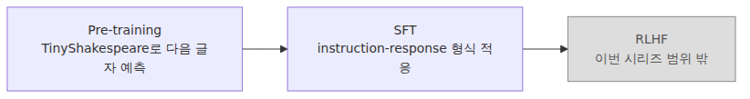

# 베이스 모델을 우리 작업에 맞추기

지난 글까지 오면 모델은 분명히 텍스트를 생성합니다. 하지만 그 출력은 여전히 TinyShakespeare가 만든 리듬에 가깝습니다. 질문을 던진다고 해서 답을 잘해 주는 것은 아니고, instruction 형식을 안다고 보기도 어렵습니다.

이 지점에서 필요한 것이 supervised fine-tuning, 즉 SFT입니다. SFT의 첫 번째 효과는 새로운 지식을 대량으로 주입하는 것보다 출력 형식을 바꾸는 데서 더 뚜렷하게 드러납니다. 작은 데이터셋만으로도 모델이 `Q:` 뒤에는 질문이, `A:` 뒤에는 답이 온다는 습관을 배우기 시작합니다.

그래서 파인튜닝은 베이스 모델을 완전히 새로 만드는 작업이 아닙니다. 이미 형성된 기본 표현 위에 특정 과업의 출력 패턴을 덧칠하는 작업에 가깝습니다. 특히 소형 모델에서는 이 "출력 습관의 이동"이 매우 선명하게 보입니다.

이번 글에서는 pre-training, SFT, RLHF의 차이를 간단히 정리하고, 작은 instruction 데이터셋과 loss masking을 이용해 `finetune.py`를 붙이는 과정을 살펴보겠습니다. 목표는 거대한 챗봇이 아니라, 형식이 바뀌는 메커니즘을 눈으로 확인하는 것입니다.

이 글은 LLM from Scratch 101 시리즈의 여덟 번째 글입니다.

이제 출력 습관을 어떻게 바꾸는지 이해하면 마지막 글에서 이 모델을 브라우저와 대화형 인터페이스로 감싸는 일이 자연스럽게 이어집니다.

## 이 글에서 다룰 문제

- pre-training, fine-tuning, RLHF는 각각 무엇을 바꾸는 단계일까요?
- instruction 데이터 한 줄은 어떤 필드 구조를 가지면 충분할까요?
- 작은 데이터셋 50개만으로도 출력 습관이 왜 바뀔 수 있을까요?
- loss masking은 왜 instruction 부분을 학습 대상에서 제외할까요?
- `train.py` 위에 `finetune.py`를 얹을 때 실제로 바뀌는 것은 무엇일까요?

## 왜 이 글이 중요한가

파인튜닝은 base model을 애플리케이션 문맥으로 끌고 오는 첫 단계입니다. 사전학습 모델이 일반적인 문자 예측 능력을 가졌다면, SFT는 그 모델이 어떤 형식으로 대답해야 하는지, 어떤 응답 습관을 따라야 하는지를 더 강하게 학습시키는 과정입니다.

또한 많은 입문자가 파인튜닝을 "새 지식을 심는 일"로만 이해하지만, 실제로는 출력 포맷과 응답 스타일 조정이 먼저 눈에 띄는 경우가 많습니다. 작은 데이터셋에서도 `Q:/A:` 패턴이 자리 잡으면, 모델은 완전히 다른 대화 가능성을 보여 줍니다.

운영적으로도 중요합니다. 파인튜닝 데이터 형식, label shifting, ignore index, learning rate 축소 같은 디테일은 모델이 질문을 복사할지, 답변 형식을 유지할지, 과도하게 붕괴할지를 좌우합니다. 작은 실험일수록 이 차이가 더 직접적으로 드러납니다.

## 파인튜닝을 이해하는 가장 좋은 방법: 베이스 모델 위에 새로운 출력 습관을 얹는 얇은 적응층으로 보는 것입니다

파인튜닝을 베이스 모델을 갈아엎는 작업으로 생각하면 기대가 과도해집니다. 더 현실적인 관점은 이렇습니다. **SFT는 베이스 모델의 기본 표현을 유지한 채, 작은 태스크 전용 데이터셋으로 출력 습관과 형식을 덧입히는 얇은 적응층**입니다.

이 관점은 작은 데이터셋의 효과를 이해하는 데 특히 유용합니다. 50개 예시가 셰익스피어풍 모델에게 새로운 세계지식을 주지는 못해도, `Q:` 다음에 질문이 오고 `A:` 다음에 짧고 직접적인 답이 와야 한다는 패턴은 충분히 학습시킬 수 있습니다.

또한 loss masking이 왜 필요한지도 여기서 분명해집니다. 우리는 질문 자체를 반복 암기시키려는 것이 아니라, 주어진 instruction 뒤에서 올바른 answer 패턴을 예측하게 만들고 싶습니다. 따라서 손실은 응답 구간에 더 집중되어야 합니다.

> 이번 글의 핵심은 이것입니다. 파인튜닝은 베이스 모델을 버리는 작업이 아니라, 작은 데이터셋으로 출력 습관을 덧칠하는 작업입니다.

## 핵심 개념

### pre-training, SFT, RLHF는 역할이 다릅니다

pre-training은 거대한 말뭉치에서 next-token prediction을 학습하는 단계입니다. SFT는 이미 학습된 모델을 instruction-response 형식에 맞추는 단계입니다. RLHF는 여기에 사람 선호 기반 신호를 더해 응답 정책을 더 조정하는 단계입니다.



*베이스 지식 형성, 형식 적응, 선호 정렬이 각각 어느 단계에서 일어나는지 비교한 그림입니다.*

이번 시리즈는 RLHF까지 가지 않고 SFT까지만 다룹니다. 목표는 인간 선호 정렬이 아니라, base model 위에 instruction 형식을 얹는 메커니즘을 직접 확인하는 데 있습니다.

### instruction 데이터 한 줄은 매우 단순해도 됩니다

우리의 `instructions.jsonl`은 `{"instruction": ..., "response": ...}` 형태만으로 충분합니다. 학습 시에는 이를 `Q: {instruction}\nA: {response}` 형식의 단일 시퀀스로 이어 붙여 사용합니다. 중요한 것은 복잡한 스키마보다 일관된 형식입니다.

### 작은 데이터셋도 출력 습관을 바꾸기에는 충분할 수 있습니다

50개 정도의 예시는 거대한 일반지식을 추가하기에는 턱없이 부족합니다. 하지만 모델에게 새로운 응답 습관을 보여 주기에는 생각보다 강한 신호가 됩니다. 특히 베이스 모델이 이미 문자 패턴과 문장 리듬을 어느 정도 알고 있다면, SFT는 그 기반 위에 형식을 빠르게 덧입힙니다.

```json
{"instruction":"Who is ROMEO?","response":"A young lover who loves Juliet."}
{"instruction":"What is Juliet's last name?","response":"Capulet."}
{"instruction":"Who said 'To be, or not to be'?","response":"Hamlet."}
{"instruction":"Write one sentence swearing loyalty to the King.","response":"My lord, I keep my faith."}
{"instruction":"Give one sentence of advice on guarding against jealousy.","response":"Jealousy first harms one's own heart."}
```

이 예시의 핵심은 내용보다 패턴입니다. 모델은 `Q:`와 `A:`라는 표식을 반복적으로 보면서, 이제 셰익스피어 문장 이어쓰기보다 질문-응답 형식을 더 자주 선택하게 됩니다.

### 학습 루프는 거의 같고 두 가지만 크게 달라집니다

`finetune.py`는 `train.py`와 매우 비슷합니다. 다만 learning rate를 더 낮게 잡고, `Q: ...\nA: ...` 전체 시퀀스에서 shifted label을 만들어 next-token prediction을 유지합니다. 즉, 학습 목표 자체는 그대로 두되 데이터 형식을 바꾸는 것입니다.

### loss masking은 응답 구간에 학습 신호를 집중시킵니다

시퀀스 전체를 인코딩한 뒤 `x = ids[:-1]`, `y = ids[1:]`로 만듭니다. 그다음 prompt 부분에 해당하는 shifted `y`를 `-100`으로 덮어 `cross_entropy(..., ignore_index=-100)`에서 무시하게 만듭니다. 이렇게 하면 causal LM objective는 유지하면서도 질문 구간을 정답 학습 대상으로 삼지 않을 수 있습니다.

이 처리는 매우 중요합니다. 질문까지 그대로 외우게 만들면 모델은 사용자 프롬프트를 복사하는 방향으로 치우칠 수 있습니다. 우리는 응답 형식을 학습시키고 싶기 때문에 손실을 답변 부분에 집중시킵니다.

### `finetune.py`는 기존 학습 스크립트 위에 얇게 덧붙일 수 있습니다

아래 코드는 `train.py`를 바탕으로 파인튜닝에 필요한 최소 변경만 추가한 예제입니다.

```python
# finetune.py
import json, torch, torch.nn.functional as F
from dataclasses import asdict
from data import encode
from model import GPT, GPTConfig

def load_rows(path="instructions.jsonl"):
    with open(path, encoding="utf-8") as f: return [json.loads(line) for line in f]

def build_example(row, block_size):
    prompt = f"Q: {row['instruction']}\nA:"
    full = f"{prompt} {row['response']}"[:block_size]
    ids = encode(full)
    x = torch.tensor(ids[:-1], dtype=torch.long)
    y = torch.tensor(ids[1:], dtype=torch.long)
    prompt_len = min(len(encode(prompt)), len(ids))
    y[: max(prompt_len - 1, 0)] = -100
    return x, y

device = "cuda" if torch.cuda.is_available() else "cpu"
ckpt = torch.load("ckpt.pt", map_location=device)
config = GPTConfig(**ckpt["config"])
model = GPT(config).to(device); model.load_state_dict(ckpt["model"])
optimizer = torch.optim.AdamW(model.parameters(), lr=3e-5)
rows = load_rows()

for step in range(500):
    row = rows[step % len(rows)]
    xb, yb = build_example(row, config.block_size)
    xb, yb = xb[None, :].to(device), yb[None, :].to(device)
    logits, _ = model(xb)
    loss = F.cross_entropy(logits.view(-1, config.vocab_size), yb.view(-1), ignore_index=-100)
    optimizer.zero_grad(set_to_none=True)
    loss.backward()
    torch.nn.utils.clip_grad_norm_(model.parameters(), 1.0)
    optimizer.step()

torch.save({"model": model.state_dict(), "config": asdict(config)}, "ckpt_sft.pt")
```

이 스크립트는 매우 짧지만 파인튜닝의 본질을 잘 보여 줍니다. 베이스 체크포인트를 불러오고, 작은 학습률로 instruction 데이터셋을 반복해서 보여 주고, SFT용 체크포인트를 새로 저장합니다.

### before/after 비교는 형식 변화에 집중해서 읽으면 됩니다

파인튜닝 효과는 동일한 프롬프트에 대한 출력 비교에서 가장 선명하게 드러납니다. base model은 여전히 셰익스피어풍 continuation으로 흐르기 쉽고, SFT model은 `Q:/A:` 구조를 유지하며 답변 구간을 더 직접적으로 채우려 합니다.

```text
[base]
Q: Write one sentence swearing loyalty to the King.
A: Wha, the thoue of thine me,

[sft]
Q: Write one sentence swearing loyalty to the King.
A: My lord, I serve thee with a faithful heart.
```

여기서 중요한 것은 완벽한 사실성보다 형식의 이동입니다. 즉, 모델이 질문-답변 계약을 받아들이기 시작했는지를 보는 것이 핵심입니다.

## 흔히 헷갈리는 지점

- 파인튜닝이 곧 대규모 지식 주입이라고 생각하기 쉽지만, 작은 SFT에서는 출력 형식 변화가 먼저 드러납니다.
- 학습 목표가 바뀌었다고 보기 쉽지만, 여전히 next-token prediction입니다.
- 질문 구간도 함께 loss를 주면 좋다고 느끼기 쉽지만, 응답 구간에 신호를 집중하기 위해 masking이 필요합니다.
- 작은 데이터셋은 의미 없다고 생각하기 쉽지만, 출력 습관을 바꾸는 데는 꽤 강한 신호가 됩니다.
- base model을 버리고 처음부터 다시 학습해야 한다고 느끼기 쉽지만, SFT는 기존 표현 위에 얹는 적응 단계입니다.

## 운영 체크리스트

- [ ] instruction/response 데이터 행이 일관된 템플릿으로 직렬화되는가
- [ ] `y[: ...] = -100` masking 경계가 prompt 길이와 맞는지 출력으로 확인했는가
- [ ] base checkpoint를 불러온 뒤 낮은 learning rate로 미세 조정하고 있는가
- [ ] `ckpt_sft.pt`에 SFT 이후 가중치와 config를 함께 저장했는가
- [ ] 같은 프롬프트로 base vs SFT 출력을 비교해 형식 변화가 생겼는지 확인했는가

## 정리

이번 글에서는 base GPT 위에 작은 instruction 데이터셋을 얹어 supervised fine-tuning을 수행했습니다. 핵심은 모델을 완전히 새로 만드는 것이 아니라, 이미 배운 문자 예측 능력 위에 질문-응답 형식이라는 새로운 출력 습관을 덧씌우는 데 있습니다.

또한 loss masking을 통해 instruction 구간을 손실에서 제외하고, response 구간에 학습 신호를 집중하는 이유도 살펴봤습니다. 이 처리 덕분에 모델은 프롬프트를 복사하는 대신 답변 구간을 더 잘 채우는 방향으로 움직입니다.

다음 글에서는 이렇게 미세 조정한 모델을 FastAPI 서버와 브라우저 UI로 감쌉니다. 즉, 지금까지 만든 LLM을 실제로 대화할 수 있는 작은 챗봇 시스템으로 마무리하게 됩니다.

<!-- toc:begin -->
## 시리즈 목차

- [글자를 숫자로 바꾸기](./01-tokenizer.md)
- [정수에서 벡터로, 그리고 위치](./02-embedding.md)
- [어떤 토큰을 얼마나 볼지 스스로 정하기](./03-attention.md)
- [블록 하나, 깊이의 단위](./04-transformer-block.md)
- [조립: GPT 모델 클래스 완성](./05-gpt-model.md)
- [기울기로 배우기](./06-training-loop.md)
- [샘플링 — 학습된 모델에서 글 뽑아내기](./07-inference.md)
- **베이스 모델을 우리 작업에 맞추기 (현재 글)**
- 직접 만든 LLM을 챗봇으로 — FastAPI + 스트리밍 (예정)

<!-- toc:end -->

## 참고 자료

### 공식 문서

- [Finetuned Language Models Are Zero-Shot Learners (arXiv:2109.01652)](https://arxiv.org/abs/2109.01652)
- [Training language models to follow instructions with human feedback (arXiv:2203.02155)](https://arxiv.org/abs/2203.02155)
- [Stanford Alpaca (GitHub)](https://github.com/tatsu-lab/stanford_alpaca)
- [PyTorch cross_entropy (Documentation)](https://pytorch.org/docs/stable/generated/torch.nn.functional.cross_entropy.html)

### 관련 시리즈

- [AI Agent 101 — 컨텍스트 엔지니어링](../../ai-agent-101/ko/02-context-engineering.md)
- [LLM 앱 기초 — 프롬프트 엔지니어링 기초](../../llm-app-foundations-101/ko/03-prompt-engineering-basics.md)
- [LLM API 프로덕션 101 — 구조화 출력](../../llm-api-production-101/ko/01-structured-output.md)

Tags: LLM, PyTorch, Transformer, Tutorial
