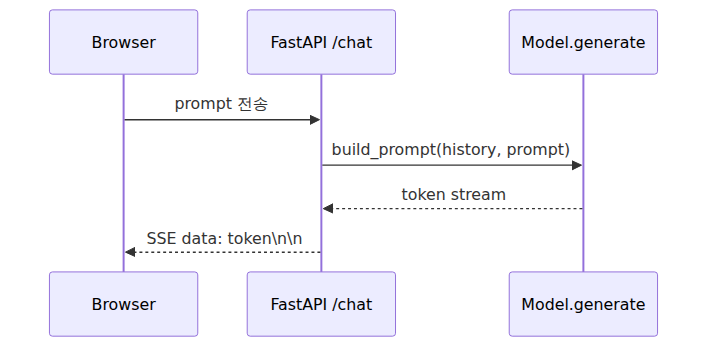

# 직접 만든 LLM을 챗봇으로 — FastAPI + 스트리밍

> LLM from Scratch 101 시리즈 (9/9)

`generate.py`까지 오면 모델은 돌아가지만 아직은 개발자 도구에 가깝습니다.

스트리밍을 붙이면 체감이 바로 달라집니다.

이번 시리즈의 모델은 120만 파라미터 char-level GPT입니다.

오늘 멘탈 모델은 이렇습니다. **챗봇은 모델 하나로 끝나지 않고, 대화 히스토리와 스트리밍 입출력을 함께 묶은 작은 시스템입니다.**

---

## 챗봇 = 모델 + 대화 히스토리 + 스트리밍 + UI

필요한 부품은 모델, 대화 히스토리, 스트리밍, 브라우저 화면입니다.


## 멀티턴 프롬프트 포맷 디자인

이번 글에서는 대화 이력을 아래처럼 평문으로 이어 붙입니다. 이번 시리즈의 모델은 영어 char-level vocab으로 학습됐기 때문에, 데모 대화도 영어 기준으로 맞춥니다.

```text
User: Hello!
Bot: Nice to meet you.
User: Who is Romeo?
Bot:
```

새 질문이 들어올 때마다 마지막 `Bot:` 뒤를 모델이 채우게 하면 됩니다. 한국어 입력은 vocab에 없는 문자가 대부분이라 경고와 함께 무시됩니다. 한국어 챗봇을 만들려면 한국어 코퍼스로 토크나이저와 vocab을 다시 구축해야 합니다.

## 모델을 한 번만 로드 — FastAPI lifespan

매 요청마다 `ckpt_sft.pt`를 다시 읽으면 느립니다. 시작 시점에 한 번만 로드하고 `lifespan`으로 관리합니다.

## /chat 엔드포인트 — 가장 단순한 동기 호출 먼저

`POST /chat`은 JSON으로 `history`와 `prompt`를 받고 결과 문자열을 돌려줍니다.

## 스트리밍이 왜 필요한가 — 토큰 하나씩 떨어지는 UX

이번 구현은 문자 단위에 가깝지만 SSE 흐름을 익히기에는 직관적입니다.

## SSE(Server-Sent Events)로 토큰 스트리밍

`GET /chat/stream?prompt=...`는 `StreamingResponse`를 돌려줍니다.

```python
# server.py
from contextlib import asynccontextmanager

import torch
from fastapi import FastAPI, HTTPException, Request
from fastapi.responses import HTMLResponse, StreamingResponse
from fastapi.templating import Jinja2Templates
from pydantic import BaseModel
from data import decode, stoi
from model import GPT, GPTConfig
templates = Jinja2Templates(directory="templates"); state = {}

class ChatBody(BaseModel):
    prompt: str
    history: list[dict[str, str]] = []
    max_new_tokens: int = 120

def build_prompt(history, prompt):
    lines = []
    for t in history: lines += [f"User: {t['user']}", f"Bot: {t['bot']}"]
    lines.append(f"User: {prompt}")
    lines.append("Bot:")
    return "\n".join(lines)

def encode_chat_text(text: str):
    dropped = sorted({c for c in text if c not in stoi})
    ids = [stoi[c] for c in text if c in stoi]
    if not ids:
        raise ValueError("지원되는 문자가 하나도 남지 않았습니다.")
    return ids, dropped

@asynccontextmanager
async def lifespan(app: FastAPI):
    d = "cuda" if torch.cuda.is_available() else "cpu"
    ckpt = torch.load("ckpt_sft.pt", map_location=d)
    m = GPT(GPTConfig(**ckpt["config"])).to(d); m.load_state_dict(ckpt["model"]); m.eval()
    state["device"] = d; state["model"] = m
    yield
    state.clear()

app = FastAPI(lifespan=lifespan)

@app.get("/", response_class=HTMLResponse)
async def index(request: Request):
    return templates.TemplateResponse("index.html", {"request": request})

@app.post("/chat")
async def chat(body: ChatBody):
    text = build_prompt(body.history, body.prompt)
    try:
        ids, dropped = encode_chat_text(text)
    except ValueError as e:
        raise HTTPException(status_code=400, detail=str(e)) from e
    idx = torch.tensor([ids], dtype=torch.long, device=state["device"])
    with torch.no_grad(): out = state["model"].generate(idx, body.max_new_tokens, 0.8, 20, 0.9)
    response = {"response": decode(out[0].tolist())[len(ids):]}
    if dropped:
        response["warning"] = f"지원하지 않는 문자를 건너뛰었습니다: {''.join(dropped)}"
    return response

@app.get("/chat/stream")
async def chat_stream(prompt: str):
    async def event_gen():
        try:
            ids, dropped = encode_chat_text(build_prompt([], prompt))
        except ValueError as e:
            raise HTTPException(status_code=400, detail=str(e)) from e
        if dropped:
            yield f"data: [warning] 지원하지 않는 문자를 건너뛰었습니다: {''.join(dropped)}\n\n"
        current = torch.tensor([ids], dtype=torch.long, device=state["device"])
        for _ in range(120):
            with torch.no_grad(): next_ids = state["model"].generate(current, 1, 0.8, 20, 0.9)
            current = next_ids; token_id = next_ids[0, -1].item()
            yield f"data: {decode([token_id])}\n\n"
    return StreamingResponse(event_gen(), media_type="text/event-stream")
```

## 미니멀 HTML 클라이언트 — 50줄짜리 단일 페이지

브라우저 쪽은 `EventSource`면 충분합니다.

```html
<!doctype html>
<html lang="ko"><body>
<h1>Mini Bot</h1>
<input id="prompt" size="50" placeholder="질문"><button id="send">전송</button>
<pre id="out"></pre>
<script>
const promptEl=document.getElementById('prompt'),out=document.getElementById('out');let source=null;
document.getElementById('send').onclick=()=>{if(source)source.close();out.textContent='';
source=new EventSource(`/chat/stream?prompt=${encodeURIComponent(promptEl.value)}`);
source.onmessage=e=>out.textContent+=e.data;source.onerror=()=>source.close();};
</script></body></html>
```

이 데모는 영어 vocab 위에서만 안전하게 동작합니다. 지원하지 않는 문자가 섞이면 서버가 해당 문자를 건너뛰고 경고를 돌려주며, 남는 문자가 하나도 없으면 요청을 거절합니다.

실행은 `uvicorn server:app --reload`입니다.

## 시리즈 마무리

아홉 편을 거치며 대략 720줄 안팎의 코드로 작은 GPT를 끝까지 만들었습니다. 문자 단위 토크나이저, 임베딩, causal self-attention, 트랜스포머 블록, 학습 루프, 샘플링, SFT, FastAPI 챗봇까지 한 줄로 이어졌습니다.

이 모델은 추론기보다 셰익스피어 풍 리듬 생성기에 가깝습니다.

다음 단계로는 LoRA, vLLM, RoPE, RLHF, BPE, mixed precision을 권합니다.

<!-- toc:begin -->
## 시리즈 목차

- [글자를 숫자로 바꾸기](./01-tokenizer.md)
- [정수에서 벡터로, 그리고 위치](./02-embedding.md)
- [어떤 토큰을 얼마나 볼지 스스로 정하기](./03-attention.md)
- [블록 하나, 깊이의 단위](./04-transformer-block.md)
- [조립: GPT 모델 클래스 완성](./05-gpt-model.md)
- [기울기로 배우기](./06-training-loop.md)
- [샘플링 — 학습된 모델에서 글 뽑아내기](./07-inference.md)
- [베이스 모델을 우리 작업에 맞추기](./08-finetuning.md)
- **직접 만든 LLM을 챗봇으로 — FastAPI + 스트리밍 (현재 글)**

<!-- toc:end -->

## 참고 자료

- [FastAPI Lifespan Events](https://fastapi.tiangolo.com/advanced/events/)
- [MDN EventSource](https://developer.mozilla.org/en-US/docs/Web/API/EventSource)
- [FastAPI StreamingResponse](https://fastapi.tiangolo.com/advanced/custom-response/#streamingresponse)
- [nanoGPT](https://github.com/karpathy/nanoGPT)

Tags: LLM, PyTorch, Transformer, Tutorial
