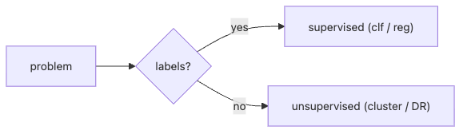

# Supervised and Unsupervised Learning

Most beginner ML mistakes are not model mistakes. They are framing mistakes. Teams jump into logistic regression or KMeans before agreeing on the more important question: do we have labels, do we need a numeric prediction, or are we only trying to surface structure in the data?

This is post 2 in the Machine Learning 101 series. Here we will separate supervised learning from unsupervised learning and use that split to clarify where classification, regression, and clustering actually belong.

## Questions this post answers

- When labels are present versus absent, do we reach for the same algorithms?
- How do classification and regression differ if both are supervised learning?
- Why is clustering not just “classification without labels”?
- What should you do when only part of the dataset is labeled?
- Which framing checks belong at the beginning of the project?

> Supervised learning fits a function from `(X, y)` pairs, while unsupervised learning discovers structure from `X` alone. Even under the same machine learning umbrella, once the starting question changes, the evaluation method and success criteria change with it.

## Why It Matters

Picking the wrong paradigm makes any model improvement meaningless. Problem framing is the first lever.

## Concept at a Glance



*The first branch in the workflow is whether labels exist; that choice determines whether you are predicting targets or discovering structure.*

## Key Terms

- **Supervised learning**: learn a function from `(X, y)` pairs.
- **Unsupervised learning**: discover structure from `X` alone.
- **Classification**: predict discrete labels.
- **Regression**: predict continuous values.
- **Clustering**: group similar points by distance or density.

## Before/After

**Before**: "ML is one line of regression" — paradigm ignored.

**After**: Decide in order — labels available? then classification or regression? then choose the algorithm.

## Hands-on: 5 Steps Comparing Paradigms

### Step 1 — Load data

```python
from sklearn.datasets import load_iris
X, y = load_iris(return_X_y=True)
```

### Step 2 — Supervised classification

```python
from sklearn.linear_model import LogisticRegression
clf = LogisticRegression(max_iter=1000).fit(X, y)
print("clf acc:", clf.score(X, y))
```

### Step 3 — Regression dataset

```python
from sklearn.datasets import fetch_california_housing
Xr, yr = fetch_california_housing(return_X_y=True)
```

### Step 4 — Regression model

```python
from sklearn.linear_model import LinearRegression
reg = LinearRegression().fit(Xr, yr)
print("R^2:", reg.score(Xr, yr))
```

### Step 5 — Unsupervised clustering

```python
from sklearn.cluster import KMeans
km = KMeans(n_clusters=3, n_init=10).fit(X)
print("inertia:", km.inertia_)
```

**Expected output:** the classifier prints a training accuracy, the regression example prints an `R^2` score, and KMeans returns an inertia value. Those numbers are not comparable, which is exactly the point: changing the paradigm changes the success criterion too.

## What to Notice in This Code

- `clf.score` returns accuracy, `reg.score` returns R-squared, `km.inertia_` measures cluster cohesion. Different metrics, different meaning.
- `KMeans(n_init=...)` matters for reproducibility and stability.
- Unsupervised results are harder to interpret because there is no ground truth.

## Read the first failure signal this way

- If the team cannot say what the label is, start by asking what action the prediction should change downstream.
- If clustering output gets treated like a true class label, stop and decide how you will validate it with business or experimental outcomes.
- If a metric discussion becomes confusing, verify whether people are comparing a supervised score to an unsupervised cohesion number.

## Five Common Mistakes

1. Solving a regression problem as classification (or the reverse).
2. Throwing away partially labeled data instead of using semi-supervised methods.
3. Treating cluster assignments as if they were ground truth.
4. Fixing `K` for clustering without ever visualizing.
5. Skipping standardization before distance-based algorithms.

## How This Shows Up in Production

Spam and fraud rely on classification, pricing and demand forecasting on regression, customer segmentation on clustering. Real systems combine all three for ranking and recommendation.

## How a Senior Engineer Thinks

- Order matters: problem, then metric, then paradigm.
- Use unsupervised methods early for exploration.
- Semi-supervised setups are the common case in industry.
- Reinforcement learning is the last card to play.
- A labeling strategy beats algorithm choice.

## Checklist

- [ ] I can give an example of classification, regression, and clustering.
- [ ] I know the meaning behind each `.score()` value.
- [ ] I know `K` in KMeans is a hyperparameter.
- [ ] I know which algorithms require standardized inputs.

## Practice Problems

1. Cluster `iris` with KMeans and produce a cross-tab against the true `y`.
2. List three problems best framed as regression and three as classification.
3. Describe one situation where semi-supervised learning is the right answer.

## Wrap-up and Next Steps

Picking the paradigm sets the ceiling on model performance. Next, we measure generalization with train/test splits.

<!-- toc:begin -->
- [What Is Machine Learning?](./01-what-is-machine-learning.md)
- **Supervised and Unsupervised Learning (current)**
- Train/Test Split (upcoming)
- Linear Regression (upcoming)
- Logistic Regression (upcoming)
- Decision Tree and Random Forest (upcoming)
- Clustering (upcoming)
- Overfitting and Regularization (upcoming)
- Model Evaluation (upcoming)
- The ML Project Workflow (upcoming)
<!-- toc:end -->

## References

- [scikit-learn — Supervised learning](https://scikit-learn.org/stable/supervised_learning.html)
- [scikit-learn — Unsupervised learning](https://scikit-learn.org/stable/unsupervised_learning.html)
- [Pattern Recognition and Machine Learning — Bishop](https://www.microsoft.com/en-us/research/people/cmbishop/prml-book/)
- [Google — ML Problem Framing](https://developers.google.com/machine-learning/problem-framing)

Tags: MachineLearning, SupervisedLearning, UnsupervisedLearning, Classification, Clustering
