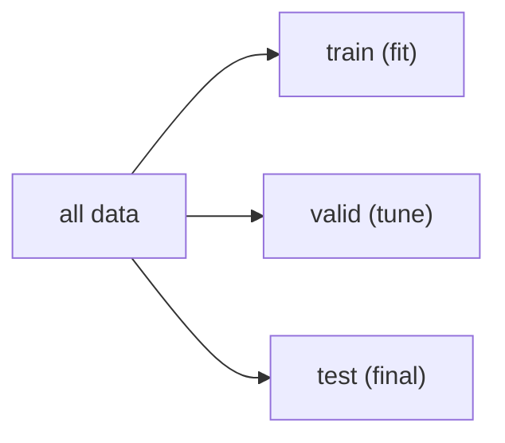

# Train/Test Split

> Machine Learning 101 series (3/10)

<!-- a-grade-intro:begin -->

**Core question**: A model with 99% training accuracy can still fail in production. Why?

> *A train/test split is the minimum apparatus for measuring how a model behaves on data it has never seen.*

<!-- a-grade-intro:end -->

## What You Will Learn

- The roles of train, validation, and test sets
- Why `random_state` matters for reproducibility
- How `stratify` handles imbalanced classes
- The intuition behind K-fold cross-validation
- Five common pitfalls

## Why It Matters

Without measuring generalization, you cannot select or compare models. Training scores are scores you cannot ship.

## Concept at a Glance



## Key Terms

- **Train**: data used for fitting the model.
- **Validation**: data used for tuning hyperparameters.
- **Test**: held out, looked at exactly once.
- **Stratify**: keep class proportions constant across splits.
- **K-fold**: split into K parts and rotate the test fold.

## Before/After

**Before**: Fit on all data, score on the same data. Performance is overestimated.

**After**: Fit on train, score on held-out test. The number reflects reality.

## Hands-on: 5 Steps to Split and Evaluate

### Step 1 — Data

```python
from sklearn.datasets import load_iris
X, y = load_iris(return_X_y=True)
```

### Step 2 — Split

```python
from sklearn.model_selection import train_test_split
Xtr, Xte, ytr, yte = train_test_split(
    X, y, test_size=0.2, stratify=y, random_state=42
)
```

### Step 3 — Model

```python
from sklearn.linear_model import LogisticRegression
model = LogisticRegression(max_iter=1000).fit(Xtr, ytr)
```

### Step 4 — Evaluate

```python
print("train:", model.score(Xtr, ytr))
print("test :", model.score(Xte, yte))
```

### Step 5 — Cross-validate

```python
from sklearn.model_selection import cross_val_score
print(cross_val_score(model, X, y, cv=5).mean())
```

## What to Notice in This Code

- `stratify=y` preserves class ratios in both splits.
- A fixed `random_state` makes results reproducible.
- `cross_val_score` repeats train and evaluate K times.

## Five Common Mistakes

1. Tuning on the test set, which leaks performance.
2. Fitting a scaler on the entire dataset before splitting.
3. Forgetting to set the random seed and chasing noise.
4. Ignoring `stratify` on imbalanced data.
5. Splitting time-series data randomly instead of by time.

## How This Shows Up in Production

A/B experiments, model comparison, and MLOps gating all hinge on a sound split strategy. The split governs the decision, not just the metric.

## How a Senior Engineer Thinks

- Touch the test set exactly once.
- Keep validation and test separate.
- Split time-series chronologically.
- Always suspect group leakage.
- Preprocess after splitting, not before.

## Checklist

- [ ] I know the role of train, valid, and test.
- [ ] I understand what `stratify` does.
- [ ] I always fix `random_state`.
- [ ] I can run `cross_val_score`.

## Practice Problems

1. Vary `test_size` between 0.1 and 0.3 and observe the test score.
2. Compare class ratios in train and test with `stratify=None`.
3. Compare the variance of 5-fold and 10-fold scores.

## Wrap-up and Next Steps

A correct split is the prerequisite for every measurement that follows. Next, we cover linear regression as the foundation of supervised learning.

<!-- toc:begin -->
- [What Is Machine Learning?](./01-what-is-machine-learning.md)
- [Supervised and Unsupervised Learning](./02-supervised-and-unsupervised.md)
- **Train/Test Split (current)**
- Linear Regression (upcoming)
- Logistic Regression (upcoming)
- Decision Tree and Random Forest (upcoming)
- Clustering (upcoming)
- Overfitting and Regularization (upcoming)
- Model Evaluation (upcoming)
- The ML Project Workflow (upcoming)
<!-- toc:end -->

## References

- [scikit-learn — train_test_split](https://scikit-learn.org/stable/modules/generated/sklearn.model_selection.train_test_split.html)
- [scikit-learn — Cross-validation](https://scikit-learn.org/stable/modules/cross_validation.html)
- [Forecasting: Principles and Practice — Hyndman](https://otexts.com/fpp3/)
- [Google — Rules of ML](https://developers.google.com/machine-learning/guides/rules-of-ml)

Tags: MachineLearning, TrainTestSplit, Generalization, CrossValidation, scikit-learn
