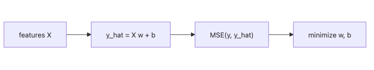

# Linear Regression

When people call linear regression “too simple,” they usually mean “easy to underestimate.” A straight line that explains most of the variation is already an operationally strong baseline, and it often teaches you more about the data than a more complex model that scores slightly higher but hides why.

This is post 4 in the Machine Learning 101 series. Here we will treat linear regression as both a prediction model and a diagnostic tool by reading coefficients, residuals, MSE, and `R^2` together.

## Questions this post answers

- How does the linear regression equation produce a prediction?
- What does least squares actually minimize?
- What does `R^2` explain, and what does it hide?
- Why are residuals the fastest way to test the model story?
- Which failure modes show up before you ever need a more complex model?

> Linear regression is the simplest model and still one of the strongest baselines. It also remains one of the most trustworthy reference points when interpretability matters.

## Why It Matters

Linear regression is interpretable, fast, and surprisingly strong. Always run it first. Without a baseline, no complex model is justified.

## Concept at a Glance



*Linear regression combines features into a prediction, then adjusts the weights by minimizing a loss such as mean squared error.*

## Key Terms

- **Weights w**: feature contributions.
- **Intercept b**: baseline level.
- **MSE**: average squared error.
- **R-squared**: variance explained by the model.
- **Residual**: `y - y_hat`.

## Before/After

**Before**: "Looks like a straight line on the chart" — no numerical check.

**After**: Model, metric, and residuals form a three-step verification.

## Hands-on: 5 Steps of Regression

### Step 1 — Data

```python
from sklearn.datasets import fetch_california_housing
X, y = fetch_california_housing(return_X_y=True)
```

### Step 2 — Split

```python
from sklearn.model_selection import train_test_split
Xtr, Xte, ytr, yte = train_test_split(X, y, test_size=0.2, random_state=42)
```

### Step 3 — Fit

```python
from sklearn.linear_model import LinearRegression
model = LinearRegression().fit(Xtr, ytr)
```

### Step 4 — Evaluate

```python
from sklearn.metrics import mean_squared_error, r2_score
pred = model.predict(Xte)
print("MSE:", mean_squared_error(yte, pred))
print("R^2:", r2_score(yte, pred))
```

### Step 5 — Inspect coefficients

```python
for name, coef in zip(range(Xtr.shape[1]), model.coef_):
    print(f"x{name}: {coef:.3f}")
```

**Expected output:** you should see an MSE value, an `R^2` value, and a list of signed coefficients. The important part is not a perfect score. It is whether the coefficient directions make sense and whether the residual story suggests the line is missing structure.

## What to Notice in This Code

- Sign and magnitude of `coef_` drive interpretation.
- A low R-squared often signals nonlinearity.
- MSE squares the error, so it reacts strongly to outliers.

## Read the first failure signal this way

- If `R^2` is weak and residuals curve, suspect missing nonlinear features before abandoning regression entirely.
- If coefficients flip sign run to run, inspect multicollinearity and feature scaling.
- If a few points dominate the error, treat outliers as a modeling decision, not a cleanup footnote.

## Five Common Mistakes

1. Comparing coefficients while ignoring scale differences.
2. Letting multicollinearity destabilize the coefficients.
3. Skipping the residual plot.
4. Allowing outliers to drag the line.
5. Extrapolating beyond the training range.

## How This Shows Up in Production

Pricing, demand modeling, and A/B effect estimation lean on linear regression because stakeholders need an interpretable lever, not a black box.

## How a Senior Engineer Thinks

- Always start from a baseline.
- Interpretability is a business tool, not just a technical one.
- Residuals are the model's diary.
- Standardize before comparing coefficients.
- Add Ridge or Lasso when regularization is needed.

## Checklist

- [ ] I report both MSE and R-squared.
- [ ] I plot the residuals.
- [ ] I scale features before reading coefficients.
- [ ] I flag extrapolation risks explicitly.

## Practice Problems

1. Add `PolynomialFeatures(degree=2)` and observe R-squared.
2. Plot residuals against predictions and describe any pattern.
3. Compare coefficient magnitudes between `Ridge(alpha=1.0)` and `LinearRegression`.

## Wrap-up and Next Steps

Linear regression is the starting point for every regression task. Next, we move to logistic regression for classification.

<!-- toc:begin -->
- [What Is Machine Learning?](./01-what-is-machine-learning.md)
- [Supervised and Unsupervised Learning](./02-supervised-and-unsupervised.md)
- [Train/Test Split](./03-train-test-split.md)
- **Linear Regression (current)**
- Logistic Regression (upcoming)
- Decision Tree and Random Forest (upcoming)
- Clustering (upcoming)
- Overfitting and Regularization (upcoming)
- Model Evaluation (upcoming)
- The ML Project Workflow (upcoming)
<!-- toc:end -->

## References

- [scikit-learn — Linear models](https://scikit-learn.org/stable/modules/linear_model.html)
- [An Introduction to Statistical Learning — James et al.](https://www.statlearning.com/)
- [Seeing Theory — Regression](https://seeing-theory.brown.edu/regression-analysis/index.html)
- [StatQuest — Linear Regression](https://www.youtube.com/watch?v=nk2CQITm_eo)

Tags: MachineLearning, LinearRegression, Regression, scikit-learn, Beginner
