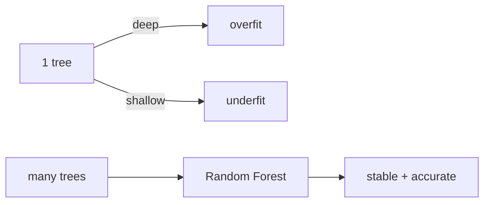

# Decision Tree and Random Forest

> Machine Learning 101 series (6/10)

<!-- a-grade-intro:begin -->

**Core question**: How can a giant pile of if-else rules outperform a neural network on tabular data?

> *Decision trees are interpretable nonlinear models. Random forests turn many trees into a robust ensemble.*

<!-- a-grade-intro:end -->

## What You Will Learn

- Splitting criteria (Gini and entropy)
- Overfitting and pruning
- Bagging and the random forest construction
- Feature importance and its limits
- Five common pitfalls

## Why It Matters

Random forests and gradient-boosted trees still dominate tabular data. They belong in every baseline before you reach for deep learning.

## Concept at a Glance



## Key Terms

- **Split**: separates data using a feature and threshold.
- **Gini and entropy**: impurity measures.
- **Pruning**: limit depth or leaf size.
- **Bagging**: bootstrap aggregation.
- **Feature importance**: contribution of each feature to splits.

## Before/After

**Before**: "Trees are interpretable, end of story" — single trees have huge variance.

**After**: Use a forest to reduce variance and explain it with SHAP.

## Hands-on: 5 Steps with Trees and Forests

### Step 1 — Data

```python
from sklearn.datasets import load_breast_cancer
X, y = load_breast_cancer(return_X_y=True)
```

### Step 2 — Split

```python
from sklearn.model_selection import train_test_split
Xtr, Xte, ytr, yte = train_test_split(X, y, test_size=0.2, stratify=y, random_state=42)
```

### Step 3 — Single tree

```python
from sklearn.tree import DecisionTreeClassifier
tree = DecisionTreeClassifier(max_depth=4, random_state=0).fit(Xtr, ytr)
print("tree:", tree.score(Xte, yte))
```

### Step 4 — Random Forest

```python
from sklearn.ensemble import RandomForestClassifier
rf = RandomForestClassifier(n_estimators=200, random_state=0).fit(Xtr, ytr)
print("rf  :", rf.score(Xte, yte))
```

### Step 5 — Feature importance

```python
import numpy as np
order = np.argsort(rf.feature_importances_)[::-1][:5]
print("top:", order)
```

## What to Notice in This Code

- `max_depth` is the main lever against overfitting.
- More `n_estimators` is more stable, with diminishing returns.
- `feature_importances_` splits credit across correlated features.

## Five Common Mistakes

1. Using a single deep tree without depth limits.
2. Reading feature importance as causal.
3. Standardizing features even though trees do not need it.
4. Trusting a 100% training accuracy.
5. Skipping a comparison with gradient-boosted trees.

## How This Shows Up in Production

Credit scoring, click prediction, and recommender features all run on tree ensembles. They remain the workhorse of tabular ML.

## How a Senior Engineer Thinks

- Random forest is baseline plus epsilon.
- Gradient boosting is usually stronger.
- Permutation importance is more trustworthy.
- Add SHAP for instance-level interpretation.
- Categorical features need model-specific handling.

## Checklist

- [ ] I set `max_depth` explicitly.
- [ ] I use enough trees in the forest.
- [ ] I know the limits of feature importance.
- [ ] I compare against a GBDT model.

## Practice Problems

1. Sweep `max_depth` from 1 to 20 and chart the test score.
2. Compare random forest with gradient boosting.
3. Compare default importance against permutation importance.

## Wrap-up and Next Steps

Trees and forests are the workhorse of tabular ML. Next we explore unsupervised learning through clustering.

<!-- toc:begin -->
- [What Is Machine Learning?](./01-what-is-machine-learning.md)
- [Supervised and Unsupervised Learning](./02-supervised-and-unsupervised.md)
- [Train/Test Split](./03-train-test-split.md)
- [Linear Regression](./04-linear-regression.md)
- [Logistic Regression](./05-logistic-regression.md)
- **Decision Tree and Random Forest (current)**
- Clustering (upcoming)
- Overfitting and Regularization (upcoming)
- Model Evaluation (upcoming)
- The ML Project Workflow (upcoming)
<!-- toc:end -->

## References

- [scikit-learn — Decision Trees](https://scikit-learn.org/stable/modules/tree.html)
- [scikit-learn — Ensemble methods](https://scikit-learn.org/stable/modules/ensemble.html)
- [Random Forests — Breiman (2001)](https://link.springer.com/article/10.1023/A:1010933404324)
- [StatQuest — Random Forests](https://www.youtube.com/watch?v=J4Wdy0Wc_xQ)

Tags: MachineLearning, DecisionTree, RandomForest, Ensemble, scikit-learn
