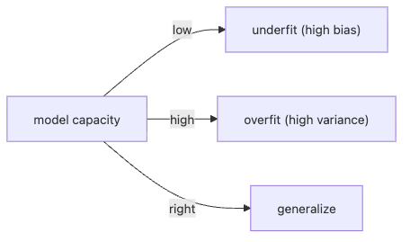

# Overfitting and Regularization

When the train score soars and the test score collapses, “the model is smart” is usually the wrong interpretation. More often, the model found ways to memorize noise, shortcut the split, or overreact to feature quirks that do not survive new data.

This is post 8 in the Machine Learning 101 series. Here we will diagnose underfitting versus overfitting, connect that diagnosis to the bias-variance trade-off, and use Ridge, Lasso, and related regularization tools to recover generalization.

## Questions this post answers

- Which signals separate overfitting from underfitting?
- What does the bias-variance trade-off actually mean in practice?
- How do Ridge, Lasso, and ElasticNet differ?
- What can learning curves tell you that one score cannot?
- Which regularization mistakes show up first in beginner workflows?

> Overfitting means the model has memorized noise. Regularization is the mechanism that reduces model freedom so it can recover generalization.

## Why It Matters

Half of every model improvement is regularization. The more capacity a model has, the more regularization keeps it alive.

## Concept at a Glance



*Too little capacity underfits, too much capacity overfits, and regularization helps move the model back toward a generalizing middle ground.*

## Key Terms

- **Overfitting**: training looks great, test does not.
- **Underfitting**: both training and test are weak.
- **Bias**: error baked into model assumptions.
- **Variance**: sensitivity to data changes.
- **L1 / L2**: penalties on coefficient magnitude.

## Before/After

**Before**: "Make the model bigger" — and overfit harder.

**After**: Diagnose with learning curves, then regularize.

## Hands-on: 5 Steps Comparing Regularization

### Step 1 — Data

```python
from sklearn.datasets import fetch_california_housing
from sklearn.model_selection import train_test_split
from sklearn.preprocessing import StandardScaler
X, y = fetch_california_housing(return_X_y=True)
Xtr, Xte, ytr, yte = train_test_split(X, y, test_size=0.2, random_state=42)
sc = StandardScaler().fit(Xtr); Xtr, Xte = sc.transform(Xtr), sc.transform(Xte)
```

### Step 2 — Linear

```python
from sklearn.linear_model import LinearRegression
lin = LinearRegression().fit(Xtr, ytr)
print("lin :", lin.score(Xte, yte))
```

### Step 3 — Ridge (L2)

```python
from sklearn.linear_model import Ridge
ridge = Ridge(alpha=1.0).fit(Xtr, ytr)
print("ridge:", ridge.score(Xte, yte))
```

### Step 4 — Lasso (L1)

```python
from sklearn.linear_model import Lasso
lasso = Lasso(alpha=0.01).fit(Xtr, ytr)
print("lasso:", lasso.score(Xte, yte), "nz:", (lasso.coef_ != 0).sum())
```

### Step 5 — Alpha sweep

```python
import numpy as np
for a in np.logspace(-3, 2, 6):
    s = Ridge(alpha=a).fit(Xtr, ytr).score(Xte, yte)
    print(f"alpha={a:.3g}  R^2={s:.3f}")
```

**Expected output:** linear, Ridge, and Lasso each produce a test score, and the alpha sweep shows that regularization strength has a real trade-off curve. If every alpha performs badly, the issue may be feature quality or model family, not only regularization.

## What to Notice in This Code

- Lasso doubles as feature selection by zeroing coefficients.
- Ridge shrinks all coefficients smoothly.
- Choose `alpha` by cross-validation, not by guessing.

## Read the first failure signal this way

- If the train-test gap widens as capacity grows, regularization and data volume deserve attention before architecture changes.
- If Lasso keeps selecting unstable feature sets, check for correlated inputs and try ElasticNet or Ridge.
- If both train and test are weak, stop calling it overfitting and reconsider feature design or model capacity.

## Five Common Mistakes

1. Applying L1 or L2 without scaling.
2. Trying `alpha` once instead of sweeping.
3. Diagnosing overfitting from training scores alone.
4. Ignoring Lasso's instability with correlated features.
5. Forgetting ElasticNet exists.

## How This Shows Up in Production

Ad CTR, search ranking, and genomics rely on Lasso and ElasticNet for feature selection in high-dimensional regimes.

## How a Senior Engineer Thinks

- Learning curves come first.
- More data is the strongest regularizer.
- Dropout and augmentation are also regularization.
- Use `RidgeCV` to choose `alpha` automatically.
- Underfitting demands more model capacity.

## Checklist

- [ ] I track train and test scores together.
- [ ] I plot learning curves.
- [ ] I cross-validate `alpha`.
- [ ] I inspect Lasso's selected features.

## Practice Problems

1. Use `PolynomialFeatures(degree=10)` with Ridge and reproduce overfitting.
2. Compare `RidgeCV` against a manually chosen `alpha`.
3. List the features Lasso shrinks to zero.

## Wrap-up and Next Steps

Regularization is a core lever for generalization. Next, we cover proper model evaluation.

<!-- toc:begin -->
- [What Is Machine Learning?](./01-what-is-machine-learning.md)
- [Supervised and Unsupervised Learning](./02-supervised-and-unsupervised.md)
- [Train/Test Split](./03-train-test-split.md)
- [Linear Regression](./04-linear-regression.md)
- [Logistic Regression](./05-logistic-regression.md)
- [Decision Tree and Random Forest](./06-decision-tree-and-random-forest.md)
- [Clustering](./07-clustering.md)
- **Overfitting and Regularization (current)**
- Model Evaluation (upcoming)
- The ML Project Workflow (upcoming)
<!-- toc:end -->

## References

- [scikit-learn — Linear models (Ridge, Lasso)](https://scikit-learn.org/stable/modules/linear_model.html)
- [scikit-learn — Validation curves](https://scikit-learn.org/stable/modules/learning_curve.html)
- [Bias-Variance — Stanford CS229 notes](https://cs229.stanford.edu/notes2022fall/)
- [StatQuest — Regularization](https://www.youtube.com/watch?v=Q81RR3yKn30)

Tags: MachineLearning, Overfitting, Regularization, Ridge, Lasso
