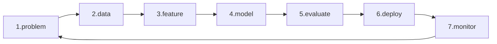

# The ML Project Workflow

> Machine Learning 101 series (10/10)

<!-- a-grade-intro:begin -->

**Core question**: If accuracy is everything, why do 90% of ML projects fail to ship?

> *ML success means completing the loop from problem framing to monitoring, not just maximizing a score.*

<!-- a-grade-intro:end -->

## What You Will Learn

- The seven-step ML workflow
- How `Pipeline` glues preprocessing and model
- Reproducibility and model cards
- Why post-deployment monitoring matters
- Five common pitfalls

## Why It Matters

A 0.95 score in a notebook is worth zero if the model never reaches users. Owning the full loop is what creates impact.

## Concept at a Glance



## Key Terms

- **Pipeline**: a single object combining preprocessing and model.
- **Reproducibility**: pinned seeds, versions, and data snapshots.
- **Model Card**: official documentation of model metadata.
- **Drift**: shift in input or target distribution.
- **Shadow deploy**: log predictions without acting on them.

## Before/After

**Before**: "Train the model, print the score, done."

**After**: A loop of problem, data, model, evaluation, deployment, and monitoring.

## Hands-on: 5-Step Mini Workflow

### Step 1 — Problem and data

```python
from sklearn.datasets import load_breast_cancer
from sklearn.model_selection import train_test_split
X, y = load_breast_cancer(return_X_y=True)
Xtr, Xte, ytr, yte = train_test_split(X, y, test_size=0.2, stratify=y, random_state=42)
```

### Step 2 — Pipeline

```python
from sklearn.pipeline import Pipeline
from sklearn.preprocessing import StandardScaler
from sklearn.linear_model import LogisticRegression
pipe = Pipeline([
    ("scaler", StandardScaler()),
    ("clf", LogisticRegression(max_iter=2000)),
])
```

### Step 3 — Train and evaluate

```python
pipe.fit(Xtr, ytr)
print("test:", pipe.score(Xte, yte))
```

### Step 4 — Save (reproducibility)

```python
import joblib
joblib.dump(pipe, "model.joblib")
loaded = joblib.load("model.joblib")
print("loaded:", loaded.score(Xte, yte))
```

### Step 5 — Simulate monitoring

```python
import numpy as np
fresh = Xte + np.random.normal(0, 0.1, Xte.shape)
print("drifted:", loaded.score(fresh, yte))
```

## What to Notice in This Code

- `Pipeline` blocks preprocessing leakage at the source.
- `joblib` enables reproducible deployment.
- Even small input noise drops the score, illustrating drift.

## Five Common Mistakes

1. Spreading preprocessing across notebook cells.
2. Skipping seeds and version pinning, killing reproducibility.
3. Deploying without monitoring.
4. Sharing models without a model card.
5. Evaluating on stale data that no longer reflects reality.

## How This Shows Up in Production

Recommendation, fraud detection, and search teams compete on how well they automate the full ML loop, not on a single notebook.

## How a Senior Engineer Thinks

- Problem framing is 60% of the value.
- `Pipeline` decides maintainability.
- Monitoring is the real beginning, not the end.
- Drift always happens.
- Model cards become organizational assets.

## Checklist

- [ ] Wrap everything inside a `Pipeline`.
- [ ] Save and load with `joblib`.
- [ ] Pin seeds and versions.
- [ ] Plan a drift monitoring strategy.

## Practice Problems

1. Add `PCA` to the pipeline and compare scores.
2. Load the saved model from a separate script and re-evaluate.
3. Plot the score curve as input noise increases.

## Wrap-up and Next Steps

Congratulations — you finished Machine Learning 101. Continue with Model Evaluation 101 and MLOps 101 for deeper material.

<!-- toc:begin -->
- [What Is Machine Learning?](./01-what-is-machine-learning.md)
- [Supervised and Unsupervised Learning](./02-supervised-and-unsupervised.md)
- [Train/Test Split](./03-train-test-split.md)
- [Linear Regression](./04-linear-regression.md)
- [Logistic Regression](./05-logistic-regression.md)
- [Decision Tree and Random Forest](./06-decision-tree-and-random-forest.md)
- [Clustering](./07-clustering.md)
- [Overfitting and Regularization](./08-overfitting-and-regularization.md)
- [Model Evaluation](./09-model-evaluation.md)
- **The ML Project Workflow (current)**
<!-- toc:end -->

## References

- [scikit-learn — Pipelines](https://scikit-learn.org/stable/modules/compose.html)
- [Google — Rules of ML](https://developers.google.com/machine-learning/guides/rules-of-ml)
- [Model Cards — Mitchell et al. (2019)](https://arxiv.org/abs/1810.03993)
- [Hidden Technical Debt in ML — Sculley et al.](https://papers.nips.cc/paper/2015/hash/86df7dcfd896fcaf2674f757a2463eba-Abstract.html)

Tags: MachineLearning, MLWorkflow, Pipeline, MLOps, Beginner
