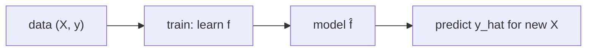

# Machine Learning이란 무엇인가?

> Machine Learning 101 시리즈 (1/10)


## 이 글에서 다룰 문제

추천, 의료, 금융, 자율주행처럼 다양한 산업이 ML을 중심으로 빠르게 재편되는 중입니다. 그래서 기초 개념이 흔들리면 뒤에서 어떤 모델을 써도 금방 한계가 드러납니다.

## 전체 흐름


## Before/After

**Before**: *“if-else로 모든 규칙 작성”* — 새 패턴마다 *코드 추가*.

**After**: *“데이터를 주면 모델이 규칙을 배움”* — *코드 대신 데이터* 로 확장.

## 5단계 첫 ML

### 1단계 — 데이터 준비

```python
from sklearn.datasets import load_iris
X, y = load_iris(return_X_y=True)
print(X.shape, y.shape)
```

### 2단계 — 모델 선택

```python
from sklearn.linear_model import LogisticRegression
model = LogisticRegression(max_iter=1000)
```

### 3단계 — 학습

```python
model.fit(X, y)
```

### 4단계 — 예측

```python
print(model.predict(X[:5]))
```

### 5단계 — 평가

```python
print("acc:", model.score(X, y))
```

## 이 코드에서 주목할 점

- *fit / predict / score* 는 scikit-learn의 표준 인터페이스입니다.
- *score* 는 단지 훈련 정확도일 뿐이며 일반화 성능을 직접 보여 주지 않습니다.
- 모델 선택은 문제 유형에 따라 달라집니다.

## 자주 하는 실수 5가지

1. 훈련 데이터 평가만 보고 성공이라고 판단합니다.
2. 피처 스케일 차이를 무시합니다.
3. 레이블 누수(target leakage)를 놓칩니다.
4. 랜덤 시드를 고정하지 않아 결과를 재현하지 못합니다.
5. 결측치나 이상치를 처리하지 않은 채 학습합니다.

## 실무에서는 이렇게 쓰입니다

추천, 사기 탐지, 수요 예측, 이미지 인식, NLP 챗봇까지, 데이터 → 학습 → 추론 파이프라인이 거의 모든 ML 제품의 척추 역할을 합니다.

## 체크리스트

- [ ] *X, y* 의 의미를 안다.
- [ ] *fit/predict/score* 를 호출할 수 있다.
- [ ] 훈련 정확도와 일반화 성능이 다르다는 점을 안다.
- [ ] 베이스라인의 가치를 안다.

## 정리 및 다음 단계

머신러닝은 데이터로 학습하는 함수라고 볼 수 있습니다. 다음 글에서는 지도학습과 비지도학습을 다룹니다.

<!-- toc:begin -->
- **Machine Learning이란 무엇인가? (현재 글)**
- 지도학습과 비지도학습 (예정)
- Train/Test Split (예정)
- Linear Regression (예정)
- Logistic Regression (예정)
- Decision Tree와 Random Forest (예정)
- Clustering (예정)
- Overfitting과 Regularization (예정)
- Model Evaluation (예정)
- ML 프로젝트 전체 흐름 (예정)
<!-- toc:end -->

## 참고 자료

- [scikit-learn — Getting Started](https://scikit-learn.org/stable/getting_started.html)
- [Andrew Ng — Machine Learning Specialization](https://www.coursera.org/specializations/machine-learning-introduction)
- [Hands-On Machine Learning — Aurélien Géron](https://www.oreilly.com/library/view/hands-on-machine-learning/9781098125967/)
- [Google — Machine Learning Crash Course](https://developers.google.com/machine-learning/crash-course)

Tags: MachineLearning, AI, DataScience, Foundations, Beginner
